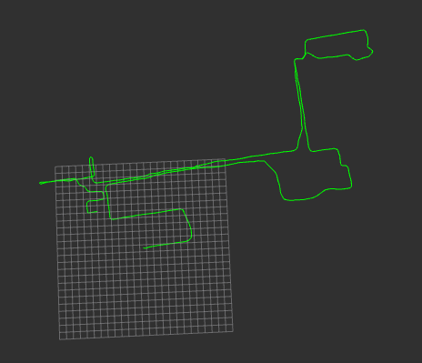
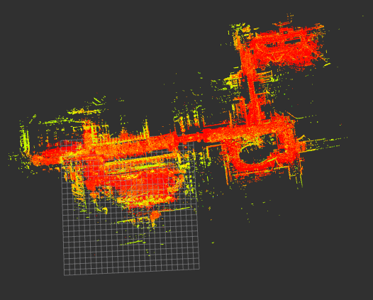
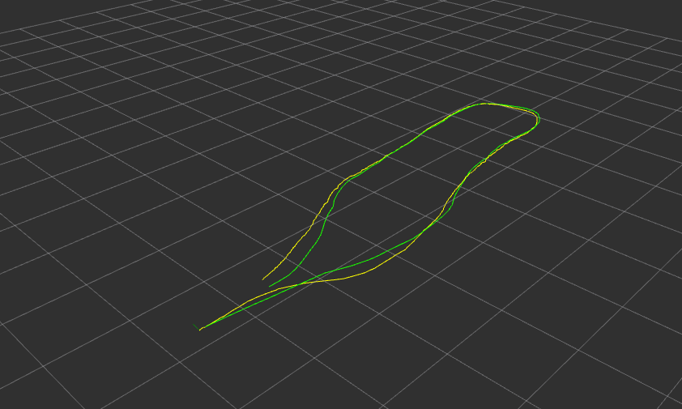
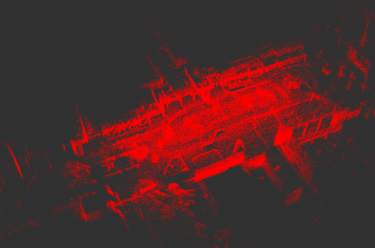

lidarslam_ros2
====
ros2 slam package of the frontend using OpenMP-boosted gicp/ndt scan matching and the backend using graph-based slam. 

mobile robot mapping  


Green: path with loopclosure  
(the 25x25 grids in size of 10m × 10m)

 

Red and yellow: map

## summary

`lidarslam_ros2` is a ROS2 package  of the frontend using  OpenMP-boosted gicp/ndt scan matching and the backend using graph-based slam.  
I found that even a four-core laptop with 16GB of memory could work in outdoor environments for several kilometers with only 16 line LiDAR.  
(WIP)

## requirement to build
You need  [ndt_omp_ros2](https://github.com/rsasaki0109/ndt_omp_ros2) for scan-matcher

clone
(If you forget to add the --recursive option when you do a git clone, run `git submodule update --init --recursive` in the lidarslam_ros2 directory)
```
cd ~/ros2_ws/src
git clone --recursive https://github.com/rsasaki0109/lidarslam_ros2
```
build
```
cd ~/ros2_ws
colcon build --cmake-args -DCMAKE_BUILD_TYPE=Release
```

## io

### frontend(scan-matcher) 
- input  
/input_cloud  (sensor_msgs/PointCloud2)  
/tf(from "base_link" to LiDAR's frame)  
/initial_pose  (geometry_msgs/PoseStamed)(optional)  
/imu  (sensor_msgs/Imu)(optional)  
/tf(from "odom" to "base_link")(Odometry)(optional)  

- output  
/current_pose (geometry_msgs/PoseStamped)  
/map  (sensor_msgs/PointCloud2)  
/path  (nav_msgs/Path)  
/tf(from "map" to "base_link")  
/map_array(lidarslam_msgs/MapArray)

### backend(graph-based-slam)
- input  
/map_array(lidarslam_msgs/MapArray)
- output  
/modified_path  (nav_msgs/Path)   
/modified_map  (sensor_msgs/PointCloud2)  

- srv  
/map_save  (std_srvs/Empty)

`pose_graph.g2o` and `map.pcd` are saved in loop closing or using the following service call.

```
ros2 service call /map_save std_srvs/Empty
```

## params

- frontend(scan-matcher) 

|Name|Type|Default value|Description|
|---|---|---|---|
|registration_method|string|"NDT"|"NDT" or "GICP"|
|ndt_resolution|double|5.0|resolution size of voxel[m]|
|ndt_num_threads|int|0|threads using ndt(if `0` is set, maximum alloawble threads are used.)(The higher the number, the better, but reduce it if the CPU processing is too large to estimate its own position.)|
|gicp_corr_dist_threshold|double|5.0|the distance threshold between the two corresponding points of the source and target[m]|
|trans_for_mapupdate|double|1.5|moving distance of map update[m]|
|vg_size_for_input|double|0.2|down sample size of input cloud[m]|
|vg_size_for_map|double|0.05|down sample size of map cloud[m]|
|use_min_max_filter|bool|false|whether or not to use minmax filter|
|scan_max_range|double|100.0|max range of input cloud[m]|
|scan_min_range|double|1.0|min range of input cloud[m]|
|scan_period|double|0.1|scan period of input cloud[sec](If you want to compound imu, you need to change this parameter.)|
|map_publish_period|double|15.0|period of map publish[sec]|
|num_targeted_cloud|int|10|number of targeted cloud in registration(The higher this number,  the less distortion.)|
|debug_flag|bool|false|Whether or not to display the registration information|
|set_initial_pose|bool|false|whether or not to set the default pose value in the param file|
|initial_pose_x|double|0.0|x-coordinate of the initial pose value[m]|
|initial_pose_y|double|0.0|y-coordinate of the initial pose value[m]|
|initial_pose_z|double|0.0|z-coordinate of the initial pose value[m]|
|initial_pose_qx|double|0.0|Quaternion x of the initial pose value|
|initial_pose_qy|double|0.0|Quaternion y of the initial pose value|
|initial_pose_qz|double|0.0|Quaternion z of the initial pose value|
|initial_pose_qw|double|1.0|Quaternion w of the initial pose value|
|publish_tf|bool|true|Whether or not to publish tf from global frame to robot frame|
|use_odom|bool|false|whether odom is used or not for initial attitude in point cloud registration|
|use_imu|bool|false|whether 9-axis imu(Angular velocity, acceleration and orientation must be included.) is used or not for point cloud distortion correction.(Note that you must also set the `scan_period`.)|
|debug_flag|bool|false|Whether or not to display the registration information|


- backend(graph-based-slam)

|Name|Type|Default value|Description|
|---|---|---|---|
|registration_method|string|"NDT"|"NDT" or "GICP"|
|ndt_resolution|double|5.0|resolution size of voxel[m]|
|ndt_num_threads|int|0|threads using ndt(if `0` is set, maximum alloawble threads are used.)|
|voxel_leaf_size|double|0.2|down sample size of input cloud[m]|
|loop_detection_period|int|1000|period of searching loop detection[ms]|
|threshold_loop_closure_score|double|1.0| fitness score of ndt for loop clousure|
|distance_loop_closure|double|20.0| distance far from revisit candidates for loop clousure[m]|
|range_of_searching_loop_closure|double|20.0|search radius for candidate points from the present for loop closure[m]|
|search_submap_num|int|2|the number of submap points before and after the revisit point used for registration|
|num_adjacent_pose_cnstraints|int|5|the number of constraints between successive nodes in a pose graph over time|
|use_save_map_in_loop|bool|true|Whether to save the map when loop close(If the map saving process in loop close is too heavy and the self-position estimation fails, set this to `false`.)|

## demo
### trial environment
demo data(ROS1) is `hdl_400.bag` in [hdl_graph_slam](https://github.com/koide3/hdl_graph_slam)  
The Velodyne VLP-32 was used in this data.  
To use rosbag in ROS1, use [rosbag2_bag_v2](https://github.com/ros2/rosbag2_bag_v2)  
```
rviz2 -d src/lidarslam_ros2/lidarslam/rviz/mapping.rviz 
```

```
ros2 launch lidarslam lidarslam.launch.py
```

```
ros2 bag play -s rosbag_v2 hdl_400.bag 
```



Green: path with loopclosure, Yellow: path without loopclosure



### The larger environment

demo data(ROS1) by Autoware Foundation  
https://data.tier4.jp/rosbag_details/?id=212  
The Velodyne VLP-16 was used in this data.


```
rviz2 -d src/lidarslam_ros2/lidarslam/rviz/mapping_tukuba.rviz 
```

```
ros2 launch lidarslam lidarslam_tukuba.launch.py
```

```
ros2 bag play -s rosbag_v2 tc_2017-10-15-15-34-02_free_download.bag 
```

  

Green: path  

  

Red and yellow: map

## Used Libraries 

- Eigen
- PCL(BSD3)
- g2o(BSD2 except a part)
- [ndt_omp](https://github.com/koide3/ndt_omp) (BSD2)

## Related packages 

- [li_slam_ros2](https://github.com/rsasaki0109/li_slam_ros2) (BSD2)
