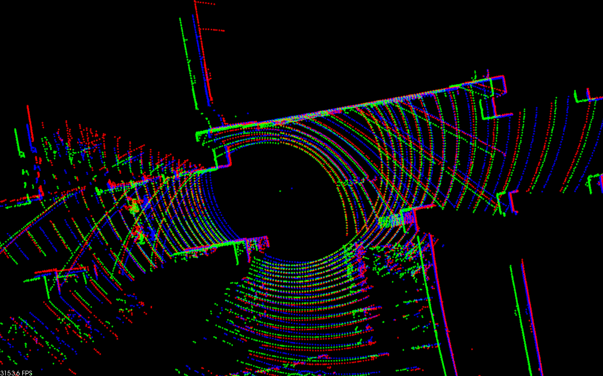

# ndt_omp_ros2
This package provides an OpenMP-boosted Normal Distributions Transform (and GICP) algorithm derived from pcl. The NDT algorithm is modified to be SSE-friendly and multi-threaded. It can run up to 10 times faster than its original version in pcl.

### Benchmark
```
$ cd ~/ros2_ws/src/ndt_omp_ros2/data
$ ros2 run ndt_omp_ros2 align 251370668.pcd 251371071.pcd

--- pcl::GICP ---
single : 267.385[msec]
10times: 1151.76[msec]
fitness: 0.220382

--- pclomp::GICP ---
single : 173.152[msec]
10times: 1299.14[msec]
fitness: 0.220388

--- pcl::NDT ---
single : 425.142[msec]
10times: 3638.77[msec]
fitness: 0.213937

--- pclomp::NDT (KDTREE, 1 threads) ---
single : 308.935[msec]
10times: 3095.53[msec]
fitness: 0.213937

--- pclomp::NDT (DIRECT7, 1 threads) ---
single : 188.942[msec]
10times: 1373.47[msec]
fitness: 0.214205

--- pclomp::NDT (DIRECT1, 1 threads) ---
single : 41.3584[msec]
10times: 347.261[msec]
fitness: 0.208511

--- pclomp::NDT (KDTREE, 8 threads) ---
single : 108.68[msec]
10times: 1046.16[msec]
fitness: 0.213937

--- pclomp::NDT (DIRECT7, 8 threads) ---
single : 56.9189[msec]
10times: 545.279[msec]
fitness: 0.214205

--- pclomp::NDT (DIRECT1, 8 threads) ---
single : 16.7266[msec]
10times: 169.097[msec]
fitness: 0.208511
```

Several methods for neighbor voxel search are implemented. If you select pclomp::KDTREE, results will be completely same as the original pcl::NDT. We recommend to use pclomp::DIRECT7 which is faster and stable. If you need extremely fast registration, choose pclomp::DIRECT1, but it might be a bit unstable.

<br>
Red: target, Green: source, Blue: aligned
