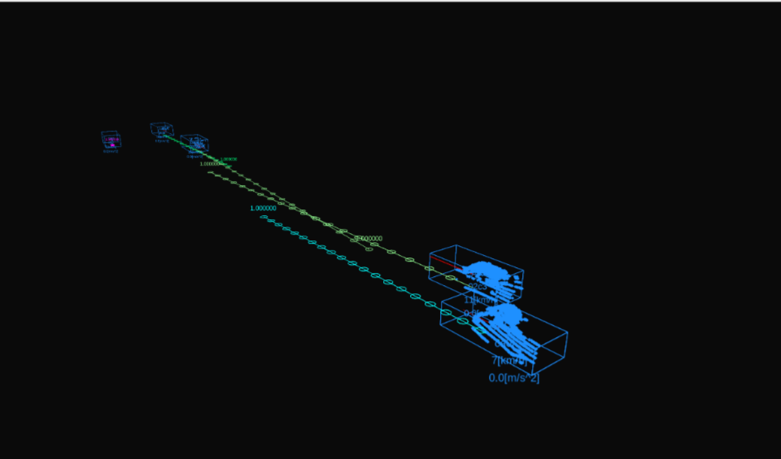

# autoware_auto_perception_plugin

## Purpose

It is an rviz plugin for visualizing the result from perception module. This package is based on the implementation of the rviz plugin developed by Autoware.Auto.

See Autoware.Auto design documentation for the original design philosophy. [[1]](https://gitlab.com/autowarefoundation/autoware.auto/AutowareAuto/-/blob/master/src/tools/visualization/autoware_rviz_plugins)

<!-- Write the purpose of this package and briefly describe the features.

Example:
  {package_name} is a package for planning trajectories that can avoid obstacles.
  This feature consists of two steps: obstacle filtering and optimizing trajectory.
-->

## Input Types / Visualization Results

### DetectedObjects

#### Input Types

| Name | Type                                                  | Description               |
| ---- | ----------------------------------------------------- | ------------------------- |
|      | `autoware_auto_perception_msgs::msg::DetectedObjects` | detection result array    |
|      | `sensor_msgs::msg::PointCloud2`                       | point cloud for filtering |

#### Visualization Result

### TrackedObjects

#### Input Types

| Name | Type                                                 | Description               |
| ---- | ---------------------------------------------------- | ------------------------- |
|      | `autoware_auto_perception_msgs::msg::TrackedObjects` | tracking result array     |
|      | `sensor_msgs::msg::PointCloud2`                      | point cloud for filtering |

#### Visualization Result

Overwrite tracking results with detection results.

### PredictedObjects

#### Input Types

| Name | Type                                                   | Description              |
| ---- | ------------------------------------------------------ | ------------------------ |
|      | `autoware_auto_perception_msgs::msg::PredictedObjects` | prediction result array  |
|      | `sensor_msgs::msg::PointCloud2`                        | pointcloud for filtering |

#### Visualization Result

Overwrite prediction results with tracking results.

### Visualization with active point cloud publishing

Publishing colored point clouds. With colors according to different classes of detected objects, same as polygons.

## References/External links

[1] <https://gitlab.com/autowarefoundation/autoware.auto/AutowareAuto/-/tree/master/src/tools/visualization/autoware_rviz_plugins>

## Future extensions / Unimplemented parts
