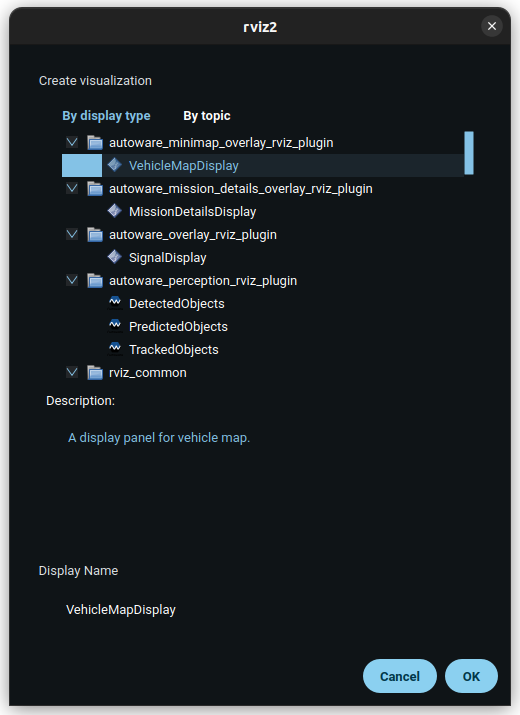
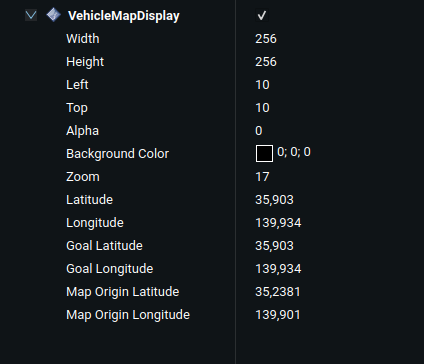

# autoware_minimap_overlay_rviz_plugin

Plugin for displaying a minimap overlay in RViz2 with vehicle position, goal pose, and route information.

Based on the [jsk_visualization](https://github.com/jsk-ros-pkg/jsk_visualization) package, under the 3-Clause BSD license.

## Purpose

This plugin provides a visual representation of the vehicle's position, the goal pose, and the planned route on a minimap overlay within RViz2. It is designed to enhance situational awareness by displaying relevant navigation information.

## Inputs / Outputs

### Input

| Name                                             | Type                                             | Description                           |
| ------------------------------------------------ | ------------------------------------------------ | ------------------------------------- |
| `/api/vehicle/kinematics`                        | `autoware_adapi_v1_msgs::msg::VehicleKinematics` | The topic is the vehicle's kinematics |
| `/planning/mission_planning/echo_back_goal_pose` | `geometry_msgs::msg::PoseStamped`                | The topic is the goal pose            |
| `/api/routing/state`                             | `autoware_adapi_v1_msgs::msg::RouteState`        | The topic is the routing state        |
| `/planning/scenario_planning/trajectory`         | `autoware_planning_msgs::msg::Trajectory`        | The topic is the planned trajectory   |

## Parameters

### Core Parameters

#### VehicleMapDisplay

| Name                   | Type   | Default Value     | Description                         |
| ---------------------- | ------ | ----------------- | ----------------------------------- |
| `Width`                | int    | 256               | Width of the overlay (max: 500 px)  |
| `Height`               | int    | 256               | Height of the overlay (max: 500 px) |
| `Left`                 | int    | 10                | Left position of the overlay        |
| `Top`                  | int    | 10                | Top position of the overlay         |
| `Alpha`                | float  | 0.0               | Transparency of the overlay         |
| `Background Color`     | QColor | QColor(0, 0, 0)   | Background color of the overlay     |
| `Zoom`                 | int    | 15                | Zoom level of the map (15-18)       |
| `Latitude`             | float  | 0.0               | Latitude of the ego vehicle         |
| `Longitude`            | float  | 0.0               | Longitude of the ego vehicle        |
| `Goal Latitude`        | float  | 0.0               | Latitude of the goal pose           |
| `Goal Longitude`       | float  | 0.0               | Longitude of the goal pose          |
| `Map Origin Latitude`  | float  | 35.23808753540768 | Latitude of the map origin          |
| `Map Origin Longitude` | float  | 139.9009591876285 | Longitude of the map origin         |

## Important Note

- The Map Origin Latitude and Map Origin Longitude parameters should be updated according to the specific map being used. These values define the reference point for converting local coordinates to geographic coordinates and vice versa, the default values are for the `sample-map-planning` from the Autoware planning tutorial.
- The Zoom parameter should be set according to the map tiles available for the specified zoom levels between 15-18.
- The Latitude and Longitude parameters should automatically update based on the vehicle's position and the goal pose topics, and are there for debug purposes.
- The Width and Height parameters should be set according to the desired size of the overlay, the maximum value is 500 px.
- The Left and Top parameters should be set according to the desired position of the overlay, considering it is relative to the bottom-left corner of the RViz2 window.

## Assumptions / Known Limits

- The plugin assumes that the vehicle position and goal pose topics are being published.
- Map tiles must be fetched and available for the specified zoom levels.
- The position icon should rotate correctly according to the vehicle's orientation.

## Usage

1. Start `rviz2` and click the `Add` button under the `Displays` panel.

   

2. Under the `By display type` tab, select `autoware_minimap_overlay_rviz_plugin/VehicleMapDisplay` and press OK.

3. Edit size, position, zoom or map origin parameters as needed.

   

## Example Configuration

Here is an example configuration for the VehicleMapDisplay:

```yaml
VehicleMapDisplay:
  Width: 256
  Height: 256
  Left: 10
  Top: 10
  Alpha: 0.5
  Background Color: [0, 0, 0]
  Zoom: 16
  Latitude: 35.0
  Longitude: 139.0
  Goal Latitude: 35.1
  Goal Longitude: 139.1
  Map Origin Latitude: 35.23808753540768
  Map Origin Longitude: 139.9009591876285
```

## License

This project is licensed under the Apache License, Version 2.0. See the [LICENSE](LICENSE) file for details.
