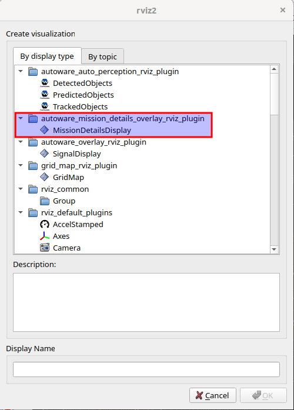
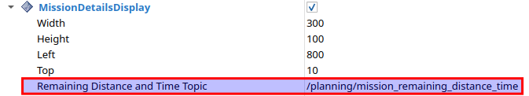

# autoware_overlay_rviz_plugin

Plugin for displaying 2D overlays over the RViz2 3D scene for mission details (such as remaining distance and time).

Based on the [jsk_visualization](https://github.com/jsk-ros-pkg/jsk_visualization)
package, under the 3-Clause BSD license.

## Purpose

This plugin provides a visual and easy-to-understand display of mission details (remaining distance and time)

## Inputs / Outputs

### Input

| Name                                        | Type                                                        | Description                                               |
| ------------------------------------------- | ----------------------------------------------------------- | --------------------------------------------------------- |
| `/planning/mission_remaining_distance_time` | `autoware_planning_msgs::msg::MissionRemainingDistanceTime` | The topic is for mission remaining distance and time Data |

## Parameter

### Core Parameters

#### SignalDisplay

| Name               | Type | Default Value | Description                       |
| ------------------ | ---- | ------------- | --------------------------------- |
| `property_width_`  | int  | 300           | Width of the plotter window [px]  |
| `property_height_` | int  | 100           | Height of the plotter window [px] |
| `property_left_`   | int  | 800           | Left of the plotter window [px]   |
| `property_top_`    | int  | 10            | Top of the plotter window [px]    |

## Assumptions / Known limits

TBD.

## Usage

1. Start `rviz2` and click `Add` button under the `Displays` panel.

   

2. Under `By display type` tab, select `autoware_mission_details_overlay_rviz_plugin/MissionDetailsDisplay` and press OK.
   

3. Enter the names of the topics if necessary `/planning/mission_remaining_distance_time`.

   
