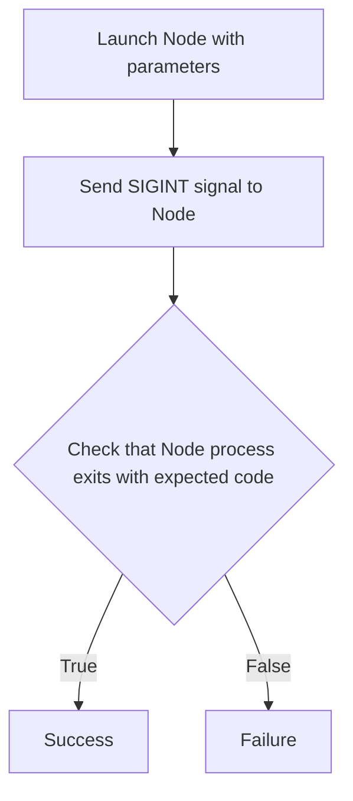
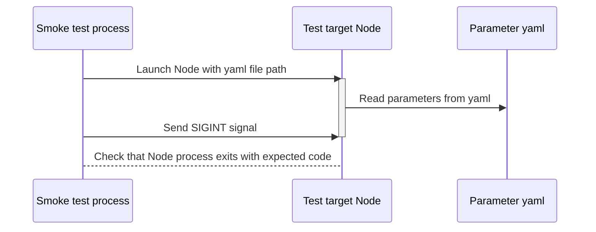
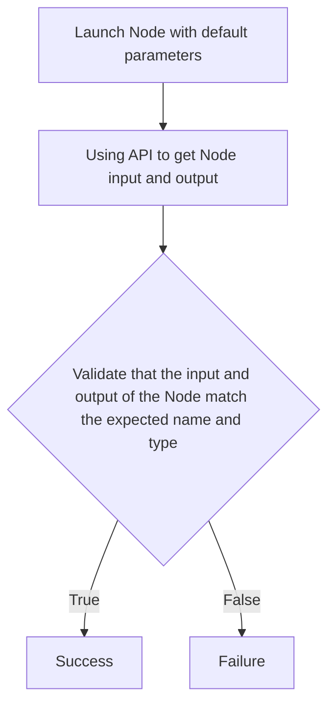
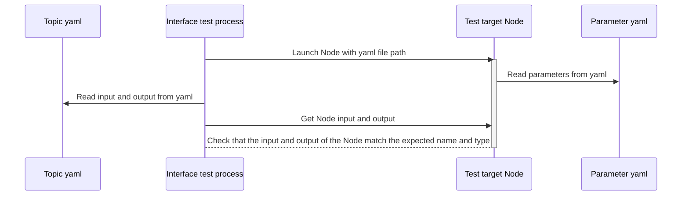

# autoware_testing

This is the design document for the `autoware_testing` package.

# Purpose / Use cases

The purpose of this document is to enable Autoware developers to use the common testing framework in the `autoware_testing` package.

The package aims to provide a unified way to add standard testing functionality to the package, currently supporting:

- Smoke testing (`add_smoke_test`): A smoke component test ensures that the node can be
  1. launched with its default configuration and doesn't crash
  1. shut down through a SIGINT signal with the corresponding process return code.
- Interface testing (`add_interface_test`): An interface test ensures that a node consumes/produces the desired output in line with the high-level documentation of its design document.
  - It helps to keep the docs up to date and to prevent users from having to dig through the source code to find the topic names/types.

# Design

Uses `ros_testing` (which is an extension of `launch_testing`) and provides some parametrized, reusable standard tests to run.

## Test flow

### Smoke test

Smoke test launches Node and sends `SIGINT` signal afterwards.
Smoke test checks the exit code of the Node process and raises an error if it is different from the expected exit code.
The parameters needed to launch the Node can be passed in yaml format.





### Interface test

Interface test launches Node and get Node input and output using API.
The test process reads the yaml in which the topic information is defined and compares it with the information actually retrieved from the Node. If the information matches, it exits successfully. If they do not match, it raises an error.





## Assumptions / Known limits

Parametrization is limited to package, executable names, parameters filename, topics filename and executable arguments. Test namespace is set as 'test'.
Parameters file and topics file for the package is expected to be in `param` directory inside package.

## Inputs / Outputs / API

To add tests in `autoware_testing` to your package tests, add a test dependency for `autoware_testing` to `package.xml`

```xml
<test_depend>autoware_testing</test_depend>
```

### Smoke test

Sdd the following two lines to `CMakeLists.txt` in the `IF (BUILD_TESTING)` section:

```cmake
find_package(autoware_testing REQUIRED)
add_smoke_test(<package_name> <executable_name> [PARAM_FILENAME <param_filename>] [EXECUTABLE_ARGUMENTS <arguments>])
```

Where

`<package_name>` - [required] tested node package name.

`<executable_name>` - [required] tested node executable name.

`<param_filename>` - [optional] param filename. Default value is `test.param.yaml`. Required mostly in situation where there are multiple smoke tests in a package and each requires different parameters set.

`<arguments>` - [optional] arguments passed to executable. By default no arguments are passed.

which adds `<executable_name>_smoke_test` test to suite.

Example test result:

```log
build/<package_name>/test_results/<package_name>/<executable_name>_smoke_test.xunit.xml: 1 test, 0 errors, 0 failures, 0 skipped
```

### Interface test

Add a yaml file that defines topics to your package.
This yaml file is to contain the public API. It can be easily read in python.
It should be referenced from the design doc and remain human readable.
The file will looks like this:

```yaml
input_topics:
  - name: ~/input/lateral/control_cmd
    type: autoware_auto_control_msgs/msg/AckermannLateralCommand
  - name: ~/input/longitudinal/control_cmd
    type: autoware_auto_control_msgs/msg/LongitudinalCommand
output_topics:
  - name: ~/output/control_cmd
    type: autoware_auto_control_msgs/msg/AckermannControlCommand
```

and add the following two lines to `CMakeLists.txt` in the `IF (BUILD_TESTING)` section:

```cmake
find_package(autoware_testing REQUIRED)
add_interface_test(<package_name> <executable_name> [TOPIC_FILENAME <topic_filename>] [PARAM_FILENAME <param_filename>] [EXECUTABLE_ARGUMENTS <arguments>])
```

Where

`<package_name>` - [required] tested node package name.

`<executable_name>` - [required] tested node executable name.

`<topic_filename>` - [required] topic filename. Defines the input and output topics to be used by the interface tests.

`<param_filename>` - [optional] param filename. Default value is `test.param.yaml`. Required mostly in situation where there are multiple interface tests in a package and each requires different parameters set.

`<arguments>` - [optional] arguments passed to executable. By default no arguments are passed.

which adds `<executable_name>_interface_test` test to suite.

Example test result:

```log
build/<package_name>/test_results/<package_name>/<executable_name>_interface_test.xunit.xml: 1 test, 0 errors, 0 failures, 0 skipped
```

# References / External links

- <https://en.wikipedia.org/wiki/Smoke_testing_(software)>
- <https://github.com/ros2/ros_testing>
- <https://github.com/ros2/launch/blob/master/launch_testing>

# Future extensions / Unimplemented parts

- Adding more types of standard tests.

# Related issues

- [Autoware.Auto Issue #700: add smoke test](https://gitlab.com/autowarefoundation/autoware.auto/AutowareAuto/-/issues/700)
- [Autoware.Auto Issue #1224: Port other packages with smoke tests to use `autoware_testing`](https://gitlab.com/autowarefoundation/autoware.auto/AutowareAuto/-/issues/1224)
- [Autoware.Auto Issue #951: Add infrastructure for component-interface test](https://gitlab.com/autowarefoundation/autoware.auto/AutowareAuto/-/issues/951)
