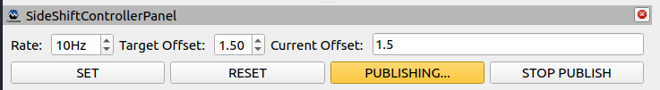
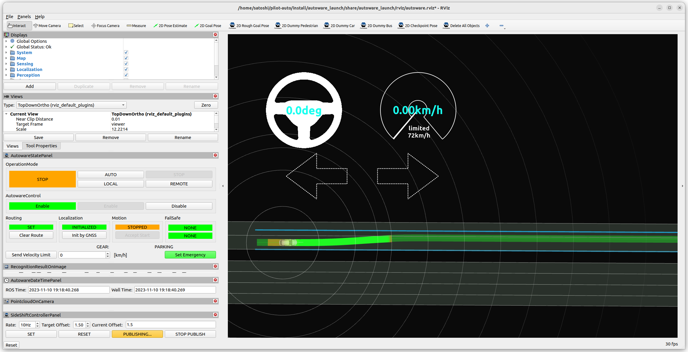

# tier4_side_shift_controller_panel

## Purpose

This plugin panel publishes lateral offset for side shift module.

## Inputs / Outputs

### Output

| Name                                                                                                    | Type                                      | Description    |
| ------------------------------------------------------------------------------------------------------- | ----------------------------------------- | -------------- |
| `/planning/scenario_planning/lane_driving/behavior_planning/behavior_path_planner/input/lateral_offset` | `tier4_planning_msgs::msg::LateralOffset` | lateral offset |

## HowToUse

  

1. Enter lateral offset value.
2. Push `SET` button.
3. Push `PUBLISH` button.

  

