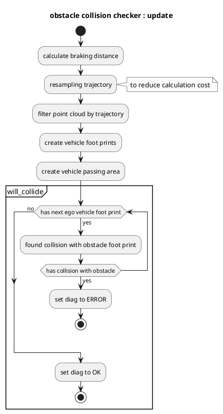

# obstacle_collision_checker

## 目的

`obstacle_collision_checker`は、予測された軌跡と障害物衝突をチェックし、衝突を発見した場合に診断エラーを公開するモジュールです。

## 仕組み / アルゴリズム

### フローチャート

### アルゴリズム

### データの確認

`obstacle_collision_checker` が地上点群、予測軌跡、基準軌跡、現在の速度データを受信していないことを確認します。

### 診断の更新

予測パスで衝突が発生した場合、このモジュールは診断ステータスとして `ERROR` レベルを設定し、それ以外の場合は `OK` を設定します。

## 入出力

### 入力

| 名前 | 型 | 説明 |
|---|---|---|
| `~/input/trajectory` | `autoware_planning_msgs::msg::Trajectory` | 基準軌跡 |
| `~/input/trajectory` | `autoware_planning_msgs::msg::Trajectory` | 予測軌跡 |
| `/perception/obstacle_segmentation/pointcloud` | `sensor_msgs::msg::PointCloud2` | 自車が停止または回避すべき障害物の点群 |
| `/tf` | `tf2_msgs::msg::TFMessage` | TF |
| `/tf_static` | `tf2_msgs::msg::TFMessage` | スタティックTF |

### 出力

**AutowareのPlanningモジュール**

**概要**

Planningモジュールは、Autowareの重要なコンポーネントの1つであり、Perceptionモジュールから受信したセンサデータを処理して、経路計画と制御コマンドを生成します。このモジュールは、次の手順で動作します。

**主な機能**

* **経路計画:**
    * ダイナミック計画法を使用して、周囲の環境を考慮した最適な経路を生成します。
    * 衝突回避と安全性を確保するために、予測可能な障害物パスを予測します。
* **モーション計画:**
    * 経路計画に基づいて、目標速度と加速度を決定します。
* **コマンド生成:**
    * 目標速度と加速度を使用して、車両のハンドルとアクセル/ブレーキの制御コマンドを生成します。

**入力**

* Perceptionモジュールからのセンサデータ
    * LiDAR
    * レーダー
    * カメラ
* 自車位置

**出力**

* 計画された経路
* 目標速度と加速度
* ハンドルとアクセル/ブレーキの制御コマンド

**考慮事項**

* **センサーの不確実性:** センサーデータは不確実性を伴うため、Planningモジュールはロバストで信頼性の高い出力を生成する必要があります。
* **現実世界の制約:** 計画された経路は、道路の傾斜、交通信号、その他の現実世界の制約を考慮する必要があります。
* **リアルタイム処理:** Planningモジュールは、リアルタイムで動作して、車両の安全な運転を確保する必要があります。

**追加の機能**

* **'post resampling' 局所パス計画:** センサーデータの更新に応じて、局所パスをリアルタイムで調整します。
* **多様なパラメータ設定:** 車両のモデル、環境条件、運転スタイルに応じて、Planningモジュールのパラメータを調整できます。
* **詳細なログ記録:** Planningモジュールの動作を診断し、改善するために、ログデータを記録できます。

**関連ドキュメント**

* Autoware Planningモジュールユーザーガイド
* Autoware Planningモジュール開発者ガイド

| 変数名        | 型                                    | 説明                       |
| ------------ | --------------------------------------- | -------------------------- |
| `~/debug/marker` | `visualization_msgs::msg::MarkerArray` | 視覚化用マーカー             |

## パラメータ

| 名称                | 型     | 説明                                                 | デフォルト値 |
| :------------------ | :------- | :----------------------------------------------------- | :------------ |
| `delay_time`        | `double` | 車両の遅延時間 [s]                                  | 0.3           |
| `footprint_margin`  | `double` | 車両形状のマージン [m]                              | 0.0           |
| `max_deceleration`  | `double` | 自車停止時の最大減速度 [m/s^2]                       | 2.0           |
| `resample_interval` | `double` | `post resampling`された軌道データの区間 [m]             | 0.3           |
| `search_radius`     | `double` | 軌道データから点群への探索距離 [m]                    | 5.0           |

## 前提 / 既知の制限事項

適切な衝突確認を行うためには、予測軌道とノイズのない障害物点群の予測値を取得する必要があります。

