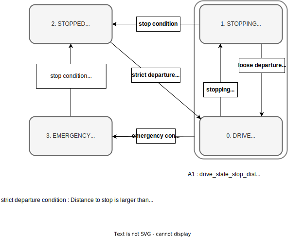

# PID Longitudinal Controller

## 目的 / ユースケース

longitudinal_controllerは、フィードフォワード / フィードバック制御を使用して、目標軌道の各点で設定された目標速度を実現するために目標加速度を計算します。

また、道路傾斜情報を考慮する傾斜力補正機能と遅延補償機能も搭載されています。ここで計算された目標加速度が車両インターフェースによって適切に実現されることが想定されています。

車両が「目標速度」インターフェースをサポートしている場合、Autowareではこのモジュールの使用は必須ではないことに注意してください。

## 設計 / 内部動作 / アルゴリズム

### 状態

このモジュールには、特定の状況で特殊な処理を処理するために、以下に示す4つの状態遷移があります。

- **DRIVE**
  - PID制御による目標速度追従を実行します。
  - また、遅延補償と傾斜補償も適用します。
- **STOPPING**
  - 停止直前の動きを制御します。
  - 正確かつスムーズな停止を実現するために特別なシーケンスが実行されます。
- **STOPPED**
  - 停止状態での操作を行います（例：ブレーキホールド）
- **EMERGENCY**
  - 特定の条件が満たされた場合（例：車両が停止線の一定距離を超えた場合）、緊急状態に入ります。
  - 回復条件（車両が完全に停止するまで緊急状態を維持するかどうかの条件）または緊急状態での減速度はパラメータによって定義されます。

状態遷移図を以下に示します。

### ロジック

#### 制御ブロックダイアグラム

#### フィードフォワード（FF）

軌道に設定された基準加速度と傾斜補正項をフィードフォワードとして出力します。モデリングエラーのない理想的な条件下では、このFF項のみで速度追従に十分です。

モデリングエラーまたは離散化エラーを引き起こす追従エラーは、フィードバック制御（現在はPIDを使用）によって除去されます。

##### ブレーキ保持

乗り心地の観点からは、加速0で停止することが重要です。なぜなら、ブレーキによる衝撃が低減されるからです。ただし、停止時の目標加速度が0の場合、車両モデルエラーまたは勾配推定エラーにより、車両が停止線を越えてしまったり、停止線の前で少し加速したりする可能性があります。

信頼性の高い停止を実現するために、フィードフォワードシステムによって計算された目標加速度は、停止時には負の加速度に制限されます。

#### 傾斜補正

傾斜情報に基づき、補正項が目標加速度に追加されます。

倾斜情報には2つの情報源があり、パラメータによって切り替えることができます。

  - 傾斜角から現在の勾配を計算します
  - 長所: 容易に入手可能
  - 短所: 車両の振動の影響により、正確な勾配情報を抽出できません
- 軌道の Z 座標
  - ターゲット軌跡における前輪と後輪位置の Z 座標の差から道路勾配を計算します
  - 長所: 経路の Z 座標が適切に維持されている場合、ピッチ情報よりも正確
  - 長所: 遅延補正との併用が可能（現時点では未実装）
  - 短所: 高精度マップの Z 座標が必要
  - 短所: 自由空間計画をサポートしていない（現時点では）

**記号:** この関数は、低レベル制御システムに加速フィードバックがない車両システムでのみ正常に動作します。

この補正は、ターゲット加速度に重力補正を加え、自立走行システムが求めるターゲット加速度と等しくなくなる出力値を出力します。そのため、低レベルコントローラーの加速フィードバックの役割と矛盾します。
たとえば、車両が「1.0 m/s^2」の加速度で始動しようとしており、「-1.0 m/s^2」の重力補正が適用されると、出力値は「0」になります。この出力値を誤ってターゲット加速度として扱えば、車両は始動しません。

勾配補正機能に適した車両システムの例は、 longitudinal_controller からの出力加速度をフィードバックなしでターゲットアクセル/ブレーキペダル入力に変換するシステムです。この場合、出力加速度はターゲットペダルの計算のためのフィードフォワード項としてのみ使用されるため、上記の点は問題になりません。

注: 勾配の角度は上り坂で正、自車位置のピッチ角は上向きで負と定義されます。定義は逆です。

#### PID 制御

フィードフォワード制御で処理できない偏差、たとえばモデル誤差に対しては、フィードバックシステムを構築するために PID 制御が使用されます。

この PID 制御は、現在の自車速度とターゲット速度の偏差からターゲット加速度を計算します。

この PID 処理は、各項の出力に最大値があります。これは次のことを防ぐためです。

- 大きい積分項は、ユーザーによる予期しない動作を引き起こす可能性があります。
- 予期しないノイズは、微分項の出力の値を非常に高くする可能性があります。

注: デフォルトでは、車両が停止している場合、制御システムの積分項は蓄積されません。この予防措置は、Autoware は車両がエンゲージしていることを想定していますが、起動手順を開始するために外部システムが車両を固定している場合に、積分項の予期しない累積を防ぐことを目的としています。

ただし、車両が起動時に路面の陥没部に遭遇したり、勾配補正が不正確に推定されたり（必要以上に小さくなったり）すると、動作を開始できない場合があります。これらのシナリオに対処するために、`enable_integration_at_low_speed` パラメータを true に設定することで、車両が静止している場合でもエラーの積分をアクティブにすることができます。

`enable_integration_at_low_speed` が true に設定されている場合、PID コントローラーは、`time_threshold_before_pid_integration` パラメータで定義された特定の時間が経過し、車両が `current_vel_threshold_pid_integration` パラメータで設定された最小速度を超えていない場合に、加速度誤差の積分を開始します。

`time_threshold_before_pid_integration` パラメータがあることは、実用的な PID チューニングにとって重要です。車両が停止中または低速時に誤差を積分すると、PID のチューニングが複雑になる可能性があります。このパラメータは効果的に積分部分がアクティブになるまでの遅延を導入し、瞬時に開始することを防ぎます。この遅延により、PID コントローラーのより制御された効果的なチューニングが可能になります。

現在、PID 制御は、開発/保守コストとパフォーマンスのトレードオフの観点から実装されています。
将来的には、より高性能なコントローラー（適応制御またはロバスト制御）に置き換えられる場合があります。

#### 時間遅延補正

高速では、アクセルペダルやブレーキなどのアクチュエータシステムの遅延が走行精度に大きな影響を与えます。
車両の作動原理に応じて、アクセルペダルとブレーキを物理的に制御するメカニズムには通常、約 100 ミリ秒の遅延があります。

このコントローラーでは、予測自車速度と遅延時間後のターゲット速度が計算され、遅延時間の問題に対処するためのフィードバックに使用されます。

### 勾配補正

勾配情報に基づいて、補正項がターゲット加速度に追加されます。

勾配情報のソースは 2 つあり、パラメータで切り替えることができます。

- 推定自車位置のピッチ（デフォルト）
  - 傾斜角から現在の勾配を計算します

## 軌道の Z 座標
  - ターゲット軌道の前輪と後輪位置の Z 座標の差から道路勾配を計算
  - 長所: 経路の Z 座標が適切に維持されていれば、ピッチ情報よりも正確
  - 長所: (まだ実装されていない) 遅延補正と組み合わせて使用できる
  - 短所: 高精細マップの Z 座標が必要
  - 短所: (現時点では) フリースペースプランニングに対応していない

## 前提 / 制限事項

1. スムーズ化された目標速度とその加速度は軌跡に設定される必要がある
   1. 速度コマンドはコントローラー内でスムージングされない (ノイズのみが除去される場合がある)。
   2. ステップ状のターゲット信号の場合、トラッキングは可能な限り高速に実行されます。
2. 車両速度は適切な値でなければならない
   1. 自車速度は、前進/後進方向に対応する符号付き値でなければならない
   2. 自車速度は適切なノイズ処理で与えられるべきである。
   3. 自車速度に大きなノイズが含まれる場合、追従性能が大幅に低下する。
3. このコントローラからの出力を後続モジュール (例: 車両インターフェース) で実現する必要がある。
   1. 車両インターフェースに目標速度または目標加速度インターフェイスがない場合 (例: 車両にアクセルペダルとブレーキインターフェースのみがある場合)、このコントローラの後に適切な変換を行う必要がある。

## 入出力 / API

### 入力

[controller_node](../autoware_trajectory_follower_node/README.md) から次を設定

- `autoware_planning_msgs/Trajectory`: フォローするリファレンストラジェクトリ。
- `nav_msgs/Odometry`: 現在のオドメトリ

### 出力

次の情報を格納した LongitudinalOutput をコントローラノードに返却

- `autoware_control_msgs/Longitudinal`: 車両の縦運動を制御するコマンド。目標速度と目標加速度が含まれます。
- LongitudinalSyncData
  - 速度収束 (現在は使用されていません)

### PIDController クラス

`PIDController` クラスは簡単に使用できます。
最初に、比例 (P)、積分 (I)、および微分 (D) 成分のゲインと制限を `setGains()` と `setLimits()` を使用して設定する必要があります。
次に、現在の誤差とタイムステップ時間を `calculate()` 関数に提供することで速度を計算できます。

## パラメータの説明

`param/lateral_controller_defaults.param.yaml` で定義されている既定のパラメータは、時速 40 km 未満の運転のために AutonomouStuff Lexus RX 450h に調整されています。

| 名称                        | 型   | 説明                                                                                                                                                                             | デフォルト値 |
| :-------------------------- | :----- | :-------------------------------------------------------------------------------------------------------------------------------------------------------------------------------------- | :------------ |
| `delay_compensation_time` | double | 縦制御の遅延 [s]                                                                                                                                                      | 0.17          |
| `enable_smooth_stop`        | bool   | STOPPING への遷移を有効にするフラグ                                                                                                                                                   | true          |
| `enable_overshoot_emergency` | bool   | `emergency_state_overshoot_stop_dist` で指定された距離でエゴが停止線を超えた場合に EMERGENCY への遷移を有効にするフラグ | true          |
| `enable_large_tracking_error_emergency` | bool   | 軌道とエゴの姿勢の大きなずれにより、最も近い軌跡ポイントの検索が失敗した場合に EMERGENCY への遷移を有効にするフラグ | true          |
| `enable_slope_compensation` | bool   | 勾配補正のための出力加速度を変更するフラグ。勾配角のソースはエゴの姿勢または軌道の角度から選択できます。 `use_trajectory_for_pitch_calculation` を参照してください。 | true          |
| `enable_brake_keeping_before_stop` | bool   | エゴが停止する前の DRIVE 状態中に特定の加速度を維持するフラグ。 [ブレーキの維持](#brake-keeping) を参照 | false         |
| `enable_keep_stopped_until_steer_convergence` | bool   | ステアが収束するまで停止状態を維持するフラグ                                                                                                                         | true          |
| `max_acc`                  | double | 出力加速度の最大値 [m/s^2]                                                                                                                                                | 3.0           |
| `min_acc`                  | double | 出力加速度の最小値 [m/s^2]                                                                                                                                                | -5.0          |
| `max_jerk`                 | double | 出力加速度のジャークの最大値 [m/s^3]                                                                                                                                        | 2.0           |
| `min_jerk`                 | double | 出力加速度のジャークの最小値 [m/s^3]                                                                                                                                        | -5.0          |
| `use_trajectory_for_pitch_calculation` | bool   | true の場合、勾配は軌跡の z レベルから推定されます。それ以外の場合は、エゴの姿勢のピッチ角が使用されます。                                                                             | false         |
| `lpf_pitch_gain`            | double | ピッチ推定用のローパスフィルターのゲイン                                                                                                                                            | 0.95          |
| `max_pitch_rad`             | double | 推定ピッチの最大値 [rad]                                                                                                                                                      | 0.1           |
| `min_pitch_rad`             | double | 推定ピッチの最小値 [rad]                                                                                                                                                      | -0.1          |

### 状態遷移

| 名称                               | タイプ | 説明                                                                                                                                                               | デフォルト値 |
| :---------------------------------- | :----- | :----------------------------------------------------------------------------------------------------------------------------------------------------------------------- | :------------ |
| drive_state_stop_dist               | double | 停止位置までの距離が`drive_state_stop_dist` + `drive_state_offset_stop_dist` [m]を超えると、DRIVE状態に移行します。                                  | 0.5           |
| drive_state_offset_stop_dist        | double | 停止位置までの距離が`drive_state_stop_dist` + `drive_state_offset_stop_dist` [m]を超えると、DRIVE状態に移行します。                                  | 1.0           |
| stopping_state_stop_dist            | double | 停止位置までの距離が`stopping_state_stop_dist` [m]未満になるとSTOPPING状態に移行します。                                                              | 0.5           |
| stopped_state_entry_vel             | double | STOPPED状態への遷移時の自車速度のしきい値 [m/s]                                                                                                       | 0.01          |
| stopped_state_entry_acc             | double | STOPPED状態への遷移時の自車加速度のしきい値 [m/s^2]                                                                                                     | 0.1           |
| emergency_state_overshoot_stop_dist | double | `enable_overshoot_emergency`が真の場合、自車が停止位置から`emergency_state_overshoot_stop_dist`メートル先にあるとEMERGENCY状態に移行します。 [m] | 1.5           |
| emergency_state_traj_trans_dev      | double | 自車位置が最寄りの軌跡ポイントから`emergency_state_traj_tran_dev`メートル離れているとEMERGENCY状態に移行します。 [m]                             | 3.0           |
| emergency_state_traj_rot_dev        | double | 自車の方位が最寄りの軌跡ポイントの方位から`emergency_state_traj_rot_dev`ラジアン離れているとEMERGENCY状態に移行します。 [rad]                     | 0.784         |

### DRIVE パラメータ

| 名称                                  | 型   | 説明                                                                                                                                                       | デフォルト値 |
| :------------------------------------ | :----- | :---------------------------------------------------------------------------------------------------------------------------------------------------------------- | :------------ |
| kp                                    | double | Longitudinal制御のPゲイン                                                                                                                                      | 1.0           |
| ki                                    | double | Longitudinal制御のIゲイン                                                                                                                                      | 0.1           |
| kd                                    | double | Longitudinal制御のDゲイン                                                                                                                                      | 0.0           |
| max_out                               | double | DRIVE状態におけるPID出力加速度の最大値[m/s²]                                                                                                              | 1.0           |
| min_out                               | double | DRIVE状態におけるPID出力加速度の最小値[m/s²]                                                                                                              | -1.0          |
| max_p_effort                          | double | Pゲインにおける加速度の最大値                                                                                                                              | 1.0           |
| min_p_effort                          | double | Pゲインにおける加速度の最小値                                                                                                                              | -1.0          |
| max_i_effort                          | double | Iゲインにおける加速度の最大値                                                                                                                              | 0.3           |
| min_i_effort                          | double | Iゲインにおける加速度の最小値                                                                                                                              | -0.3          |
| max_d_effort                          | double | Dゲインにおける加速度の最大値                                                                                                                              | 0.0           |
| min_d_effort                          | double | Dゲインにおける加速度の最小値                                                                                                                              | 0.0           |
| lpf_vel_error_gain                    | double | 速度誤差のローパスフィルタのゲイン                                                                                                                           | 0.9           |
| enable_integration_at_low_speed       | bool   | 車両速度が`current_vel_threshold_pid_integration`未満の場合に、加速度誤差の積分を有効にするか否か                                                                          | false         |
| current_vel_threshold_pid_integration | double | 現在の速度の絶対値がこのパラメータより大きい場合にのみ、I項に対して速度誤差を積分します。 [m/s]                                                              | 0.5           |
| time_threshold_before_pid_integration | double | PID誤差の積分を有効にするまでに車両の無移動が経過する必要がある時間。 [s]                                                                                  | 5.0           |
| brake_keeping_acc                     | double | `enable_brake_keeping_before_stop`が真の場合、自我が停止する前にDRIVE状態中に特定の加速度が維持されます [m/s²] [ブレーキキープ](#brake-keeping)を参照 | 0.2           |

### STOPPING パラメーター（スムーズストップ）

`enable_smooth_stop` が真の場合、スムーズストップが有効になります。
スムーズストップでは、まず車両の速度を下げるために強い加速度（`strong_acc`）が生成されます。
次に、弱い加速度（`weak_acc`）が生成されて車両のジャークを下げながらスムーズに停止します。
車両がある一定時間停止しなかったり、停止位置を何メートルか超えた場合は、すぐに停止するための弱い加速度（`weak_stop_acc`）が生成されます。
車両がまだ走っている場合は、すぐに停止するための強い加速度（`strong_stop_acc`）が生成されます。

| 名前                        | タイプ   | 説明                                                                                                                       | デフォルト値 |
| :--------------------------- | :----- | :-------------------------------------------------------------------------------------------------------------------------- | :------------ |
| smooth_stop_max_strong_acc   | double | 最大強加速 [m/s^2]                                                                                                         | -0.5          |
| smooth_stop_min_strong_acc   | double | 最小強加速 [m/s^2]                                                                                                         | -0.8          |
| smooth_stop_weak_acc         | double | 弱加速 [m/s^2]                                                                                                             | -0.3          |
| smooth_stop_weak_stop_acc    | double | 弱停止加速 [m/s^2]                                                                                                          | -0.8          |
| smooth_stop_strong_stop_acc  | double | 自車が停止ポイントから `smooth_stop_strong_stop_dist` メートル離れたときに出力される強加速 [m/s^2] | -3.4          |
| smooth_stop_max_fast_vel     | double | 自車が高速走行中とみなす、最大の高速限界速度 [m/s]。高速走行中とみなされると、強加速が出力されます。 | 0.5           |
| smooth_stop_min_running_vel  | double | 自車が走行中とみなす、最低走行速度 [m/s]                                                                                | 0.01          |
| smooth_stop_min_running_acc  | double | 自車が走行中とみなす、最低走行加速度 [m/s^2]                                                                              | 0.01          |
| smooth_stop_weak_stop_time   | double | 弱加速を出力する最大時間 [s]。時間を超えると強加速が出力されます。                                                       | 0.8           |
| smooth_stop_weak_stop_dist   | double | 自車が停止ポイントから `smooth_stop_weak_stop_dist` メートルの距離にあるとき、弱加速が出力されます [m]                   | -0.3          |
| smooth_stop_strong_stop_dist | double | 自車が停止ポイントから `smooth_stop_strong_stop_dist` メートルの距離にあるとき、強加速が出力されます [m]                  | -0.5          |

### STOPPED パラメーター

`STOPPED` 状態では、車両が完全に停止しており、ブレーキが完全に作動していることを想定しています。
そのため、`stopped_acc` には、車両に最大のブレーキを適用することを可能にする値を設定する必要があります。
`stopped_acc` が十分に低いと、急勾配で滑落する可能性があります。

| Name         | Type   | Description                                                                        | Default value |
| :----------- | :----- | :----------------------------------------------------------------------------------- | :------------ |
| stopped_vel  | double | STOPPED状態における目標速度 [m/s]                                               | 0.0           |
| stopped_acc  | double | STOPPED状態における目標加速度 [m/s^2]                                             | -3.4          |
| stopped_jerk | double | STOPPED状態における目標ジャーク [m/s^3]                                            | -5.0          |

### EMERGENCYパラメータ

| 名称           | タイプ   | 説明                                       | デフォルト値 |
| :------------- | :----- | :------------------------------------------------ | :------------ |
| emergency_vel  | 倍精度浮動小数点 | EMERGENCY状態での目標速度 [m/s]          | 0.0           |
| emergency_acc  | 倍精度浮動小数点 | EMERGENCY状態での目標加速度 [m/s^2] | -5.0          |
| emergency_jerk | 倍精度浮動小数点 | EMERGENCY状態での目標ジャーク [m/s^3]         | -3.0          |

## 参考文献 / 外部リンク

## 今後の拡張 / 未実装の部分

## 関連する課題

