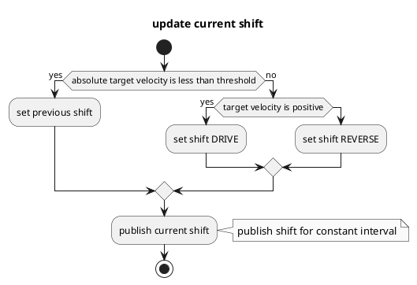

# シフトデリサイダー

## 目的

`autoware_shift_decider`は、アッカーマン制御コマンドからシフトを決めるモジュールです。

## 内部構造とアルゴリズム

### フローチャート

### アルゴリズム

## 入出力

### 入力

| 名称                  | タイプ                                  | 説明                  |
| --------------------- | ------------------------------------- | ---------------------------- |
| `~/input/control_cmd` | `autoware_control_msgs::msg::Control` | 車両の制御コマンド。 |

### 出力

**自動運転ソフトウェア**

**更新履歴**

* 2023年3月15日: ドキュメントの初回公開

**概要**

このドキュメントは、Autoware の自動運転ソフトウェアのアーキテクチャ、機能、使用方法に関する包括的なガイドです。このソフトウェアは、センサーデータの収集、環境認識、経路計画、制御コマンドの生成など、自動運転システムのすべての重要なコンポーネントを提供します。

**アーキテクチャ**

Autoware のアーキテクチャはモジュール化されており、次のコンポーネントで構成されています。

* **Perception (認識)**: カメラ、レーダー、LIDAR から受信したセンサーデータを処理し、自車位置と周囲環境のモデルを作成します。
* **Planning (計画)**: 知覚された環境に基づいて、安全で効率的な経路を計画します。
* **Control (制御)**: 計画された経路に従って車両を制御し、センサーデータとフィードバックを使用して適応します。
* **Localization (自己位置推定)**: 車両の位置と姿勢をリアルタイムで追跡します。

**機能**

Autoware は以下を含む幅広い機能を提供します。

* **障害物検出と回避**: 歩行者、車両、その他の障害物を検出し、衝突を回避します。
* **経路追従**: 計画された経路に沿って車両を正確に制御します。
* **交通信号認識**: 交通信号を検出し、それらに従って動作します。
* **駐車支援**: 車両の自動駐車を支援します。
* **ビジョンベースの自己位置推定**: カメラ画像を使用して車両の位置と姿勢を推定します。

**使用方法**

Autoware を使用するには、次の手順に従います。

1. ハードウェア（センサー、コンピューター、アクチュエーター）をインストールします。
2. Autoware ソフトウェアをインストールし、構成します。
3. 車両をキャリブレーションし、環境をマッピングします。
4. シミュレーションまたは現実世界でシステムをテストします。

**注意事項**

* 自動運転システムは常に慎重に使用し、道路交通法を遵守する必要があります。
* Autoware は開発中のソフトウェアであり、常に改善されています。
* システムを十分にテストせずに使用しないでください。

**免責事項**

Autoware はオープンソースソフトウェアであり、いかなる保証もなしに提供されています。ユーザーは自己責任でこのソフトウェアを使用するものとします。

| Name                | Type                                       | Description                           |
| -------------------- | -------------------------------------------- | ------------------------------------- |
| `~output/gear_cmd`    | `autoware_vehicle_msgs::msg::GearCommand` | 前進 / 後退走行時のギア              |

## パラメータ

なし

## 仮定 / 制限事項

TBD

