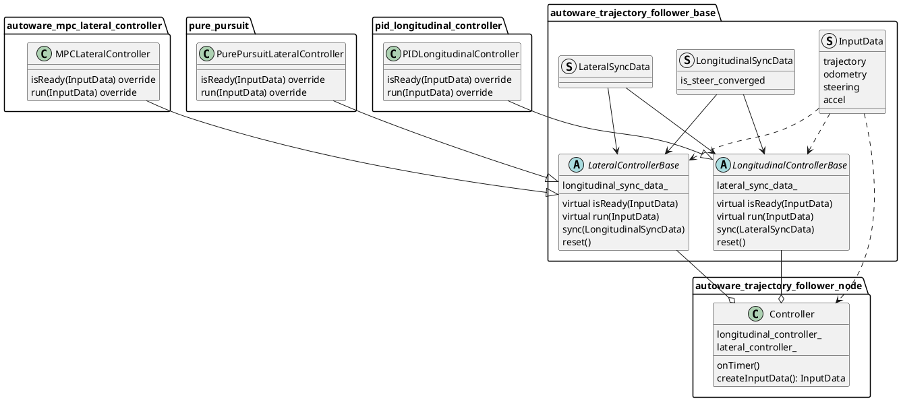

# 軌道追随ノード

## 目的

与えられた軌道に従う制御コマンドを生成します。

## 設計

これは、[autoware_trajectory_follower_base](../autoware_trajectory_follower_base/README.md#trajectory-follower) パッケージから派生したコントローラクラスで実装された機能のノードです。これにはこれらの機能のインスタンスがあり、それらに計算を実行するための入力データを渡し、制御コマンドをパブリッシュします。

デフォルトでは、次の `Controller` クラスのコントローラインスタンスが使用されます。




`Controller` クラスのプロセスフローは次のとおりです。


```cpp
// 1. create input data
const auto input_data = createInputData(*get_clock());
if (!input_data) {
  return;
}

// 2. check if controllers are ready
const bool is_lat_ready = lateral_controller_->isReady(*input_data);
const bool is_lon_ready = longitudinal_controller_->isReady(*input_data);
if (!is_lat_ready || !is_lon_ready) {
  return;
}

// 3. run controllers
const auto lat_out = lateral_controller_->run(*input_data);
const auto lon_out = longitudinal_controller_->run(*input_data);

// 4. sync with each other controllers
longitudinal_controller_->sync(lat_out.sync_data);
lateral_controller_->sync(lon_out.sync_data);

// 5. publish control command
control_cmd_pub_->publish(out);
```

自動運転ソフトウェアに関するドキュメント

ステアリングの収束に関する情報を縦方向制御器に提供すると、次のパラメータが `true` の場合に停止中でもステアリングを制御できます。

- 横方向制御器
  - `keep_steer_control_until_converged`
- 縦方向制御器
  - `enable_keep_stopped_until_steer_convergence`

### 入出力 / API

#### 入力

- `autoware_planning_msgs/Trajectory` : 追跡する基準経路
- `nav_msgs/Odometry`: 現在のオドメトリ
- `autoware_vehicle_msgs/SteeringReport` 現在のステアリング

#### 出力

- `autoware_control_msgs/Control`: 横方向および縦方向のコマンドを含むメッセージ

#### パラメータ

- `ctrl_period`: 制御コマンドの発行周期
- `timeout_thr_sec`: 入力メッセージが破棄されるまでの期間（秒）
  - 各コントローラから横方向および縦方向のコマンドを受け取ると、次の2つの条件が満たされた場合に `Control` を発行します。
    1. コマンドの両方が受信された。
    2. 最新に受信したコマンドが `timeout_thr_sec` で定義された時間よりも古くない。
- `lateral_controller_mode`: `mpc` または `pure_pursuit`
  - （現在は縦方向制御器には `PID` のみを使用）

## デバッグ

横方向および縦方向の制御器によるデバッグ情報は、`tier4_debug_msgs/Float32MultiArrayStamped` メッセージを使用して発行されます。

[PlotJuggler](https://github.com/facontidavide/PlotJuggler) の設定ファイルが `config` フォルダに用意されており、読み込むとデバッグに役立つ情報を自動的に購読して視覚化できます。

さらに、予測された MPC 経路が `output/lateral/predicted_trajectory` トピックに発行され、Rviz で視覚化できます。

