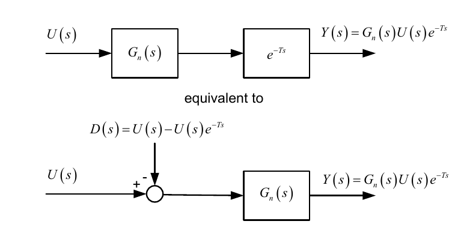
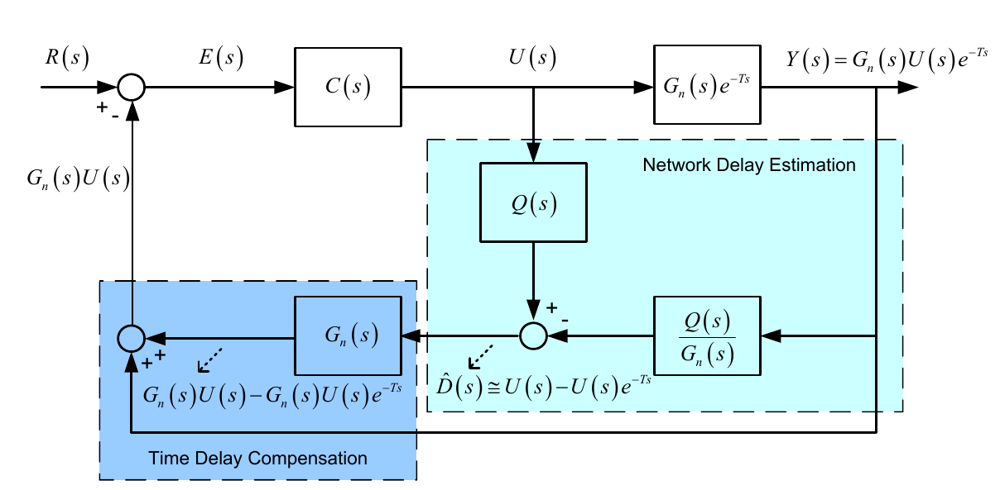
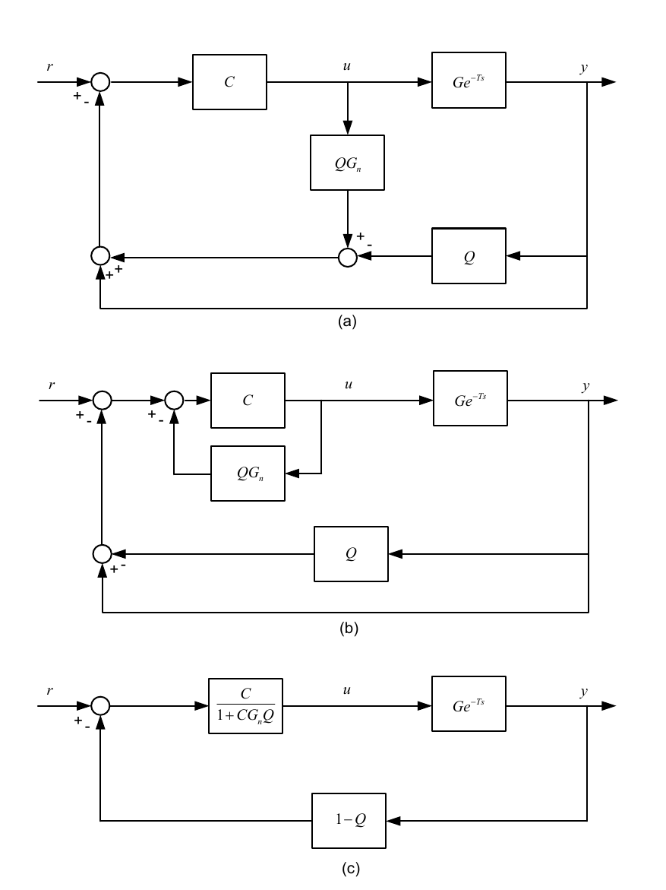
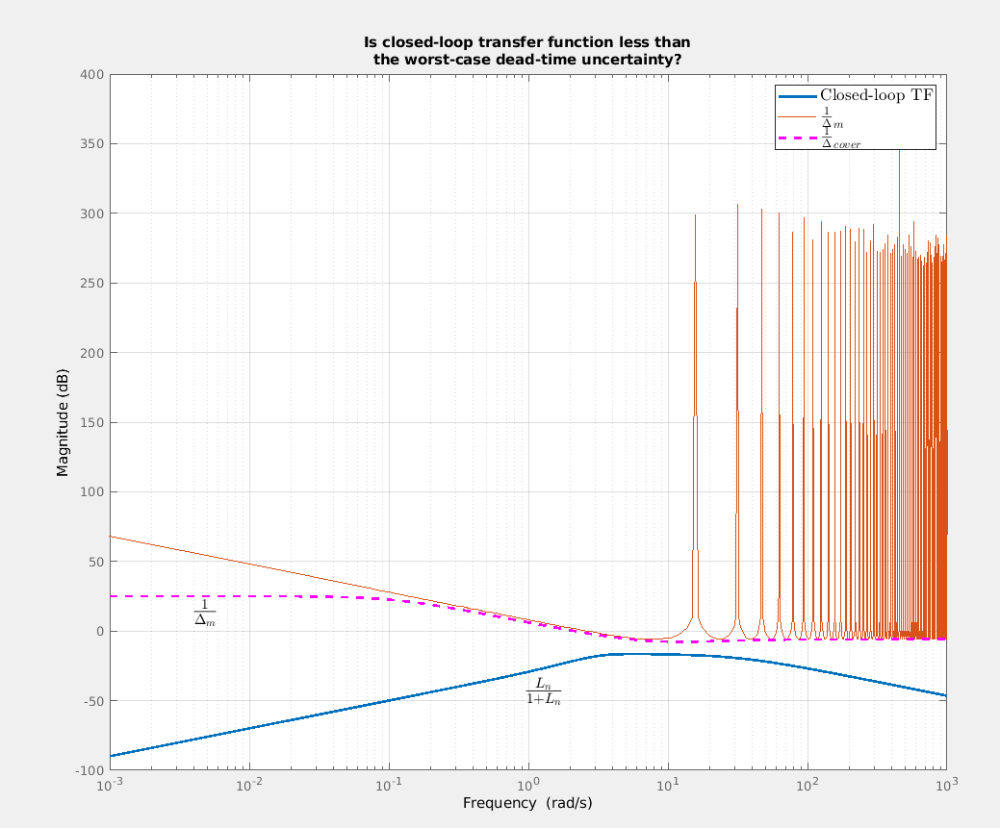
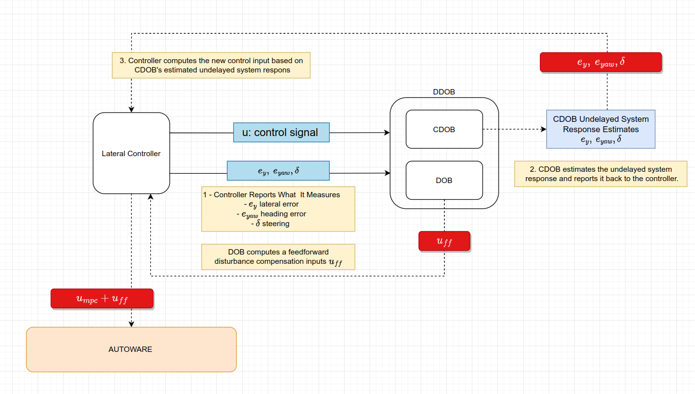

# COMMUNICATION DELAY OBSERVER BASED COMPENSATOR (CDOB) WITH a DISTURBANCE OBSERVER (DOB)

## Theory and Structure

The CDOB and DOB observer-based compensators are intended to mitigate the effects of delayed control and
measurement signals on the system behavior.

Time delay on the signal may cause motion instability or reduce the attainable performance of the controllers. As
such it is essential to alleviate the effects in the practical implementation of the control algorithms.

If the amount of time delay is small, we can design robust controllers that can minimize the effects of the
time delay. However, when the time delay gets more significant, we can do little to design robust controllers. There is
almost no solution other than using the predictive controllers (finite-spectrum assignment) or
time-delay compensators.

The former design methodology requires a good estimation and knowledge of the magnitude of time delays. If the
estimated time delay does not match the real value, or there are time-varying time delays, the time-delay problem may
persist, although we use predictive models.

The CDOB compensators theoretically remove the time delay from the closed-loop system equations allowing to
design controllers as if there no time delay enters any signal channel.

The CDOB approach originates from an assumption that the delay is a disturbance entering from the control channel;

$$
\begin{equation}
u \rightarrow {e^{-Ts}} \rightarrow u e^{-Ts} = u - d
\label{eq:sample}
\end{equation}
$$

where $d$ is the time-delay disturbance. The block diagram shown in the figure illustrates the disturbance concept
in which U(s), Gn(s) and exponential term represent the control signal, a controlled system and time-delay.

Figure 1. Disturbance Concept in CDOB [5 by Courtesy of Emirler, M.T] 

This assumption allows us to evaluate the amount of response on system output measurements caused entirely by this
disturbance. This way, we can always feedback the controller with an approximate undelayed response without delay,
preventing the disturbance from entering the control channel.

Figure 2. CDOB Block Diagram [5 by Courtesy of Emirler, M.T]  

Figure 2 depicts the whole CDOB process. This form is primarily employed in theoretical analysis. However, we may
simplify the block diagram, allowing for more flexible implementation. An error signal E(s) is generated from the
reference and system response in the block diagram and fed back to a controller. We can estimate the delayed control
input acting on the system by a system inversion (or an appropriate
disturbance observer). However, inverting a system from a control theory standpoint may not be viable. A Q-filter is
designed to render the inverse transfer function proper to achieve system inversion.

The transfer function of the resulting block diagram is given by

$$
\frac{\mathrm{Y}(\mathrm{s})}{R(s)}=\frac{C G_n e^{-T s}}{1+C G_n Q+C G_n(1-Q) e^{-T s}}
$$

where $Q$ represents a Q-filter which is a low-pass filter and determines the perfomance of the compensation loop.
When the amplitude of Q-filter goes to one, the transfer function of CDOB given above reduces to

$$
\frac{\mathrm{Y}(\mathrm{s})}{R(s)}=\frac{C G_n e^{-T s}}{1+C G_n Q}.
\tag{Eq. 3}
$$

From the implementation perspective, the block diagram given in Figure 2 can be reduced to a form that can make the
implementation easier (Fig. 3.). In this package implementation, we used this block diagram for the CDOB compensator.

Figure 3. Equivalent Block Diagram Transformation [5 by Courtesy of Emirler, M.T] 

## CDOB Filter Design

The appropriate order of low-pass Q-filters is chosen concerning the system order if the inverse transfer function
approach summarized in Fig. 2 is used. The details of the robustness analysis can be found in [6] if significant
uncertainties exist in the system model and parameters. If the reduced form is to be used, one can design a
Q-filter in any order as long as the closed-loop system is stable and robust to uncertainties. Before the vehicle
tests and implementations, we analyzed the system's robustness against the worst-case time-delay uncertainty and
worst-case time-delay uncertainty with the parameter uncertainty in our model and the parameters. In Fig.4, we show
that the magnitude of the closed loop transfer function always stays under the inverse of the worst-case time-delay
uncertainty transfer function magnitude indicates that the model with CDOB will be stable under all considered
time-delay uncertainties [see Chapter 10.2 of Ref 7, and 5.2.2 of Ref 6].

Figure 4. Nyquist condition for loop uncertainty $\frac{L_n}{1 + L_n}<\frac{1}{\Delta}$

We used a first-order low-pass Q-filter in our lateral controller channel of the Nonlinear MPC controller and performed
our analyses with this filter structure.

$$
\frac{1}{\tau s +1}
\tag{Eq. 4}
$$

The NMPC controller's lateral input is based on the lateral and heading errors. On top of these error, the steering
angle
appears in the cost function. Therefore, in the CDOB figures above, if $C$ represents the NMPC controller, the
measurements $y$ would be $y = [e_y, e_{yaw}, \delta]^T$ where the terms inside the vector represents the lateral
error, heading error and the measured steering angle.

# DESIGN OF DISTURBANCE OBSERVER

An input disturbance observer (DOB) accompanies the CDOB compensator in our design to increase the control accuracy
further
and reject the external (i.e., curvature in vehicle model) and internal disturbances (i.e., model mismatch, parameter
inaccuracy). In the literature, the design scheme is called Double Disturbance Observer (DDOB) when a CDOB and DOB are
used together [4, 6].

In designing an input disturbance observer, a disturbance input is assumed to be entering from the control channel
through it is constant dynamics (slowly varying disturbance assumption $\dot{d} = 0$) to capture the deviation of
system's response from its model expectation.

In our lateral control implementation, the resulting linear kinematic vehicle model is parameter varying (an LPV
system); accordingly, we designed a DOB by using the Linear Matrix Inequalities  (LMI, see 8), which ensures the
stability of the observer all over the pre-defined vehicle operating range.

# OPERATION of DDOB IN AUTOWARE and HOW IT CAN BE USED FOR OTHER MODELS (longitudinal dynamics)

We show the class integration diagram in Fig. 5. In the figure, the lateral control signal computed by the NMPC
controller and the states it uses are reported to the DDOB block. In the DDOB block, the CDOB compensator
computes new reference states (undelayed system response) and reports them back to the controller. The NMPC computes
its control signal based on the CDOB reference states, not what it measures.

The DOB compensator computes a feedforward control input which is then added on to the MPC lateral control signal.
The controller sends its control signal by adding the feedforward control from the DOB to the Autoware system as
the final low-level control signal.

Figure 5. Controllers, DDOB Interaction Diagram

# References

1. Natori, K., 2012, March. A design method of time-delay systems with communication disturbance observer by using Pade
   approximation. In 2012 12th IEEE International Workshop on Advanced Motion Control (AMC) (pp. 1-6). IEEE.
2. Zhang, W., Tomizuka, M., Wei, Y.H., Leng, Q., Han, S. and Mok, A.K., 2015, July. Robust time delay compensation in a
   wireless motion control system with double disturbance observers. In 2015 American Control Conference (ACC) (pp.
   5294-5299). IEEE.
3. Wang, H. and Guvenc, L., 2018. Use of Robust DOB/CDOB Compensation to Improve Autonomous
   Vehicle Path Following Performance in the Presence of Model Uncertainty, CAN Bus Delays and External Disturbances
   (No. 2018-01-1086).
4. Zhang, W., Tomizuka, M., Wu, P., Wei, Y.H., Leng, Q., Han, S. and Mok, A.K., 2017. A double disturbance observer
   design for compensation of unknown time delay in a wireless motion control system. IEEE Transactions on Control
   Systems Technology, 26(2), pp.675-683.
5. Emirler, M.T., 2015. Advanced Control Systems for Ground Vehicles (Doctoral dissertation, PhD Thesis, İstanbul
   Technical University, İstanbul, Turkey).
6. Wang, H., 2018. Control system design for autonomous vehicle path
   following and collision avoidance (Doctoral dissertation, The Ohio State University).
7. Åström, K.J. and Murray, R.M., 2021. Feedback systems: an introduction for scientists and engineers. Princeton
   university press.
8. Peet, M.M., 2016. Introduction to Optimal Control via LMIs.
