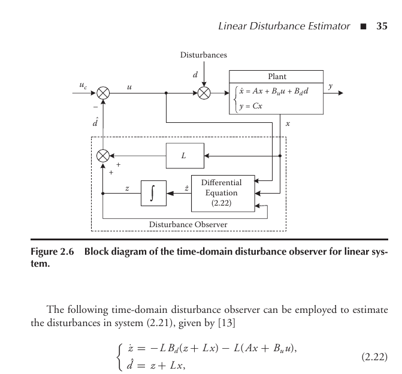
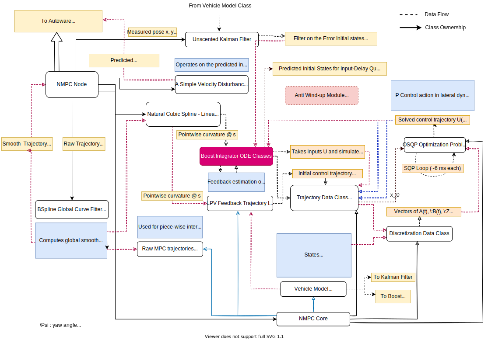
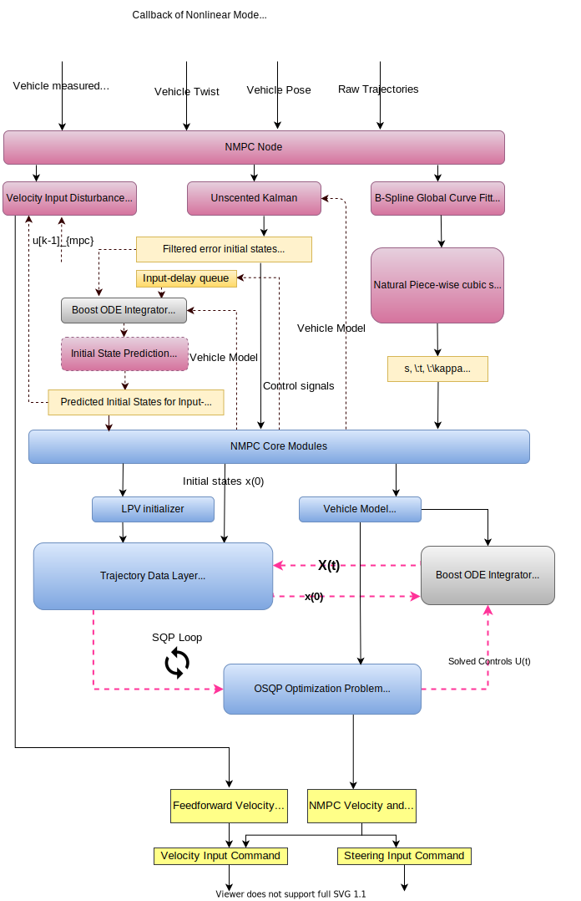

### **Dependencies:**

- Use installation script to install [CppAD](https://github.com/coin-or/CppAD)
  and [CppAD-Codegen](https://github.com/joaoleal/CppADCodeGen),
- Install [OSQP](https://osqp.org/docs/installation/cc++),

CppAD-Codegen requires following packages. Before CppAD-Codegen these packages must be installed.

### Performance Messages Requirements

- Add the following msg and stamped-msg files into the autoware_control_msgs packages
    - NonlinearMPCPerformance.msg
  ```c++
  float64 steering_angle_input
  float64 steering_angle_velocity_input
  float64 steering_measured
  float64 acceleration_input
  float64 lateral_error
  float64 yaw_error
  float64 value_function_value
  float64 curvature
  float64 lateral_error_ukf
  float64 yaw_error_ukf
  float64 steering_ukf
  float64 velocity_ukf
  float64 velocity_target
  float64 velocity_input
  float64 velocity_measured
  float64 velocity_disturbance_input
  float64 velocity_sum_input_disturbance
  float64 avg_computation_time
  float64 yaw_vehicle
  float64 yaw_target
  float64 yaw_autoware
  float64 virtual_car_distance
  ```
    - and the stamped message file NonlinearMPCPerformanceStamped.msg
  ```c++
        std_msgs/Header header
        autoware_control_msgs/NonlinearMPCPerformance nmpc_performance_msg
  ```

We used [google-OSQP](https://github.com/google/osqp-cpp) version which dependents on
the [abseil-cpp](https://github.com/abseil/abseil-cpp) library. These libraries are written in C++17 and require higher
versions of CMake (>=11). We removed the abseil-cpp dependency in **google-OSQP** to make it compatible with the ROS1
systems, and CMake versions.

### **External Headers and Licences**

- **Exterternal/eigenIntegration.hpp**  
  The header file to equip Eigen matrix and vectors with a vector algebra that is used in the Boost Integration
  libraries (Boost Software License, Version 1.0).

  https://github.com/BeamMW/boost-android/blob/master/include/boost/numeric/odeint/external/eigen/eigen_algebra.hpp

- **vehicle_models/vehicle_dynamics_base.hpp**
  A base class for implementing the Automatic Differentiation (AD) initialization for CppAD and CppAD-Codegen libraries.

  https://github.com/EmbersArc/SCpp/blob/master/scpp_core/include/systemDynamics.hpp (MIT Licence.)

### **Computations:**

We describe the Quadratic optimization algorithms and the equations of the Nonlinear MPC formulation in the
NMPC_OSQP.pdf in the documentation folder.

In addition to Quadratic Formulation (QP), we have added an integral state for the vehicle model longitudinal speed to
remove the steady state speed tracking error along with the reference speed scaling as a part of refrence speed
feedforward control scheme (see [4-5]).

### **Possible Improvements in NMPC optimization:**

We implemented the NMPC version with the Sequential Quadratic Programming (SQP) solution method which does not require a
non-linear solvers. The preliminary version is **the minimal** implementation that constitutes a backbone for further
developments, such as;

- In case of implementing a nonlinear constraint in the equations, adding a virtual cost-term in the states and control
  which acts as soft-constraint (slack variables),
- Adding a trust-region term that enables progression of the SQP towards to optimal trajectory.
  <br></br>

### **Possible Improvements in PI type controller for the speed tracking:**

- We used only scalar reference scaling factor $\in$ [0, 1] to prevent over and under-shooting. There are more advanced
  reference scaling methods (within feedforward control scheme) and these methods can be implemented in the related code
  sections.
- **Anti-Windup** mechanisms must be improved by implementing "Back-Calculation and Tracking [4, Section 3.5]". This
  method requires measured control signal to feed it back to Anti-Windup block.

- #### **Robust Tube-NMPC - Adding Stability Constraints :**

    - Adding terminal cost-term. The terminal cost-term enables using shorter MPC prediction horizons, and increase the
      stability of the MPC computations.
    - Adding tube-state in the model differential equations to be able to compute the evaluation of the noise states and
      add constraint tightening property to guarantee the recursive feasibility of the NMPC algorithm :
      $$ \dot{s_t(t)} = \rho s_t(t) + \omega(x(t), u(t))
      $$

### Using with the Planning Simulator:

The simple_planning_simulator node of Autoware make use of the car-like kinematic vehicle model with the following
equations.

$$ \begin{aligned} \dot{x} &= V cos(\Psi) \quad \text{the rate of change of x-position of the vehicle in global
coordinate frame}\\ \dot{y} &= Vsin(\Psi) \quad \text{the rate of change of y-position of the vehicle in global
coordinate frame}\\ \dot{\Psi}&= \frac{V}{L} tan({\delta} )\quad \text{and the rate of change of yaw - heading angle }
\end{aligned} $$

where **"L"** is the distance between the front and rear axle of the vehicles. The **DELAY*STEER*(ACC)** models makes
additional assumptions in the steering and longitudinal dynamics which are modeled as a first order dynamical models
with the following equations;

$$ \begin{aligned} \dot{\delta} = -\frac{(\delta -u_\delta)}{\tau_{steering}} \\ \dot{V} = -\frac{(V - u_V)}{\tau_
{velocity}} \end{aligned} $$

where the **"$\tau$"** defines the time-constant of these dynamics, and $u_{\delta}$ and V are the steering and speed
inputs respectively computed by the controllers. This kinematic-vehicle model are based on the **Ackermann Steering
Geometry** in which the tires are assumed to be rigid bodies and do not exhibit tire-deflections during turning.

### Input Disturbance Observer.

We have included an input disturbance observer in the longitudinal vehicle dynamics [5]. The observer is a simple linear
observer. It assumes that a disturbance input enters to the system from the input channel as shown from the following
figure.



The input disturbance observer helps removing the steady-state error even though with low PI-integral term weights.

### Class Interaction and Data Flow Diagrams:




### Parameters in the YAML file:

```yaml
/**:
  ros__parameters:
    # -- Control Algorithm Parameters --
    control_frequency: 30.0 # Hertz
    mpc_prediction_dt: 0.1 # prediction time step length [s]

    # -- Vehicle Model Parameters --
    steering_time_constant: 0.27 # [s]
    speed_time_constant: 0.61 # [s]

    # -- Simulation model for planning simulator --
    use_mpc_controller: true # if false it uses the feedback controllers.
    use_delay_sim_model: true # for DELAY_STEER planning simulator model. For debugging only.
    input_delay_time: 0.24 # input dead-time [s]

    # -- Use time or arc-length as the interpolation coordinates for predictions --
    use_acceleration_inputs: true # if false, traj speeds are used in the simulations
    use_linear_trajectory_initialization: false # if false LPV feedback initialization is used.

    # -- State and Control Weights. ['xw', 'yw', 'yaw', 's', 'e_y', 'e_yaw', 'Vx', 'delta'] --
    state_weights: [ 0.0, 0.0, 0.0, 0.0, 1.0, 1.0, 1.0, 0., 0.05 ]
    state_weights_terminal: [ 0.0, 0.0, 0.0, 0.0, 2.0, 1.0, 1.0, 0.0, 0.05 ]
    control_weights: [ 0.001, 0.001 ] # [vx speed input, steering input]
    jerk_weights: [ 1.0, 1.0 ] # [ax and steering_rate]

    #  -- Constraints - Upper and lower bounds. ['xw', 'yw', 'yaw', 's', 'e_y', 'e_yaw', 'Vx', 'delta'] --
    xlower: [ -.inf, -.inf, -.inf, -.inf, -3.0, -1.0, 0.0, -0.69, -.inf ]
    xupper: [ .inf, .inf, .inf, .inf, 3.0, 1.0, 25.0, 0.69, .inf ]
    ulower: [ -50., -1.0 ] # vx speed input [m/s], steering input [rad]
    uupper: [ 50., 1.0 ]

    # -- Scaling Matrices ['xw', 'yw', 'psi', 's', 'e_y', 'e_yaw', 'Vx', 'delta'] --
    scaling_range: [ -1., 1. ]

    xmin_for_scaling: [ -50., -50., -3.14, 0.0, -2.0, -1.0, 0.0, -0.69, -2.0 ]
    xmax_for_scaling: [ 50., 50., 3.14, 40.0, 2.0, 1.0, 10.0, 0.69, 2.0 ]

    umin_for_scaling: [ -50., -1.0 ] # vx speed input [m/s], steering input [rad]
    umax_for_scaling: [ 50., 1.0 ]

    # OSQP Options.
    osqp_warm_start: true
    osqp_polishing: true
    osqp_scaling: true
    osqp_max_iters: 1000
    osqp_eps_abs: 1e-5
    osqp_eps_rel: 1e-5
    osqp_verbose: false # outputs iteration results.

    # -- Lyapunov Matrices for LPV Initialization - Delay steering --
    num_of_nonlinearities: 7  # Number of nonlinearities in the state transition matrix.
    Xd1: [ -65.15507751254682, -36.77626859505827, -47.396597586050916, 157.71749405735076, -36.77626859505827, 1.3462058571298208, 41.56344244301195, 1.3523022918235805, -47.396597586050916, 41.56344244301195, -275.1233877176854, -104.22798423475713, 157.71749405735076, 1.3523022918235805, -104.22798423475713, -100.37310765156614 ]
    Xd2: [ 64.10145429314974, -2.180721171474225, -271.98655150001787, -0.22665990238350273, -2.180721171474225, -2.336930382598269, 38.241120784641566, 2.968960799623693, -271.98655150001787, 38.241120784641566, 36.07794254193002, 15.68802326783617, -0.22665990238350273, 2.968960799623693, 15.68802326783617, -5.261944971040233 ]
    Xd3: [ 100.07544105711509, 66.650732984822, 83.70497647471979, -296.6736623995904, 66.650732984822, -0.9959555114714462, -81.14709270650266, -8.666359996283582, 83.70497647471979, -81.14709270650266, 511.42945238668204, 191.86781038984105, -296.6736623995904, -8.666359996283582, 191.86781038984105, 180.3374692744003 ]
    Xd4: [ -8.827822545738721, -35.483619176862476, 20.9355279662206, 27.847854078184255, -35.483619176862476, 3.3988582402213825, 2.529431137376689, -135.8062748291455, 20.9355279662206, 2.529431137376689, -1288.430343517453, 45.844520173561605, 27.847854078184255, -135.8062748291455, 45.844520173561605, 391.2611685165978 ]
    Xd5: [ -7.2716437878738, 1.6397010731289985, -4.686420161213995, -17.178007227897066, 1.6397010731289985, 1.9463501734933277, -4.169937292073157, -19.810191655412, -4.686420161213995, -4.169937292073157, -217.466878321031, -10.27284979681935, -17.178007227897066, -19.810191655412, -10.27284979681935, 46.23140933312023 ]
    Xd6: [ -100.41433733722431, 3.2305430696908086, 115.94298337462855, -21.74052813025834, 3.2305430696908086, 3.065202734803516, -176.4873290429417, 1.0095360057477334, 115.94298337462855, -176.4873290429417, 13.667066205452524, -521.3227657617408, -21.74052813025834, 1.0095360057477334, -521.3227657617408, -1.4324254868167314 ]
    Xd7: [ 27.207280922954098, -1.0313290389465992, 3.474673550109833, 29.67187543658177, -1.0313290389465992, -1.8348702397623158, 8.369699399534905, -1.9508947200381759, 3.474673550109833, 8.369699399534905, -10.481394494964587, -1.590819937317799, 29.67187543658177, -1.9508947200381759, -1.590819937317799, -77.6394311516931 ]
    Xd8: [ 7557.248805840959, -676.6056994581357, -2.3052192561490745, -479.16264131173165, -676.6056994581357, 368.08027822772044, -1.1719667581507367, -348.48174995180716, -2.3052192561490745, -1.1719667581507367, 1382.3532842343293, -10.763685561179733, -479.16264131173165, -348.48174995180716, -10.763685561179733, 3547.133931340104 ]
    Yd1: [ -27.14876261983346, -488.3831058217359, -27.001721918762865, 21.75251250833555, -946.4833676287031, -7.594394460770382, 31.929202449234577, 140.96940732607248 ]
    Yd2: [ 11.662736189247278, 10.478691571798988, 9.017409381936384, -1.0590360184691858, -41.79977317502188, -30.44504323401985, -796.7031337730207, 59.84710220655771 ]
    Yd3: [ -62.00097457392179, -1074.6520288526442, -59.449628160441094, 57.40293032225527, -2085.98018969308, -16.757828727035395, 70.44834333698886, 308.51308903143064 ]
    Yd4: [ 3041.2153300222644, 611.899276984242, 320.1375093711639, -2129.0668798679103, 6131.204371201294, 520.7277039803178, -1256.36729729468, 3808.9328483553995 ]
    Yd5: [ 172.26695789674625, 1122.6556000049043, -101.3022415554688, 647.110289255875, -1912.4346956504303, 106.90286874442312, -668.8612366198226, -2878.7658430034844 ]
    Yd6: [ 68.44525541270693, 8.77562216332413, 51.02961741743889, 20.060206291545988, 61.30571559691704, 317.38309472890757, -4405.237005859442, -1104.34094558638 ]
    Yd7: [ -49.78890095719916, 2260.099356359471, 206.69274408302255, -419.3465284448969, 5776.42096335318, 31.021601990580887, -187.41578435373398, 29.588001940489736 ]
    Yd8: [ 8.030695096416812, -7.752585404524556, -3.5696860946514297, -18.340658318254288, -9008.127357796282, -33.4759841583891, 174.39862572662446, -27787.968271810852 ]

    #  -- No delay dynamics on both vx and steering --
    Xn1: [ -0.7236207119658895, -0.023216776954915478, -0.06495960889537933, 0.004794716685702354, -0.023216776954915478, 0.0006748275874827787, 0.016417884073048603, 0.0019503754831873808, -0.06495960889537933, 0.016417884073048603, -0.013755213047587742, -0.005135739146691346, 0.004794716685702354, 0.0019503754831873808, -0.005135739146691346, -0.004208211836237403 ]
    Xn2: [ -0.008350793885009426, -0.007762152533523893, -0.17221978195228554, 0.004302377553179582, -0.007762152533523893, 0.0024892012747078345, 0.01788428087264171, -0.0011595597604029159, -0.17221978195228554, 0.01788428087264171, -0.00020532090035945224, -0.0006654457328139225, 0.004302377553179582, -0.0011595597604029159, -0.0006654457328139225, 0.0006034867181272237 ]
    Xn3: [ 1.2297620126210127, 0.05930865050123967, 0.09761477563618849, -0.025771092713513893, 0.05930865050123967, -0.007353742000886429, -0.02997282301790201, 0.006618246628068941, 0.09761477563618849, -0.02997282301790201, -0.007981497133316256, 0.007649896166544902, -0.025771092713513893, 0.006618246628068941, 0.007649896166544902, -0.001537477001642402 ]
    Xn4: [ -0.43090101710242307, -0.04945882761346455, -0.008767689498220209, 0.07553409198981083, -0.04945882761346455, 0.035686746712330665, 0.013402758207392165, -0.05035148674990605, -0.008767689498220209, 0.013402758207392165, -0.23365154052351475, -0.007725446718695992, 0.07553409198981083, -0.05035148674990605, -0.007725446718695992, 0.021067142275473936 ]
    Xn5: [ -0.11091306554548544, 0.04079512930992029, 0.014090985605511292, 0.041350284534508765, 0.04079512930992029, -0.011542649615932918, -0.0005935228953894252, -0.013304233521783022, 0.014090985605511292, -0.0005935228953894252, -0.015032130298210334, -1.4979160825741144e-05, 0.041350284534508765, -0.013304233521783022, -1.4979160825741144e-05, 0.008131787312723345 ]
    Xn6: [ -0.008393501279661476, 0.010078334411737874, 0.022909573571588942, -0.0011488050057545823, 0.010078334411737874, -0.003412370986290518, -0.02812869449193083, 0.001451849462505991, 0.022909573571588942, -0.02812869449193083, 9.391199899920411e-07, 0.02572961685147718, -0.0011488050057545823, 0.001451849462505991, 0.02572961685147718, -0.0011809934353934945 ]
    Xn7: [ 0.11903106632724006, -0.02857410001891605, 0.030874736085658466, 0.02288264943721111, -0.02857410001891605, 0.010567638663275172, 0.0007258965118328524, -0.003458273127282151, 0.030874736085658466, 0.0007258965118328524, 0.049413171710642134, 0.0021451983979624794, 0.02288264943721111, -0.003458273127282151, 0.0021451983979624794, -0.002043241673998676 ]
    Xn8: [ 34.988750991827715, -5.07244834455697, -0.01198103491423707, 1.5433721760193042, -5.07244834455697, 1.418137755158318, 0.0002555842009677299, -0.6861162637305583, -0.01198103491423707, 0.0002555842009677299, 0.31176435642504285, 0.001040615147071697, 1.5433721760193042, -0.6861162637305583, 0.001040615147071697, 0.4621514809081605 ]
    Yn1: [ 0.00232668037968769, -0.05237252347123037, -0.0011524708979107681, 0.010233829898673193, 0.004723813174808242, 0.0002574354620672578, 0.00013677374183073383, -0.0028125151399493544 ]
    Yn2: [ 5.956406714786627e-06, 0.0002555947107063074, 1.984496006915533e-07, -2.8212838483174534e-06, -0.0001360151606725512, 0.0029936889310493357, 4.883325364378648e-06, -6.106434433891972e-05 ]
    Yn3: [ 0.005078028412281726, -0.09701628528020606, -0.001565131037552766, 0.034005709520438056, -0.009995838980173796, 0.0006494978284173363, 0.0010162221475114625, -0.012496226925444014 ]
    Yn4: [ -0.007720717528531404, 1.889785111049587, -0.002675350432987854, -0.4025942449370813, -0.01510948276666608, -0.01317031468703622, 0.001123674052955183, 0.13140980471684405 ]
    Yn5: [ 0.01215130822163364, -0.07977541695675887, -0.006298904807429382, 0.044275409665959255, -0.001419025142876479, 0.0001912827341315633, 0.0021449413117227483, -0.014710220544856763 ]
    Yn6: [ -4.903063599781219e-05, -0.000727050442402764, 1.0394131886139978e-05, 0.0001503596616396636, -4.6601941222582556e-05, -0.0033283417372573752, -8.87358384017946e-06, 7.521332783616094e-05 ]
    Yn7: [ -0.014505889024654545, 0.3353995425278637, 0.005538722409186562, -0.08908147798514109, 0.0016676699295155959, -0.0017930260986189727, -0.001908288609821389, 0.02974116271203787 ]
    Yn8: [ 8.289067609815415e-06, -0.00015346814100999933, -2.3035209417187076e-06, 4.616928721474997e-05, -0.899993882662694, -9.47785390522342e-05, 1.0527378168230078e-06, -0.9000158069105447 ]

    # -- Stopping Condition Parameters --
    stop_state_entry_ego_speed: 0.2
    stop_state_entry_target_speed: 0.5
    stop_state_keep_stopping_dist: 0.5

    # -- Accuracy parameters --
    number_of_sqp_iterations: 2

    # -- Kalman filter parameters for error model states [e_y, e_yaw[rad], v, steering [deg]] --
    # -- UKF specific parameters --
    alpha: 0.90 # controls spread of the sigma points,
    beta: 2.0 # for Gaussian distribution,
    kappa: 0.0 # scale the sigma points further from x_mean.

    Pkalman: [ 0.4, 0.4, 0.08, 0.3, 0.15, 0.07, 0.1, 0.07, 0.25 ] # Kalman estimate uncertainty variance estimate.
    Vprocess: [ 0.2, 0.2, 0.05, 0.2, 0.05, 0.02, 0.15, 0.03, 0.05 ] # process [model] uncertainty variance estimate.
    Wmeasurement: [ 0.4, 0.4, 0.08, 0.3, 0.15, 0.07, 0.01, 0.05, 0.2 ] # measurement uncertainty variance estimate
    observer_gain_speed: 0.5 # Input disturbance observer gain for longitudinal speed
    observer_gain_steering: 0.5 # Input disturbance observer gain for steering

    cog_rear_lr: 1.35 # distance of rear axle center to COG [m]

    # -- Speed tracking PI control I-integrator saturation limits
    speed_tracking_integrator_bound: 10.0 # Integrator saturation limit. (meters)
    feedforward_speed_set_point_scale: 1.0 # Scale the reference longitudinal speed.
```

#### References:

1. Rajamani, R., 2011. _Vehicle dynamics and control_. Springer Science & Business Media.

2. Kong, J., Pfeiffer, M., Schildbach, G. and Borrelli, F., 2015, June. Kinematic and dynamic vehicle models for
   autonomous driving control design. In 2015 IEEE Intelligent Vehicles Symposium (IV) (pp. 1094-1099). IEEE.

3. Van Der Merwe, R., 2004. Sigma-point Kalman filters for probabilistic inference in dynamic state-space models. Oregon
   Health & Science University.

4. Åström, K.J., Hägglund, T. and Astrom, K.J., 2006. Advanced PID control (Vol. 461), [Section 3.4]. Research Triangle
   Park, NC: ISA-The Instrumentation, Systems, and Automation Society.

5. Li, S., Yang, J., Chen, W.H. and Chen, X., 2014. Disturbance observer-based control: methods and applications. CRC
   press.
