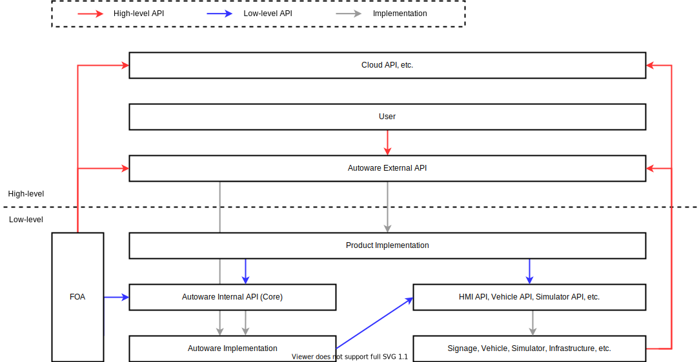

# Concept of Autoware API

## 注意事項

本ページでは Autoware で使用される API について記載する。Autoware という単語がどこまでの範囲を指し示しているかについては議論が必要だが、このドキュメントにおいては車両制御や周辺装置などを含め、自動運転を行うシステムが使用する API を全部まとめて Autoware API と呼称することにする。

## 設計方針

High-level API は、FMS やオペレーターなどユーザー視点で必要となる操作を安定して提供することを目標に設計する。具体的な実装は車両や環境により異なるため、各層で定義した API を組み合わせて柔軟に動作変更する仕組みを内部で用意しておき、High-level API の仕様を維持したまま様々な要望への対応を可能とする。

## アーキテクチャー

## API の分類

<dl>
  <dt>High-level API</dt>
  <dd>車両の乗客や整備員、FMSなど自動運転システム(Autoware)のUserに提供するAPI。全ての車両で仕様が共通であり長期間安定していることが求められる。</dd>
  <dt>Low-level API</dt>
  <dd>自動運転システム(Autoware)内部で使用するために提供するAPI。主にFOAなどの内部ツールや、車両固有のハードウェアを制御するために使用する。</dd>
</dl>

## 共通設定項目

<dl>
  <dt>Behavior</dt>
  <dd>APIの動作がTopic/Service/Actionのどれなのかを指定する。</dd>
  <dt>Category</dt>
  <dd>APIの実装が必須なのか任意なのかを指定する。</dd>
  <dt>Data Type</dt>
  <dd>APIで使用されるデータの形を指定する。</dd>
  <dt>QoS</dt>
  <dd>APIのサービスレベルを指定する。</dd>
  <dt>Topic Rate</dt>
  <dd>APIの動作がTopic場合に送受信の周期を指定する。</dd>
  <dt>Timeout</dt>
  <dd>APIの動作がService場合に応答時間の制限を指定する。</dd>
</dl>
