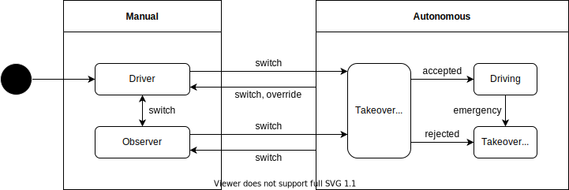
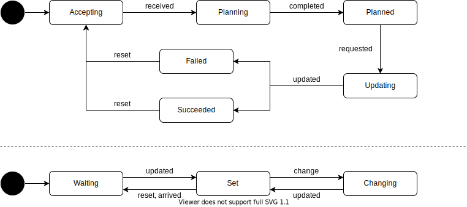

# State Machine of Autoware API (Proposal)

## Power State

システムの起動と終了に関する状態遷移。主に電源投入後にシステムの起動が完了したかの判定や、電源切断が可能かを管理する。

| State    | Description                                        |
| -------- | -------------------------------------------------- |
| Startup  | システムの起動処理が行われている状態。             |
| PowerOn  | システムの起動処理が完了し、機能を提供できる状態。 |
| Shutdown | システムの終了処理が行われている状態。             |
| PowerOff | システムの終了処理が完了し、電源を切って良い状態。 |

## Operator State

車両の操作者を管理する状態遷移。車両を直接手動で操作している状態と、ソフトウェアを介した間接手動操作、Autoware による自律制御に分かれる。

| State               | Description                                                    |
| ------------------- | -------------------------------------------------------------- |
| Driver              | 車両が用意したインターフェースを使用して手動操作している状態。 |
| Observer            | 近距離または遠距離からソフトウェアにより手動操作している状態。 |
| Takeover Operating  | 自立制御への移行が可能かを判断している状態。                   |
| Driving             | 自律制御により走行している状態。                               |
| Takeover Requesting | ODD 逸脱などにより手動運転への移行を要求している状態。         |

## Observer State

車両の監視者を管理する状態遷移。車両に問題が起きたときに操作を引き継ぐ対象を指定する。

| State  | Description                            |
| ------ | -------------------------------------- |
| None   | 車両の運転手が監視者を兼ねている状態。 |
| Local  | 車両が近接監視されている状態。         |
| Remote | 車両が遠隔監視されている状態。         |

## Driving State

自律走行を行うための初期化と発車判断に関する状態遷移。

| State        | Description                                                              |
| ------------ | ------------------------------------------------------------------------ |
| Initializing | ノードの起動中や自己位置推定未完了などの初期化処理を行っている状態。     |
| Preparing    | ルートの配信待ちやドアの開閉中など発車するための条件が整っていない状態。 |
| Ready        | 発車の準備ができておりユーザーからの操作を待っている状態。               |
| Driving      | 目的地に向かって走行している状態。                                       |

## Route State

ルートの計画と設定に関する状態遷移。

| State     | Description                                        |
| --------- | -------------------------------------------------- |
| Accepting | 新しいルートを受け付けている状態。                 |
| Planning  | 新しいルートを計画している状態。                   |
| Planned   | 新しいルートの計画が完了していて反映できる状態。   |
| Updating  | 新しいルートを現在のルートとして反映している状態。 |
| Failed    | 新しいルートを現在のルートに反映失敗した状態。     |
| Succeeded | 新しいルートを現在のルートに反映成功した状態。     |
| Waiting   | ルートが設定されていない状態。                     |
| Driving   | ルートが設定されている状態。                       |
| Changing  | ルートを切り替えている状態。                       |

## Fail Safe State

システム異常時の車両制御に関する状態遷移。現在の車両状態（手動操作・自律制御など）により異常と判定される条件は異なり、状況に応じて車両を安全な状態に移行させる。

| State              | Description                                                     |
| ------------------ | --------------------------------------------------------------- |
| Normal             | 異常がなく車両が問題なく制御できる状態。                        |
| OverrideRequesting | 異常があるがまだ MRM を動作させず運転手に引継要求している状態。 |
| MrmOperating       | 異常があり MRM が車両を安全な状態に移行している状態。           |
| MrmSucceeded       | 異常があり MRM により車両が安全な状態に移行した状態。           |
| MrmFailed          | 異常があり MRM により車両が安全な状態に移行できなかった状態。   |
