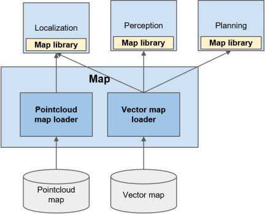

Map
=============

# Overview 
Map is responsible for distributing static information about the environment that autonomous vehicle might drive. Currently, this is separated into two categories:

- Geometric information about the environment (pointcloud map)
- Semantic information about roads (vector map)

## Use Cases

### Pointcloud Map
Use cases of the maps are the following:
* Localization: Autoware must always be aware of its position in Earth frame. Pointcloud map is used for local localization with LiDAR based localization algorithm such as NDT matching.

### Vector Map
Vector map provides semantic information about roads and is used for various uses cases in both Planning and Perception. Note that some of the following use cases might be removed as performance of perception improves. For example, retrieving lane shapes and detecting traffic lights can be done online e.g. using camera images. However, with consideration of [spoofing attacks](https://www.nassiben.com/mobilbye) and reliability of current Perception stack, following uses cases must be supported by vector map for now.

* Planning:
  * Calculating route from start to goal
  * Creating trajectory along lane during lane following
  * Driving according to traffic rules, such as speed limit, traffic light, and right of way.
* Perception: 
  * predicting other participant's trajectory along lanes
  * Detecting traffic lights

## Requirements
The role of map is to publish map information to other stacks. In order to satisfy use cases above, the following requirements must be met.

### PointCloud map 
  * The map should provide geometric information of surrounding environment that includes any region 200m away from any possible route that the vehicle might take.
  * Resolution of pointcloud map must be at least 0.2m. (from past experience)
  * Size of the map should be less than 1GB in binary format. (Limit of ROS message)
  * Pointcloud must be georeferenced.

### Vector Map
  * The map should be georeferenced.
  * The map should include region within 200m away from any possible route that autonomous vehicle might drive with following information:
    * Routing: the map should be able to retrieve next lane, previous lane, right lane, and left lane of a lane with availability of lane change.
    * Geometry: shape and position of following objects must be provided:
      * lanes
      * traffic lights
      * stop lines
      * crosswalk
      * parking space
      * and parking lots.
    * Traffic rules: the map should be able to retrieve following information from given lane:
      * traffic lights
      * stop lines
      * traffic signs
      * right of way
      * speed limit
      * direction of lanes

## Input
The input to Map stack:

| Input               | Data Type       | Explanation                                                                                                                                                                                                     |
| ------------------- | --------------- | --------------------------------------------------------------------------------------------------------------------------------------------------------------------------------------------------------------- |
| PointCloud Map file | PCD format      | This includes the shape of surrounding environment as collection of raster points, including grounds and buildings. It may include other additional information such as intensity and colors for visualization. |
| Vector Map file     | Lanelet2 format | This should describe all semantic information about roads. This includes road connection, road geometry, and traffic rules. Supporting format may change to OpenDRIVE in the future as discussed in Map WG.     |

### Output

The table below summarizes the output from Map stack:

| Output         | Topic Name(Data Type)                                   | Explanation                                                                                                                                                                                                                                                                                                                                                                                                         |
| -------------- | ------------------------------------------------------- | ------------------------------------------------------------------------------------------------------------------------------------------------------------------------------------------------------------------------------------------------------------------------------------------------------------------------------------------------------------------------------------------------------------------- |
| PointCloud map | `/map/pointcloud_map` (`sensor_msgs::PointCloud2`)   | This includes the shape of surrounding environment as collection of points.   This is assumed to be used by Localization module for map matching with LiDAR pointclouds.                                                                                                                                                                                                                                         |
| Vector Map     | `/map/vector_map` (`autoware_lanelet2_msgs::MapBin`) | Lanelet2 map information will be dumped as serialized data, and passed down to other stacks. Then, it will be converted back to internal data structure to enable Lanelet2 library API access to each data.   This is assumed to be used by Localization stack for lane-based localization, Perception stack for trajectory prediction of other vehicles, and Planning to plan behavior to follow traffic rules. |

# Design

Map module consist of two modules: pointcloud map loader and vector map loader. Since map data are converted into binary data array, it is meant to be converted back to internal data structure using appropriate library, for example PCL for pointcloud and Lanelet2 for vector map. The access to each data element is also assumed to be done through map library.

## PointCloud Map Loader

### Role

Role of this module is to output pointcloud map in `map` frame to be used by other stacks.

### Input

- PCD File   This contains collection of point coordinates from reference point.
- YAML File   This is meant to contain the coordinate of origin of PCD file in earth frame (either in ECEF or WGS84)

### Output

- pointcloud_map: `sensor_msgs::PointCloud2`   This module should output environment information as pointcloud message type. The points in the message should be projected into map frame since the main user is assumed to be Localization stack.

## Vector Map Loader

### Role
Role of this module is to semantic road information in map frame to be used by other stacks.

### Input
- Lanelet2 Map File (OSM file)   This includes all lane-related information. The specification about the format is specified [here](./SemanticMap/AutowareLanelet2Format.md). 

### Output
- vector_map `autoware_lanelet_msgs::MapBin`   This contains serialized data of Lanelet2 map. All coordinate data contained in the map should be already projected into map frame using specified ECEF parameter. 
