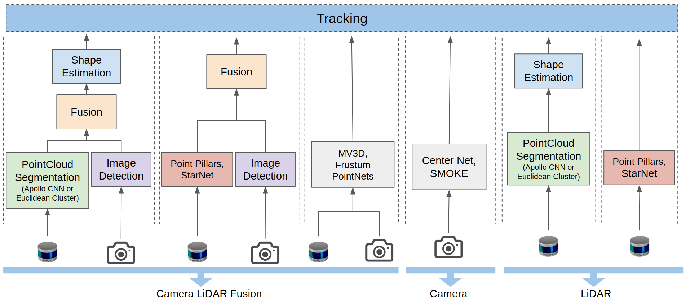
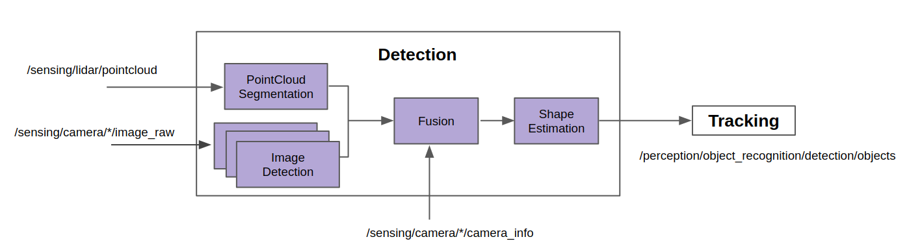
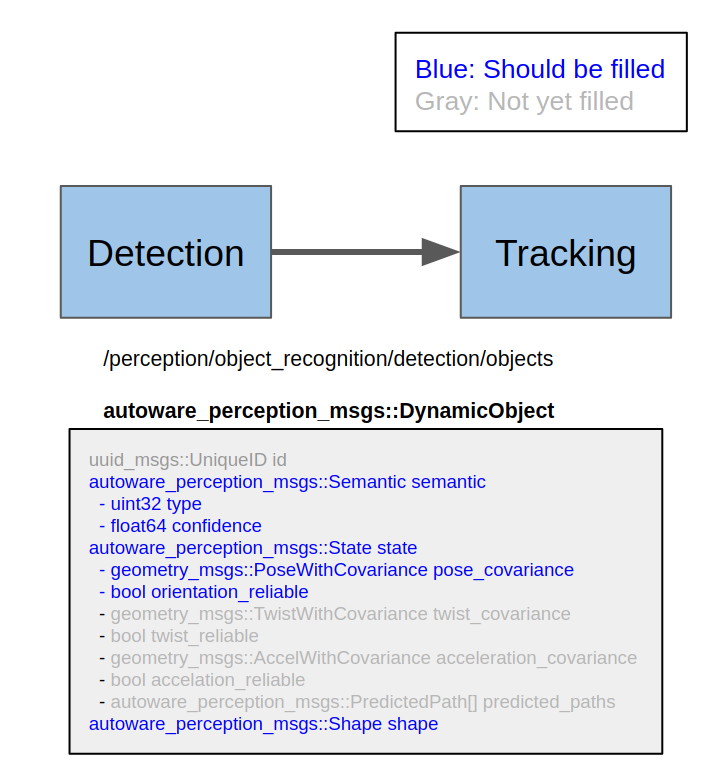

Detection
=====
## Use Cases and Requirements
Detection in Object Recognition is required for use cases involved with obstacles:

* Changing lane
* Turning at intersection
* Avoiding parked vehicles
* Stopping at a crosswalk when pedestrians are walking
* Passing intersection without traffic lights
* Merging into another lane
* Taking over Pedestrian/Cyclists
* Stopping/yielding to an obstacle

For the details about related requirements, please refer to the [document for Perception stack](/design/Perception/Perception.md).

## Role
Detection in Object Recognition detects objects by processing sensor data. Detection is triggered on every sensor data callback independently from previous detection results. The Detection module is responsible for calculating objects' pose, class, and shape.

## Input

| Input       | Data Type                 | Topic                         |
| ----------- | ------------------------- | ----------------------------- |
| LiDAR       | `sensor_msgs::PointCoud2` | /sensing/lidar/pointcloud     |
| Camera      | `sensor_msgs::Image`      | /sensing/camera/*/image_raw   |
| Camera info | `sensor_msgs::CameraInfo` | /sensing/camera/*/camera_info |
| TF          | `tf2_msgs::TFMessage`     | /tf                           |

## Output

| Output          | Data Type                                      | Output Module                | TF Frame    | Topic                                            |
| --------------- | ---------------------------------------------- | ---------------------------- | ----------- | ------------------------------------------------ |
| Dynamic Objects | `autoware_perception_msgs::DynamicObjectArray` | Object Recognition: Tracking | `base_link` | /perception/object_recognition/detection/objects |

## Design
The Detection module is designed to adopt various detection algorithms.

This is one of our sample implementations for the Detection module.

## Requirement in Output

Designated objects' properties in `autoware_perception_msgs::DynamicObject` need to be filled in the Detection module before passing to the Tracking module.

| Property             | Definition                                    | Data Type                           | Parent Data Type                          |
| -------------------- | --------------------------------------------- | ----------------------------------- | ----------------------------------------- |
| type                 | Class information                             | `uint8`                             | `autoware_perception_msgs::Semantic`      |
| confidence           | Class's confidence 0.0~1.0.                   | `float64`                           | `autoware_perception_msgs::Semantic`      |
| pose                 | Position and orientation                      | `geometry_msgs::PoseWithCovariance` | `autoware_perception_msgs::State`         |
| orientation_reliable | Boolean for stable orientation or not         | `bool`                              | `autoware_perception_msgs::State`         |
| shape                | Shape in 3D bounding box, cylinder or polygon | `autoware_perception_msgs::Shape`   | `autoware_perception_msgs::DynamicObject` |
