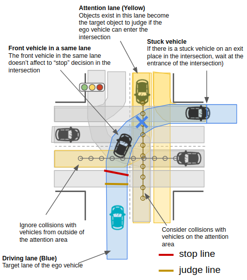
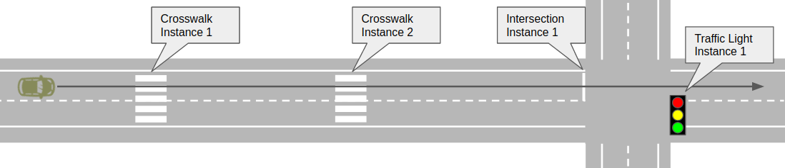

# Overview

Behavior velocity planner is responsible for modifying velocity so that ego vehicle drives according to traffic rules.

## Inputs

topic name: "path_with_lane_id"
type: autoware_planning_msgs::PathWithLaneId
frequency: 10Hz

## Outputs

Behavior velocity planner should output path with velocity profile using following message type.
topic name: "path"
type: autoware_planning_msgs::Path
frequency: 10Hz

## Use Cases

Behavior planner is responsible for handling different traffic rules present in the environment.
Note that traffic rules might be different depending on country. Therefore, behavior velocity planner node must be designed to allow developers to easily modify the traffic rules.

Currently the following traffic rules are considered in the reference implementation:

1. crosswalk
2. intersection
3. stop line
4. traffic light

## Requirements

Again, traffic rules might be different depending on country, and the requirement described here is for Japanese traffic rules.

1. **Crosswalk**

   - Ego vehicle must stop if a pedestrian is within stop area shown in the image.
   - Ego vehicle must stop if a pedestrian is expected to enter the stop area. (e.g. within 3 seconds)
   - Ego vehicle must slow down (e.g. to 5km/h) when there is a pedestrian in the deceleration area shown in the image.
     **rationale:** We don't want to make vehicle keep waiting for pedestrian to pass crosswalk completely. We want vehicle to start driving when pedestrian walks past the car.

   

2. **Intersection**

   - Unless ego vehicle has right of way, Vehicle must stop before entering intersection whenever other vehicles are entering intersection.

   

3. **Stop Line (Stop Sign)**

   - Vehicle must stop at stopline when it passes through the line.
   - Stop line should be specified in the Semantic Map.

   

4. **Follow traffic light**

   - Planning stack should refer to Perception output of the traffic light associated to driving lane.
   - Speed profile of a trajectory at the associated stopline must be zero when relevant traffic light is red and it has enough distance to stop before the stopline with given deceleration configuration

   

## Design

The example node diagram of the behavior velocity planner is shown as the diagram below.

The node consist of two steps.

1. **Module Instance Update** From the given path, the planner will look up the HD Map to see if there are upcoming traffic rule features in the map. For each detected traffic rule features, respective scene module instance will be generated. Also, scene module instances from past features will be deleted.

2. **Velocity Update** Actual modification of the velocity profile of the path happens in this step. Path message will be passed to each traffic rule scene modules, and each module will update velocity according to its traffic rule. Minimum value of all scene modules will become the final velocity profile.

### Adding/Modifying Traffic Rules

The actual rule for modifying velocity of the path is defined in scene modules.
Whenever a developer want to add new rules to the planner, the developer must define a new traffic rule scene module class which inherits SceneModuleInterface class. For the details, please refer to the [source code](/src/planning/scenario_planning/lane_driving/behavior_planning/behavior_velocity_planner).
