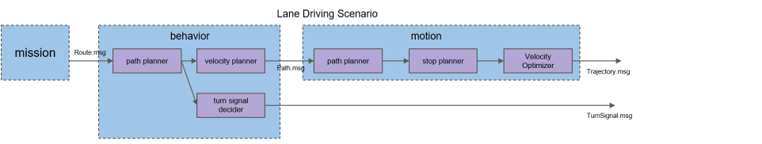

# Lane Driving Scenario

## Use Cases and Requirements

Lane Driving Scenario must satisfy the following use cases:

- Driving along lane
- Operating lane change
- Following speed limit of lane
- Follow traffic light
- Turning left/right at intersections

For the details about related requirements, please refer to the [document for Planning stack](/design/Planning/Planning.md).

## Input

- Route: `autoware_planning_msgs::Route`   This includes the final goal pose and which lanes are available for trajectory planning.
- Map: `autoware_lanelet_msgs::MapBin`   This provides all static information about the environment, including lane connection, lane geometry, and traffic rules. Scenario module should plan trajectory such that vehicle follows all traffic rules specified in map.
- Dynamic Objects: `autoware_perception_msgs::DynamicObjectArray`   This provides all obstacle information calculated from sensors. Scenario module should calculate trajectory such that vehicle does not collide with other objects. This can be either done by planning velocity so that it stops before hitting obstacle, or by calculate path so that vehicle avoids the obstacle.
- Scenario: `autoware_planning_msgs::Scenario`   This is the message from scenario selector. Scenario modules only run when the module is selected by this topic.

## Output

- Trajectory: `autoware_planning_msgs::Trajectory`   This contains trajectory that Control must follow. The shape and velocity of the trajectory must satisfy all the use cases for the scenario module.
- Turn Signal: `autoware_vehicle_msgs::TurnSignal`   Turn signal command should also be published because Scenario module is only aware of the traffic rules and operating maneuvers in the whole Autoware stack.

## Design

Lane Driving scenario is decomposed into following modules: LaneChangePlanner, BehaviorVelocityPlanner, MotionPlanner and TurnSignalDecider.

### Behavior Planner

Behavior Planner plans the path, which includes reference trajectory(i.e. path points) for motion planner to optimize and drivable area. General idea is that behavior layer sets constraints according to traffic rules to ensure optimized trajectory follows traffic rules.

It is decomposed into:

- LaneChangePlanner that decides lane change
- BehaviorVelocityPlanner that plans the velocity profile according to traffic rules
- TurnSignalDecider that decides turn signals according to planned behavior

#### Input

- Route: `autoware_planning_msgs::Route`   This includes the final goal pose and which lanes are available for trajectory planning.
- Map: `autoware_lanelet_msgs::MapBin`   This provides all static information about the environment, including lane connection, lane geometry, and traffic rules. Scenario module should plan trajectory such that vehicle follows all traffic rules specified in map.
- Dynamic Objects: `autoware_perception_msgs::DynamicObjectArray`   This provides all obstacle information calculated from sensors. Scenario module should calculate trajectory such that vehicle does not collide with other objects. This can be either done by planning velocity so that it stops before hitting obstacle, or by calculate path so that vehicle avoids the obstacle.
- Scenario: `autoware_planning_msgs::Scenario`   This is the message from scenario selector. Scenario modules only run when the module is selected by this topic.

#### Output

- Path: `autoware_planning_msgs::Path`
  This message contains path points, which are reference points that will be optimized by motion planner, and drivable area which indicates the space in which motion planner is allowed to change position of path points during optimization.
- Turn Signal: `autoware_vehicle_msgs::TurnSignal`   Turn signal command should also be published because Scenario module is only aware of the traffic rules and operating maneuvers in the whole Autoware stack.

### MotionPlanner

Motion planner is responsible for following functions:

- Optimize the shape of trajectory with given lateral acceleration and jerk limit
  - Motion planner should not manipulate position of trajectory points from behavior planner outside given drivable area
- Optimize the velocity of trajectory with given acceleration and jerk limit
  - Motion planner is only allowed to decrease the speed profile given from behavior planner since all traffic rules(such as speed limits) are considered in behavior planner.
- Interpolate trajectory points with enough resolution for Control

#### Input

- Path: `autoware_planning_msgs::Path` 
  This contains reference trajectory points, speed constraints, and geometrical constraints for optimization.

#### Output

- Trajectory: `autoware_planning_msgs::Trajectory`   This contains trajectory that Control must follow. The shape and velocity of the trajectory must satisfy given acceleration and jerk limits.
