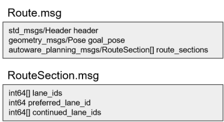
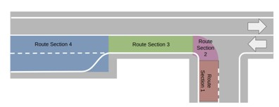

# Mission planner

## Role

The role of mission planner is to calculate route that navigates from current vehicle pose to goal pose. The route is made of sequence of lanes that vehicle must follow to reach goal pose.

This module is responsible for calculating full route to goal, and therefore only use static map information. Any dynamic obstacle information (e.g. pedestrians and vehicles) is not considered during route planning. Therefore, output route topic is only published when goal pose is given and will be latched until next goal is provided.

**remark**: Dynamic map information, such as road construction blocking some lanes, may be considered in the future. However, this feature becomes more reasonable unless we have multiple vehicle, where each vehicle updates map online and share it with other vehicles. Therefore, we only consider static map information for now.

## Input

- current pose: `/tf` (map->base_link):   This is current pose in map frame calculated by Localization stack.
- goal pose: geometry_msgs::PoseStamped   This is goal pose given from the Operator/Fleet Management Software
- map: autoware_lanelet_msgs::MapBin   This is binary data of map from Map stack. This should include geometry information of each lane to match input start/goal pose to corresponding lane, and lane connection information to calculate sequence of lanes to reach goal lane.

## Output

route: `autoware_planning_msgs::Route`   Message type is described below. Route is made of sequence of route section that vehicle must follow in order to reach goal, where a route section is a “slice” of a road that bundles lane changeable lanes. Note that the most atomic unit of route is lane_id, which is the unique id of a lane in vector map. Therefore, route message does not contain geometric information about the lane since we did not want to have planning module’s message to have dependency on map data structure.

