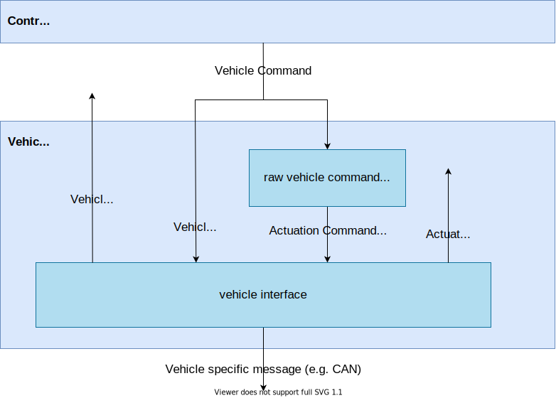
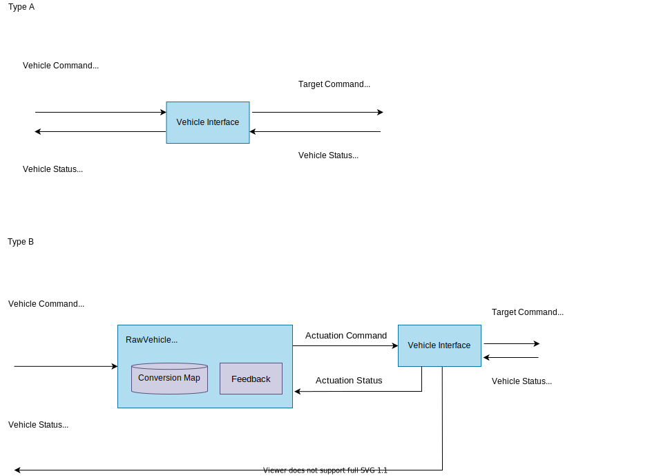
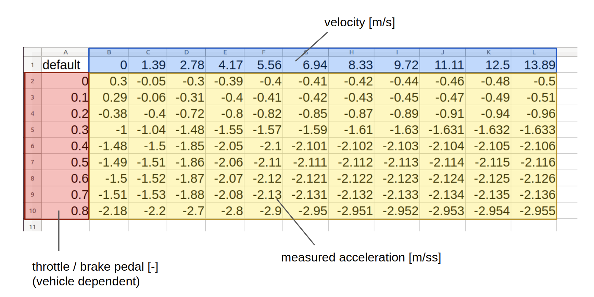

# Vehicle

## Overview

Vehicle stack is an interface between Autoware and vehicle. This layer converts signals from Autoware to vehicle-specific, and vice versa.
This module needs to be designed according to the vehicle to be used. How to implement a new interface is described [below.](#how-to-design-a-new-vehicle-interface)

## Role

There are two main roles of Vehicle stack:

- **Conversion of Autoware commands to a vehicle-specific format**
- **Conversion of vehicle status in a vehicle-specific format to Autoware messages**

## Assumption

It is assumed that the vehicle has one of the following control interfaces.

**Type A. target steering and target velocity/acceleration interface.**

**Type B. generalized target command interface (e.g. accel/brake pedal, steering torque).**

The use case and requirements change according to this type.

## Use Cases

Vehicle stack supports the following use cases.

- Speed control with desired velocity or acceleration (for type A only)
- Steering control with desired steering angle and/or steering angle velocity (for type A only)
- Speed control with desired actuation commands (for type B only)
- Steering control with desired actuation commands (for type B only)
- Shift control (for both)
- Turn signal control (for both)

## Requirement

To achieve the above use case, the vehicle stack requires the following conditions.

### Vehicle control with desired steering and velocity/acceleration (for type A)

- The vehicle can be controlled in longitudinal direction by the target velocity or acceleration.
- The vehicle can be controlled in lateral direction by the target steering.
- The output to the vehicle includes desired velocity or acceleration in a vehicle-specific format.
- The output to the vehicle includes desired steering in a vehicle-specific format.

### Vehicle control with the desired actuation command (for type B)

- The vehicle can be controlled in longitudinal direction by the specific target command (e.g. accel/brake pedal)
- The vehicle can be controlled in lateral direction by the specific target command (e.g. steering torque)
- The output to the vehicle includes desired target command in a vehicle-specific format.

### Shift control

- The vehicle can be controlled by the target shift mode.
- The input vehicle command includes the desired shift.
- The output to the vehicle includes the desired shift in a vehicle-specific format.

### Turn signal control

- The vehicle can be controlled by the target turn signal mode.
- The input vehicle command includes the desired turn signal.
- The output to the vehicle includes the desired turn signal in a vehicle-specific format.

## Input

The input to Vehicle stack:

| Input           | Topic(Data Type)                                                   | Explanation |
| --------------- | ------------------------------------------------------------------ | ----------- |
| Vehicle Command | `/control/vehicle_cmd` (`autoware_vehicle_msgs/VehicleCommand`) | Table Below |

The detailed contents in Vehicle Command are as follows.

| Input                   | Data Type        | Explanation                            |
| ----------------------- | ---------------- | -------------------------------------- |
| Velocity                | std_msgs/Float64 | Target velocity [m/s]                  |
| Acceleration            | std_msgs/Float64 | Target acceleration [m/s2]             |
| Steering angle          | std_msgs/Float64 | Target steering angle [rad]            |
| Steering angle velocity | std_msgs/Float64 | Target steering angle velocity [rad/s] |
| Gear shifting command   | std_msgs/Int32   | Target Gear shift                      |
| Emergency command       | std_msgs/Int32   | Emergency status of Autoware           |

### Output

There are two types of outputs from Vehicle stack: vehicle status to Autoware and a control command to the vehicle.

The table below summarizes the output from Vehicle stack:

| Output (to Autoware)          | Topic(Data Type)                                                                       | Explanation                                  |
| ----------------------------- | -------------------------------------------------------------------------------------- | -------------------------------------------- |
| velocity status               | `/vehicle/status/twist` (`geometry_msgs/TwistStamped`)                              | vehicle velocity status to Autoware [m/s]    |
| steering status (optional)    | `/vehicle/status/steering` (`autoware_vehicle_msgs/Steering`)                       | vehicle steering status to Autoware [rad]    |
| shift status (optional)       | `/vehicle/status/Shift` (`autoware_vehicle_msgs/ShiftStamped`)                      | vehicle shift to Autoware [-]                |
| turn signal status (optional) | `/vehicle/status/turn_signal` (`autoware_vehicle_msgs/TurnSignal`)                  | vehicle turn signal status to Autoware [m/s] |
| actuation status (optional)   | `/vehicle/status/actuation_status` (`autoware_vehicle_msgs/ActuationStatusStamped`) | vehicle actuation status to Autoware [m/s]   |

The output to the vehicle depends on each vehicle interface.

| Output (to vehicle)      | Topic(Data Type)        | Explanation                          |
| ------------------------ | ----------------------- | ------------------------------------ |
| vehicle control messages | Depends on each vehicle | Control signals to drive the vehicle |

### Internal Messages

If the vehicle does not support the TypeA interface (steering angle and velocity/acceleration), the following actuation command/status are used. These message is defined according to the interface for each vehicle, and the raw vehicle command converter is responsible for the conversion between the output from the autoware control module and the actuation message.

| Input     | Data Type        | Explanation                                                |
| --------- | ---------------- | ---------------------------------------------------------- |
| accel_cmd | std_msgs/Float64 | Vehicle-specific commands to accelerate the vehicle.       |
| brake_cmd | std_msgs/Float64 | Vehicle-specific commands to decelerate the vehicle.       |
| steer_cmd | std_msgs/Float64 | Vehicle-specific commands to control the vehicle steering. |

| Output       | Data Type        | Explanation                                                                                   |
| ------------ | ---------------- | --------------------------------------------------------------------------------------------- |
| accel_status | std_msgs/Float64 | Status of the accel-actuator corresponding to the actuation command (e.g. accel pedal)        |
| brake_status | std_msgs/Float64 | Status of the brake-actuator corresponding to the actuation command (e.g. brake pedal)        |
| steer_status | std_msgs/Float64 | Status of the steering-actuator corresponding to the actuation command (e.g. steering torque) |

## Design

- For vehicles of the type controlled by the target velocity or acceleration (type A)
- For vehicles of the type controlled by the target accel, brake and steer commands (type B)

## Vehicle Interface

### Role

To convert Autoware control messages to vehicle-specific format, and generate vehicle status messages from vehicle-specific format.

### Input

- Vehicle Command (`autoware_vehicle_msgs/VehicleCommand`) (type A only)
  - includes target velocity, acceleration, steering angle, steering angle velocity, gear shift, and emergency.
- Actuation Command (`autoware_vehicle_msgs/ActuationCommandStamped`) (type B only)
  - includes target accel_cmd, brake_cmd, steer_cmd.
- Turn signal (`autoware_vehicle_msgs/TurnSignal`) (optional)

### Output

- Velocity status (`geometry_msgs/TwistStamped`)
- Steering status (`autoware_vehicle_msgs/Steering`) (optional)
- Shift status (`autoware_vehicle_msgs/ShiftStamped`) (optional)
- Turn signal status (`autoware_vehicle_msgs/TurnSignal`) (optional)
- Actuation Status (`autoware_vehicle_msgs/ActuationStatusStamped`) (optional)

NOTE: Lane driving is possible without the optional part. Design vehicle interface according to the purpose.

## Raw Vehicle Cmd Converter

### Role

To convert the target acceleration to the actuation commands with the given conversion map. This node is used only for the case of vehicle type B.

### Input

- Vehicle Command (`autoware_vehicle_msgs/VehicleCommand`)
- Current velocity (`geometry_msgs/TwistStamped`)

### Output

- Actuation Command (`autoware_vehicle_msgs/ActuationCommandStamped`)
  - includes target accel_cmd, brake_cmd, steer_cmd.

### How to design a new vehicle interface

#### For type A

Create a module that satisfies the following two requirements

- Receives `autoware_vehicle_msg/VehicleCommand` and sends control commands to the vehicle.
- Converts the information from the vehicle, publishes vehicle speed to Autoware with `geometry_msgs/TwistStamped`.

For example, if the vehicle has an interface to be controlled with a target velocity, the velocity in `autoware_vehicle_msg/VehicleCommand` is sent to the vehicle as the target velocity. If the vehicle control interface is steering wheel angle, it is necessary to convert steering angle to steering wheel angle in this vehicle_interface.

#### For type B

Since `autoware_vehicle_msg/VehicleCommand` contains only the target steering, velocity and acceleration, you need to convert these values for the vehicle-specific interface. In this case, use the `RawVehicleCmdConverter`. The `RawVehicleCmdConverter` converts the `VehicleCommand` to the `ActuationCommand` which is specific to each vehicle based on the given conversion map. You need to create this conversion map in advance from vehicle data sheets and experiments.

With the use of `RawVehicleCmdConverter`, you need to create a module that satisfies the following two requirements

- Receives `autoware_vehicle_msg/ActuationCommandStamped` and sends control commands to the vehicle.
- Converts the information from the vehicle, publishes vehicle speed to Autoware with `geometry_msgs/TwistStamped`.

#### How to make an conversion map (for type B)

When using the `RawVehicleCmdConverter` described above, it is necessary to create an conversion map for each vehicle. The conversion map is data in CSV format. In the case of conversion between accel pedal and acceleration, it describes how much acceleration is produced when the accel command is on in each vehicle speed range. You can find the default conversion map data in `src/vehicle/raw_vehicle_cmd_converter/data` as a reference. In the CSV data, the horizontal axis is the current velocity [m/s], the vertical axis is the vehicle-specific command value [-], and the element is the acceleration [m/ss] as described below.

This is the reference data created by TierIV with the following steps.

- Press the command to a constant value on a flat road to accelerate/decelerate the vehicle.
- Save IMU acceleration and vehicle velocity data during acceleration/deceleration.
- Create a CSV file with the relationship between command values and acceleration at each vehicle speed.

After your acceleration map is created, load it when `RawVehicleCmdConverter` is launched (the file path is defined at the launch file).

#### Control of additional elements, such as turn signals

If you need to control parts that are not related to the vehicle drive (turn signals, doors, window opening and closing, headlights, etc.), the vehicle interface will handle them separately. The current Autoware supports and implements only turn signals.
