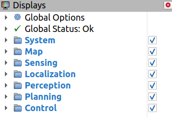
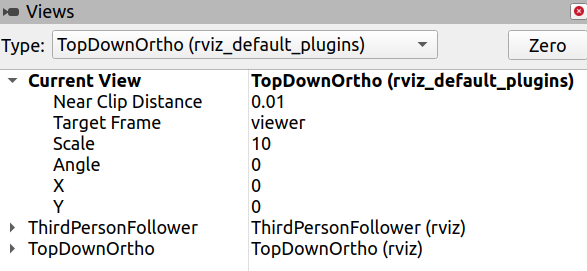

# RViz Panels

This document describes the items of RViz panels configured by autoware.rviz as of autoware.proj v1.8.0.

## Displays Panel

### Global Options

| Item name        | What is the setting                                                  | How it will be displayed in 3D view                                     | Supplementary information                                                                                                                                                       |
| ---------------- | -------------------------------------------------------------------- | ----------------------------------------------------------------------- | ------------------------------------------------------------------------------------------------------------------------------------------------------------------------------- |
| Fixed Frame      | Defines the TF frame that is the base of references for other frames |                                                                         | No need to change this setting. Changing the setting from the default frame (`map`) to a different frame will cause the map to disappear or the viewpoint to shift unnaturally. |
| Background Color | Background color                                                     | The background color (black by default).                                |                                                                                                                                                                                 |
| Frame Rate       | The frequency at which the 3D view is updated (frame per second)     | The higher the value, the smoother the rendering will be.               | Increasing the value above the topic Hz will not have much effect.                                                                                                              |
| Default Light    | Marker color                                                         | When off, the color of the traffic light signals and TFs will be black. | No need to turn it off.                                                                                                                                                         |

### System

| Item name | Sub item name    | What is the setting                         | How it will be displayed in 3D view                                                                                                       | Supplementary information                                                                                                                                                                                  |
| --------- | ---------------- | ------------------------------------------- | ----------------------------------------------------------------------------------------------------------------------------------------- | ---------------------------------------------------------------------------------------------------------------------------------------------------------------------------------------------------------- |
| TF        | Show Names       | Show TF names                               | TF names will be shown near the TF.                                                                                                       | Default is off.                                                                                                                                                                                            |
|           | Show Axes        | Show TF Coordinates                         | The coordinate axes (red, green, blue) are displayed at the position of the TF.                                                           | Default is off.                                                                                                                                                                                            |
|           | Show Arrows      | Show lines connecting TF positions          | TFs that have a parent-child relationship will be connected by a yellow line.                                                             | Default is off.                                                                                                                                                                                            |
| Grid      |                  | Show Grid                                   | Grid lines are displayed.                                                                                                                 | Default is off. The origin, size, transparency, etc. can be changed.                                                                                                                                       |
| Vehicle   | SteeringAngle    | Displays the steering angle                 | A steering wheel symbol is displayed on the 3D View, showing how many degrees the steering wheel of the ego vehicle is turned.            | The display position, size, color, etc. can be changed.                                                                                                                                                    |
|           | ConsoleMeter     | Displays a speed meter                      | A speed meter is displayed on the 3D View, showing the current speed of the ego vehicle.                                                  | The display position, size, text color, etc. can be changed.                                                                                                                                               |
|           | VelocityHistory  | Displays velocity histories                 | The velocity histories are displayed as white dots behind the ego vehicle.                                                                |                                                                                                                                                                                                            |
|           | VehicleModel     | Displays a 3D model of the ego vehicle      | A 3D model of the ego vehicle is displayed at the position of the vehicle on the map.                                                     | The transparency of the 3D model can be changed. The 3D model corresponds to the one specified in `vehicle_model` when executing `ros2 launch`.                                                            |
|           | PolarGridDisplay | Displays concentric circles                 | Concentric circles are displayed.                                                                                                         | By default, the reference frame is `base_link`, so `base_link` is the center of the circles. You can change the spacing of the circles, the color and transparency of the lines, the "wave" settings, etc. |
|           | MaxVelocity      | Displays the value set as the maximum speed | Displays as "limited xx km/h" (where xx is the value defined as the maximum speed).                                                       | When you change the maximum speed setting in the web UI of the planning simulator, the value displayed will also change. The position and color of the text can be changed.                                |
|           | TurnSignal       | Displays turn signal                        | The left and right arrows are drawn with dashed lines, and are filled in white when the turn signal command is output by turn_signal_cmd. | The position and size can be changed.                                                                                                                                                                      |

### Map

| Item name         | What is the setting      | How it will be displayed in 3D view                                                                                                               | Supplementary information                                                                                                                         |
| ----------------- | ------------------------ | ------------------------------------------------------------------------------------------------------------------------------------------------- | ------------------------------------------------------------------------------------------------------------------------------------------------- |
| PointCloudMap     | Displays point cloud map | By default, a white dot marker is displayed at the position of the point cloud.                                                                   | You can change the shape of the marker (points, squares, etc.), size, color (axis direction, reflection intensity of the point cloud, etc.), etc. |
| Lanelet2VectorMap | Displays vector map      | Lane information (white lines), crosswalk areas (green areas), stop lines (red lines), and traffic signals (traffic light symbols) are displayed. | You can change the visibility of the information on the map.                                                                                      |

### Sensing

| Item name | Sub item name         | What is the setting                                                                                       | How it will be displayed in 3D view                                                                                                       | Supplementary information                                                                                                                  |
| --------- | --------------------- | --------------------------------------------------------------------------------------------------------- | ----------------------------------------------------------------------------------------------------------------------------------------- | ------------------------------------------------------------------------------------------------------------------------------------------ |
| LiDAR     | ConcatenatePointCloud | Displays a point cloud which is a concatenation of all point clouds acquired by LiDARs                    | By default, displayed in rainbow colors along the z-axis.                                                                                 | Marker shape (points, squares, etc.), size, color coding (axis direction, reflection intensity of point cloud, etc.), etc. can be changed. |
|           | NoGroundPointCloud    | Displays a point cloud from which the ground has been removed                                             | By default, the point cloud is displayed as light blue, slightly larger points.                                                           | Marker shape (points, squares, etc.), size, color (axis direction, reflection strength of point cloud, etc.), etc. can be changed.         |
|           | MeasurementRange      | Displays a polygon that indicates the range of the point cloud to be detected as NoGroundPointCloud above | By default, a polygon with a yellow-green line is displayed.                                                                              | Default is off. The color and transparency of the lines can be changed.                                                                    |
| GNSS      |                       | Displays GNSS (GPS) position and orientation information                                                  | By default, the information is displayed as orange, slightly larger arrow. Covariance is displayed as a purple sphere covering the arrow. | The size, color and transparency can be changed.                                                                                           |

### Localization

| Item name | Sub item name         | What is the setting                                                                        | How it will be displayed in 3D view                                                                                                                                     | Supplementary information                                               |
| --------- | --------------------- | ------------------------------------------------------------------------------------------ | ----------------------------------------------------------------------------------------------------------------------------------------------------------------------- | ----------------------------------------------------------------------- |
| NDT       | PoseWithCovInitial    | Displays the initial pose with covariance when performing NDT matching                     | By default, it is displayed as a blue arrow at the bottom of the rear of the vehicle, almost coinciding with the `base_link`.                                           | The size, color, transparency, etc. can be changed.                     |
|           | PoseWithCovAligned    | Displays the pose with covariance in the output of NDT matching                            | By default, it is displayed as a yellow-green arrow that follows the `base_link` at the bottom of the rear of the vehicle.                                              | The size, color, transparency, etc. can be changed.                     |
|           | PoseHistory           | Displays the pose history                                                                  | By default, a yellow-green line that traces the vehicle is displayed.                                                                                                   | The color, thickness of the line, buffers for the lines can be changed. |
|           | Initial               |                                                                                            | By default, a slightly larger light-blue dot is displayed.                                                                                                              | The marker type, color, size, and color coding can be changed.          |
|           | Aligned               |                                                                                            | By default, a slightly larger yellow-green dot is displayed.                                                                                                            | The marker type, color, size, and color coding can be changed.          |
|           | MonteCarloInitialPose | Displays the pose of the ego vehicle's initial position as estimated by Monte Carlo method | Pose of the ego vehicle's initial position as estimated by Monte Carlo method, displayed as numerous arrows near the vehicle's initial position during Rosbag playback. | Multiple markers are displayed as arrows.                               |
| EKF       | PoseHistory           | Displays the trace of the EKF output pose                                                  | By default, a light-blue line that traces the vehicle is displayed.                                                                                                     | The color, thickness of the line, buffers for the lines can be changed. |

### Perception

| Item name  | Item type      | What is the setting                                 | How it will be displayed in 3D view                                                                                                                                                                                                                                                                                                                                                                                                                     |
| ---------- | -------------- | --------------------------------------------------- | ------------------------------------------------------------------------------------------------------------------------------------------------------------------------------------------------------------------------------------------------------------------------------------------------------------------------------------------------------------------------------------------------------------------------------------------------------- |
| Detection  | DynamicObjects | Displays the information about the detected objects | Displayed as a part of Prediction below.                                                                                                                                                                                                                                                                                                                                                                                                                |
| Tracking   | DynamicObjects | Displays the information about the detected objects | Displayed as a part of Prediction below.                                                                                                                                                                                                                                                                                                                                                                                                                |
| Prediction | DynamicObjects | Displays the information about the detected objects | The shape of the object is displayed as a green polygon. The text that describes what the object is and ID (label) are displayed as white texts. The velocity and angular velocity (twist) of the object are displayed as a red line. The predicted path of the object is displayed as a yellow-green or light-blue line and circle. The path confidence is displayed as a number in the same color as the path displayed ahead of each predicted path. |

### Planning

| Item name                                                                                          | Sub item name                                          | What is the setting                                                                      | How it will be displayed in 3D view                                                                                                                                                                                    | Supplementary information                                                                                                                                        |
| -------------------------------------------------------------------------------------------------- | ------------------------------------------------------ | ---------------------------------------------------------------------------------------- | ---------------------------------------------------------------------------------------------------------------------------------------------------------------------------------------------------------------------- | ---------------------------------------------------------------------------------------------------------------------------------------------------------------- |
| MissionPlanning                                                                                    | RouteArea                                              | Displays the drivable area of the route to reach the goal                                | Lanes are displayed in light-blue, yellow-green, and blue colors.                                                                                                                                                      |                                                                                                                                                                  |
|                                                                                                    | GoalPose                                               | Displays the position of the goal                                                        | The blue, red, and green 3D axes symbol is displayed.                                                                                                                                                                  | The shape, size, and color of the goal symbol can be changed.                                                                                                    |
| ScenarioPlanning (Only the common items that do not depend on the specific scene are described) | ScenarioTrajectory                                     | Trajectory output from scenario_planning                                                 | Path is displayed as a yellow-green or red colored area, and velocity is displayed as a line of the same color.                                                                                                        | If the path can be drivable, it is displayed in yellow-green, and if not, it is displayed in red. The width, transparency, and color of the area can be changed. |
|                                                                                                    | LaneDriving > Behavior Planning > Path                 | Path of the output from Behavior Planner                                                 | Path is displayed as a yellow-green or red colored area, and velocity is displayed as a line of the same color.                                                                                                        | If the path can be drivable, it is displayed in yellow-green, and if not, it is displayed in red. The width, transparency, and color of the area can be changed. |
|                                                                                                    | LaneDriving > Behavior Planning > Arrow                | Path of the output from Behavior Velocity Planner                                        | Displayed as a small white arrow on the path.                                                                                                                                                                          |
|                                                                                                    | LaneDriving > Behavior Planning > LaneChange           | Predicted path marker output from Lane Change Planner                                    | A rainbow-colored circular area is displayed in front of and behind the ego vehicle.                                                                                                                                   | The size of the circle changes dynamically depending on the speed.                                                                                               |
|                                                                                                    | LaneDriving > Behavior Planning > LaneChangeCandidate  | Paths that are candidates for Lane Change                                                |                                                                                                                                                                                                                        | The width, transparency, and color of the area can be changed.                                                                                                   |
|                                                                                                    | LaneDriving > Motion Planning > Trajectory             | Trajectory output from Lane Driving                                                      | Path is displayed as a yellow-green colored area, and velocity is displayed as a line of the same color.                                                                                                               | The width, transparency, and color of the area can be changed.                                                                                                   |
|                                                                                                    | LaneDriving > Motion Planning > ObstaclePointCloudStop | Pointcloud detection rectangle for object collision prediction considering vehicle shape | Displayed as a yellow-green rectangle.                                                                                                                                                                                 |
|                                                                                                    | LaneDriving > Motion Planning > SurroundObstacleCheck  | Marker of the result of checking for objects passing by a stopped vehicle                | When an object is close, a red wall (virtual_wall/no_start) and white texts (virtual_wall/no_start) are displayed on it, and the object is also marked with a white "!".                                               |
|                                                                                                    | LaneDriving > Motion Planning > ObstacleAvoidance      | Marker indicating the factor of the decision to avoid an obstacle                        | (Omit the description of minor markers)  The object to be avoided is displayed as a yellow-green polygon. The footprint, which takes into account the shape of the ego vehicle, is displayed as a yellow rectangle. |                                                                                                                                                                  |
|                                                                                                    | Parking > Costmap                                      | Area estimated as a drivable one in the Parking scenario                                 | In a certain area centered on the vehicle, areas that are drivable are displayed in white, and not drivable are displayed in black.                                                                                    | It is possible to change the transparency of the black and white areas, as well as the vertical order of the layers in relation to other display items.          |
|                                                                                                    | Parking > PartialPoseArray                             | Array of poses that the vehicle will move after this (partial)                           | By default, displayed as a red arrow.                                                                                                                                                                                  | The shape, color, size, transparency, etc. of the markers can be changed.                                                                                        |
|                                                                                                    | Parking > PoseArray                                    | Array of poses that the vehicle will move after this                                     | By default, displayed as a blue arrow.                                                                                                                                                                                 | The shape, color, size, transparency, etc. of the markers can be changed.                                                                                        |

### Control

| Item name         | What is the setting                                            | How it will be displayed in 3D view                                                                                                                                                                                                                                                                  | Supplementary information                                                                              |
| ----------------- | -------------------------------------------------------------- | ---------------------------------------------------------------------------------------------------------------------------------------------------------------------------------------------------------------------------------------------------------------------------------------------------- | ------------------------------------------------------------------------------------------------------ |
| Debug/MPC         | Marker that indicates the behavior when running in MPC         | For each trajectory line and pose, the predicted (predicted_trajectory), raw (trajectory_raw), spline interpolated (trajectory_spline), and the averaged data (trajectory_average) are displayed with gray, orange, blue, and green lines and arrows, respectively.                                  | (At startup, either MPC or PurePursuit algorithm is selected, so only one of them will work at a time) |
| Debug/PurePursuit | Marker that indicates the behavior when running in PurePursuit | A marker (next_target) that indicates the aimed target used to determine the steering angle is displayed as a yellow-green sphere in front of the vehicle, and the trajectory (trajectory_circle) that the vehicle will follow if the steering is aimed at that target is displayed as a white line. | (At startup, either MPC or PurePursuit algorithm is selected, so only one of them will work at a time) |

## Views Panel

| Type                  | Description                                                             |
| --------------------- | ----------------------------------------------------------------------- |
| FPS (FirstPersonView) | Displays the view as a first-person perspective.                        |
| Orbit                 | Displays the view as if the user is looking around the specified point. |
| ThirdPersonFollower   | Displays the view as a third-person perspective.                        |
| TopDownOrtho          | Displays a top-down orthographic view.                                  |
| XYOrbit               | Displays the Orbit view on on the X-Y plane.                            |

The origin of the viewpoint can be changed by changing the Target Frame of Current View in the Views panel. In many cases, you may want to follow the vehicle, so basically set the Target Frame to `base_link`.
