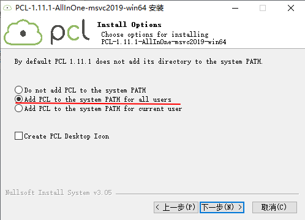
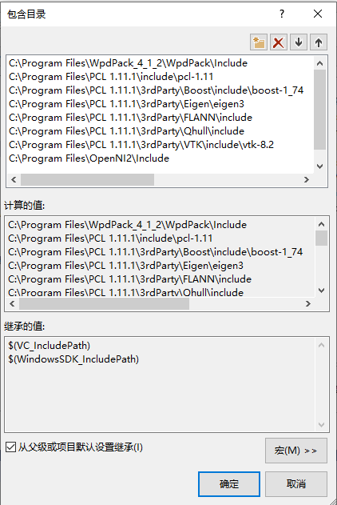
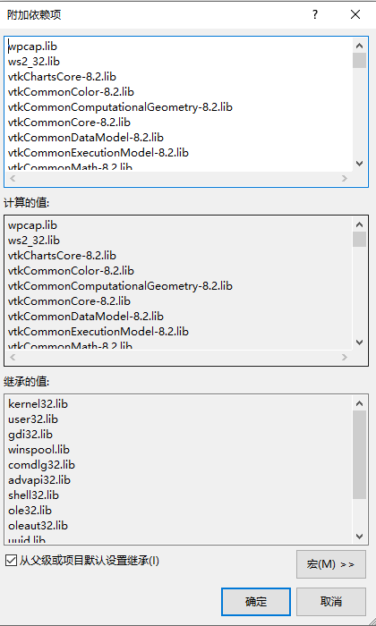

# 16 **如何在Windows上编译rs_driver**

## 16.1 概述

这里的编译说明，针对`rs_driver`的两个部分。
- 示例程序，包括`demo_online`和`demo_pcap`
- 点云显示工具 `rs_driver_viewer`

两者对第三方库的依赖不同，这里将分开说明。

如下步骤在`Windows 10`系统下完成，使用的编译工具为`VS2019`。


## 16.2 编译demo_online

演示程序的编译，以`demo_online`为例说明。`demo_pcap`的编译步骤与`demo_online`相同。

### 16.2.1 安装第三方库

- 如果需要解析PCAP文件，则需要安装`libpcap`库，包括：

```
WpdPack_4_1_2.zip, 编译时需要的头文件和库文件
WinPcap_4_1_3.exe, 包括运行时库
```

- 将`WpdPack_4_1_2.zip`解压到目录`C:/Program Files`下。

- 运行`WinPcap_4_1_3.exe`，安装到目录`C:/Program Files`下。

### 16.2.2 创建demo_online工程

- 创建`demo_online`工程，加入源文件`demo_online.cpp`。


### 16.2.3 配置demo_online工程

- 遵循`C++14`标准


- `demo_online`当然依赖`rs_driver`库。设置`rs_driver`的头文件路径。


- 设置`libpcap`库的头文件路径。


- 设置`libpcap`库的库文件路径。


- 设置依赖的`libpcap`库`wpcap.lib`。也同时设置`ws2_32.lib`，这是Windows的socket库，`rs_driver`依赖它。


- 设置编译选项 `_CRT_SECURE_NO_WARNINGS`，避免不必要的编译错误。


### 16.2.4 编译及运行

- 编译`demo_online`工程，并运行。
  
  这个步骤没有什么特别的。


## 16.3 编译rs_driver_viewer

### 16.3.1 安装第三方库

- 与`demo_online`一样，安装`libpcap`库。

- `rs_driver_viewer`还依赖`PCL`库，后者又依赖`Boost`、`Eigen`等一系列库。幸运的是，`PCL`库提供了适配`MSVC2019`的安装包，而这个包中又自带了它所依赖的库。这里使用的安装包是：

```
PCL-1.11.1-AllInOne-msvc2019-win64.exe
```

  运行它，安装到目录`C:/Program Files`下。


  注意，安装`PCL`库的同时，也会安装它依赖的库。


安装的组件位置如下：
```
C:\Program Files\PCL 1.11.1          # PCL自身的库
C:\Program Files\OpenNI2             # PCL依赖的OpenNI2库
C:\Program Files\PCL 1.11.1\3rdParty # PCL依赖的其他库
```

### 16.3.2 配置第三方库

将如下运行时库的路径加入`PATH`。


```
C:\Program Files\PCL 1.11.1\bin
C:\Program Files\PCL 1.11.1\3rdParty\VTK\bin
C:\Program Files\PCL 1.11.1\3rdParty\OpenNI2\Redist
```

### 16.3.3 创建rs_driver_viewer工程

- 创建`rs_driver_viewer`工程，加入源文件`rs_driver_viewer.cpp`。


### 16.3.4 配置rs_driver_viewer工程

- 与`demo_online`一样，遵循`C++14`标准


- 禁止SDL检查


- 与`demo_online`一样，设置`rs_driver`的头文件路径。


- 设置`PCL`库的头文件路径如下。（与`demo_online`一样，同时设置`libpcap`库）


```
C:\Program Files\PCL 1.11.1\include\pcl-1.11
C:\Program Files\PCL 1.11.1\3rdParty\Boost\include\boost-1_74
C:\Program Files\PCL 1.11.1\3rdParty\Eigen\eigen3
C:\Program Files\PCL 1.11.1\3rdParty\FLANN\include
C:\Program Files\PCL 1.11.1\3rdParty\Qhull\include
C:\Program Files\PCL 1.11.1\3rdParty\VTK\include\vtk-8.2
C:\Program Files\OpenNI2\Include
```

- 设置`PCL`库的库文件路径。（与`demo_online`一样，同时设置`libpcap`）


```
C:\Program Files\PCL 1.11.1\lib
C:\Program Files\PCL 1.11.1\3rdParty\Boost\lib
C:\Program Files\PCL 1.11.1\3rdParty\FLANN\lib
C:\Program Files\PCL 1.11.1\3rdParty\Qhull\lib
C:\Program Files\PCL 1.11.1\3rdParty\VTK\lib
C:\Program Files\OpenNI2\Lib
```

- 设置`PCL`及它依赖的库，包括`PCL`和`vtk`两部分。（与`demo_online`一样，同时设置`wpcap.lib`和`ws2_32.lib`）

`PCL`的库文件如下：

```
pcl_common.lib
pcl_commond.lib
pcl_features.lib
pcl_featuresd.lib
pcl_filters.lib
pcl_filtersd.lib
pcl_io.lib
pcl_iod.lib
pcl_io_ply.lib
pcl_io_plyd.lib
pcl_kdtree.lib
pcl_kdtreed.lib
pcl_keypoints.lib
pcl_keypointsd.lib
pcl_ml.lib
pcl_mld.lib
pcl_octree.lib
pcl_octreed.lib
pcl_outofcore.lib
pcl_outofcored.lib
pcl_people.lib
pcl_peopled.lib
pcl_recognition.lib
pcl_recognitiond.lib
pcl_registration.lib
pcl_registrationd.lib
pcl_sample_consensus.lib
pcl_sample_consensusd.lib
pcl_search.lib
pcl_searchd.lib
pcl_segmentation.lib
pcl_segmentationd.lib
pcl_stereo.lib
pcl_stereod.lib
pcl_surface.lib
pcl_surfaced.lib
pcl_tracking.lib
pcl_trackingd.lib
pcl_visualization.lib
pcl_visualizationd.lib
```

`vtk`库分为`debug`/`release`版本。如下是`release`版本。这里的步骤以`release`版本举例。


```
vtkChartsCore-8.2.lib
vtkCommonColor-8.2.lib
vtkCommonComputationalGeometry-8.2.lib
vtkCommonCore-8.2.lib
vtkCommonDataModel-8.2.lib
vtkCommonExecutionModel-8.2.lib
vtkCommonMath-8.2.lib
vtkCommonMisc-8.2.lib
vtkCommonSystem-8.2.lib
vtkCommonTransforms-8.2.lib
vtkDICOMParser-8.2.lib
vtkDomainsChemistry-8.2.lib
vtkDomainsChemistryOpenGL2-8.2.lib
vtkdoubleconversion-8.2.lib
vtkexodusII-8.2.lib
vtkexpat-8.2.lib
vtkFiltersAMR-8.2.lib
vtkFiltersCore-8.2.lib
vtkFiltersExtraction-8.2.lib
vtkFiltersFlowPaths-8.2.lib
vtkFiltersGeneral-8.2.lib
vtkFiltersGeneric-8.2.lib
vtkFiltersGeometry-8.2.lib
vtkFiltersHybrid-8.2.lib
vtkFiltersHyperTree-8.2.lib
vtkFiltersImaging-8.2.lib
vtkFiltersModeling-8.2.lib
vtkFiltersParallel-8.2.lib
vtkFiltersParallelImaging-8.2.lib
vtkFiltersPoints-8.2.lib
vtkFiltersProgrammable-8.2.lib
vtkFiltersSelection-8.2.lib
vtkFiltersSMP-8.2.lib
vtkFiltersSources-8.2.lib
vtkFiltersStatistics-8.2.lib
vtkFiltersTexture-8.2.lib
vtkFiltersTopology-8.2.lib
vtkFiltersVerdict-8.2.lib
vtkfreetype-8.2.lib
vtkGeovisCore-8.2.lib
vtkgl2ps-8.2.lib
vtkglew-8.2.lib
vtkGUISupportMFC-8.2.lib
vtkhdf5-8.2.lib
vtkhdf5_hl-8.2.lib
vtkImagingColor-8.2.lib
vtkImagingCore-8.2.lib
vtkImagingFourier-8.2.lib
vtkImagingGeneral-8.2.lib
vtkImagingHybrid-8.2.lib
vtkImagingMath-8.2.lib
vtkImagingMorphological-8.2.lib
vtkImagingSources-8.2.lib
vtkImagingStatistics-8.2.lib
vtkImagingStencil-8.2.lib
vtkInfovisCore-8.2.lib
vtkInfovisLayout-8.2.lib
vtkInteractionImage-8.2.lib
vtkInteractionStyle-8.2.lib
vtkInteractionWidgets-8.2.lib
vtkIOAMR-8.2.lib
vtkIOAsynchronous-8.2.lib
vtkIOCityGML-8.2.lib
vtkIOCore-8.2.lib
vtkIOEnSight-8.2.lib
vtkIOExodus-8.2.lib
vtkIOExport-8.2.lib
vtkIOExportOpenGL2-8.2.lib
vtkIOExportPDF-8.2.lib
vtkIOGeometry-8.2.lib
vtkIOImage-8.2.lib
vtkIOImport-8.2.lib
vtkIOInfovis-8.2.lib
vtkIOLegacy-8.2.lib
vtkIOLSDyna-8.2.lib
vtkIOMINC-8.2.lib
vtkIOMovie-8.2.lib
vtkIONetCDF-8.2.lib
vtkIOParallel-8.2.lib
vtkIOParallelXML-8.2.lib
vtkIOPLY-8.2.lib
vtkIOSegY-8.2.lib
vtkIOSQL-8.2.lib
vtkIOTecplotTable-8.2.lib
vtkIOVeraOut-8.2.lib
vtkIOVideo-8.2.lib
vtkIOXML-8.2.lib
vtkIOXMLParser-8.2.lib
vtkjpeg-8.2.lib
vtkjsoncpp-8.2.lib
vtklibharu-8.2.lib
vtklibxml2-8.2.lib
vtklz4-8.2.lib
vtklzma-8.2.lib
vtkmetaio-8.2.lib
vtkNetCDF-8.2.lib
vtkogg-8.2.lib
vtkParallelCore-8.2.lib
vtkpng-8.2.lib
vtkproj-8.2.lib
vtkpugixml-8.2.lib
vtkRenderingAnnotation-8.2.lib
vtkRenderingContext2D-8.2.lib
vtkRenderingContextOpenGL2-8.2.lib
vtkRenderingCore-8.2.lib
vtkRenderingExternal-8.2.lib
vtkRenderingFreeType-8.2.lib
vtkRenderingGL2PSOpenGL2-8.2.lib
vtkRenderingImage-8.2.lib
vtkRenderingLabel-8.2.lib
vtkRenderingLOD-8.2.lib
vtkRenderingOpenGL2-8.2.lib
vtkRenderingVolume-8.2.lib
vtkRenderingVolumeOpenGL2-8.2.lib
vtksqlite-8.2.lib
vtksys-8.2.lib
vtktheora-8.2.lib
vtktiff-8.2.lib
vtkverdict-8.2.lib
vtkViewsContext2D-8.2.lib
vtkViewsCore-8.2.lib
vtkViewsInfovis-8.2.lib
vtkzlib-8.2.lib
```

- 设置如下编译选项，避免不必要的编译错误。（与`demo_online`一样，设置`_CRT_SECURE_NO_WARNINGS`选项）


```
BOOST_USE_WINDOWS_H
NOMINMAX
_CRT_SECURE_NO_DEPRECATE
```

### 16.3.5 编译及运行

编译`demo_online`工程，并运行。

