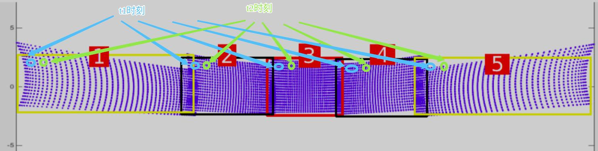

# 18 **Point Type and Point Layout**


## 18.1 Overview

This document describes:

+ the member variables of point and point cloud, and
+ what they really means


## 18.2 Point And Point Cloud

### 18.2.1 Point

The member variables of point are as below. 

```c++
struct PointXYZIRT
{
  float x;
  float y;
  float z;
  uint8_t intensity;
  uint16_t ring;
  double timestamp;
};
```

### 18.2.2 Point Cloud

The member variables of point cloud are as below. Its member `points` is a `vector` of points.

```c++
template <typename T_Point>
class PointCloudT
{
public:
  typedef T_Point PointT;
  typedef std::vector<PointT> VectorT;

  uint32_t height = 0;    ///< Height of point cloud
  uint32_t width = 0;     ///< Width of point cloud
  bool is_dense = false;  ///< If is_dense is true, the point cloud does not contain NAN points
  double timestamp = 0.0; ///< Timestamp of point cloud
  uint32_t seq = 0;       ///< Sequence number of point cloud

  VectorT points;
};
```


## 18.3 Member `ring` of Point

### 18.3.1 Mechanical LiDAR

In design of mechanical LiDAR, its channels are numbered by scan order. However, this order is not a ascending/descending order, so vertical angles of channels are not either.   

`rs_driver` sorts the channels by their vertical angels in ascending. The member `ring`  is such a  sorted number.


### 18.3.2 MEMS LiDAR

MEMS LiDAR scan 5 zone per scan, and get 5 points. Their timestamps are same. 

The member `ring`  is the number of zone.





## 18.4 Point Layout

### 18.4.1 Mechanical LiDAR

Take RS32 as an example.

It gets 32 points per scan, 1 point per channel. These 32 points is packed into a `Block`, and written into MSOP packet.

After a round of scan, LiDAR get a point set on a loop surface.


MSOP packet consists of `Block`. `rs_driver` parses `Block`s one by one, and saves their points group by group. The points are in the member `points` of point cloud. LiDARs scans the channels, and `rs_driver` save their points in the same order.

To traverse all points in a channel, just skip 32 points every time.


### 18.4.2 MEMS LiDAR

MEMS LiDAR scans 5 zones per scan, and get 5 points, and packs them into a `Block`, write into MSOP packet.

`rs_driver`parses `Block`s one by one, 5 points in a `Block`is saved as a group in the member `points`  of point cloud.


Here is the point cloud in each zone. 

The zone is `126` lines x `125` columns. LiDAR scan from up to down in Z order. `rs_driver` same these points in the same order.


## 18.5 Coordinate of points

`rs_driver`comply with the right-handed coordinate system.

To change this, change mapping relationship of (x, y, z) as below. 

```c++
//.../decoder/decoder_RSM1.hpp

    int pitch = ntohs(channel.pitch) - ANGLE_OFFSET;
    int yaw = ntohs(channel.yaw) - ANGLE_OFFSET;

    float x = distance * COS (pitch) * COS (yaw);
    float y = distance * COS (pitch) * SIN (yaw);
    float z = distance * SIN (pitch);
```


## 18.6  Member `timestamp` of Point

Mechanical LiDAR (600 rpm） and MEMS LiDAR finish a frame in 0.1 second. Its points scatter into this time range.

To get higher resolution of timestamp than point cloud's, please use  the point type of `XYZIRT`. `T` is the timestamp of point.


## 18.7 member `timestamp` of Point Cloud

`timestamp` of point cloud may be from from its first point or last point.


### 18.7.1 From LiDAR, or From Host ?

`rs_driver`may get `timestamp` of point cloud from LiDAR or from host.

+ From MSOP packet.  LiDAR set set the timestamp based on its own system clock. Generally, user synchronizes LiDAR's clock with the PTP protocol. 
+ Invoke Operation System's API. With it, `rs_driver` gets the local system time. This is the default.

Use the option `use_lidar_clock` to change this.

```c++
struct RSDecoderParam  ///< LiDAR decoder parameter
{
  ...
  bool use_lidar_clock = false;  ///< true: use LiDAR clock as timestamp; false: use system clock as timestamp
  ...
}
```

### 18.7.2 The first point, or The last point ?

The default value is from the last point.

Use the option `ts_first_point` to change this.

```c++
struct RSDecoderParam  ///< LiDAR decoder parameter
{
  ...
  bool ts_first_point = false;   ///< true: time-stamp point cloud with the first point; false: with the last point;
  ...
}
```

### 18.7.3 UTC time or Local time ?

LiDAR writes UTC time into MSOP packets.

In `CMakeLists.txt`,  enable the macro `ENABLE_STAMP_WITH_LOCAL` to convert it to local time.

```cmake
option(ENABLE_STAMP_WITH_LOCAL    "Enable stamp point cloud with local time" OFF)
```

