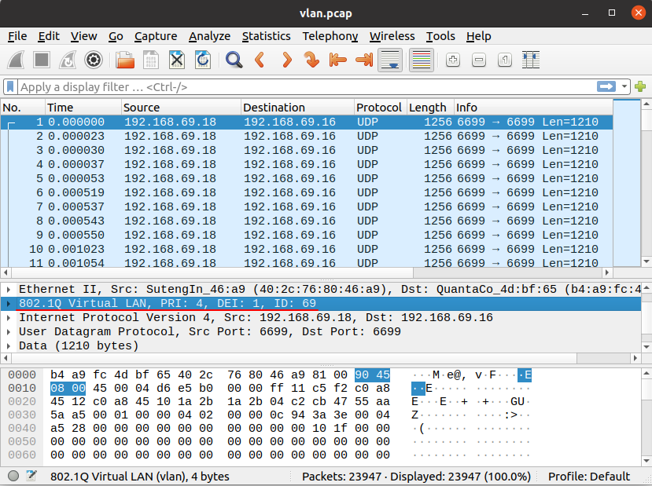

#  12 **Configure rs_driver by PCAP file**

## 12.1 Overview

By PCAP files, we can learn what the MSOP/DIFOP packet is like, so as to learn how to configure `rs_driver` and get point cloud.

Here we use the 3rd party tool `WireShark`.

About how to capture a PCAP file, please refer to [How to pcap PCAP file](./13_how_to_capture_pcap_file.md).

## 12.2 Format of MSOP/DIFOP

### 12.2.1 Protocol Layer

MSOP/DIFOP Packet is based on UDP protocol. It includes:

+ Ethernet
+ VLAN（Optional） 
+ IP 
+ UDP
+ User Layer（Prefix part, Optional） 
+ MSOP/DIFOP Packet（Real data）
+ Tail Layer（Suffix part, Optional）

`VLAN` Layer is optional. It is up to:

+ Whether the LiDAR is on VLAN
+ Capture MOSP/DIFOP packets on phisical NIC or virtual NIC

`User Layer`  is added by the user. User determines its length.

`Tail Layer` is from the user too. One Example is that Domain Controller of Intelligent Car appends its 4 bytes.

### 12.2.2 Packet ID

WireShark can parse `Ethernet` layer,`IP` layer,`UDP` layer, etc.

To parse MSOP/DIFOP Packet and `User Layer`，first locate the `ID` of MSOP/DIFOP Packet.

To parse MSOP/DIFOP Packet与`Tail Layer`，first find out the length of MSOP/DIFOP Packet (excludes `User Layer` and `Tail Layer`).

The `ID` and the length of LiDARs is fixed as below.

| LiDAR Type              |Packet Type |  ID                 |Packet Length |
| ----                               | ----     | ----                        | ----    |
| RS16/RS32/RSBP                     |  MSOP    |  55 aa 05 0a 5a a5 50 a0    |  1248   |
|                                    |  DIFOP   |  a5 ff 00 5a 11 11 55 55    |  1248   |
| RS128/RS80/RS48/RSP128/RSP80/RSP48/RSHELIOS/RSHELIOS_16P | MSOP |55 aa 05 5a|  1248   |
|                                    |  DIFOP   |  a5 ff 00 5a 11 11 55 55    |  1248   |
| RSM1/RSM2/RSE1                     |  MSOP    |  55 aa 5a a5                |  1210   |
|                                    |  DIFOP   |  a5 ff 00 5a 11 11 55 55    |  256    |

Note:  MSOP and DIFOP packets have different `ID`s, so we can determine which packet is MSOP or DIFOP.

## 12.3 Steps

Below are the steps to analysis PCAP file.
+ Find out the destination IP address of MSOP/DIFOP Packet。In design of RoboSense LiDAR, MSOP and DIFOP packets always have the same destination IPs.

​		Also find out what address is it? broadcast/multicast/unicast address? If it is multicast, `groud_address` and `host_address` are required.

+ Find out the destination port of MSOP/DIFOP packets.

​		Here show a specified type of packet with filter criteria.

​		Here exclude a specified type with filter criteria.

​		Just set filter criteria on `msop_port` and `difop_port`.

+ Is there VLAN layer? If Yes,

    + create virtual NIC in case of online LiDAR.

    + set `use_vlan=true`, in case of PCAP file.

+ Find out the ID bytes first. Is there User Layer?  How long is it?

​		If Yes, set `user_layer_bytes`.

+ Is there Tail Layer ? How long is it?

​		If Yes, set `tail_layer_bytes`.

## 12.4 Examples

### 12.4.1 RS32 - MSOP Packet

Below is a example of RS32 MSOP packet.
+ Destination IP is `192.168.1.102` (labeled by red 1)
+ Destination port is `6699` (labeled by red 2)
+ Length of MSOP Packet is 1248`(labeled by red 3)
+ ID bytes of RS32 MSOP Packet is `55 aa 05 0a 5a a5 50 a0`. It is at the beginning (labeled by red 4), so no User Layer here.

### 12.4.2 RS32 - DIFOP Packet

Below is an example of RS32 DIFOP Packet.
+ Destination IP is `192.168.1.102` (labeled by red 1)
+ Destination port is `7788` (labeled by red 2)
+ Length of MSOP Packet is 1248`(labeled by red 3)
+ ID bytes of DIFOP Packet is `a5 ff 00 5a 11 11 55 55`. It is at the begining(labeled by red 4), so no User Layer here.

### 12.4.3 VLAN Layer

Below is an example of VLAN layer. This is a MSOP packet of RSM1.

`VLAN Layer` is between `Ethernet Layer` and `IP Layer`.  `vlan id` is `69`.

### 12.4.4 User Layer

Below is an example of User Layer. This is a MSOP Packet of RSM1.

ID bytes of MSOP Packet is `55 aa 5a a5`. There are `16` bytes before it。This is just User Layer.

### 12.4.5 Tail Layer

Below is an example of User Layer. This is a MSOP Packet of RSM1.
The length of MSOP Packet is `1210` bytes, plus bytes of lower laytes `14 + 20 + 8 = 42`, and then it should be `1252` bytes. Actually WireShark captures `1256` bytes. These extra `4` bytes are at the tail of MSOP packet(`c9 77 8e c3` in the picture). This  is Tail Layer.

### 12.4.6 Unsupported Case

Below is unsupported case with `Linux cooked capture`(labeled line). It is captured on any NICs, such as `tcpdump -i any`.

It is not `Ethernet`protocol, `rs_driver`doesn't accept it.

