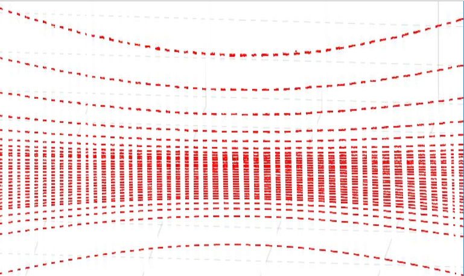
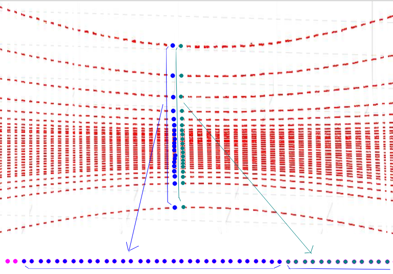

# 18 **点云格式与点布局**


## 18.1 概述

这里先回顾点及点云的定义，看看有哪些属性，再说明这些属性的确切含义。


## 18.2 点云格式

### 18.2.1 点

点的属性如下。这里列出的是`XYZIRT`类型，它包括了`XYZI`类型的所有属性。

```c++
struct PointXYZIRT
{
  float x;
  float y;
  float z;
  uint8_t intensity;
  uint16_t ring;
  double timestamp;
};
```

### 18.2.2 定义点云类型

点云的属性如下。它的成员`points`是一个点的`vector`。

```c++
template <typename T_Point>
class PointCloudT
{
public:
  typedef T_Point PointT;
  typedef std::vector<PointT> VectorT;

  uint32_t height = 0;    ///< Height of point cloud
  uint32_t width = 0;     ///< Width of point cloud
  bool is_dense = false;  ///< If is_dense is true, the point cloud does not contain NAN points
  double timestamp = 0.0; ///< Timestamp of point cloud
  uint32_t seq = 0;       ///< Sequence number of point cloud

  VectorT points;
};
```


## 18.3 点的ring

### 18.3.1 机械式雷达

机械式雷达的通道内部编号是按照激光扫描顺序排列的，但是这个扫描顺序并不是一直从下向上（或从上向下），所以按照这个编号的顺序，通道的垂直角不是递增（或递减）的。

`rs_driver`根据通道的垂直角，对它们从小到大（升序）重新编号。点的`ring`属性是这样重新排列后的编号。


### 18.3.2 MEMS雷达

MEMS雷达每轮扫描同时扫`5`个区域，得到`5`个点，这`5`个点有一样的时间戳。

点的`ring`是点所在区域的编号。


## 18.4 点的布局

### 18.4.1 机械式雷达

这里以RS32雷达为例。

雷达每轮扫描得到`32`个点，每个通道一个点。这`32`个点打包到一个`Block`，写入MSOP Packet。

当雷达马达旋转一圈时，就得到环形面上一个点集合。



`rs_driver`解析MSOP Packet时，按照`Block`的顺序解析。在点云的`points`数组中，每个`Block`的`32`个点连续保存为一组。

如果要顺序访问同一通道上的点，只需要每次跳过32个点就好了。

如前所述，在`Block`内，`32`个点的排列是按照扫描的顺序保存的，它们在`points`中排列也是这个顺序。


### 18.4.2 MEMS雷达

MEMS雷达每轮扫描同时扫`5`个区域，得到`5`个点，打包到一个`Block`，写入MSOP Packet。

`rs_driver`解析MSOP Packet时，按照`Block`的顺序解析，所以在点云的`points`数组中，每个Block的`5`个点连续保存为一组。


这里以M1为例，说明每个区域的点布局。

M1的每个区域`126`行 x `125`列，从上往下呈Z字型扫描。在点云的`points`数组中，点的排列也是这个顺序。


## 18.5 点的坐标系

`rs_driver`输出的点遵循右手坐标系。

如果想改变这一点，可以改变雷达解码器`Decoder`的实现代码，改变坐标(x,y,z)的映射关系。如下是M1 Decoder的例子。

```c++
//.../decoder/decoder_RSM1.hpp

    int pitch = ntohs(channel.pitch) - ANGLE_OFFSET;
    int yaw = ntohs(channel.yaw) - ANGLE_OFFSET;

    float x = distance * COS (pitch) * COS (yaw);
    float y = distance * COS (pitch) * SIN (yaw);
    float z = distance * SIN (pitch);
```


## 18.6 点的timestamp

机械式雷达（转速等于600圈/分钟时）和MEMS雷达扫描一帧的时间是100毫秒。点云中的点散布在这100毫秒的范围内。

如何想得到比点云时间戳更高精度的时间戳，请考虑使用`XYZIRT`点格式，它的`T`是点的时间戳。


## 18.7 点云的timestamp

点云的时间戳可以来自第一个点，也可以来自最后一点。


### 18.7.1 雷达的时间，还是主机的时间？

`rs_driver`有两种方式得到点云的时间戳。

+ 从MSOP Packet解析。这个时间是雷达根据自身的时间设置。一般需要对雷达进行PTP时间同步，以保证雷达的时间与PTP Master保持一致。
+ 调用操作系统的函数，得到`rs_driver`运行的这台主机的时间。这是`rs_driver`的默认配置。

`rs_driver`的选项`use_lidar_clock`可以改变这个配置。

```c++
struct RSDecoderParam  ///< LiDAR decoder parameter
{
  ...
  bool use_lidar_clock = false;  ///< true: use LiDAR clock as timestamp; false: use system clock as timestamp
  ...
}
```

### 18.7.2 取第一个点的时间，还是最后一个点的？

默认情况下，取最后一个点的时间。

`rs_driver`的选项`ts_first_point`可以改变这个配置。

```c++
struct RSDecoderParam  ///< LiDAR decoder parameter
{
  ...
  bool ts_first_point = false;   ///< true: time-stamp point cloud with the first point; false: with the last point;
  ...
}
```

### 18.7.3 UTC时间还是本地时间？

雷达写入MSOP Packet的时间是UTC时间。

`rs_driver`工程的`CMakeLists.txt`中的`ENABLE_STAMP_WITH_LOCAL`宏，可以根据本地的时区，将这个时间转换成本地时间。

```cmake
option(ENABLE_STAMP_WITH_LOCAL    "Enable stamp point cloud with local time" OFF)
```

