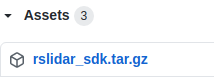

# 1 **rslidar_sdk**

 [中文介绍](README_CN.md) 


## 1 Introduction

**rslidar_sdk** is the Software Development Kit of the RoboSense Lidar based on Ubuntu. It contains:

+ The lidar driver core [rs_driver](https://github.com/RoboSense-LiDAR/rs_driver),
+ The ROS support, 
+ The ROS2 support,

To get point cloud through ROS/ROS2,  please just use this SDK. 

To integrate the Lidar driver into your own projects, please use the rs_driver.

### 1.1 LiDAR Supported

- RS-LiDAR-16
- RS-LiDAR-32
- RS-Bpearl
- RS-Helios
- RS-Helios-16P
- RS-Ruby-128
- RS-Ruby-80
- RS-Ruby-48
- RS-Ruby-Plus-128
- RS-Ruby-Plus-80
- RS-Ruby-Plus-48
- RS-LiDAR-M1
- RS-LiDAR-M2
- RS-LiDAR-E1

### 1.2 Point Type Supported

- XYZI - x, y, z, intensity
- XYZIRT - x, y, z, intensity, ring, timestamp


## 2 Download

### 2.1 Download via Git 

Download the rslidar_sdk as below. Since it contains the submodule rs_driver, please also use `git submodule` to download the submodule properly.


```sh
git clone https://github.com/RoboSense-LiDAR/rslidar_sdk.git
cd rslidar_sdk
git submodule init
git submodule update
```

### 2.2 Download directly

Instead of using Git, user can also access [rslidar_sdk_release](https://github.com/RoboSense-LiDAR/rslidar_sdk/releases) to download the latest version of rslidar_sdk. 

Please download the **rslidar_sdk.tar.gz** archive instead of Source code. The Source code zip file does not contain the submodule rs_driver, so it has to be downloaded manaully.



## 3 Dependencies

### 3.1 ROS

To run rslidar_sdk in the ROS environment, please install below libraries. 
+ Ubuntu 16.04 - ROS Kinetic desktop
+ Ubuntu 18.04 - ROS Melodic desktop
+ Ubuntu 20.04 - ROS Noetic desktop

For installation, please refer to http://wiki.ros.org.

**It's highly recommanded to install ros-distro-desktop-full**. If you do so, the corresponding libraries, such as PCL, will be installed at the same time. 

This brings a lot of convenience, since you don't have to handle version conflict.

### 3.2 ROS2

To use rslidar_sdk in the ROS2 environment, please install below libraries.
+ Ubuntu 16.04 - Not supported
+ Ubuntu 18.04 - ROS2 Eloquent desktop
+ Ubuntu 20.04 - ROS2 Galactic desktop
+ Ubuntu 22.04 - ROS2 Humble desktop

For installation, please refer to https://index.ros.org/doc/ros2/Installation/Eloquent/Linux-Install-Debians/

**Please do not install ROS and ROS2 on the same computer, to avoid possible conflict and manually install some libraries, such as Yaml.**

### 3.3 Yaml (Essential) 

version: >= v0.5.2

*If ros-distro-desktop-full is installed, this step can be skipped*

Installation:

```sh
sudo apt-get update
sudo apt-get install -y libyaml-cpp-dev
```

### 3.4 libpcap (Essential) 

version: >= v1.7.4

Installation:

```sh
sudo apt-get install -y  libpcap-dev
```


## 4 Compile & Run

Please compile and run the driver in three ways.

### 4.1 Compile directly

(1) On top of the file *CMakeLists.txt*，set the variable **COMPILE_METHOD** to **ORIGINAL**.

```cmake
#=======================================
# Compile setup (ORIGINAL,CATKIN,COLCON)
#=======================================
set(COMPILE_METHOD ORIGINAL)
```

(2) In ROS (unfortunately not ROS2), user can compile it directly. 

Please laucn ROS master node ```roscore``` in advance, and use ```rviz``` to visualize point cloud.

```sh
cd rslidar_sdk
mkdir build && cd build
cmake .. && make -j4
./rslidar_sdk_node
```

### 4.2 Compile with ROS catkin tools

(1) On top of the file *CMakeLists.txt*，set the variable **COMPILE_METHOD** to **CATKIN**.

```cmake
#=======================================
# Compile setup (ORIGINAL,CATKIN,COLCON)
#=======================================
set(COMPILE_METHOD CATKIN)
```

(2) Copy the file *package_ros1.xml*  to *package.xml* in the rslidar_sdk .

(3) Create a new workspace folder, and create a *src* folder in it. Then put the rslidar_sdk project into the *src* folder.

(4) Go back to the root of workspace, run the following commands to compile and run. (if using zsh, replace the 2nd command with *source devel/setup.zsh*).

```sh
catkin_make
source devel/setup.bash
roslaunch rslidar_sdk start.launch
```

### 4.3 Compile with ROS2 colcon

(1) On top of the file *CMakeLists.txt*，set the variable **COMPILE_METHOD** to **COLCON**.

```cmake
#=======================================
# Compile setup (ORIGINAL,CATKIN,COLCON)
#=======================================
set(COMPILE_METHOD COLCON)
```

(2) Copy the file *package_ros2.xml* to *package.xml* in the rslidar_sdk. 

(3) Create a new workspace folder, and create a *src* folder in it. Then put the rslidar_sdk project in the *src* folder.

(4) Download the packet definition project in ROS2 through [link](https://github.com/RoboSense-LiDAR/rslidar_msg), then put the project rslidar_msg in the *src* folder you just created.

(5) Go back to the root of workspace, run the following commands to compile and run. (if using zsh, replace the 2nd command with *source install/setup.zsh*).

```sh
colcon build
source install/setup.bash
ros2 launch rslidar_sdk start.py
```

Another version of start.py may be used, since it is different on different versios of ROS2. For example, elequent_start.py is used instead for ROS2 elequent.


## 5 Introduction to parameters

To change behaviors of rslidar_sdk, change its parameters. please read the following links for detail information.

[Intro to parameters](doc/intro/02_parameter_intro.md)

[Intro to hidden parameters](doc/intro/03_hiding_parameters_intro.md)


## 6 Quick start

Below are some quick guides to use rslidar_sdk. 

[Connect to online LiDAR and send point cloud through ROS](doc/howto/06_how_to_decode_online_lidar.md)

[Decode PCAP file and send point cloud through ROS](doc/howto/08_how_to_decode_pcap_file.md)

[Change Point Type](doc/howto/05_how_to_change_point_type.md) 


## 7 Advanced Topics

[Online Lidar - Advanced topics](doc/howto/07_online_lidar_advanced_topics.md) 

[PCAP file - Advanced topics](doc/howto/09_pcap_file_advanced_topics.md) 

[Coordinate Transformation](doc/howto/10_how_to_use_coordinate_transformation.md) 

[Record rosbag & Replay it](doc/howto/11_how_to_record_replay_packet_rosbag.md)


