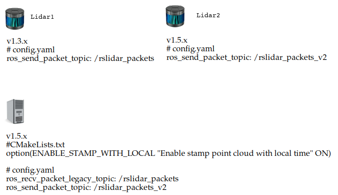

# 4 如何与rslidar_sdk_node v1.3.x共存？


## 4.1 问题描述

`rslidar_sdk_node` `v1.3.x`和`v1.5.x`的配置方式不同。除了如下两个可能有交互的场景外， 两者各自运行，没有关系。

+ `rslidar_sdk_node`在主题`/rslidar_points`下发布点云，rosbag订阅并录制到一个cloud rosbag文件。后面rosbag又会回放这个文件，发布到`/rslidar_points`，`rslidar_sdk_node`订阅并播放它。

+ `rslidar_sdk_node`在主题`/rslidar_packets`下发布原始的`MSOP/DIFOP Packet`，rosbag订阅并录制到一个packet rosbag文件。后面rosbag又会回放这个文件到`/rslidar_packets`，`rslidar_sdk_node`订阅并播放它。

第一种场景下，`v1.3.x`和`v1.5.x`发布的点云格式相同，所以`v1.3.x`录制的点云，在`v1.5.x`上播放是没有问题的。

第二种场景下，`v1.3.x`将MSOP/DIFOP Packet分别发布在两个主题`/rslidar_packets`和`/rslidar_packets_difop`下，而`v1.5.x`将MSOP/DIFOP Packet发布在单个主题`/rslidar_packets`下，而且`v1.3.x`和`v1.5.x`的消息定义也不同，所以`v1.3.x`录制的packet rosbag在`v1.5.x`上不能播放。ROS会检测出这两种格式的MD5 Checksum不匹配并报错。

本文说明如何配置`rslidar_sdk` `v1.5.x`，让它在第二种场景下可以同时播放`v1.3.x`和`v1.5.x`的packet rosbag。


## 4.2 场景说明

场景说明如下。
+ 2个雷达，`Lidar1`是运行`v1.3.x`的雷达，`Lidar2`是运行`v1.5.x`的雷达。
+ 1台主机，用于分析`Lidar1`和`Lidar2`的数据。



## 4.3 步骤


### 4.3.1 配置 v1.3.x 雷达

使用`v1.3.x` `rslidar_sdk_node`录制pacekt rosbag。

按照默认的`config.yaml`的配置，消息发布到主题`/rslidar_packets`和`/rslidar_packets_difop`下。

```
common:
  msg_source: 1                                         #0: not use Lidar
                                                        #1: packet message comes from online Lidar
                                                        #2: packet message comes from ROS or ROS2
                                                        #3: packet message comes from Pcap file
                                                        #4: packet message comes from Protobuf-UDP
                                                        #5: point cloud comes from Protobuf-UDP
  send_packet_ros: true                                 #true: Send packets through ROS or ROS2(Used to record packet)
  send_point_cloud_ros: true                            #true: Send point cloud through ROS or ROS2
lidar:
  - driver:
      lidar_type: RSM1                                  #LiDAR type - RS16, RS32, RSBP, RSHELIOS, RS128, RS80, RSM1
      msop_port: 6699                                   #Msop port of lidar
      difop_port: 7788                                  #Difop port of lidar
    ros:
      ros_send_packet_topic: /rslidar_packets           #Topic used to send lidar packets through ROS
      ros_send_point_cloud_topic: /rslidar_points       #Topic used to send point cloud through ROS
```

### 4.3.2 配置 v1.5.x 雷达

使用`v1.5.6` `rslidar_sdk_node`录制packet rosbag。

为了与`v1.3.2`的消息区别，将消息输出到主题`/rslidar_packets_v2`下。

```
common:
  msg_source: 1                                         #0: not use Lidar
                                                        #1: packet message comes from online Lidar
                                                        #2: packet message comes from ROS or ROS2
                                                        #3: packet message comes from Pcap file
  send_packet_ros: true                                 #true: Send packets through ROS or ROS2(Used to record packet)
  send_point_cloud_ros: true                            #true: Send point cloud through ROS or ROS2
lidar:
  - driver:
      lidar_type: RSM1                                  #LiDAR type - RS16, RS32, RSBP, RSHELIOS, RS128, RS80, RS48, RSM1
      msop_port: 6699                                   #Msop port of lidar
      difop_port: 7788                                  #Difop port of lidar
    ros:
      ros_send_packet_topic: /rslidar_packets_v2        #Topic used to send lidar packets through ROS
      ros_send_point_cloud_topic: /rslidar_points       #Topic used to send point cloud through ROS
```


### 4.3.3 配置 v1.5.x 主机

+ 打开CMake编译选项`ENABLE_SOURCE_PACKET_LEGACY=ON`，编译`rslidar_sdk`。

```
# CMakeLists.txt

option(ENABLE_SOURCE_PACKET_LEGACY "Enable ROS Source of MSOP/DIFOP Packet v1.3.x" ON)
```

+ 在`config.yaml`中，增加一个配置项`ros_recv_packet_legacy_topic`: `/rslidar_packets`。这样`rslidar_sdk_node`将同时订阅两个主题。
  + 订阅`/rslidar_packets`和`/rslidar_packets_difop`，读入`v1.3.x`的消息
  + 订阅`/rslidar_packets_v2`，读入`v1.5.x`的消息

```
common:
  msg_source: 1                                         #0: not use Lidar
                                                        #1: packet message comes from online Lidar
                                                        #2: packet message comes from ROS or ROS2
                                                        #3: packet message comes from Pcap file
  send_packet_ros: false                                #true: Send packets through ROS or ROS2(Used to record packet)
  send_point_cloud_ros: true                            #true: Send point cloud through ROS or ROS2
lidar:
  - driver:
      lidar_type: RSM1                                  #LiDAR type - RS16, RS32, RSBP, RSHELIOS, RS128, RS80, RS48, RSM1
      msop_port: 6699                                   #Msop port of lidar
      difop_port: 7788                                  #Difop port of lidar
    ros:
      ros_recv_packet_legacy_topic: /rslidar_packets    #Topic used to receive lidar packets from ROS
      ros_recv_packet_topic: /rslidar_packets_v2        #Topic used to receive lidar packets from ROS
      ros_send_point_cloud_topic: /rslidar_points       #Topic used to send point cloud through ROS
```

