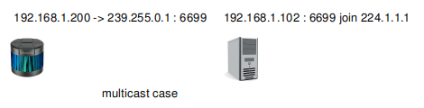
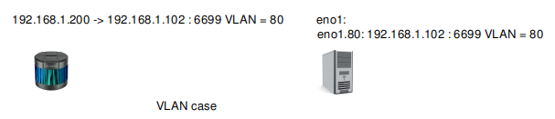

# 7 Online LiDAR - Advanced Topics


## 7.1 Introduction

The RoboSense LiDAR may work 

+ in unicast/multicast/broadcast mode, 
+ with VLAN layer 
+ with user layers. 
+ Also rslidar_sdk supports multi-LiDARs.

This document illustrates how to configure rslidar_sdk in each case.

Before reading this document, please be sure that you have read:
+ LiDAR user-guide 
+ [Intro to parameters](../intro/02_parameter_intro.md) 
+ [Decode online LiDAR](./06_how_to_decode_online_lidar.md)


## 7.2 Unicast, Multicast and Broadcast

### 7.2.1 Broadcast mode

The Lidar sends MSOP/DIFOP packets to the host machine (rslidar_sdk runs on it). For simplicity, the DIFOP port is ommited here.
+ The Lidar sends to `255.255.255.255` : `6699`, and the host binds to port `6699`.


Below is how to configure `config.yaml`.

```yaml
common:
  msg_source: 1                                       
  send_point_cloud_ros: true                            

lidar:
  - driver:
      lidar_type: RS32           
      msop_port: 6699             
      difop_port: 7788            
    ros:
      ros_frame_id: rslidar           
      ros_send_point_cloud_topic: /rslidar_points     
```

The `common` part and the `lidar-ros` part is listed here. They will be ommited in the following examples, since they are not changed.

### 7.2.2 Unicast mode

To reduce the network load, the Lidar is suggested to work in unicast mode.
+ The Lidar sends to `192.168.1.102` : `6699`, and the host binds to port `6699`.


Below is how to configure `config.yaml`. In fact, it same with the broadcast mode.

```yaml
lidar:
  - driver:
      lidar_type: RS32           
      msop_port: 6699             
      difop_port: 7788            
```

### 7.2.3 Multicast mode

The Lidar may also works in multicast mode.
+ The lidar sends to `224.1.1.1`:`6699` 
+ The host binds to port `6699`. And it makes local NIC (Network Interface Card) join the multicast group `224.1.1.1`. The local NIC's IP is `192.168.1.102`.


Below is how to configure `config.yaml`.

```yaml
lidar:
  - driver:
      lidar_type: RS32           
      msop_port: 6699             
      difop_port: 7788
      group_address: 224.1.1.1
      host_address: 192.168.1.102
```


## 7.3 Multiple LiDARs

### 7.3.1 Different remote ports

If you have two or more Lidars, it is suggested to set different remote ports.
+ First Lidar sends to `192.168.1.102`:`6699`, and the first driver instance binds to `6699`.
+ Second Lidar sends to `192.168.1.102`:`5599`, and the second driver instance binds to `5599`.


Below is how to configure `config.yaml`.

```yaml
lidar:
  - driver:
      lidar_type: RS32           
      msop_port: 6699             
      difop_port: 7788
  - driver:
      lidar_type: RS32           
      msop_port: 5599
      difop_port: 6688
```

### 7.3.2 Different remote IPs

An alternate way is to set different remote IPs. 
+ The host has two NICs: `192.168.1.102` and `192.168.1.103`.
+ First Lidar sends to `192.168.1.102`:`6699`, and the first driver instance binds to `192.168.1.102:6699`.
+ Second Lidar sends to `192.168.1.103`:`6699`, and the second driver instance binds to `192.168.1.103:6699`.


Below is how to configure `config.yaml`.

```yaml
lidar:
  - driver:
      lidar_type: RS32           
      msop_port: 6699             
      difop_port: 7788
      host_address: 192.168.1.102
  - driver:
      lidar_type: RS32           
      msop_port: 6699
      difop_port: 7788
      host_address: 192.168.1.103
```


## 7.4 VLAN

In some user cases, The Lidar may work on VLAN.  Its packets have a VLAN layer.


The driver cannot parse this packet. Instead, it depends on a virtual NIC to strip the VLAN layer.

Below is an example.
+ The Lidar works on VLAN `80`. It sends packets to `192.168.1.102` : `6699`. The packet has a VLAN layer.
+ Suppose there is a physical NIC `eno1` on the host.  It receives packets with VLAN layer.


To strip the VLAN layer, create a virtual NIC `eno1.80` on `eno1`, and assign IP `192.168.1.102` to it.

```
sudo apt-get install vlan -y
sudo modprobe 8021q

sudo vconfig add eno1 80
sudo ifconfig eno1.80 192.168.1.102 up
```

Now the driver may take `eno1.80` as a general NIC, and receives packets without VLAN layer.

```yaml
lidar:
  - driver:
      lidar_type: RS32           
      msop_port: 6699             
      difop_port: 7788            
```


## 7.5 User Layer, Tail Layer 

In some user cases, User may add extra layers before or after the MSOP/DIFOP packet.
+ USER_LAYER is before the packet and TAIL_LAYER is after it.


These extra layers are parts of UDP data. The driver can strip them. 

To strip them, just give their lengths in bytes. 

In the following example, USER_LAYER is 8 bytes, and TAIL_LAYER is 4 bytes.

```yaml
lidar:
  - driver:
      lidar_type: RS32           
      msop_port: 6699             
      difop_port: 7788
      user_layer_bytes: 8
      tail_layer_bytes: 4      
```

