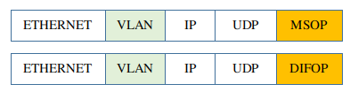

# 9 **在线雷达 - 高级主题**

## 9.1 概述

根据雷达的配置，它可能工作在单播/组播/广播模式下，或者在VLAN环境下，也可能加入用户自己的层。

+ 本文说明了在每种场景下如何设置`rs_driver`的网络配置选项。

​		设置网络配置选项的前提，是先确定雷达工作在哪种场景。这一点，请参考[根据PCAP文件确定网络配置选项](./12_how_to_configure_by_pcap_file_CN.md)

​		为了清晰，本文所有的图都只列出了MSOP端口，DIFOP端口的配置与MSOP类似。

+ 在所有配置选项都正确的前提下，一些系统设置不正确，也可能导致MSOP/DIFOP Packet无法接收。本文也对这些环境因素作了说明。


## 9.2 单播、组播、广播

### 9.2.1 广播模式

广播模式的配置最简单。

下面的图中，雷达发送MSOP/DIFOP Packet到主机，`rs_driver`运行在主机上。
+ 雷达发送到 `255.255.255.255` : `6699`, rs_driver绑定到端口`6699`.


如下代码配置RSDriverParam。

```c++
RSDriverParam param;                              ///< Create a parameter object
param.input_type = InputType::ONLINE_LIDAR;       ///< get packet from online lidar
param.input_param.msop_port = 6699;               ///< Set the lidar msop port number, the default is 6699
param.input_param.difop_port = 7788;              ///< Set the lidar difop port number, the default is 7788
param.lidar_type = LidarType::RS32;               ///< Set the lidar type.
```

### 9.2.2 单播模式

为减少网络流量，推荐使用单播模式。

如下的例子中，

+ 雷达发送到`192.168.1.102` : `6699`, `rs_driver`绑定到端口`6699`。


如下代码配置RSDriverParam。它与广播模式的配置完全相同。

```c++
RSDriverParam param;                              ///< Create a parameter object
param.input_type = InputType::ONLINE_LIDAR;       ///< get packet from online lidar
param.input_param.msop_port = 6699;               ///< Set the lidar msop port number, the default is 6699
param.input_param.difop_port = 7788;              ///< Set the lidar difop port number, the default is 7788
param.lidar_type = LidarType::RS32;               ///< Set the lidar type.
```


### 9.2.3 组播模式

雷达也可以工作在组播模式。

如下的例子中，

+ 雷达发送到`224.1.1.1`:`6699` 
+ `rs_driver`绑定到端口`6699`。 `rs_driver`让本地网卡加入组播组`224.1.1.1`. 这个网卡的地址是`192.168.1.102`。


如下代码配置RSDriverParam。

```c++
RSDriverParam param;                              ///< Create a parameter object
param.input_type = InputType::ONLINE_LIDAR;       ///< get packet from online lidar
param.input_param.group_address = "224.1.1.1";    ///< Set the multicast group address.
param.input_param.host_address = "192.168.1.102"; ///< Set the host address.
param.input_param.msop_port = 6699;               ///< Set the lidar msop port number, the default is 6699
param.input_param.difop_port = 7788;              ///< Set the lidar difop port number, the default is 7788
param.lidar_type = LidarType::RS32;               ///< Set the lidar type. Make sure this type is correct 
```


## 9.3 多雷达的情况

### 9.3.1 雷达目的端口不同

如果要接入两个雷达，推荐给它们配置不同的目的端口。

如下的例子中，

+ 第一个雷达发送到`192.168.1.102`:`6699`，rs_driver的第一个实例绑定到端口`6699`。
+ 第二个雷达发送到`192.168.1.102`:`5599`，rs_driver的第二个实例绑定到端口`5599`。


```c++
RSDriverParam param1;                              ///< Create a parameter object for Lidar 192.168.1.200
param1.input_type = InputType::ONLINE_LIDAR;       ///< get packet from online lidar
param1.input_param.msop_port = 6699;               ///< Set the lidar msop port number
param1.input_param.difop_port = 7788;              ///< Set the lidar difop port number
param1.lidar_type = LidarType::RS32;               ///< Set the lidar type.

RSDriverParam param2;                              ///< Create a parameter object for Lidar 192.168.1.201
param2.input_type = InputType::ONLINE_LIDAR;       ///< get packet from online lidar
param2.input_param.msop_port = 5599;               ///< Set the lidar msop port number
param2.input_param.difop_port = 6688;              ///< Set the lidar difop port number
param2.lidar_type = LidarType::RS32;               ///< Set the lidar type.
```

### 9.3.2 雷达的目的IP不同

虽然不推荐，也可以给接入的两个雷达配置不同的目的IP。
+ 主机有两个网卡，地址分别是`192.168.1.102` 和`192.168.1.103`。
+ 第一个雷达发送到`192.168.1.102`:`6699`，第一个rs_driver实例绑定到`192.168.1.102:6699`。
+ 第二个雷达发送到`192.168.1.103`:`6699`，第二个rs_driver实例绑定到`192.168.1.103:6699`。


如下代码分别配置两个`rs_driver`实例的RSDriverParam。

```c++
RSDriverParam param1;                              ///< Create a parameter object for Lidar 192.168.1.200
param1.input_type = InputType::ONLINE_LIDAR;       ///< get packet from online lidar
param1.input_param.host_address = "192.168.1.102"; ///< Set the host address.
param1.input_param.msop_port = 6699;               ///< Set the lidar msop port number
param1.input_param.difop_port = 7788;              ///< Set the lidar difop port number
param1.lidar_type = LidarType::RS32;               ///< Set the lidar type.

RSDriverParam param2;                              ///< Create a parameter object for Lidar 192.168.1.201
param2.input_type = InputType::ONLINE_LIDAR;       ///< get packet from online lidar
param2.input_param.host_address = "192.168.1.103"; ///< Set the host address.
param2.input_param.msop_port = 6699;               ///< Set the lidar msop port number
param2.input_param.difop_port = 7788;              ///< Set the lidar difop port number
param2.lidar_type = LidarType::RS32;               ///< Set the lidar type.
```


## 9.4 VLAN

有些场景下，雷达工作在VLAN环境下。这时MSOP/DIFOP包带VLAN层，如下图。


`rs_driver`工作在应用层，接触不到VLAN层。这时需要用户手工创建一个虚拟网卡来剥除VLAN层。

如下是一个例子。
+ 给雷达分配的VLAN ID是`80`。雷达发送到`192.168.1.102` : `6699`。 发送的包带VLAN层。
+ 主机上装的物理网卡`eno1`也在VLAN ID `80`上，它接收雷达发出的带VLAN层的包。


要剥除VLAN层，需要用户手工创建一个虚拟网卡。如下的命令在物理网卡`eno1`上创建虚拟网卡`eno1.80`，并给它指定IP地址`192.168.1.102` 。

```shell
sudo apt-get install vlan -y
sudo modprobe 8021q

sudo vconfig add eno1 80
sudo ifconfig eno1.80 192.168.1.102 up
```

注意这里不需要设置`eno1`的IP地址，保持`0.0.0.0`就好了。尤其不要设置成与`eno1.80`一样，这样反而可能导致`eno1.80`无法接收。

现在`rs_driver`就可以从`eno1.80`网卡上接收MSOP/DIFOP Packet了，这些包不带VLAN层。


如下代码配置RSDriverParam。

```c++
RSDriverParam param;                              ///< Create a parameter object
param.input_type = InputType::ONLINE_LIDAR;       ///< get packet from online lidar
param.input_param.msop_port = 6699;               ///< Set the lidar msop port number, the default is 6699
param.input_param.difop_port = 7788;              ///< Set the lidar difop port number, the default is 7788
param.lidar_type = LidarType::RS32;               ///< Set the lidar type.
```

另外可能需要说明的一点是：

连接在线雷达时，不需要、不关心选项`RSInputParam.use_vlan`的值。这个选项是为解析PCAP文件准备的。


## 9.5 User Layer, Tail Layer 

某些场景下，用户可能在MSOP/DIFOP数据前后加入自己的层。
+ `USER_LAYER` 在MSOP/DIFOP数据之前，`TAIL_LAYER`在MSOP/DIFOP数据之后。


这些层是UDP数据的一部分，所以`rs_driver`可以自己剥除他们。只需要告诉`rs_driver`每个层的字节数就可以。

如下的例子中，指定`USER_LAYER`为8字节，`TAIL_LAYER`为4字节。

```c++
RSDriverParam param;                              ///< Create a parameter object
param.input_type = InputType::ONLINE_LIDAR;       ///< get packet from online lidar
param.input_param.msop_port = 6699;               ///< Set the lidar msop port number, the default is 6699
param.input_param.difop_port = 7788;              ///< Set the lidar difop port number, the default is 7788
param.input_param.user_layer_bytes = 8;           ///< user layer bytes. there is no user layer if it is 0
param.input_param.tail_layer_bytes = 4;           ///< tail layer bytes. there is no user layer if it is 0
param.lidar_type = LidarType::RS32;               ///< Set the lidar type.
```


## 9.6 其他可能影响接收的系统设置

Wireshark等抓包工具能抓到包，`rs_driver`的所有的网络配置选项也是正确的，但它仍有可能收不到MSOP/DIFOP Packet。

如下是一些可能的原因。

+ 雷达工作在VLAN模式，物理网卡（而不是虚拟网卡）配置了雷达发送MSOP/DIFOP Packet的目标地址。
+ 雷达工作在广播模式，但是主机的掩码不正确，导致主机不认为雷达发出的包是广播包。

  举个例子。假设主机的IP地址是`192.168.1.102`/`255.255.0.0`，则广播地址就是`192.168.255.255`。
  如果雷达的目的地址是`192.168.1.255`，那它发出的包，就不是广播包，主机会丢掉这些包。

+ 防火墙可能挡住了MSOP/DIFOP Packet。

  在Ubuntu上，可以用`iptables`工具查看防火墙设置。

  ```shell
  sudo iptables -L # list all rules
  suod iptalbes --flush # clear all rules
  ```

+ `rs_driver`的其他实例，或者其他程序（如RSView），已经先绑定了相应的的端口。


