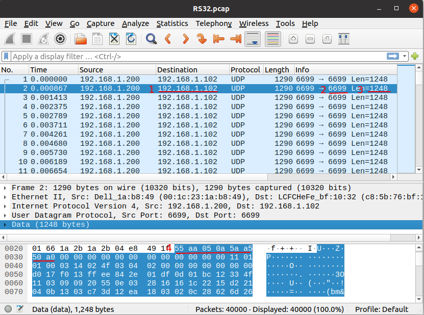

#  12 **根据PCAP文件确定`rs_driver`的网络配置选项**

## 12.1 概述

通过分析PCAP文件中的MSOP/DIFOP Packet格式，可以确定`rs_driver`的网络选项，并显示点云。

这里使用第三方工具WireShark分析PCAP文件。

关于如何使用第三方工具录制PCAP文件，请阅读[如何录制PCAP文件](./13_how_to_capture_pcap_file_CN.md)

## 12.2 MSOP/DIFOP格式

### 12.2.1 协议分层

MSOP/DIFOP Packet基于UDP协议，包括如下层。

+ Ethernet
+ VLAN（可选） 
+ IP 
+ UDP
+ 用户自定义层（前缀部分，可选） 
+ MSOP/DIFOP Packet（真正的数据部分）
+ 尾部层（后缀部分，可选）

`VLAN`层是可选的。有没有`VLAN`层取决于两点：

+ 雷达是不是运行在VLAN环境下
+ 是在物理网卡还是在虚拟网卡上抓的包

`用户自定义层`是客户为了适配自己的运行环境加的层，长度客户自己确定。

`尾部层`也是客户环境带来的。其中一个常见的例子是：智能汽车的`域控制器`可能会在MSOP/DIFOP Packet后面加上自己的4个字节。

### 12.2.2 Packet ID

WireShark软件可以区分`Ethernet`、`IP`、`UDP`这些层。

要区分MSOP/DIFOP Packet与`用户自定义层`，需要先定位MSOP/DIFOP Packet的`ID`，也就是它们的`标志字节`。

要区分MSOP/DIFOP Packet与`尾部层`，还需要知道MSOP/DIFOP Packet的长度（这个长度不包括`用户自定义层`和`尾部层`）。

各雷达的MSOP/DIFOP Packet的`ID`和长度都是确定的，如下面的表。

| 雷达类型                           |Packet类型 |  标志字节                   |Packet长度 |
| ----                               | ----     | ----                        | ----    |
| RS16/RS32/RSBP                     |  MSOP    |  55 aa 05 0a 5a a5 50 a0    |  1248   |
|                                    |  DIFOP   |  a5 ff 00 5a 11 11 55 55    |  1248   |
| RS128/RS80/RS48/RSP128/RSP80/RSP48/RSHELIOS/RSHELIOS_16P | MSOP |55 aa 05 5a|  1248   |
|                                    |  DIFOP   |  a5 ff 00 5a 11 11 55 55    |  1248   |
| RSM1/RSM2/RSE1                     |  MSOP    |  55 aa 5a a5                |  1210   |
|                                    |  DIFOP   |  a5 ff 00 5a 11 11 55 55    |  256    |

这里还可以看到，MSOP Packet的标志字节与DIFOP Packet的不同，所以在PCAP文件中，可以通过它确定哪个Packet是`MSOP`，哪个是`DIFOP`。

## 12.3 一般步骤

如下是查看PCAP文件的一般步骤。
+ 确定MSOP/DIFOP Packet的`目的地址`。在RoboSense雷达的设计中，MSOP和DIFOP的`目的地址`总是相同的。

​		需要明确的是，这是个什么地址？`广播地址`/`组播地址`/`单播地址`？如果是`组播地址`，则需要同时指定`group_address`和`host_address`。

+ MSOP/DIFOP Packet的`目的端口`。

​		可以通过设置过滤条件来显示某种类型的Packet。

​		也可以排除某种类型的Packet。

​		需要分别设置`msop_port`和`difop_port`。

+ 是否有`VLAN层`？ 如果有`VLAN层`，则：
  + 连接在线雷达时，需手工创建虚拟网卡 
  + 解析PCAP文件时，需指定`use_vlan`选项 

+ 通过MSOP/DIFOP Packet的`标志字节`，确定是否有`用户自定义层`。如果有，是多长？

​		如果有`用户自定义层`，需指定`user_layer_bytes`。

+ 通过MSOP/DIFOP Packet的长度， 确定是否有`尾部层`。如果有，是多长？

​		如果有`尾部层`，需指定`tail_layer_bytes`。

## 12.4 举例

### 12.4.1 RS32雷达 - MSOP Packet

如下图，是RS32雷达MSOP Packet的例子。
+ `目的地址`为`192.168.1.102`（红色1标注）。
+ 目的端口为`6699` （红色2标注） 
+ MSOP Packet的包长为`1248`（红色3标注）
+ RS32雷达的MSOP Packet的标志字节是`55 aa 05 0a 5a a5 50 a0`，它就在UDP数据的一开始（红色4标注），所以这里没有`用户自定义层`。

### 12.4.2 RS32雷达 - DIFOP Packet

如下图，是RS32雷达DIFOP Packet的例子。
+ 目的地址为`192.168.1.102`（红色1标注）
+ 目的端口为`7788`（红色2标注）
+ MSOP Packet的包长为`1248`（红色3标注）
+ DIFOP Packet的ID是`a5 ff 00 5a 11 11 55 55`，它在UDP数据部分的一开始，所以这里没有`用户自定义层`（红色4标注）。

### 12.4.3 有VLAN的情况

下图是有`VLAN层`的情况。这是一个RSM1雷达的MSOP包。

`VLAN层`在`Ethernet层`与`IP层`之间。这个`VLAN`层的`vlan id`为`69`。

### 12.4.4 有用户自定义层的情况

下图是有`用户自定义层`的情况。这是一个RSM1雷达的MSOP Packet。

MSOP Packet的标志字节是`55 aa 5a a5`。可以看到在标志字节之前还有`16`字节数据，这就是`用户自定义层`。

### 12.4.5 有尾部层的情况

下图是有用户尾部层的情况。这是一个RSM1雷达的MSOP Packet。
MSOP Packet的长度是`1210`字节，加上前面各个层的头`14 + 20 + 8 = 42`个字节，应该是`1252`个字节，但实际上WireShark抓到了`1256`个字节。多的`4`个字节附加在MSOP Packet尾部（图中的`c9 77 8e c3`），这个就是`尾部层`。

### 12.4.6 不支持的情况

下图是不支持的格式。`Linux cooked capture`一般是在抓包时指定了任意网卡，如`tcpdump -i any`。

这样抓的包不是`Ethernet`格式，不符合`rs_driver`的要求。

