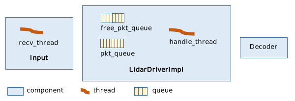

# 3 **线程模型与接口设计**

## 3.1 概述

这个章节的本意是说明`rs_driver`的接口设计，而不是描述它的线程模型。

要求使用者了解`rs_driver`的内存运行机制，至少理论上是不应该的。但这里还是这么做了。

坚持这样做的原因是：

+ 使用者实现的回调函数运行在`rs_driver`的线程中，设计不当可能导致`rs_driver`丢包
+ `rs_driver`希望使用者自己管理点云实例，以避免点云的复制，反复分配和释放。这一点与它对MSOP/DIFOP Packet的处理类似。

所以先讲清楚线程模型，能帮助使用者更好地了解接口背后的设计考虑。

## 3.2 组件与线程

`rs_driver`主要由三部分组成： `Input`、`Decoder`、`LidarDriverImpl`。

+ `Input`部分负责从Socket、PCAP文件等数据源，获取MSOP/DIFOP Packet。`Input`的类一般有自己的接收线程`recv_thread`。
+ `Decoder`部分负责解析MSOP/DIFOP Packet，得到点云。`Decoder`部分没有自己的线程，它运行在`LiarDriverImpl`的Packet处理线程`handle_thread`中。
+ `LidarDrvierImpl`部分将`Input`和`Decoder`组合到一起。它从`Input`得到Packet，根据Packet的类型将它派发到`Decoder`。得到点云后，通过用户的回调函数传递给用户。

这里有两点值得说明：

+ `LidarDriverImpl`管理一个空闲MSOP/DIFOP Packet的队列`free_pkt_queue`，和一个填充了的Packet的队列`pkt_queue`。`Input`接收前从`free_pkt_queue`得到空闲的Packet实例，接收后将填充好的Packet保存到`pkt_queue`，这两者都通过`LidarDriverImpl`的两个回调函数完成。
+ `LidarDriverImpl`的回调函数实际上运行在`Input`的线程`recv_thread`中，它们只是简单从队列中取出Packet实例，或将Packet实例放入队列。这是简单的工作，不会拖慢`recv_thread`的运行。

将Packet队列的设计想法平移到点云队列，就得到`rs_driver`的接口设计了。

+ 点云实例由调用者的代码自己管理，`rs_driver`只要求两个回调函数，一个得到空闲的点云实例，一个返回填充好的点云。调用者的代码可以借鉴Packet队列的做法，管理两个点云队列，但这点并不强制要求。
+ 调用者实现的两个回调函数，运行在rs_driver的线程`handle_thread`中。这个线程负责解析MSOP/DIFOP Packet，如果不能及时处理它们，`pkt_queue`就会溢出，`rs_driver`除了报告`ERRCODE_PKTBUFOVERFLOW`之外，还会丢掉处理不了的Packet。所以使用者的回调函数不能做任何太耗时的事情。

## 3.3 接口设计

这样`rs_driver`接口设计的目标就清楚了。
+ 避免点云的复制、避免点云的反复分配和释放
+ 让点云的构建（填充）与点云的处理并行，两者不要互相干扰

如下图是设想的`rs_driver`与调用者之间交互的方式。

图中略去了`rs_driver`的大部分实现细节，只留下MSOP/DIFOP Packet的处理线程`handle_thread`。它同时也是点云的构建线程，这里以点云为说明对象，所以重命名为`construct_thread`。

`rs_driver`运行在线程`construct_thread`中。它

+ 从调用者得到空闲的点云实例。调用者从一个空闲的点云队列`free_point_cloud_queue`得到这个实例。如果队列为空，则创建一个新的。
+ 解析MSOP/DIFOP Packet，构建（填充）点云实例
+ 将填充好的点云返还给调用者
+ 调用者将这个实例转移到另一个点云队列`stuffed_point_cloud_queue`，等待处理。

调用者的点云处理代码，运行在自己的线程`process_thread`中。它
+ 从待处理点云队列`stuffed_point_cloud_queue`，取出一个点云实例。
+ 处理这个点云实例
+ 处理后，将它放回空闲队列`free_point_cloud_queue`，等待`rs_driver`再次使用。

