# **rs_driver v1.5.9 源代码解析**


## 1 基本概念

### 1.1 机械式雷达、MEMS雷达

rs_driver支持RoboSense的两种雷达：
+ 机械式雷达。如RS16/RS32/RSBP/RSHELIOS/RS80/RS128。机械式雷达有控制激光发射角度的旋转部件，有360°扫描视场。
+ MEMS雷达。如RSM1。MEMS雷达是单轴、谐振式的MEMS扫描镜，其水平扫描角度可达120°。

### 1.2 通道 Channel

对于机械式雷达，通道指的是垂直方向上扫描的点数，每个通道上的点连成一条线。比如，RS16是16线雷达，也就是16个通道； RSBP是32线雷达，RS128是128线雷达。

MEMS雷达的通道与机械式雷达不同，它的每个通道可能对应一块区域，比如一个矩形区域。

### 1.3 MSOP/DIFOP

RoboSense雷达与电脑主机的通信协议有三种。
+ MSOP (Main data Stream Ouput Protocol)。 激光雷达将扫描出来的距离、角度、反射率等信息封装成MSOP Packet，输出给电脑主机。
+ DIFOP (Device Information Output Protocol)。激光雷达将自身的配置信息，以及当前的状态封装成DIFOP Packet，输出给电脑主机。
+ UCWP (User Configuration Write Protocol)。用户可以修改激光雷达的某些配置参数。

rs_driver处理前两类协议的包，也就是MSOP Packet和DIFOP Packet。

一般来说，激光雷达与电脑主机通过以太网连接，使用UDP协议。MSOP/DIFOP的格式，不同的雷达可能有较大差异。

### 1.4 点云帧

+ 机械式雷达持续旋转，输出点。扫描一圈360°得到的所有点，构成一帧点云。
  + 使用者可以指定一个角度，rs_driver按照这个角度，分割MSOP Pacekt序列得到点云。

+ 对于MEMS雷达，点云在MSOP Packet序列中的开始和结束位置，由雷达自己确定。
  + 一帧点云包含固定数目（比如N）的MSOP Packet。雷达对MSOP Packet从 1 到 N 编号，并一直循环。


## 2 rs_driver的组件

rs_driver主要由三部分组成： Input、Decoder、LidarDriverImpl。


+ Input部分负责从Socket/PCAP文件等数据源，获取MSOP/DIFOP Packet。Input的类一般有自己的接收线程`recv_thread_`。
+ Decoder部分负责解析MSOP/DIFOP Packet，得到点云。Decoder部分没有自己的线程，它运行在LiarDriverImpl的Packet处理线程`handle_thread_`中。
+ LidarDrvierImpl部分将Input和Decoder组合到一起。它从Input得到Packet，根据Packet的类型将它派发到Decoder。得到点云后，通过用户的回调函数传递给用户。
  + LidarDriverImpl提供Packet队列。Input收到MSOP/DIFOP Packet后，调用LidarDriverImpl的回调函数。回调函数将它保存到Packet队列。
  + LidarDriverImpl提供Packet处理线程`handle_thread_`。在这个线程中，将MSOP Packet和DIFOP Packet分别派发给Decoder相应的处理函数。
  + Decoder解析完一帧点云时，通知LidarDriverImpl。后者再将点云传递给用户。


## 3 Packet接收

Input部分负责接收MSOP/DIFOP Packet，包括：
+ Input，
+ Input的派生类，如InputSock、InputPcap、InputRaw
+ Input的工厂类 InputFactory

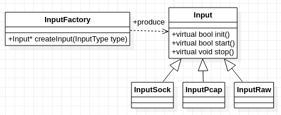

### 3.1 Input

Input定义接收MSOP/DIFOP Packet的接口。
+ 成员`input_param_`是用户配置参数RSInputParam，其中包括从哪个port接收Packet等信息。
+ Input自己不分配接收Packet的缓存。
  + Input的使用者调用Input::regCallback()，提供两个回调函数cb_get_pkt和cb_put_pkt， 它们分别保存在成员变量`cb_get_pkt_`和`cb_put_pkt_`中。
  + Input的派生类调用`cb_get_pkt_`可以得到空闲的缓存；在缓存中填充好Packet后，可以调用`cb_put_pkt_`将它返回。

+ Input有自己的线程`recv_thread_`。
  + Input的派生类启动这个线程读取Packet。


### 3.2 InputSock

InputSock类从UDP Socket接收MSOP/DIFOP Packet。雷达将MSOP/DIFOP Packet发送到这个Socket。

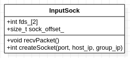

+ 一般情况下，雷达将MSOP/DIFOP Packet发送到不同的目的Port，所以InputSock创建两个Socket来分别接收它们。
  + 成员变量`fds_[2]`保存这两个Socket的描述符。`fds_[0]`是MSOP socket, `fds_[1]`是DIFOP socket。但也可以配置雷达将MSOP/DIFOP Packet发到同一个Port，这时一个Socket就够了，`fds_[1]`就是为无效值`-1`。
  + MSOP/DIFOP对应的Port值可以在RSInputParam中设置，分别对应于`RSInputParam::msop_port`和`RSInputParam::difop_port`。
+ 一般情况下，MSOP/DIFOP Packet直接构建在UDP协议上。但在某些客户的场景下(如车联网)，MSOP/DIFOP Packet可能构建在客户的协议上，客户协议再构建在UDP协议上。这时，InputSock派发MSOP/DIFOP Packet之前，会先丢弃`USER_LAYER`的部分。成员变量`sock_offset_`保存了`USER_LAYER`部分的字节数。
  + `USER_LAYER`部分的字节数可以在RSInputParam中设置，对应于`RSInputParam::user_layer_bytes`。
+ 有的场景下，客户的协议会在MSOP/DIFOP Packet尾部附加额外的字节。这时，InputSock派发MSOP/DIFOP Packet之前，会先丢弃`TAIL_LAYER`的部分。成员变量`sock_tail_`保存了`TAIL_LAYER`部分的字节数。
  + `TAIL_LAYER`部分的字节数可以在RSInputParam中设置，对应于`RSInputParam::tail_layer_bytes`。

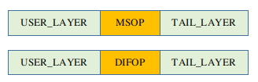

#### 3.2.1 InputSock::createSocket()

createSocket()用于创建UDP Socket。
+ 调用setsockopt(), 设置选项`SO_REUSEADDR`
+ 调用bind()将socket绑定到指定的(IP, PORT)组上
+ 如果雷达是组播模式，则将指定IP加入该组播组。
+ 调用fcntl()设置O_NONBLOCK选项，以异步模式接收MSOP/DIFOP Packet

该Socket的配置参数可以在RSInputParam中设置。根据设置的不同，createSocket()支持如下几种模式。

| msop_port/difop_port       |    host_address            |  group_address          |               |
|:-----------:|:----------------------:|:-----------------:|:-------------|
| 6699/7788       |    0.0.0.0            | 0.0.0.0          | 雷达的目的地址可以为广播地址、或电脑主机地址 |
| 6699/7788       |    192.168.1.201      | 0.0.0.0          | 雷达的目的地址可以为电脑主机地址 |
| 6699/7788       |    192.168.1.201      | 239.255.0.1      | 雷达的目的地址可以为组播地址、或电脑主机地址   |

#### 3.2.2 InputSock::init()

init() 调用createSocket()，创建两个Socket,分别接收MSOP Packet和DIFOP Packet。

#### 3.2.3 InputSock::start()

start() 开始接收MSOP/DIFOP Packet。
+ 启动接收线程，线程函数为InputSock::recvPacket()

#### 3.2.4 InputSock::recvPacket()

recvPacket() 接收MSOP/DIFOP Packet。
在while()循环中，

+ 调用FD_ZERO()初始化本地变量`rfds`，调用FD_SET()将`fds_[2]`中的两个fd加入`rfds`。当然，如果MSOP/DIFOP Packet共用一个socket， 无效的`fds_[1]`就不必加入了。
+ 调用select()在`rfds`上等待Packet, 超时值设置为`1`秒。
如果select()的返回值提示`rfds`上有信号，调用FD_ISSET()检查是`fds_[]`中的哪一个fd可读。对这个fd，
+ 调用回调函数`cb_get_pkt_`， 得到大小为`MAX_PKT_LEN`的缓存。`MAX_PKT_LEN` = `1500`，对当前RoboSense雷达来说，够大了。
+ 调用recvfrom()接收Packet，保存到这个缓存中
+ 调用回调函数`cb_put_pkt_`，将Packet派发给InputSock的使用者。
  + 注意在派发之前，调用Buffer::setData()设置了MSOP Packet在Buffer的中偏移量及长度，以便剥除`USER_LAYER`和`TAIL_LAYER`（如果有的话）。

### 3.3 InputPcap

InputPcap解析PCAP文件得到MSOP/DIFOP Packet。使用第三方工具，如WireShark，可以将雷达数据保存到PCAP文件中。

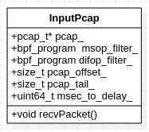

+ InputPcap基于第三方的libpcap库，使用它可以遍历PCAP文件，依次得到所有UDP Packet。
  + 成员变量`pcap_`变量保存Pcap文件指针，`pcap_t`定义来自libpcap库。

+ 与InputSock一样，在有的客户场景下，InputPcap也需要处理`USER_LAYER`和`TAIL_LAYER`的情况。InputPcap的成员`pcap_offset_`和`pcap_tail_`分别保存`USER_LAYER`和`TAIL_LAYER`的字节数。
+ 但也有不同的地方。InputSock从Socket接收的Packet只有UDP数据部分，而InputPcap从PCAP文件得到的Packet不同，它包括所有Packet的所有层。`pcap_offset_`除了`USER_LAYER`的长度之外，还要加上其他所有层。
  + 对于一般的以太网包，`pcap_offset_`需要加上其他层的长度，也就是 `14`(ETHERNET) + `20`(IP) + `8`(UDP) = `42` 字节。
  + 如果还有VLAN层，`pcap_offset_`还需要加上 `4` 字节。


+ PCAP文件中可能不止包括MSOP/DIFOP Packet，所以需要使用libpcap库的过滤功能。libpcap过滤器`bpf_program`，由库函数pcap_compile()生成。成员`msop_filter_`和`difop_filter_`分别是MSOP Packet和DIFOP Packet的过滤器。
  + MSOP/DIFOP Packet都是UDP Packet，所以给pcap_compile()指定选项`udp`。
  + 如果是基于VLAN的，则需要指定选项`vlan`
  + 如果在一个PCAP文件中包含多个雷达的Packet，则还需要指定选项 `udp dst port`，以便只提取其中一个雷达的Packet。
  

用户配置参数RSInputParam中指定选项`udp dst port`。有如下几种情况。

| msop_port  |  difop_port  |     说明      |
|:-----------:|:-------------:|:-------------|
| 0          |    0         | 如果PCAP文件中只包含一个雷达的Packet |
| 6699       |    7788      | 如果PCAP文件中包含多个雷达的Packet，则可以只提取指定雷达的Packet（该雷达MSOP/DIFOP端口不同） |
| 6699       |    6699/0    | 如果PCAP文件中包含多个雷达的Packet，则可以只提取指定雷达的Packet（该雷达DIFOP/DIFOP端口相同）       |

#### 3.3.1 InputPcap::init()

init()打开PCAP文件，构造PCAP过滤器。
+ 调用pcap_open_offline()打开PCAP文件，保存在成员变量`pcap_`中。
+ 调用pcap_compile()构造MSOP/DIFOP Packet的PCAP过滤器。
  + 如果它们使用不同端口，则需要两个过滤器，分别保存在`mosp_filter_`和`difop_filter_`中。
  + 如果使用同一端口，那么`difop_filter_`就不需要了。

#### 3.3.2 InputPcap::start()

start()开始解析PCAP文件。
+ 调用std::thread()，创建并启动PCAP解析线程，线程的函数为recvPacket()。

#### 3.3.3 InputPcap::recvPacket()

recvPacket()解析PCAP文件。
在循环中，
+ 调用pcap_next_ex()得到文件中的下一个Packet。

如果pcap_next_ex()还能读出Packet，
+ 本地变量`header`指向Packet的头信息，变量`pkt_data`指向Packet的数据。
+ 调用pcap_offline_filter()，使用PCAP过滤器校验Packet（检查端口、协议等是否匹配）。

如果是MSOP Packet,
  + 调用`cb_get_pkt_`得到大小为`MAX_PKT_LEN`的缓存。`MAX_PKT_LEN` = `1500`，对当前的RoboSense雷达来说，够大了。
  + 调用memcpy()将Packet数据复制到缓存中，并调用Buffer::setData()设置Packet的长度。复制时剥除了不需要的层，包括`USER_LAYER`和`TAIL_LAYER`（如果有的话）。
  + 调用回调函数`cb_put_pkt_`，将Packet派发给InputSock的使用者。

如果是DIFOP Packet，处理与MSOP Packet一样。

+ 调用this_thread::sleep_for()让解析线程睡眠一小会。这是为了模拟雷达发送MSOP Packet的间隔。这个间隔时间来自每个雷达的`Decoder`类，每个雷达有自己的值。在Decoder部分，会说明如何计算这个值。

如果pcap_next_ex()不能读出Packet，一般意味着到了文件结尾，则：
+ 调用pcap_close()关闭pcap文件指针 `pcap_` 。

用户配置RSInputParam的设置决定是否重新进行下一轮的解析。这个选项是`RSInputParam::pcap_repeat`。
+ 如果这个选项为真，调用pcap_open_offline()重新打开PCAP文件。这时成员变量`pcap_`回到文件的开始位置。下一次调用pcap_next_ex()，又可以重新得到PCAP文件的第一个Packet了。

### 3.4 InputRaw

InputRaw是为了重播MSOP/DIFOP Packet而设计的Input类型。将在后面的Packet Record/Replay章节中说明。

### 3.5 InputFactory

InputFactory是创建Input实例的工厂。

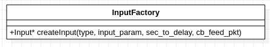

Input类型如下。

```
enum InputType
{
  ONLINE_LIDAR = 1, // InputSock
  PCAP_FILE,        // InputPcap
  RAW_PACKET        // InputRaw
};
```

#### 3.5.1 InputFactory::creatInput()

createInput() 根据指定的类型，创建Input实例。
+ 创建InputPcap时，需指定`sec_to_delay`。这是InputPcap回放MSOP Packet的间隔。
+ 创建InputRaw时，需指定`cb_feed_pkt`。这个将在后面的Packet Record/Replay章节中说明。


## 4 Packet解析

### 4.1 MSOP格式

这里说明MSOP格式中这些字段。
+ 距离 `distance`、
+ 角度 
+ 发射率 `intensity`、
+ 通道 `ring`、
+ 时间戳 `timestamp`、
+ 温度 `temperature`
+ 回波模式 `echo_mode`

其中前五个与点云直接相关。

MSOP格式中的点是极坐标系的坐标，包括极径和极角。距离就是这里的极径。从距离和角度可计算直角坐标系的坐标，也就是点云使用的坐标。

#### 4.1.1 Distance

Distance用两个字节表示。它乘以一个解析度得到真实距离。
+ 不同的雷达的解析度可能不同。
+ 特定于雷达的配置参数`RSDecoderConstParam::DISTANCE_RES`保存这个解析度。

```
uint16_t distance;
```
#### 4.1.2 角度

+ 对于机械式雷达， MSOP格式的azimuth保存点的极角（水平角）。

  ```
  uint16_t azimuth;
  ```

  要计算点的直角坐标系坐标，除了`distance`和`azimuth`之外，还需要一个垂直角。
  + 垂直角从DIFOP Packet得到，一个机械式激光雷达有一组固定的垂直角，每个通道一个。后面的章节将说明垂直角。

  + 水平角是MOSP Packet中点的`azimuth`。

+ 对于MEMS雷达， 角度是`pitch`和`yaw`。

  ```
  uint16_t yaw;
  uint16_t pitch;
  ```
  从`distance`、`pitch`、和`yaw`，可计算直角坐标系的坐标。

+ 雷达的角度分辨率是`0.01`度。这意味着一圈`360`度，可以划分成`36000`个单位。

+ MSOP格式中，角度以`0.01`度为单位，范围是(`0`, `36000`)，所以可以用`uint16_t`来表示。

#### 4.1.3 intensity

`intensity`保存在1个字节中。

```
uint8_t intensity;
```

#### 4.1.4 ring

`ring`在后面的ChanAngles章节说明。

#### 4.1.5 timestamp

RoboSense雷达使用了几种时间戳格式。

##### 4.1.5.1 YMD 格式 

YMD格式定义如下，parseTimeYMD()负责解析这种时间戳格式。遵循这种格式的有RS16/RS32/RSBP等。

```
typedef struct 
{ 
  uint8_t year; 
  uint8_t month; 
  uint8_t day; 
  uint8_t hour; 
  uint8_t minute; 
  uint8_t second; 
  uint16_t ms; 
  uint16_t us; 
} RSTimestampYMD; 
```

##### 4.1.5.2 UTC 格式 

UTC格式定义如下。
+ 成员`sec[6]`保存的是秒数，
+ 成员`ss[4]`保存微秒值或纳秒值。

```
typedef struct 
{ 
  uint8_t sec[6];
  uint8_t ss[4];
} RSTimestampUTC;
```
+ 如果`ss[4]`保存微秒值，使用parseTimeUTCWithUs()解析。遵循这种格式的有RSHELIOS/RSM1。
+ 如果`ss[4]`保存纳秒值，使用parseTimeUTCWithNs()解析。
+ 目前出货的RS128/RS80都遵循微秒格式，只有早期出货的一些RS128/RS80是纳秒格式。当前版本的rs_driver只支持微秒格式的解析。

#### 4.1.6 temperature

RoboSense雷达使用了几种温度格式。

##### 4.1.6.1 用解析度表示温度

一种是用2字节表示温度值，这个值乘以一个解析度得到真实温度。
+ 特定于雷达的配置参数`RSDecoderConstParam::TEMPERATURE_RES`保存这个解析度。

```
typedef struct 
{ 
  uint8_t tt[2];
} RSTemperature;
```

+ 如果这两个字节是`littlen endian`格式，使用parseTempInBe()解析。遵循这种格式的有RS16/RS32/RSBP/RSHELIOS。
+ 如果这两个字节是`big endian`格式，使用parseTempInLe()解析。遵循这种格式的有RS80/RS128。

##### 4.1.6.2 相对温度

另一类用1个字节表示温度。这个值加上一个初始值得到真实温度。遵循这种格式的有RSM1。
+ 特定于雷达的配置参数`RSDecoderConstParam::TEMPERATURE_RES`保存这个初始值。

```
int8_t temperature;
```

#### 4.1.7 echo_mode

雷达内部有多种回波模式。
+ 最强回波，
+ 最后回波，
+ 双回波，

MSOP格式中用一个字节表示：

```
int8_t return_mode;
```

但rs_driver并不在意是回波是“最强的”，还是“最后的”。因为影响MSOP解析的只是：有几个回波？

如下是才是rs_driver关心的回波模式。

```
enum RSEchoMode
{
  ECHO_SINGLE = 0,
  ECHO_DUAL
};
```

不同雷达有不同的回波模式`return_mode`。每个Decoder实现自己的解析函数getEchoMode()，得到rs_driver的回波模式。

回波模式会影响MSOP Packet中数据的布局，还可能影响点云的分帧。

### 4.2 ChanAngles

#### 4.2.1 垂直角/水平角的修正

如前面MSOP格式的章节所说，理论上，从distance、垂直角、水平角就可以计算点的直角坐标系的坐标。

但在生产实践中，装配雷达总是无可避免地有细微的误差，导致雷达的角度不精确，需要进行修正。雷达装配后的参数标定过程，会找出相关的修正值，写入雷达的寄存器。标定后，使用修正值调整点，就可以使其精度达到要求。

MEMS雷达的角度修正，在雷达内部完成，所以rs_driver不需要做什么；机械式雷达的角度修正，由rs_driver在电脑主机端完成。

这里说明机械式雷达的垂直角/水平角修正。

对于机械式雷达，每个通道的垂直角是固定的。以RSBP举例，它的理论垂直角如下。（这里有`32`个值，对应RSBP的`32`个通道）

```
  89.5,    81.0625, 78.25,   72.625,  67,      61.375,  55.75,   50.125, 
  86.6875, 83.875,  75.4375, 69.8125, 64.1875, 58.5625, 52.9375, 47.3125, 
  44.5,    38.875,  33.25,   27.625,  22,      16.375,  10.75,   5.125, 
  41.6875, 36.0625, 30.4375, 24.8125, 19.1875, 13.5625, 7.9375,  2.3125
```

装配过程中的误差，导致雷达的垂直角不是这里列出的理论值，水平角`azimuth`也不是从零开始。标定过程找出两组修正值，一组针对垂直角，一组针对水平角。

还是以RSBP为例。标定过程后，实际的垂直角可能是这样的。这里修正值已经累加了原来的垂直角。

```
  89.4375, 81.0625, 78.25,   72.625,  67,      61.375,  55.75,   50.125, 
  86.8125, 83.875,  75.4375, 69.8125, 64.1875, 58.5,    52.9375, 47.3125, 
  44.5625, 38.875,  33.25,   27.625,  22,      16.375,  10.75,   5.125, 
  41.6875, 36.1875, 30.4375, 24.8125, 19.0625, 13.5625, 7.9375,  2.3125
```

类似的，水平角修正值的例子如下。（这里也有32个值，对应RSBP的32个通道）

```
   0.0625,  0.0625, -0.25,    0.625,  0,      -0.375,   0.75,   -0.125, 
  -0.3125,  0.875,  -0.4375,  0.8125, 0.1875,  0.5,    -0.9375,  0.3125, 
   0.0,    -0.875,   0.25,   -0.625,  0,      -0.375,   0.75,    0.125, 
   0.125,   0.1875,  0.4375,  0.8125, 0.0625,  0.5625,  0.9375,  0.3125
```

这两组修正值在参数标定过程中写入雷达寄存器，它们也包含在DIFOP Packet中。

#### 4.2.2 ChanAngles定义

ChanAngles从DIFOP Packet读入机械式雷达的垂直角/水平角的修正值。如果雷达修正值无效，也可以从外部文件读入。

如前面所说，只有机械式雷达需要ChanAngles。


+ 成员变量chan_num_是雷达的通道数，用于决定修正值数组的大小。
+ 成员变量vert_angles_是保存垂直角修正值的数组
+ 成员变量horiz_angles_是保存水平角修正值的数组。

#### 4.2.3 ChanAngles::loadFromDifop()

loadFromDifop()从DIFOP Packet读入角度修正值，写入成员`vert_angles_[]`和`horiz_angles_[]`。
+ 它还调用genUserChan()， 设置用户通道编号数组。

+ 在DIFOP Packet中，修正值保存在RSClibrationAngle结构中。
  + 成员`value`是非负值，
  + 成员`sign`则指定正负; `0`则修正值为正；除`0xFF`以外的非`0`值，则修正值为负；为`0xFF`时，修正值无效。

```
typedef struct
{
  uint8_t sign;
  uint16_t value;
} RSCalibrationAngle;
```

对于RSBP, MSOP Packet中的修正值保存在成员`vert_angle_cali[]`和`horiz_angle_cali[]`中。

```
typedef struct
{
  ...

  RSCalibrationAngle vert_angle_cali[32];
  RSCalibrationAngle horiz_angle_cali[32];

  ...
} RSBPDifopPkt;
```

#### 4.2.4 早期雷达适配ChanAngles

+ 不是所有雷达的修正值都保存在RSCalibrationAngle中。比如早期的雷达RS16，它的修正值保存在成员`pitch_cali[]`中。

  ```
  typedef struct
  {
    ...
    uint8_t pitch_cali[48];
    ...
  } RS16DifopPkt;
  
  ```

  为了像其他雷达一样处理RS16，将RS16DifopPkt适配到一个能兼容RSCalibrationAngle的结构 AdapterDifopPkt,

  ```
  typedef struct
  {
    uint16_t rpm;
    RSFOV fov;
    uint8_t return_mode;
    RSCalibrationAngle vert_angle_cali[32];
    RSCalibrationAngle horiz_angle_cali[32];
  } AdapterDifopPkt;
  ```
  
  RS16使用了转换函数RS16DifopPkt2Adapter()，从RS16DifopPkt构造一个AdapterDifopPkt。

  ```
  void RS16DifopPkt2Adapter (const RS16DifopPkt& src, AdapterDifopPkt& dst);
  ```
  
+ RS32也有类似的情况。虽然它的修正值也保存在RSCalibrationAngle数组中，但角度值的含义不同。

  ```
  typedef struct
  {
    ...
    RSCalibrationAngle vert_angle_cali[32];
    RSCalibrationAngle horiz_angle_cali[32];
    ...
  } RS32DifopPkt;
  ```
  
  与RS16类似，也将RS32DifopPkt适配到AdapterDifopPkt。RS32使用的转换函数是RS32DifopPkt2Adapter()。

#### 4.2.5 ChanAngles::loadFromFile()

有些场景下，雷达可能还没有写入有效的修正值，或者是因为还没有标定，或者是由于雷达故障。这时可以从外部文件读入角度修正值。

文件格式如下。
+ 每行是对应一个通道的修正值。其中第`1`个值是垂直角，第`2`个值是水平角修正值。
+ 每行对应一个通道。所以对于RSBP来说，应该有`32`行。这个例子略去了部分行。

```
89.5,0.125
81.0625,-0.025
78.25,0
72.625,0
...
30.4375,0.625
24.8125,0
19.1875,-0.25
13.5625,0
7.9375,-0.1
2.3125,0
```
loadFromFile() 解析这个文件得到修正值，写入成员`vert_angles_[]`和`horiz_angles_[]`。
+ 它还调用genUserChan()， 设置用户通道编号数组。

#### 4.2.6 ChanAngles::horizAdjust()

horizAdjust()对参数给出的水平角作修正
+ 根据内部通道编号得到水平角修正值，
+ 水平角加入这个修正值，并返回

#### 4.2.7 ChanAngles::vertAdjust()

vertAdjust()根据内部通道编号，得到修正后的垂直角。

#### 4.2.8 点云的ring值

点云中的`ring`值是从用户角度看的通道编号，它来自于ChanAngles的成员变量`user_chans_`。

回到RSBP的例子。如下是它的垂直角，它们按照雷达内部通道编号排列，而不是降序或升序排列。换句话说，雷达内部通道不是按照垂直角的升序/降序编号的。

```
 89.5,    81.0625, 78.25,   72.625,  67,      61.375,  55.75,   50.125, 
 86.6875, 83.875,  75.4375, 69.8125, 64.1875, 58.5625, 52.9375, 47.3125, 
 44.5,    38.875,  33.25,   27.625,  22,      16.375,  10.75,   5.125, 
 41.6875, 36.0625, 30.4375, 24.8125, 19.1875, 13.5625, 7.9375,  2.3125
```
但用户希望看到通道编号按照垂直角按升序/降序排列。

ChanAngles的成员变量`user_chans`保存的是按升序排列的编号，也就是角度小的通道在前。

#### 4.2.9 ChanAngles::genUserChan()

genUserChan()根据成员变量`vert_angles_[]`中的角度值，计算升序排列的用户通道编号数组。

#### 4.2.10 ChanAngles::toUserChan()

toUserChan()，从给出的雷达内部通道编号，得到用户通道编号。

### 4.3 Trigon

#### 4.3.1 查表计算三角函数值

如前面所说，MSOP Packet中的点是极坐标系的坐标。rs_driver将点坐标，从极坐标系转换为用户使用的直角坐标系。这时需要计算角度的sin/cos值。

调用三角函数又耗时又耗CPU资源，优化的方式是查表。
+ 首先确定表的范围。
  + 垂直角的范围在(`-90`,`90`)内。加上修正值，也还是在(`-90`, `90`)内。
  + 水平角的范围在(`0`, `360`)内。加上修正值，在(`-90`, `450`)内。

+ MSOP格式中，角度以`0.01`度为单位。rs_driver也是这样。对于(`-90`, `450`)的角度范围，需要对(`-9000`, `45000`)内的整数角度值，计算sin/cos值。

#### 4.3.2 Trigon定义

Trigon用于计算指定范围内的sin/cos值，并用于查询。


+ 成员变量`ANGLE_MIN`和`ANGLE_MAX`保存角度范围。这里`ANGLE_MIN` = `-9000`, `ANGLE_MAX` = `45000`。
+ 成员变量`o_sins_`保存所有角度的sin值，`o_coss_`保存所有角度的cos值。`o_sins_[]`和`o_coss_[]`是两个大小为 `AMGLE_MAX - ANGLE_MIN` 的数组。
+ 引用`os_sins_[]`和`o_coss_[]`计算三角函数值时，需要减去一个偏移。为了免去这个麻烦，重新定义了两个指针`sins_`和`coss_`，让它们分别指向`os_sins_[9000]`和`os_cons_[9000]`。这样就可以用角度值直接引用`sins_`和`coss_`了。


#### 4.3.3 Trigon::Trigon()

Trigon的构造函数Trigon() 负责初始化`o_sins_[]`和`o_coss_[]`。
+ 根据角度范围，给`o_sins[]`和`o_coss_[]`分配相应大小的空间，
+ 遍历范围内的角度值，调用std::sin()和std::cos()，将三角函数值分别保存到`o_sins_[]`和`o_coss_[]`中。
+ 让`sins_`指向`sins_[]`中`0`度角的位置，这里是`sins_[9000]`。类似地设置`coss_`。

#### 4.3.4 Trigon::sin()

sin()查表返回角度的sin值。

#### 4.3.5 Trigon::cos()

cos()查表返回角度的cos值。

### 4.4 BlockIterator

这一节"BlockIterator"，仅针对机械式雷达。

#### 4.4.1 Packet、Block、Channel

在MSOP格式中，每个Packet中有`BLOCKS_PER_PKT`个Block，每个Block中有`CHANNELS_PER_BLOCK`个Channel。
+ 这里的`BLOCKS_PER_PKT`和`CHANNEL_PER_BLOCK`分别在雷达配置参数`RSDecoderConstParam`中指定。

对于机械式雷达，雷达持续旋转，垂直方向上的每一轮激光发射，在MSOP Packet中对应一个Block。
以RSBP雷达为例，
+ 一轮就是`32`次激光发射，对应`32`个channel。所以`RSDecoderConstParam::CHANNELS_PER_BLOCK` = `32`。
+ MSOP的设计初衷，当然是向每个Packet尽可能多塞几个Block，这样就有`RSDecoderConstParam::BLOCKS_PER_PKT` = `12`。


雷达的每轮激光发射时序包括充能、发射等步骤。虽然每轮发射的持续时间（也是相邻两轮发射的时间差）相同，但在每轮发射内，每次发射的时间不是均匀分布。

以RSBP为例，

+ 一轮发射的时长为`55.52`微秒，这是Block之间的时间差。
+ 一轮发射内，`32`次发射的时间戳如下（相对于Block的相对时间，单位微秒）。这是每个Channel对所属Block的相对时间。

```
  0.00,  2.56,  5.12,  7.68, 10.24, 12.80, 15.36, 17.92, 
 25.68, 28.24, 30.80, 33.36, 35.92, 38.48, 41.04, 43.60,
  1.28,  3.84,  6.40,  8.96, 11.52, 14.08, 16.64, 19.20,
 26.96, 29.52, 32.08, 34.64, 37.20, 39.76, 42.32, 44.88
```

#### 4.4.2 Channel的时间戳

MSOP格式中，Packet头部包含一个时间戳。

如RSBP雷达，Packet的时间戳如下。

```
RSTimestampYMD timestamp;
```

通过如下方式可以计算Channel的时间戳。

```
Block的时间戳 = Packet的时间戳 + Block的持续时间 * Block数
Channel的时间戳 = 所在Block的时间戳  + Channel对Block的相对时间
```

#### 4.4.3 Channel的角度

在MSOP格式中，Block的成员中包括水平角`azimuth`。

雷达的旋转当然不是匀速的，但放到一个Block这么短的时间内看，认为旋转是匀速的，还是合理的。

所以，通过Channel占Block的时间比例，可以估计Channel对Block的相对水平角。

```
Channel的水平角 = Block的水平角 + 当前Block与下一个Block的水平角差 * Channel对Block的相对时间 / Block的持续时间
```

#### 4.4.4 双回波模式的影响

双回波模式下，虽然一个Packet还是塞了同样数目的Block，但是第二个回波的Block，其水平角/时间戳与第一个回波相同。

如下是双回波模式下，RSBP的MSOP格式。


这样，遍历Block序列时，计算Block时间戳/角度差的方式就不一样了。

#### 4.4.5 BlockIterator定义

引入BlockIterator的目的，是定义一个接口来计算：
+ Block的时间戳。这个时间戳是相对于Packet的时间戳。
+ Block与下一次Block的水平角差。也就是当前Block内雷达旋转的水平角。

BlockIterator的成员如下。
+ 成员变量`pkt_`是Packet
+ 成员变量`BLOCKS_PER_PKT`是Packet中的Block数
+ 成员`BLOCK_DURATION`是Block的持续时间
+ 成员az_diffs[]保存所有Block的水平角差
+ 成员tss[]保存所有Block的时间戳

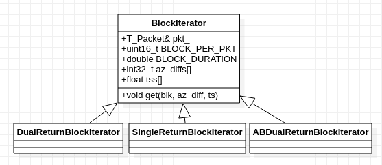

##### 4.4.5.1 BlockIterator::get() 

成员函数get()从成员az_diffs[]和tss[]，得到Block的时间戳和水平角差。BlockIterator的派生类应该计算这两个数组中的值。

#### 4.4.6 SingleReturnBlockIterator

SingleReturnBlockIterator实现单回波模式下的BlockIterator接口。

##### 4.4.6.1 SingleReturnBlockIterator() 

单回波模式下。
在构造函数中，遍历Packet中的block，并计算az_diffs[]和tss[]。

+ Block之间的时间差是固定值，也就是`BLOCK_DURATION`。
+ 1个Packet有`BLOCKS_PER_PKT`个Block。
  
  + 对于前面的Block，
  
  ```
  Block水平角差 = 下一个Block的水平角 - 当前Block的水平角
  ```
  + 最后一个Block的水平角差，认为等于`BLOCK_AZ_DURATION`，这是雷达理论上每个Block的水平角差。
  
+ 相邻Block可能跨`角度0`，所以它们的水平角差可能小于`0`，这时需要将它修正到[`0`, `36000`)内。

#### 4.4.7 DualReturnBlockIterator

DualReturnBlockIterator实现双回波模式下的BlockIterator接口。

##### 4.4.7.1 DualReturnBlockIterator() 

双回波模式下，Block两两成对。
在构造函数中，遍历Packet中的Block，并计算az_diffs[]和tss[]。遍历时步进值为2。

+ 步进差为2的Block, 时间差为`BLOCK_DURATION`。奇数Block和前一个偶数Block的时间戳相同。
  + 对于前面的Block,

  ```
  Block水平角差 = 下下个Block的水平角 - 当前Block的水平角
  ```
  
  + 最后两个Block的角度差，认为等于`BLOCK_AZ_DURATION`，这是雷达理论上每个Block的水平角差。

+ 由于相邻Block可能跨`角度0`，所以它们的水平角差可能小于`0`，这时需要将它修正到 [`0`, `36000`)内。

#### 4.4.8 ABReturnBlockIterator 

双回波模式下，Ruby128是个特殊情况。

Ruby128的每个Block有`128`个Channel，每个Block占的空间太大，以至于每个packet只能放下`3`个Block。这样一次扫描的两个Block可能在不同的Packet中。相邻的两个packet格式如下图。


ABReturnBlockIterator类用于计算Ruby128的双回波模式的时间戳和角度。

##### 4.4.8.1 ABDualReturnBlockIterator()

根据第0个Block和第1个Block的角度是否相同，判断这是一个`AAB` Packet还是`BAA` Packet。
+ `A`与`B`之间的时间差为`BLOCK_DURATION`。

+ 不论是`AAB` Packet，还是`BAA` Packet, Block的角度差都是`A`与`B`之间的角度差。

```
Block水平角差 = 第三个Block的水平角 - 第一个Block的水平角
```

#### 4.4.9 RS16的Packet格式

为了充分利用MSOP Packet的空间，16线雷达(如RS16)的Packet格式与其他机械式雷达不同。

在单回波模式下，一组`16通道数据`包含一个回波，将相邻两组的回波数据放在同一Block中。如下图所示。


在双回波模式下，一组`16通道数据`就有两个回波，将两个回波的数据放在同一Block中。如下图所示。


这样的结果是，
+ MSOP Packet中的相邻Block之间的角度差不再一定是`BLOCK_AZ_DURATION`，时间差也不再一定是`BLOCK_DURATION`。
+ 对于RS16，RSDecoderConstParam.CHANNELS_PER_BLOCK = 32。遍历所有通道时，这个值需要做一次映射，才能得到实际的通道值。

```
uint16_t laser = chan % 16;
```

RS16SingleReturnBlockIterator和RS16DualReturnBlockIterator，分别处理RS16单回波模式和双回波模式的情况。
+ 新加入的成员函数calcChannel()，计算Block内每个Channel的角度占比，和时间戳偏移。


#### 4.4.9 RS16SingleReturnBlockIterator

##### 4.4.9.1 Rs16SingleReturnBlockIterator() 

在构造函数中，遍历Packet中的Block，并计算az_diffs[]和tss[]。

与SingleReturnBlockIterator()中不同的地方是：单回波模式下，一个Block中包括相邻的两个通道数据。
+ 缺省的角度差是`BLOCK_AZ_DURATION` * 2
+ 缺省的时间差是`BLOCK_DURATION` * 2

##### 4.4.9.2 RS16SingleReturnBlockIterator::calcChannel()

calcChannel()计算单回波模式下，32个Channel的角度占比，和时间戳偏移。

#### 4.4.10 RS16DualReturnBlockIterator

##### 4.4.10.1 Rs16DualReturnBlockIterator() 

在构造函数中，遍历Packet中的Block，并计算az_diffs[]和tss[]。

与Rs16DualReturnBlockIterator不同的地方是：双回波模式下，一个Block中包括两个回波的数据。

+ 缺省的角度差是`BLOCK_AZ_DURATION`
+ 缺省的时间差是`BLOCK_DURATION`

##### 4.4.10.2 RS16SingleReturnBlockIterator::calcChannel()

calcChannel()计算双回波模式下，32个Channel的角度占比,和时间戳偏移。

### 4.5 FOV

机械式雷达的扫描角度是[0,360)，这也是雷达输出点的角度范围。

也可以对雷达进行设置，限制它的输出角度，如下图。
+ FOV的范围是[start_angle,end_angle)。
+ 与FOV互补的角度范围FOV_blind是FOV的盲区，雷达不会输出这个范围的点。

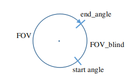

#### 4.5.1 FOV设置

FOV可以从DIFOP Packet得到。

```
  RSFOV fov;
```

RSFOV的定义如下。

```
typedef struct
{ 
  uint16_t start_angle;
  uint16_t end_angle;
} RSFOV;
```

在DecoderMech::decodeDifopCommon()中解析DIFOP Packet得到FOV。
+ 这里计算雷达扫描跨过盲区的时间差，也就是DecoderMech的成员`fov_blind_ts_diff_`.

```
void DecoderMech<T_PointCloud>::decodeDifopCommon(const T_Difop& pkt);
```

#### 4.5.2 FOV对BlockIterator的影响

在BlockIterator的各种实现中，需要考虑Packet的相邻两个Block跨过FOV盲区的情况。
如果跨过盲区，则：

+ 第一个Block的水平角度差调整为`BLOCK_AZ_DURATION`。这时理论上每个Block的水平角差。
+ 两个Block的时间差调整为`FOV_BLIND_DURATION`。这个值是盲区时间差，也就是前面说的`fov_blind_ts_diff_`。

### 4.6 分帧

机械式雷达和MEMS雷达的分帧策略不同。

#### 4.6.1 机械式雷达的分帧模式

机械式雷达持续旋转，输出点，驱动在某个分割位置分割前后帧。有三种分帧模式。
+ 按Block的水平角分帧。这是默认的分帧模式。
  + 如果Block的水平角刚好跨过指定的水平角，则分帧。
  + 雷达的转动不是均匀的，所以每帧包含的Block数可能会有细微的变动，相应地，包含的点数也会变动。


+ 按理论上每圈的Block数分帧。这样每帧包含的Block数和点数都是固定的。
  + Robosense雷达支持两种转速：`600`圈/分钟和`1200`圈/分钟。以`600`圈/分钟距离，相当于每圈`0.1`秒，而Block的持续时间是固定的，由此计算理论上每圈的Block数（实际上是假设雷达转速均匀）
  
```
 每圈Block数 = 每圈秒数 / Block持续时间
```
  + 理论上每圈Block数，在不同回波模式下不同。上面的计算是针对单回波模式。如果是双回波模式，则每圈Block数要加倍。
  
+ 按照使用者指定的Block数分帧。当然这样每帧的Block数和点数也都是固定的。

#### 4.6.2 SplitStrategy

SplitStrategy定义机械式雷达的分帧模式接口。
+ 使用者遍历Packet中的Block，以Block的水平角为参数，调用SplitStrategy::newBlock()。应该分帧时，newBlock()返回`true`，否则返回`false`。

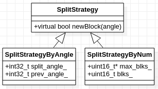

#### 4.6.3 SplitStrategyByAngle

SplitStrategyByAngle按Block角度分帧。

+ 成员`split_angle_`保存分割帧的角度。
+ 成员`prev_angle_`保存前一个Block的角度。

##### 4.6.3.1 SplitStrategyByAngle::newBlock()

当前一个Block的角度`prev_angle_`在`split_angle_`之前，而当前Block的角度在`split_angles_`之后，则认为当前Block跨越了`split_angles_`，返回`true`。
+ 这里考虑了Block的角度跨越`角度0`的情况。

#### 4.6.4 SplitStrategyByNum

SplitStrategyByNum实现按Block数分帧。
+ 成员`max_blks_`是每帧的Block数。
+ 成员`blks_`是当前已累积的Block数。

##### 4.6.4.1 SplitStrategyByAngle::newBlock()

newBlock()简单地累加Block数到成员`blks_`，当`blk_`达到`max_blks_`时，则返回`true`。

#### 4.6.5 MEMS雷达的分帧模式

MEMS雷达的分帧是在雷达内部确定的。
+ 一帧的MSOP Packet数是固定的。假设这个数为`N`, 则雷达给Packet编号，从`1`开始，依次编号到`N`。
+ 对于RSM1，单回波模式下，Packet数是`630`；在双回波模式下，输出的点数要翻倍，相应的，Packet数也要翻倍，Packet数是`1260`。

#### 4.6.6 SplitStrategyByPktSeq

SplitStrategyBySeq按Packet编号分帧。
+ 注意SplitStrategyBySeq的接口与SplitStrategy不同，不是后者的派生类。
+ 成员变量`prev_seq_`是前一个Packet的编号。
+ 成员变量`safe_seq_min_`和`safe_seq_max`，是基于`prev_seq_`的一个安全区间。


##### 4.6.6.1 SplitStrategyByPktSeq::newPacket()

使用者用MSOP Packet的编号值，调用newPacket()。如果分帧，返回`true`。

MSOP使用UDP协议，理论上Packet可能丢包、乱序。

先讨论没有安全区间时，如何处理丢包、乱序。
+ 理想情况下，如果不丢包不乱序，Packet编号从`1`到`630`, 只需要检查Packet编号是不是`1`。如果是就分帧。
+ 那假如只有丢包呢？举个例子，如果编号为`1`的Packet丢了，则可以加入检查条件，就是当前Packet编号小于`prev_seq_`，就分帧。
+ 在乱序的情况下，这个检查条件会导致另一个困境。举个例子，如果编号为`300`和`301`的两个Packet乱序，那么这个位置分帧，会导致原本的一帧拆分成两帧。

为了在一定程度上包容可能的Packet丢包、乱序情况，引入安全区间的概念。
+ 以`prev_seq_`为参考点，划定一个范围值`RANGE`, 

```
safe_seq_min_ = prev_seq_ - RANGE
safe_seq_max_ = prev_seq_ + RANGE
```


+ 如果Packet在范围(`safe_seq_min_`, `safe_seq_max_`)内，都不算异常，丢包、乱序都不触发分帧。这样在大多数情况下，之前的问题可以避免。

### 4.7 点云的有效性校验

#### 4.7.1 AzimuthSection

AzimuthSection检查水平角是否在有效范围内。
+ 成员变量`start_`指定这个范围的起始角度，`end_`指定这个范围的结束角度。支持跨水平角`0`的情况，比如`start` = `35000`, `end` = `10`。
+ 用户可以通过用户配置参数`RSDecoderParam::start_angle`，和`RSDecoderParam::start_angle`指定这个范围。


##### 4.7.1.1 AzimuthSection::in()

in()检查指定的角度`angle`是否在有效范围内。

#### 4.7.2 DistanceSection

DistanceSection检查指定的`distance`是否在有效范围内。
+ 成员`min_`和`max_`分别是这个范围的最小值和最大值。
+ 不同雷达有不同的测距范围。雷达配置参数`RSDecoderConstParam::DISTANCE_MIN`，和`RSDecoderConstParam::DISTANCE_MAX`指定这个范围。
+ 用户也可以通过用户配置参数`RSDecoderParam::min_distance`， 和`RSDecoderParam::max_distance`进一步限缩这个范围。


##### 4.7.2.1 DistanceSection::in()

in()检查指定的`distance`是否在有效范围内。

### 4.8 Decoder

Decoder解析雷达MSOP/DIFOP Packet，得到点云。
+ 它是针对所有雷达的接口类，包括机械式雷达和MEMS雷达。

DecoderMech派生于Decoder，给机械式雷达完成一些通用的功能，如解析DIFOP Packet。

每个机械式雷达分别派生自DecoderMech的类，如DecoderRS16、DecoderRS32、DecoderBP、DecoderRSHELIOS、DecoderRS80、DecoderRS128等。

MEMS雷达的类，如DecoderRSM1，直接派生自Decoder。

DecoderFactory根据指定的雷达类型，生成Decoder实例。

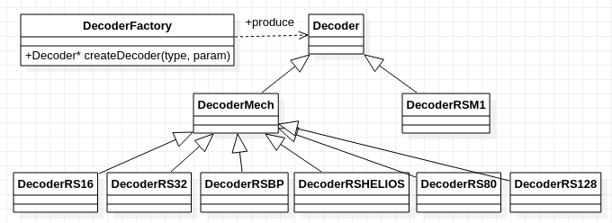

#### 4.8.1 Decoder定义

如下图是Decoder的详细定义。
+ 成员`const_param_`是雷达的参数配置。
+ 成员`param_`是用户的参数配置。
+ 成员`trigon_`是Trigon类的实例，提供快速的sin/cos计算。定义如下的宏，可以清晰、方便调用它。

```
#define SIN(angle) this->trigon_.sin(angle)
#define COS(angle) this->trigon_.cos(angle)
```
+ 成员`packet_duration_`是MSOP Packet理论上的持续时间，也就是相邻两个Packet之间的时间差。Decoder的派生类计算这个值。
  + InputPcap回放PCAP文件时，需要这个值在播放Packet之间设置延时。
+ 成员`echo_mode_`是回波模式。Decoder的派生类解析DIFOP Packet时，得到这个值。
+ 成员`temperature_`是雷达温度。Decoder的 派生类解析MSOP Packet时，应该保存这个值。
+ 成员`angles_ready_`是当前的配置信息是否已经就绪。不管这些信息是来自于DIFOP Packet，还是来自外部文件。
+ 成员`point_cloud_`是当前累积的点云。
+ 成员`prev_pkt_ts_`是最后一个MSOP Packet的时间戳，成员`prev_point_ts_`则是最后一个点的时间戳。
+ 成员`cb_split_frame_`是点云分帧时，要调用的回调函数。由使用者通过成员函数setSplitCallback()设置。


##### 4.8.1.1 RSDecoderConstParam

RSDecoderConstParam是雷达配置参数，这些参数都是特定于雷达的常量
+ `MSOP_LEN`是MSOP Packet大小
+ `DIFOP_LEN`是DIFOP Packet大小
+ `MSOP_ID[]`是MSOP Packet的标志字节。各雷达的标志字节不同，用`MSOP_ID_LEN`指定其长度。
+ `DIFOP_ID[]`是DIFOP Packet的标志字节。各雷达的标志字节不同，用`DIFOP_ID_LEN`指定其长度。
+ `BLOCK_ID[]`是MSOP Packet中Block的标志字节。所有雷达都是两个字节。
+ `LASER_NUM`是雷达的通道数。如RS16是16， RS32是32，RS128是128。
+ `BLOCKS_PER_PKT`、`CHANNELS_PER_BLOCK`分别指定每个MSOP Packet中有几个Block，和每个Block中有几个Channel。
+ `DISTANCE_MIN`、`DISTANCE_MAX`指定雷达测距范围
+ `DISTANCE_RES`指定MSOP格式中`distance`的解析度。
+ `TEMPERATURE_RES`指定MSOP格式中，雷达温度值的解析度。

```
struct RSDecoderConstParam
{
  // packet len
  uint16_t MSOP_LEN;
  uint16_t DIFOP_LEN;

  // packet identity
  uint8_t MSOP_ID_LEN;
  uint8_t DIFOP_ID_LEN;
  uint8_t MSOP_ID[8];
  uint8_t DIFOP_ID[8];
  uint8_t BLOCK_ID[2];

  // packet structure
  uint16_t LASER_NUM;
  uint16_t BLOCKS_PER_PKT;
  uint16_t CHANNELS_PER_BLOCK;

  // distance & temperature
  float DISTANCE_MIN;
  float DISTANCE_MAX;
  float DISTANCE_RES;
  float TEMPERATURE_RES;
};
```

##### 4.8.1.2 Decoder::processDifopPkt()

processDifopPkt()处理DIFOP Packet。
+ 校验Packet的长度是否匹配。
+ 校验Packet的标志字节是否匹配。
+ 如果校验无误，调用decodeDifopPkt()。这是一个纯虚拟函数，由各雷达的派生类提供自己的实现。

##### 4.8.1.3 Decoder::processMsopPkt()

processMsopPkt()处理MSOP Packet。
+ 检查当前配置信息是否已经就绪(`angles_ready_`)。
  + 对于机械式雷达，当`angles_readys` = `false`时，驱动还没有获得垂直角信息，这时得到的点云是扁平的。所以用户一般希望等待`angles_ready` = `true` 才输出点云。
  + 通过用户配置参数`RSDecoderParam::wait_for_difop`，可以设置是否等待配置信息就绪。
+ 校验DIFOP Packet的长度是否匹配。
+ 校验DIFOP Packet的标志字节是否匹配。
+ 如果以上校验通过，调用decodeMsopPkt()。这是一个纯虚拟函数，由各雷达的派生类提供自己的实现。

##### 4.8.1.4 Decoder::transformPoint()

transformPoint() 对点做坐标变换。它基于第三方开源库Eigen。

默认情况下，transformPoint()功能不开启。要启用这个特性，编译时使用`-DENABLE_TRANSFORM`选项。

```
cmake -DENABLE_TRANSFORM .
```

#### 4.8.2 DecoderMech

DecoderMech处理机械式雷达的共同特性，如转速，分帧角度、光心补偿等。
+ 成员`chan_angles_`是ChanAngles类实例，保存角度修正信息。
+ 成员`scan_section_`是AzimuthSection类实例，保存角度校验信息。
+ 成员`split_strategy_`是SplitStrategy类实例，保存分帧策略。
+ 成员`rps_`是雷达转速，单位是转/秒(round/second)。
+ 成员`blks_per_frame_`是单回波模式下，理论上的每帧Block数。
+ 成员`split_blks_per_frame_`是按Block数分帧时，每帧的Block数。包括按理论上每圈Block数分帧，和按用户指定的Block数分帧。
+ 成员`block_azi_diff_`是理论上相邻block之间的角度差。
+ 成员`fov_blind_ts_diff_`是FOV盲区的时间差


##### 4.8.2.1 RSDecoderMechConstParam

RSDecoderMechConstParam基于RSDecoderConstParam，增加机械式雷达特有的参数。
+ `RX`、`RY`、`RZ`是雷达光学中心相对于物理中心的坐标。
+ `BLOCK_DURATION`是Block的持续时间。
+ `CHAN_TSS[]`是Block中Channel对Block的相对时间。
+ `CHAN_AZIS[]`是Block中Channel占Block的时间比例，也是水平角比例。

```
struct RSDecoderMechConstParam
{
  RSDecoderConstParam base;

  // lens center
  float RX;
  float RY;
  float RZ;

  // firing_ts/chan_ts
  double BLOCK_DURATION;
  double CHAN_TSS[128];
  float CHAN_AZIS[128];
};
```
+ Decoder初始化时，从每轮激光发射中的每次发射时间表，计算`CHAN_TSS[]`、`CHAN_AZIS[]`。这可以简化每个Channel的时间戳和角度的计算。
前面的"Channel的时间戳"章节，已经列出过RSBP的发射时间表，如下。

```
  0.00,  2.56,  5.12,  7.68, 10.24, 12.80, 15.36, 17.92, 
 25.68, 28.24, 30.80, 33.36, 35.92, 38.48, 41.04, 43.60,
  1.28,  3.84,  6.40,  8.96, 11.52, 14.08, 16.64, 19.20,
 26.96, 29.52, 32.08, 34.64, 37.20, 39.76, 42.32, 44.88
```

##### 4.8.2.2 DecoderMech::decodeDifopCommon()

decodeDifopCommon()解析DIFOP Packet。
+ 解析Packet中的`rpm`，得到`rps_`.

```
 uint16_t rpm;
```

+ 计算单回波模式下，每帧Block数，也就是`blks_per_frame_`。

```
每帧Block数 = (1/rps) / Block的持续时间
```

+ 计算相邻Block之间的角度差，也就是`block_azi_diff_`。

```
Block间的角度差 = 360 / 每帧Block数
```

+ 解析得到FOV的起始角度`fov_start_angle`和终止角度`fov_end_angle`，计算FOV的大小`fov_range`。
+ 计算与FOV互补的盲区大小。按照盲区范围比例，计算盲区的时间戳差，也就是`fov_blind_ts_diff_`。

+ 如果用户设置从DIFOP Packet读入角度修正值(`RSDecoderParam.config_from_file` = `false`)，则调用ChanAngles::loadFromDifop()得到他们。
  + 一般角度修正值不改变，所以一旦解析成功（`angles_ready_ = true`），就没必要解析第二次。

#### 4.8.3 DecoderRSBP

以RSBP举例说明机械式雷达的Decoder。
+ RSBP的常量配置由成员函数getConstParam()生成。这个配置定义为静态本地变量。


##### 4.8.3.1 RSDecoderConstParam设置

| 常量参数      |  值  |     说明      |
|:-------------|:---------|:-------------:|
| MSOP_LEN     |    1248  | MSOP Packet字节数              |
| DIFOP_LEN    |    1248  | DIFOP Packet字节数  |
| MSOP_ID[]    |    {0x55, 0xAA, 0x05, 0x0A, 0x5A, 0xA5, 0x50, 0xA0}   | MSOP Packet标志字节，长度为8 |
| MSOP_ID_LEN  |    8     | MSOP_LEN[]中标志字节的长度 |
| DIFOP_ID[]   |    {0xA5, 0xFF, 0x00, 0x5A, 0x11, 0x11, 0x55, 0x55}   | DIFOP Packet标志字节，长度为8 |
| DIFOP_ID_LEN |    8     | DIFOP_LEN[]中的字节长度 |
| BLOCK_ID[]   |    {0xFF, 0xEE}   | block标志字节，长度为2 |
| LASER_NUM    |    32  | 32通道 |
| BLOCKS_PER_PKT |    12  | 每Packet中12个Block |
| CHANNEL_PER_BLOCK | 32  | RSBP为32线雷达 |
| DISTANCE_MIN |    0.1   | 测距最小值，单位米 |
| DISTANCE_MAX |  100.0   | 测距最大值，单位米 |
| DISTANCE_RES |  0.005   | Packet中distance的解析度，单位米 |
| TEMPERATURE_RES| 0.0625 | Packet中的温度的解析度 |

##### 4.8.3.2 RSDecoderMechConstParam设置

| 常量参数              |  值  |     说明      |
|:---------------|:-----------|:-------------:|
| RX             |    0.01473 | 光心相对于物理中心的X坐标  |
| RY             |    0.0085  | 光心相对于物理中心的Y坐标  |
| RZ             |    0.09427 | 光心相对于物理中心的Z坐标 |
| BLOCK_DURATION |    55.52   | Block的持续时间，单位纳秒 |
| CHAN_TSS[]     |    -       | 从发射时间列表得到 |
| CHAN_AZIS[]    |    -       | 从发射时间列表得到 |

##### 4.8.3.2 DecoderRSBP::getEchoMode()

getEchoMode()解析回波模式。

##### 4.8.3.3 DecoderRSBP::decodeDifopPkt()

decodeDifopPkt() 解析DIFOP Packet。
+ 调用DecoderMech::decodeDifopCommon()解析DIFOP Packet，得到转速等信息。
+ 调用getEchoMode()，解析`RSDifopPkt::return_mode`，得到回波模式
+ 根据回波模式，设置成员成员`split_blks_per_frame_`。如前所说，如果当前以理论上的每圈Block数分帧，则需要使用这个成员。

##### 4.8.3.4 DecoderRSBP::decodeMsopPkt()

decodeMsopPkt()使用不同的模板参数调用internDecodeMsopPkt()。
+ 单回波模式下，模板参数是SingleReturnBlockDiff<RSBPMsopPkt>，
+ 双回波模式下，模板参数是DualReturnBlockDiff<RSBPMsopPkt>。

##### 4.8.3.5 DecoderRSBP::internDecodeMsopPkt()

+ 调用parseTempInLe(), 得到雷达温度，保存到`temperature_`。
+ 调用parseTimeYMD()得到Packet的时间戳，保存到本地变量`pkt_ts`。Block时间戳的初值设置为`pkt_ts`。
+ 构造模板参数BlockDiff的实例。
+ 遍历Packet内所有的Block。
  + 校验Block的标志字节
  + 得到Block的角度值。
  + 计算得到Block的时间戳，保存到本地变量`block_ts`。
  + 调用SplitStrategy::newBlock()，检查是否分帧。如果是，调用回调函数`cb_split_frame_`，通知使用者。
    `cb_split_frame_`应该转移点云`point_cloud_`，并重置它。

+ 遍历Block内所有的Channel。
  + 计算Channel的时间戳
  + 计算Channel的水平角
  + 调用ChanAngles::vertAdjust()，得到Channel的垂直角。
  + 调用ChanAngles::horizAdjust()，对Channel的水平角进行修正。
  + 解析Channel的`distance`。
  + 调用DistanceSection::in()校验distance，调用AzimuthSection::in()校验水平角。

如果合法，
 + 计算点云坐标(`x`, `y`, `z`)。
 + 调用transfromPoint()做坐标转换。
 + 设置点云的`intensity`、`timestamp`，`ring`。
 + 将点保存到点云`point_cloud_`的尾部。

如果不合法，
 + 将`NAN`点保存到点云`point_cloud_`尾部。

+ 当前点的时间戳保存到成员`prev_point_ts`。如果下一个Block分包，那么这个时间戳就是点云的时间戳。
+ 将当前Packet的时间戳保存到成员`prev_pkt_ts`。这样，Decoder的使用者不需要重新解析Packet来得到它。

#### 4.8.4 DecoderRS16

RS16的处理与其他机械式雷达有差异，请先参考前面的“RS16的Packet格式”等章节。

##### 4.8.4.1 DecoderRS16::internDecodeMsopPkt()

在internDecoderPkt()的处理中，
+ 因为Block的通道值在[0，31]，需要将它映射到实际的通道值。

#### 4.8.5 DecoderRSM1

RSM1是MEMS雷达。这里说明RSM1的Decoder。
+ DecoderRSM1的常量配置由成员函数getConstParam()生成。这个配置定义为静态本地变量。
+ 成员`split_strategy_`是SplitStrategyBy类的实例，保存分帧策略。


##### 4.8.5.1 RSDecoderConstParam设置

| 常量参数      |  值  |     说明      |
|:-------------:|:---------:|:-------------|
| MSOP_LEN     |    1210  | MSOP Packet字节数              |
| DIFOP_LEN    |    256   | DIFOP Packet字节数  |
| MSOP_ID[]    |    {0x55, 0xAA, 0x5A, 0xA5}   | MSOP Packet标志字节，长度为4 |
| MSOP_ID_LEN  |    4     | MSOP_LEN[]中标志字节的长度 |
| DIFOP_ID[]   |    {0xA5, 0xFF, 0x00, 0x5A, 0x11, 0x11, 0x55, 0x55}   | DIFOP Packet标志字节，长度为8 |
| DIFOP_ID_LEN |    8     | DIFOP_LEN[]中的字节长度 |
| BLOCK_ID[]   |    {0xFF, 0xEE}   | block标志字节，长度为2 |
| LASER_NUM    |    5  | 5通道 |
| BLOCKS_PER_PKT |    25  | 每Packet中25个Block |
| CHANNEL_PER_BLOCK | 5  | RSM1有5个通道 |
| DISTANCE_MIN |    0.2   | 测距最小值，单位米 |
| DISTANCE_MAX |  200.0   | 测距最大值，单位米 |
| DISTANCE_RES |  0.005   | Packet中distance的解析度，单位米 |
| TEMPERATURE_RES| 80 | 雷达温度的初始值 |

##### 4.8.5.2 DecoderRSM1::decodeDifopPkt()

decodeDifopPkt() 解析DIFOP Packet。
+ 调用getEchoMode()，解析`RSDifopPkt::return_mode`，得到回波模式
+ 根据回波模式，设置成员成员`max_seq_`。

##### 4.8.5.3 DecodeRSM1::decodeMsopPkt()

decodeMsopPkt()解析MSOP Packet。
+ 解析Packet中的`temperature`字段，得到雷达温度，保存到`temperature_`。

+ 调用parseTimeUTCWithUs()得到Packet的时间戳，保存到本地变量`pkt_ts`。

+ 调用SplitStrategyBySeq::newPacket()，检查是否分帧。如果是，调用回调函数`cb_split_frame_`，通知使用者。
  `cb_split_frame_`应该转移点云`pont_cloud_`，并重置它。

+ 遍历Packet内所有的Block。
  
  + 从Block相对于Packet的偏移，得到Block的时间戳。对于RSM1, Block内的所有Channel的时间戳都是这个时间戳。
  
+ 遍历Block内所有的Channel。
  + 解析Channel的distance。
  + 调用DistanceSection::in()校验`distance`。

    如果distance合法，
     + 计算点云坐标(`x`, `y`, `z`)。
     + 调用transfromPoint()做坐标转换。
     + 设置点云的`intensity`、`timestamp`，`ring`。
     + 将点保存到点云point_cloud_的尾部。

    如果`distance`不合法，
     + 将`NAN`点保存到点云`point_cloud_`尾部。

+ 当前点的时间戳保存到成员`prev_point_ts_`。如果下一个Block分包，那么这个时间戳就是点云的时间戳。

+ 将当前Packet的时间戳保存到成员`prev_pkt_ts_`。这样，Decoder的使用者不需要重新解析Packet来得到它。

#### 4.8.6 DecoderFactory

DecoderFactory是创建Decoder实例的工厂。


Decoder/雷达的类型如下。

```
num LidarType
{
  RS16 = 1,
  RS32,
  RSBP,
  RS128,
  RS80,
  RSHELIOS,
  RSROCK,
  RSM1 = 10
};
```

##### 4.8.6.1 DecoderFactory::creatDecoder()

createDecoder() 根据指定的雷达类型，创建Decdoer实例。

### 4.9 LidarDriverImpl - 组合Input与Decoder

LidarDriverImpl组合Input部分和Decoder部分。
+ 成员`input_ptr_`是Input实例。成员`decoder_ptr_`是Decoder实例。
  + LidarDriverImpl只有一个Input实例和一个Decoder实例，所以一个LidarDriverImpl实例只支持一个雷达。如果需要支持多个雷达，就需要分别创建多个LidarDriverImpl实例。
+ 成员`handle_thread_`是MSOP/DIFOP Packet的处理线程。
+ 成员`driver_param_`是RSDriverParam的实例。
  + RSDriverParam打包了RSInputParam和RSDecoderParam，它们分别是Input部分和Decoder部分的参数。  
  
```
typedef struct RSDriverParam
{ 
  LidarType lidar_type = LidarType::RS16;  ///< Lidar type
  InputType input_type = InputType::ONLINE_LIDAR; ///< Input type
  RSInputParam input_param;
  RSDecoderParam decoder_param;
} RSDriverParam;
```

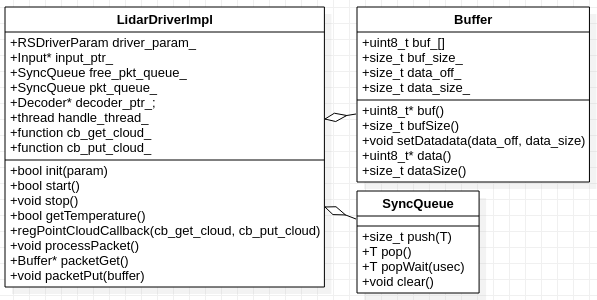

组合Input,
+ 成员`free_pkt_queue_`、`pkt_queue_`分别保存空闲的Packet， 待处理的MSOP/DIFOP Packet。
  + 这2个队列是SyncQueue类的实例。SyncQueue提供多线程访问的互斥保护。
+ 函数packetGet()和packetPut()用来向input_ptr_注册。`input_ptr_`调用前者得到空闲的Buffer，调用后者派发填充好Packet的Buffer。

组合Decoder,
+ 成员`cb_get_cloud_`和`cb_put_cloud_`是回调函数，由驱动的使用者提供。它们的作用类似于Input类的`cb_get_pkt_`和`cb_put_pkt_`。驱动调用`cb_get_cloud_`得到空闲的点云，调用`cb_put_cloud_`派发填充好的点云。
  + 驱动的使用者调用成员函数regPointCloudCallback()，设置`cb_get_cloud_`和`cb_put_cloud_`。
+ 成员函数splitFrame()用来向`decoder_ptr_`注册。`decoder_ptr_`在需要分帧时，调用split_Frame()。这样LidarDriverImpl可以调用`cb_put_cloud_`将点云传给使用者，同时调用`cb_get_cloud_`得到空闲的点云，用于下一帧的累积。

#### 4.9.1 LidarDriverImpl::getPointCloud()

LidarriverImpl的成员`cb_get_cloud_`是rs_driver的使用者提供的。getPointCloud(对它加了一层包装，以便较验它是否合乎要求。
在循环中，

+ 调用`cb_get_cloud_`，得到点云，
如果点云有效，
+ 将点云大小设置为`0`。
如果点云无效，
+ 调用runExceptionCallback()报告错误。

#### 4.9.2 LidarDriverImpl::init()

init()初始化LidarDriverImpl实例。

初始化Decoder部分，
+ 调用DecoderFactory::createDecoder()，创建Decoder实例。
+ 调用getPointCloud()得到空闲的点云，设置`decoder_ptr_`的成员`point_cloud_`。
+ 调用Decoder::regCallback()， 传递成员函数splitFrame()作为参数。这样Decoder分帧时，会调用splitFrame()通知。
+ 调用Decoder::getPacketDuration()得到Decoder的Packet持续时间。

初始化Input部分，
+ 调用InputFactory::createInput()，创建Input实例。
+ 调用Input::regCallback()，传递成员函数packetGet()和packetPut()。这样Input可以得到Buffer， 和派发填充好Packet的Buffer。
+ 调用Input::init()，初始化Input实例。

#### 4.9.3 LidarDriverImpl::start()

start()开始处理MSOP/DIFOP Packet。
+ 启动Packet处理线程`handle_thread_`， 线程函数为processPacket()。
+ 调用Input::start()， 其中启动接收线程，接收MSOP/DIFOP Packet。

#### 4.9.4 LidarDriverImpl::packetGet()

packetGet()分配空闲的Buffer。
+ 优先从`free_pkt_queue_`队列得到可用的Buffer。
+ 如果得不到，重新分配一个Buffer。

#### 4.9.5 LidarDriverImpl::packetPut()

packetPut()将收到的Packet，放入队列`pkt_queue_`。
+ 检查`msop_pkt_queue_`/`difop_pkt_queue`中的Packet数。如果处理线程太忙，不能及时处理， 则释放队列中所有Buffer。

#### 4.9.6 LidarDriverImpl::processPacket()

processMsop()是MSOP Packet处理线程的函数。在循环中,
+ 调用SyncQueue::popWait()获得Packet，
+ 检查Packet的标志字节。
  + 如果是MSOP Packet，调用Decoder::processMsopPkt()，处理MSOP Packet。如果Packet触发了分帧，则Decoder会调用回调函数，也就是DriverImpl::splitFrame()。
  + 如果是DIFOP Packet， 调用Decoder::processDifopPkt()，处理Difop Packet。
+ 将Packet的Buffer回收到`free_pkt_queue_`，等待下次使用。

#### 4.9.7 LidarDriverImpl::splitFrame()

splitFrame()在Decoder通知分帧时，派发点云。
+ 得到点云，也就是成员`decoder_ptr`的`point_cloud_`。
+ 校验`point_cloud_`，
如果点云有效，
+ 调用setPointCloudHeader()设置点云的头部信息，
+ 调用`cb_put_pc_`，将点云传给驱动的使用者。
+ 调用getPointCloud()得到空闲点云，重新设置成员`decoder_ptr`的`point_cloud_`。

#### 4.9.8 LidarDriverImpl::getTemperature()

getTemperature()调用Decoder::getTemperature()， 得到雷达温度。


## 5 Packet的录制与回放

使用者调试自己的程序时，点云的录制与回放是有用的，只是点云占的空间比较大。MSOP/DIFOP Packet占的空间较小，所以Packet的录制与回放是更好的选择。

与MSOP/DIFP Packet的录制与回放相关的逻辑，散布在rs_driver的各个模块中，所以这里单独分一个章节说明。

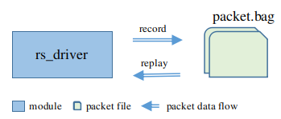

### 5.1 录制

#### 5.1.1 LidarDriverImpl::regPacketCallback()

通过regPacketCallback()，rs_driver的使用者注册一个回调函数，得到原始的MSOP/DIFOP Packet。
+ 回调函数保存在成员`cb_put_pkt_`。

#### 5.1.2 LidarDriverImpl::processMsopPkt()

在processMsopPkt()中，
+ 调用Decoder::processMsopPkt()，
+ 调用`cb_put_pkt_`，将MSOP Packet传给调用者。
  + 设置Packet的时间戳。这个时间戳调用Decoder::prevPktTs()得到。
  + 设置这个Packet是否触发分帧。这个标志是Decoder::processMsopPkt()的返回值。

#### 5.1.3 LidarDriverImpl::processDifopPkt()

在processDifopPkt()中，
+ 调用Decoder::processDifopPkt()，
+ 调用`cb_put_pkt_`，将MSOP Packet传给调用者。DIFOP Packet的时间戳不重要。

### 5.2 回放

#### 5.2.1 InputRaw


InputRaw回放MOSP/DIFOP Packet。
+ 使用者从某种数据源（比如rosbag文件）中解析MSOP/DIFOP Packet，调用InputRaw的成员函数feedPacket()，将Packet喂给它。
  + 在feedPacket()中，InputRaw简单地调用成员`cb_put_pkt_`，将Packet推送给调用者。这样，它的后端处理就与InputSock/InputPcap一样了。

#### 5.2.2 LidarDriverImpl

+ InputRaw::feedBack()在InputFactory::createInput()中被打包，最后保存在LidarDriverImpl类的成员`cb_feed_pkt_`中。
+ 使用者调用LidarDriverImpl的成员函数decodePacket()，可以将Packet喂给它。decodePacket()简单地调用成员`cb_feed_pkt_`。

### 5.3 时间戳处理

点云的时间戳来自于MSOP Packet的时间戳。MSOP Packet的时间戳可以有两种产生方式。
+ 用户配置参数`RSDecoderParam::use_lidar_clock`决定使用哪种方式。
+ `use_lidar_clock` = `true`时， 使用雷达产生的时间戳，这个时间戳在Packet中保存。这种情况下，一般已经使用时间同步协议对雷达做时间同步。
+ `use_lidar_clock` = `false`时， 忽略Packet中的时间戳，在电脑主机侧由rs_driver重新产生一个。

#### 5.3.1 使用雷达时间戳

录制时，设置`use_lidar_clock` = `true`
+ 解析MSOP Packet的时间戳。这个时间戳是雷达产生的。
+ 输出的点云使用这个时间戳
+ 如果输出Packet，也是这个时间戳

回放时，设置`use_lidar_clock` = `true`
+ MSOP Packet内保存的仍然是雷达产生的时间戳。
+ 输出点云仍然使用这个时间戳。

#### 5.3.2 使用主机时间戳

录制时，设置`use_lidar_clock` = `false`
+ rs_driver在电脑主机侧重新产生时间戳。这个时间戳覆盖Packet文件中原有的时间戳；如果这时有点云输出，使用rs_driver产生的时间戳
  + 在DecoderRSBP::internDecodeMsopPacket()中，rs_driver调用getTimeHost()产生时间戳，然后调用createTimeYMD()，用这个新时间戳替换Packet中原有的时间戳。
+ 这时输出的Packet的时间戳是rs_driver产生的时间戳

回放时，设置`use_lidar_clock` = `true`
+ 解析MSOP Packet的时间戳。这个时间戳是录制时rs_driver在电脑主机侧产生的。
+ 输出的点云使用这个时间戳。


