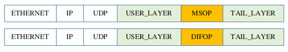

# 11 **PCAP file - Advanced Topics**


## 11.1 Introduction

According to the configuration of RoboSense LiDAR,  it may work in unicast/multicast/broadcast mode, with VLAN layer and with user layers.

This document illustrates how to configure the driver in each case.

Before configure `rs_driver`, first find out what case the LiDAR is. Please refer to [How to configure rs_driver by PCAP file](./12_how_to_configure_by_pcap_file.md).


## 11.2 General Case

Generally, below code is for decoding a PCAP file in these cases.
+ Broadcast/multicast/unicast mode
+ There are multiple LiDARs in a file, and decode only one of them.

```c++
RSDriverParam param;                              ///< Create a parameter object
param.input_type = InputType::PCAP_FILE;          ///< get packet from online lidar
param.input_param.pcap_path = "/home/robosense/lidar.pcap";  ///< Set the pcap file path
param.input_param.msop_port = 6699;               ///< Set the lidar msop port number, the default is 6699
param.input_param.difop_port = 7788;              ///< Set the lidar difop port number, the default is 7788
param.lidar_type = LidarType::RS32;               ///< Set the lidar type.
```

The only exception is:

 "Multiple LiDARs with same ports but different IPs". This is not supported by `rs_driver`.


## 11.3 VLAN

In some user cases, The LiDar may work on VLAN.  Its packets have a VLAN layer.


rs_driver decodes PCAP file and gets all parts of MSOP packets, including the VLAN layer. 

To strip the VLAN layer, just set `use_vlan=true`.

```c++
RSDriverParam param;                              ///< Create a parameter object
param.input_type = InputType::PCAP_FILE;          ///< get packet from online lidar
param.input_param.pcap_path = "/home/robosense/lidar.pcap";  ///< Set the pcap file path
param.input_param.msop_port = 6699;               ///< Set the lidar msop port number, the default is 6699
param.input_param.difop_port = 7788;              ///< Set the lidar difop port number, the default is 7788
param.input_param.use_vlan = true;                ///< Whether to use VLAN layer.
param.lidar_type = LidarType::RS32;               ///< Set the lidar type.
```

And a useful tips is: `RSInputParam.use_vlan` is not used when connecting to a online LiDAR. It is only to decode a PCAP file.


## 11.4 User Layer, Tail Layer 

In some user cases, User may add extra layers before or/and after the MSOP/DIFOP packet.
+ USER_LAYER is before the packet and TAIL_LAYER is after it.


These extra layers are parts of UDP data. The driver can strip them. 

To strip them, just give their lengths in bytes. 

In the following example, USER_LAYER is 8 bytes, and TAIL_LAYER is 4 bytes.

```c++
RSDriverParam param;                              ///< Create a parameter object
param.input_type = InputType::PCAP_FILE;          ///< get packet from online lidar
param.input_param.pcap_path = "/home/robosense/lidar.pcap";  ///< Set the pcap file path
param.input_param.msop_port = 6699;               ///< Set the lidar msop port number, the default is 6699
param.input_param.difop_port = 7788;              ///< Set the lidar difop port number, the default is 7788
param.input_param.user_layer_bytes = 8;           ///< user layer bytes. there is no user layer if it is 0
param.input_param.tail_layer_bytes = 4;           ///< tail layer bytes. there is no user layer if it is 0
param.lidar_type = LidarType::RS32;               ///< Set the lidar type.
```


