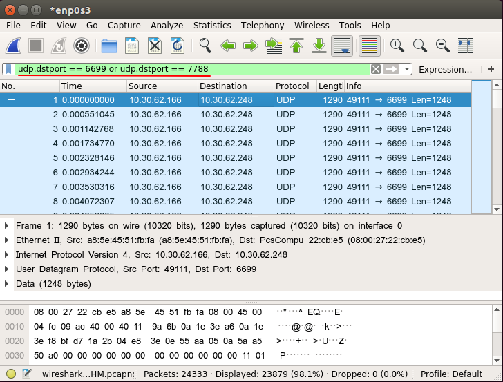
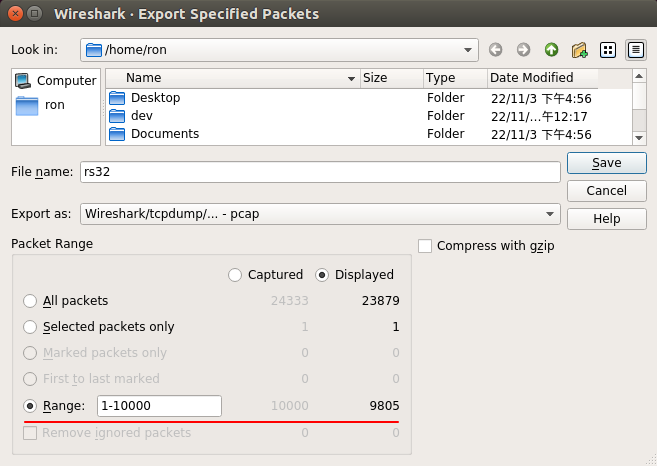
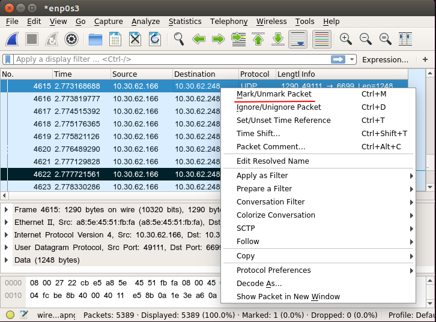

# 13 **如何为rs_driver录制一个PCAP文件**


## 13.1 使用WireShark抓包

### 13.1.1 选择网卡
打开WireShark的第一步，是选择在哪个网卡抓包。这里选择的网卡是`enp0s3`。
+ 不要选择`any`，这样录制的PCAP文件，协议为`linux cooked capture`。这不是`Ethernet`格式，`rs_driver`不能识别。
+ 如果雷达支持`VLAN`，可以选择在物理网卡上还是在虚拟网卡上抓包。在前者抓包带`VLAN`层，在后者抓包则不带。


使用如下的网络工具，可以确定网卡的名字。

+ `ipconfig` -  Windows平台
+ `ifconfig` - Linux平台


### 13.1.2 抓包

指定了网卡，就可以抓包了。


### 13.1.3 导出PCAP文件

#### 13.1.3.1 过滤掉不要的包

导出PCAP文件时，你可能希望只保留MSOP/DIFOP Packet。指定过滤条件就可以了。

+ 这里指定了两个端口`6699`和`7788`进行过滤。



#### 13.1.3.2 导出所有包

选择菜单`File` -> `Export Specified Packets ... `，得到如下的对话框。


可以选择导出所有包。在上面的图中，`Packet Range`选项，选择`All Packets`，导出所有包。

+ 保存文件时，选择`pcap`格式，而不是`pcapng`格式，后者`rs_driver`还不支持。
+ `Packet Range`下有两列数字：`Captured`和`Displayed`。这里保持`Displayed`就好了。
  + `Captured`是抓到的所有包，`Displayed`是根据前面的过滤条件过滤后的包。比如`All packets`这一栏，总共抓到`24333`个包，过滤后还有`23879`个包。
  + 如果选择`Captured`，则导出的PCAP文件是从所有包中提取；如果选择`Displayed`，则只从过滤后的包中提取。

#### 13.1.3.3 导出指定范围内的包

如果包数太多，只想导出部分包，则可以指定导出的范围。

+ 下面的例子指定的范围是`1`到`10000`，这两个序号是在抓到的所有包中的序号，而实际导出的包数是`9805`个。


#### 13.1.3.4 标记并导出特定包

有时候需要精确指定导出哪几个包。这时可以先通过右键菜单 `Mark/Unmark Packet`标记这几个包。


导出时，选择`Marked packets only`。


#### 13.1.3.5 标记并导出特定范围内的包

也可以先标记两个包，再导出它们两个之间的所有包。在导出时，选择`First to last marked`就可以。


## 13.2 使用tcpdump抓包

`tcpdump`是Unix/Linux下的抓包工具。

如下的命令在网卡`eno1`上抓包，保存到文件`a.pcap`，过滤条件是`UDP`协议，且目标端口为`6699`或`7788`。这里抓包`30000`个，对于一般问题的分析，这个包数够用了。

```shell
sudo tcpdump -i eno1 -w a.pcap -c 30000 'udp dst port 7788 or 6699'
```

使用网络工具`ifconfig`，可以确定网卡的名字。

不要使用选项`-i any`抓包。这个选项针对任意网卡抓包，协议为`linux cooked capture`。这不是Ethernet格式，rs_driver不能识别。

```shell
sudo tcpdump -i any
```

