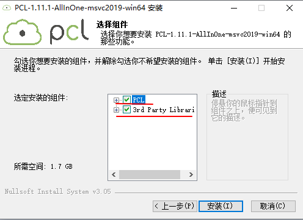
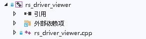
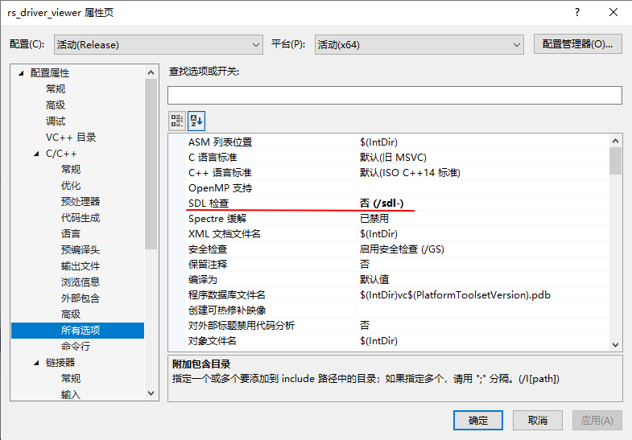

# 16 **How to compile rs_driver on Windows**


## 16.1 Overview

This document illustrates how to comile two parts of `rs_driver`.
- Demo apps, includes `demo_online` and`demo_pcap`
- Point point visualization tool `rs_driver_viewer`

They depends on different 3rd-party libraries. 

Below steps are done with `VS2019` on `Windows 10`. 


## 16.2 Compile demo_online

Here take `demo_online` as an example. `demo_pcap` is similar to  `demo_online`.

### 16.2.1 Setup 3rd Libraries

- To parse PCAP files, first setup `libpcap`. 

```
WpdPack_4_1_2.zip  // header files and library files
WinPcap_4_1_3.exe // runtime libraries
```

- Unzip `WpdPack_4_1_2.zip` to the directory `C:/Program Files`.

- Run `WinPcap_4_1_3.exe`, and setup into`C:/Program Files`.

### 16.2.2 Setup Project demo_online 

- Setup the `demo_online` project, and add the source file`demo_online.cpp`.


### 16.2.3 Configure Project demo_online

- Comply with `C++14`.


- `demo_online` depends on `rs_driver`。set its header file path.


- set the header file path of `libpcap`.


- set the library file path of `libpcap`.


- Add the dependency library of `libpcap`. It is `wpcap.lib`。Also add`ws2_32.lib`. It is Windows socket library. `rs_driver` depends on it.


- set the compile option `_CRT_SECURE_NO_WARNINGS` to avoid unnecessary compiling errors.


### 16.2.4 Compile and Run

- Compile the `demo_online` project, and run it.
  
  


## 16.3 Compile rs_driver_viewer

### 16.3.1 Setup 3rd Party Library

- Setup the `libpcap` library.

- `rs_driver_viewer` Also depends on `PCL`, and then `Boost`、`Eigen` etc. It is lucky that `PCL` offers a setup package which contains all these libraries. This package fits `VS2019`.

```
PCL-1.11.1-AllInOne-msvc2019-win64.exe
```

  Setup it to  the directory C:/Program Files`.


it also setup its dependency libraries.


The components are in the these directories.
```
C:\Program Files\PCL 1.11.1          # PCL libraries
C:\Program Files\OpenNI2             # OpenNI2 libraries depended by PCL
C:\Program Files\PCL 1.11.1\3rdParty # Other libraries depended by PCL
```

### 16.3.2 configure 3rd-party Library

Add paths of runtime libraries as below.


```
C:\Program Files\PCL 1.11.1\bin
C:\Program Files\PCL 1.11.1\3rdParty\VTK\bin
C:\Program Files\PCL 1.11.1\3rdParty\OpenNI2\Redist
```

### 16.3.3 Setup the rs_driver_viewer Project

- Setup the `rs_driver_viewer` project,  and add the source file`rs_driver_viewer.cpp`.


### 16.3.4 Configure Project rs_driver_viewer

- Comply with `C++14`


- Disable SDL check


- Set the header file path of `rs_driver`.


- Set the header file path of `PCL`. Set its dependency libraries also.


```
C:\Program Files\PCL 1.11.1\include\pcl-1.11
C:\Program Files\PCL 1.11.1\3rdParty\Boost\include\boost-1_74
C:\Program Files\PCL 1.11.1\3rdParty\Eigen\eigen3
C:\Program Files\PCL 1.11.1\3rdParty\FLANN\include
C:\Program Files\PCL 1.11.1\3rdParty\Qhull\include
C:\Program Files\PCL 1.11.1\3rdParty\VTK\include\vtk-8.2
C:\Program Files\OpenNI2\Include
```

- Set the library file path of `PCL`. Set its dependency libraries also.


```
C:\Program Files\PCL 1.11.1\lib
C:\Program Files\PCL 1.11.1\3rdParty\Boost\lib
C:\Program Files\PCL 1.11.1\3rdParty\FLANN\lib
C:\Program Files\PCL 1.11.1\3rdParty\Qhull\lib
C:\Program Files\PCL 1.11.1\3rdParty\VTK\lib
C:\Program Files\OpenNI2\Lib
```

- Set `PCL` libraries, including `PCL` and `vtk`. Also set `wpcap.lib` and `ws2_32.lib`.

`PCL` libraries are as below.

```
pcl_common.lib
pcl_commond.lib
pcl_features.lib
pcl_featuresd.lib
pcl_filters.lib
pcl_filtersd.lib
pcl_io.lib
pcl_iod.lib
pcl_io_ply.lib
pcl_io_plyd.lib
pcl_kdtree.lib
pcl_kdtreed.lib
pcl_keypoints.lib
pcl_keypointsd.lib
pcl_ml.lib
pcl_mld.lib
pcl_octree.lib
pcl_octreed.lib
pcl_outofcore.lib
pcl_outofcored.lib
pcl_people.lib
pcl_peopled.lib
pcl_recognition.lib
pcl_recognitiond.lib
pcl_registration.lib
pcl_registrationd.lib
pcl_sample_consensus.lib
pcl_sample_consensusd.lib
pcl_search.lib
pcl_searchd.lib
pcl_segmentation.lib
pcl_segmentationd.lib
pcl_stereo.lib
pcl_stereod.lib
pcl_surface.lib
pcl_surfaced.lib
pcl_tracking.lib
pcl_trackingd.lib
pcl_visualization.lib
pcl_visualizationd.lib
```

`vtk` has `debug` version and `release`version. Here take `release` as an example. 


```
vtkChartsCore-8.2.lib
vtkCommonColor-8.2.lib
vtkCommonComputationalGeometry-8.2.lib
vtkCommonCore-8.2.lib
vtkCommonDataModel-8.2.lib
vtkCommonExecutionModel-8.2.lib
vtkCommonMath-8.2.lib
vtkCommonMisc-8.2.lib
vtkCommonSystem-8.2.lib
vtkCommonTransforms-8.2.lib
vtkDICOMParser-8.2.lib
vtkDomainsChemistry-8.2.lib
vtkDomainsChemistryOpenGL2-8.2.lib
vtkdoubleconversion-8.2.lib
vtkexodusII-8.2.lib
vtkexpat-8.2.lib
vtkFiltersAMR-8.2.lib
vtkFiltersCore-8.2.lib
vtkFiltersExtraction-8.2.lib
vtkFiltersFlowPaths-8.2.lib
vtkFiltersGeneral-8.2.lib
vtkFiltersGeneric-8.2.lib
vtkFiltersGeometry-8.2.lib
vtkFiltersHybrid-8.2.lib
vtkFiltersHyperTree-8.2.lib
vtkFiltersImaging-8.2.lib
vtkFiltersModeling-8.2.lib
vtkFiltersParallel-8.2.lib
vtkFiltersParallelImaging-8.2.lib
vtkFiltersPoints-8.2.lib
vtkFiltersProgrammable-8.2.lib
vtkFiltersSelection-8.2.lib
vtkFiltersSMP-8.2.lib
vtkFiltersSources-8.2.lib
vtkFiltersStatistics-8.2.lib
vtkFiltersTexture-8.2.lib
vtkFiltersTopology-8.2.lib
vtkFiltersVerdict-8.2.lib
vtkfreetype-8.2.lib
vtkGeovisCore-8.2.lib
vtkgl2ps-8.2.lib
vtkglew-8.2.lib
vtkGUISupportMFC-8.2.lib
vtkhdf5-8.2.lib
vtkhdf5_hl-8.2.lib
vtkImagingColor-8.2.lib
vtkImagingCore-8.2.lib
vtkImagingFourier-8.2.lib
vtkImagingGeneral-8.2.lib
vtkImagingHybrid-8.2.lib
vtkImagingMath-8.2.lib
vtkImagingMorphological-8.2.lib
vtkImagingSources-8.2.lib
vtkImagingStatistics-8.2.lib
vtkImagingStencil-8.2.lib
vtkInfovisCore-8.2.lib
vtkInfovisLayout-8.2.lib
vtkInteractionImage-8.2.lib
vtkInteractionStyle-8.2.lib
vtkInteractionWidgets-8.2.lib
vtkIOAMR-8.2.lib
vtkIOAsynchronous-8.2.lib
vtkIOCityGML-8.2.lib
vtkIOCore-8.2.lib
vtkIOEnSight-8.2.lib
vtkIOExodus-8.2.lib
vtkIOExport-8.2.lib
vtkIOExportOpenGL2-8.2.lib
vtkIOExportPDF-8.2.lib
vtkIOGeometry-8.2.lib
vtkIOImage-8.2.lib
vtkIOImport-8.2.lib
vtkIOInfovis-8.2.lib
vtkIOLegacy-8.2.lib
vtkIOLSDyna-8.2.lib
vtkIOMINC-8.2.lib
vtkIOMovie-8.2.lib
vtkIONetCDF-8.2.lib
vtkIOParallel-8.2.lib
vtkIOParallelXML-8.2.lib
vtkIOPLY-8.2.lib
vtkIOSegY-8.2.lib
vtkIOSQL-8.2.lib
vtkIOTecplotTable-8.2.lib
vtkIOVeraOut-8.2.lib
vtkIOVideo-8.2.lib
vtkIOXML-8.2.lib
vtkIOXMLParser-8.2.lib
vtkjpeg-8.2.lib
vtkjsoncpp-8.2.lib
vtklibharu-8.2.lib
vtklibxml2-8.2.lib
vtklz4-8.2.lib
vtklzma-8.2.lib
vtkmetaio-8.2.lib
vtkNetCDF-8.2.lib
vtkogg-8.2.lib
vtkParallelCore-8.2.lib
vtkpng-8.2.lib
vtkproj-8.2.lib
vtkpugixml-8.2.lib
vtkRenderingAnnotation-8.2.lib
vtkRenderingContext2D-8.2.lib
vtkRenderingContextOpenGL2-8.2.lib
vtkRenderingCore-8.2.lib
vtkRenderingExternal-8.2.lib
vtkRenderingFreeType-8.2.lib
vtkRenderingGL2PSOpenGL2-8.2.lib
vtkRenderingImage-8.2.lib
vtkRenderingLabel-8.2.lib
vtkRenderingLOD-8.2.lib
vtkRenderingOpenGL2-8.2.lib
vtkRenderingVolume-8.2.lib
vtkRenderingVolumeOpenGL2-8.2.lib
vtksqlite-8.2.lib
vtksys-8.2.lib
vtktheora-8.2.lib
vtktiff-8.2.lib
vtkverdict-8.2.lib
vtkViewsContext2D-8.2.lib
vtkViewsCore-8.2.lib
vtkViewsInfovis-8.2.lib
vtkzlib-8.2.lib
```

- Set below compile options to avoid unnecessary compile errors. 


```
BOOST_USE_WINDOWS_H
NOMINMAX
_CRT_SECURE_NO_DEPRECATE
```

### 16.3.5 Compile and Run

Compile `demo_online`, and run it.

