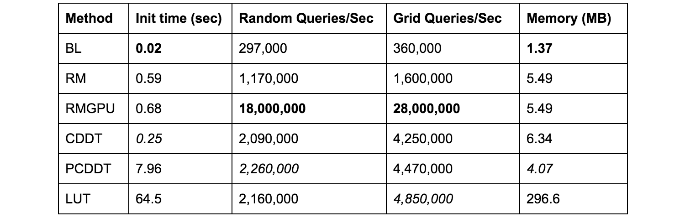

# Particle Filter Localization

This code implements the MCL algorithm for the RACECAR. 

[](https://www.youtube.com/watch?v=-c_0hSjgLYw)

For high efficiency in Python, it uses Numpy arrays and [RangeLibc](https://github.com/f1tenth/range_libc) for fast 2D ray casting.

# Installation

To run this, you need to ensure that both the map_server ROS package, and the python wrappers for RangeLibc are installed.

For the map server:
```
sudo apt-get update
rosdep install -r --from-paths src --ignore-src --rosdistro kinetic -y
```

For [RangeLibc](https://github.com/f1tenth/range_libc):

```
sudo pip install cython
git clone http://github.com/kctess5/range_libc
cd range_libc/pywrappers
# on VM
./compile.sh
# on car - compiles GPU ray casting methods
./compile_with_cuda.sh
```

# Usage

The majority of parameters you might want to tweak are in the launch/localize.launch file. You may have to modify the "odometry_topic" or "scan_topic" parameters to match your environment.

```
roslaunch particle_filter localize.launch
```

Once the particle filter is running, you can visualize the map and other particle filter visualization message in RViz. Use the "2D Pose Estimate" tool from the RViz toolbar to initialize the particle locations.

See [launch/localize.launch](/particle_filter/launch/localize.launch) for docs on available parameters and arguments.

The "range_method" parameter determines which RangeLibc ray casting method to use. The default is cddt because it is fast and has a low initialization time. The fastest option on the CPU is "glt" but it has a slow startup. The fastest version if you have can compile RangeLibc with CUDA enabled is "rmgpu". See this performance comparison chart:



# Docs

This code is the staff solution to the lab guide found in the [/docs](/particle_filter/docs) folder. A mathematical derivation of MCL is available in that guide.

There is also documentation on RangeLibc in the [/docs](/particle_filter/docs) folder.

The code itself also contains comments describing purpose of each method.

# Cite

This library accompanies the following [publication](http://arxiv.org/abs/1705.01167).

    @article{walsh17,
        author = {Corey Walsh and 
                  Sertac Karaman},
        title  = {CDDT: Fast Approximate 2D Ray Casting for Accelerated Localization},
        volume = {abs/1705.01167},
        url    = {http://arxiv.org/abs/1705.01167},
        year   = {2017}}
