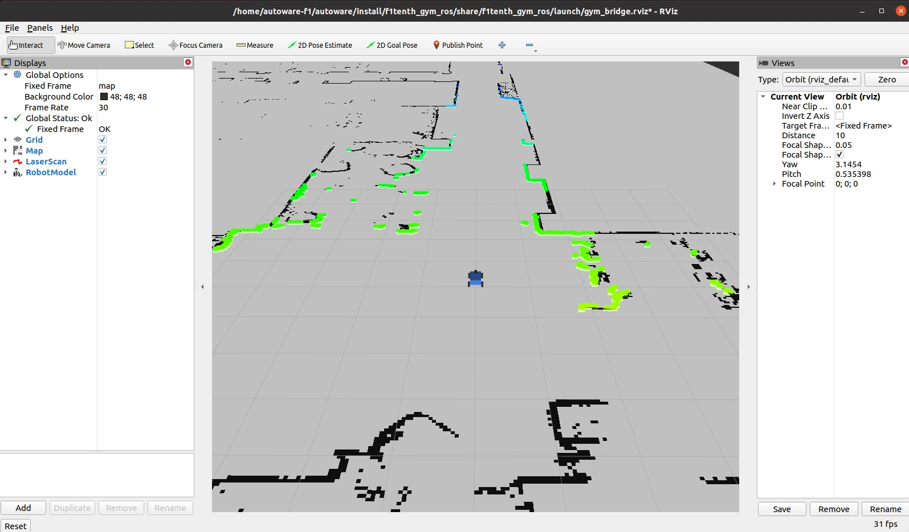

# Autoware Installation on Jetson Orin Nano and F1tenth Record-Replay Demo

This tutorial provides step-by-step instructions for installing and setting up the Autoware development environment on the F1tenth car. The Autoware installation process in this branch is modified from the main one to adapt to the Jetson Orin Nano hardware and software systems. This F1tenth branch supports `JetPack 6` on `Ubuntu 22.04`. It runs `ROS2 humble` on an slightly modified version of Autoware's release/2024.06 branch (f1tenth_humble branch). The original [Autoware installation documentation](https://autowarefoundation.github.io/autoware-documentation/main/installation/autoware/source-installation/) from main branch, and the [F1tenth build documentation](https://f1tenth.readthedocs.io/en/foxy_test/index.html)(running ROS2 foxy) are here for your reference.

This repo also includes a F1tenth Record-Replay demo. This demo allows the user to first build a map, record a trajectory by manually driving the F1tenth car, and then perform trajectory following in the `F1tenth gym simulator` or in `real-world` running Autoware framework. Instructions for installing the F1tenth gym simulator are provided. The approximate time investments listed are based on running Jetson Orin Nano on the default`15W` power mode.

## Flash JetPack6 to Jetson Orin Nano

(Approximate time investment: 1-1.5 hours)

There are multiple ways to install JetPack on a Jetson as described in [Jetpack 6 Documentation](https://developer.nvidia.com/embedded/jetpack-sdk-60). The recommended ways to install are via the `NVIDIA SDK Manager Method` or the `SD Card Image Method`. This repo was tested on JetPack 6. Other JetPack versions may also work but have not yet been tested.

### NVIDIA SDK Manager Method

This method requires a Linux host computer running Ubuntu Linux x64 version `22.04` with `~40GB` of disk space

This method you will first install `NVIDIA SDK Manager` on your host machine, connect the host machine to the Jetson Orin Nano via a `USB-C` cable, download all of the necessary JetPack components using the SDK Manager, and then flash the JetPack to the target Jetson Orin Nano. This method allows you to directly flash the JetPack to the `SD Card` or to the `NVME SSD drive` on the F1tenth car's Jetson. You may need to create an NVIDIA account to download the NVIDIA SDK manager.

1. Download and install [SDK Manager](https://developer.nvidia.com/sdk-manager) on your host machine.

2. Follow the steps at [Install Jetson Software with SDK Manager](https://docs.nvidia.com/sdk-manager/install-with-sdkm-jetson/index.html). Select JetPack version 6. The target hardware will be the Jetson Orin Nano.

3. If you have trouble flashing the JetPack, you can put the Jetson into `Force Recovery Mode` by using a jumper to connect `PINs #9 and #10` of the connector J50 before powering up the Jetson.

### SD Card Image Method

This method requires a computer with Internet connection and the ability to read and write SD cards

1. Download [JetPack 6](https://developer.nvidia.com/downloads/embedded/l4t/r36_release_v3.0/jp60-orin-nano-sd-card-image.zip)

2. If you have not previously run a JetPack 6 release on your Jetson Orin Nano Developer kit, you must first update its QSPI before using this JetPack 6 SD Card image. See the [SD Card Image Method](https://developer.nvidia.com/embedded/jetpack-sdk-511) section for more information.

3. Follow the steps at [Jetson Orin Nano Developer Kit - Get Started](https://developer.nvidia.com/embedded/learn/get-started-jetson-xavier-nx-devkit#prepare) to write the Jetpack to the microSD card.

4. Insert your microSD card to the Jetson.

Once the JetPack is successfully flashed to the Jetson NX, boot the system and the Ubuntu desktop environment should launch

## Set up Autoware development environment

(Approximate time investment: 0.5 hour)

1. Clone the `f1tenth_humble` branch of `autowarefoundation/autoware` and move to the directory.

   ```bash
   git clone -b f1tenth_humble https://github.com/autowarefoundation/autoware.git
   cd autoware
   ```

2. If you are installing Autoware for the first time, you can automatically install the dependencies by using the provided Ansible script.

   ```bash
   ./setup-dev-env.sh --no-nvidia --no-cuda-drivers
   ```

   The NVIDIA library and cuda driver installation are disabled as they are already installed with the JetPack. If you force the cuda driver installation here, it can mess up the kernel and cause errors at bootup. You will need to reflash the JetPack if this happens.

## Set up Autoware workspace

(Approximate time investment: 3-4 hours)

1. Create the `src` directory and clone repositories into it.

   autoware uses [vcstool](https://github.com/dirk-thomas/vcstool) to construct workspaces.

   ```bash
   cd autoware
   mkdir src
   vcs import src < autoware.repos
   ```

2. Install dependent ROS packages.

   ```bash
   source /opt/ros/humble/setup.bash
   rosdep update --include-eol-distros
   rosdep install -y --from-paths src --ignore-src --rosdistro $ROS_DISTRO -r
   ```

   Ignore the `Invalid version` errors during rosdep installation

3. Create swapfile. Originally from Autoware [troubleshooting section](https://autowarefoundation.github.io/autoware-documentation/main/support/troubleshooting/#build-issues)

   Building Autoware requires a lot of memory. Jetson NX can crash during a build because of insufficient memory. To avoid this problem, 16-32GB of swap should be configured.

   Optional: Check the current swapfile

   ```bash
   free -h
   ```

   Remove the current swapfile

   ```bash
   sudo swapoff /swapfile
   sudo rm /swapfile`
   ```

   Create a new swapfile

   ```bash
   sudo fallocate -l 32G /swapfile
   sudo chmod 600 /swapfile
   sudo mkswap /swapfile
   sudo swapon /swapfile
   ```

   Optional: Check if the change is reflected

   ```bash
   free -h
   ```

4. Build the workspace.

   autoware uses [colcon](https://github.com/colcon) to build workspaces.
   For more advanced options, refer to the [documentation](https://colcon.readthedocs.io/).

   ```bash
   colcon build --symlink-install --cmake-args -DCMAKE_BUILD_TYPE=Release
   ```

   Ignore the `stderr` warnings during the build.

## Install f1tenth_gym simulator dependencies

(Approximate time investment: 10 minutes)

1. The f1tenth_gym_ros simulator is used in this case, click [here](https://github.com/f1tenth/f1tenth_gym_ros) for details.

   ```bash
   cd autoware/src/universe/autoware.universe/f1tenth/f1tenth_gym_ros/f1tenth_gym
   pip3 install -e .
   ```

# F1tenth Record-Replay Demo

This demo allows the user to first build a map, record a trajectory by manually driving the F1tenth car, and then perform trajectory following in the `F1tenth gym simulator` or in `real-world` running Autoware framework.

## Create a map without an F1tenth car

If you do not have an F1tenth car. You can use the maps provided in the f1tenth_gym_ros simulation folder under `/maps` directory. By default the `pennovation` map is used. See `Change map in the F1tenth simulator` below to update and ensure the map file path correctly reflects to the system.

You can also draw your own map and save as .png files. Make sure you set the corresponding .yaml file correctly. You can also use the map provided in the f1tenth_gym_ros simulation folder under /maps directory.

## Create a map with an F1tenth car

This part assumes that you have a fully built and properly tuned F1tenth car. For instructions on how to configure an F1tenth car, see [f1tenth_system](https://github.com/autowarefoundation/autoware.universe/tree/f1tenth_galactic/f1tenth/f1tenth_system).

Install `slam_toolbox`

```bash
sudo apt install ros-humble-slam-toolbox
```

1. Start the f1tenth system

```(bash)
# Terminal 1
ros2 launch f1tenth_stack bringup_launch.py
```

2. Start the slam_toolbox with an `absulote path` for parameter `slam_params_file`. Update `<username>` based on your system.

```(bash)
# Terminal 2
ros2 launch slam_toolbox online_async_launch.py slam_params_file:=/home/<username>/autoware/src/universe/autoware.universe/f1tenth/f1tenth_system/f1tenth_stack/config/f1tenth_online_async.yaml
```

3. Launch rviz2. Add `/map` by topic. Add `/graph_visualization` by topic. On the top left corner of rviz, panels – add new panel – add SlamToolBoxPlugin panel. Once you’re done mapping, save the map using the plugin. You can give it a name in the text box next to Save Map, or manually modify the `.png` and `.yaml` file names afterward. The map files will be saved in whichever directory you run slam_toolbox (/autoware).

4. Open the generated `.yaml` file and ensure/update `image:` such that it matches the map file name.

5. To use the map in the F1tenth simulator, copy the `.png` and `.yaml` map files to the `maps` directory under `f1tenth_gym_ros`: /home/autoware/src/universe/autoware.universe/f1tenth/f1tenth_gym_ros/maps

6. To use the map on a real F1tenth car, copy the `.png` and `.yaml` files to the `maps` directory under `particle_filter`: /home/autoware/autoware/src/universe/autoware.universe/f1tenth/particle_filter/maps

[](https://youtu.be/bgrxjXlJbhI)

### Change map in the F1tenth simulator

Navigate to autoware/src/universe/autoware.universe/f1tenth/f1tenth_gym_ros/config. In `sim.yaml`, update the map file path (absulote path) and save.

### Change map on a F1tenth car

Navigate to autoware/src/universe/autoware.universe/f1tenth/particle_filter/config. In `localize.yaml`, update the map name and save.

## How to record a trajectory (simulation)

1. Use the `demo_launch` launch file to launch `gym_bridge`, `recordreplay_planner`, and `trajectory_follower_f1tenth` nodes.

```(bash)
# Terminal 1
source /opt/ros/humble/setup.bash
cd autoware && . install/setup.bash
ros2 launch launch_autoware_f1tenth demo_launch.py
```

rviz2 should launch automatically with the target map loaded (black markers). After a short peroid of time the simulated Lidar data (colored markers) and the car model should be overlaid on top of the map indicating the simulator is running correctly. It can take up to `5 minutes` for the Lidar data to show up if the simulator is launched the first time. You may use your mouse's left/right buttons and scroll wheel in rviz2 to adjust the camera position and angle for better a map view (top-down view).



2. Launch the `teleop_twist_keyboard` node for keyboard tele-operation. Focus on this window and use `U`, `I`, `O` keys to manually control the F1tenth car in the simulation. Use `Q` and `Z` keys to increase/decrease the speed.

```(bash)
# Terminal 2
source /opt/ros/humble/setup.bash
cd autoware && . install/setup.bash
ros2 run teleop_twist_keyboard teleop_twist_keyboard
```

3. Record a trajectory and save at your preferred path. To stop recording, `Ctrl + C` and your path will be automatically saved.
   The default path for the recording is set to `"/tmp/path"`. This recording will be automatically erased after system reboot.

```(bash)
# Terminal 3
source /opt/ros/humble/setup.bash
cd autoware && . install/setup.bash
ros2 action send_goal /planning/recordtrajectory autoware_auto_planning_msgs/action/RecordTrajectory "{record_path: "/tmp/path"}" --feedback
```

[](https://www.youtube.com/watch?v=gJ8JWyzbRf8)

## How to replay a trajectory (simulation)

1. Use the `demo_launch` launch file to launch `gym_bridge`, `recordreplay_planner`, and `trajectory_follower_f1tenth` nodes if they are not currently running.

```(bash)
# Terminal 1
source /opt/ros/humble/setup.bash
cd autoware && . install/setup.bash
ros2 launch launch_autoware_f1tenth demo_launch.py
```

2. Replay a trajectory from your previously saved file. You can use the `2D Pose Estimate` tool in rviz2 anytime to reset the car's pose.

```(bash)
# Terminal 2
source /opt/ros/humble/setup.bash
cd autoware && . install/setup.bash
ros2 action send_goal /planning/replaytrajectory autoware_auto_planning_msgs/action/ReplayTrajectory "{replay_path: "/tmp/path"}" --feedback
```

3. Add `/wp_marker` by topic in rviz2 to show the recorded trajectory

[](https://youtu.be/fxg8eQYiIrw)

## How to record a trajectory (real car)

1. Update the recordreplay_planner_nodes param file at ~autoware/src/universe/autoware.universe/planning/recordreplay_planner_nodes/param/defaults.param.yaml

change the `vehicle_state` from `/ego_racecar/odom` to `/pf/pose/odom` so it will use the data from particle fileter

2. Use the `realcar_launch` launch file to launch `f1tenth_stack`, `recordreplay_planner`, and `trajectory_follower_f1tenth` nodes.

```(bash)
# Terminal 1
source /opt/ros/humble/setup.bash
cd autoware && . install/setup.bash
ros2 launch launch_autoware_f1tenth realcar_launch.py
```

3. Launch the `particle_filter` node for localization. You need the library `range_libc` to utilize the GPU. For instructions on setup, see [particle_filter](https://github.com/autowarefoundation/autoware.universe/tree/f1tenth_humble/f1tenth/particle_filter).

```(bash)
# Terminal 2
source /opt/ros/humble/setup.bash
cd autoware && . install/setup.bash
ros2 launch particle_filter localize_launch.py
```

4. Record a trajectory and save at your preferred path. To stop recording, `Ctrl + C` and your path will be automatically saved.
   The default path for the recording is is set to `"/tmp/path"`. This recording will be automatically erased after system reboot.

```(bash)
# Terminal 3
source /opt/ros/humble/setup.bash
cd autoware && . install/setup.bash
ros2 action send_goal /planning/recordtrajectory autoware_auto_planning_msgs/action/RecordTrajectory "{record_path: "/tmp/path"}" --feedback
```

## How to replay a trajectory (real car)

1. Update the trajectory_follower_f1tenth launch file ~/autoware/src/universe/autoware.universe/f1tenth/trajectory_follower_f1tenth/launch/trajectory_follower_f1tenth.launch.xml

update `<remap from="input/kinematics" to="/ego_racecar/odom"/>` to `<remap from="input/kinematics" to="/pf/pose/odom"/>`

2. Use the `realcar_launch` launch file to launch `f1tenth_stack`, `recordreplay_planner`, and `trajectory_follower_f1tenth` nodes.

```(bash)
# Terminal 1
source /opt/ros/humble/setup.bash
cd autoware && . install/setup.bash
ros2 launch launch_autoware_f1tenth realcar_launch.py
```

3. Launch the `particle_filter` node for localization. You need the library range_libc to utilize the GPU. For instructions on setup, see [particle_filter](https://github.com/autowarefoundation/autoware.universe/tree/f1tenth_humble/f1tenth/particle_filter).

```(bash)
# Terminal 2
source /opt/ros/humble/setup.bash
cd autoware && . install/setup.bash
ros2 launch particle_filter localize_launch.py
```

4. Replay a trajectory from your previously saved file

```(bash)
# Terminal 3
source /opt/ros/humble/setup.bash
cd autoware && . install/setup.bash
ros2 action send_goal /planning/replaytrajectory autoware_auto_planning_msgs/action/ReplayTrajectory "{replay_path: "/tmp/path"}" --feedback
```

5. Add `/wp_marker` by topic in rviz2 to show the recorded trajectory

[](https://www.youtube.com/watch?v=NJmm76bREcY)

# Troubleshooting/Tips

1. If editing files doesn't seem to change anything, delete the respective package files in the `install` and `build` folders under `autoware` and rebuild the respective package using `--packages-select` again.

2. Use `absolute path` (ex. /home/<username>/autoware/src/universe/autoware.universe/f1tenth/) in config file or parameter when there's an issue loading the file.

3. You may need to insert a `hdmi emulator` to the Jetson for `NoMachine` to initiate remote desktop when running on a real F1tenth car. Sometimes you will need to put the emulator in and out a few times for `NoMachine` to start remote desktop.
