# system_launch

## Structure



## Package Dependencies

Please see `<exec_depend>` in `package.xml`.

## Usage

```xml
  <include file="$(find-pkg-share system_launch)/launch/system.launch.xml">
    <arg name="run_mode" value="online"/>
  </include>
```
