# tier4_control_launch

## 構造



## パッケージ依存関係

`<exec_depend>` の詳細については `package.xml` を参照してください。

## 使用方法

`control.launch.py` を `*.launch.xml` に含めるには、以下のように記述します。

`PACKAGE_param_path` としてパラメータパスを設定する必要があります。設定するパラメータパスのリストは `planning.launch.xml` の先頭に記載されています。


```xml
<include file="$(find-pkg-share tier4_control_launch)/launch/control.launch.py">
  <!-- options for lateral_controller_mode: mpc_follower, pure_pursuit -->
  <!-- Parameter files -->
  <arg name="FOO_NODE_param_path" value="..."/>
  <arg name="BAR_NODE_param_path" value="..."/>
  ...
  <arg name="lateral_controller_mode" value="mpc_follower" />
</include>
```

## 注釈

処理負荷を削減するため、ROS 2における[Component](https://docs.ros.org/en/galactic/Concepts/About-Composition.html)の機能（ROS 1におけるNodeletに類似）を使用します。

