# tier4_vehicle_launch

## 構成



## パッケージの依存関係

`<exec_depend>` in `package.xml` をご参照ください。

## 使用方法

`*.launch.xml` に次のように含めることで、`vehicle.launch.xml` を使用できます。


```xml
  <arg name="vehicle_model" default="sample_vehicle" description="vehicle model name"/>
  <arg name="sensor_model" default="sample_sensor_kit" description="sensor model name"/>

  <include file="$(find-pkg-share tier4_vehicle_launch)/launch/vehicle.launch.xml">
    <arg name="vehicle_model" value="$(var vehicle_model)"/>
    <arg name="sensor_model" value="$(var sensor_model)"/>
  </include>
```

## 注釈

このパッケージは変数やパッケージ名でいくつかの外部パッケージや設定を検出します。

例)


```xml
<let name="vehicle_model_pkg" value="$(find-pkg-share $(var vehicle_model)_description)"/>
```


```xml
<arg name="config_dir" default="$(find-pkg-share individual_params)/config/$(var vehicle_id)/$(var sensor_model)"/>
```

## vehicle.xacro

### 引数

| 名称          | タイプ   | 説明        | デフォルト |
| ------------- | ------ | ------------------ | ------- |
| sensor_model  | 文字列 | センサーモデル名  | 空文字      |
| vehicle_model | 文字列 | 車両モデル名 | 空文字      |

### 使用方法

`*.launch.xml`に次のように記述できます。


```xml
  <arg name="vehicle_model" default="sample_vehicle" description="vehicle model name"/>
  <arg name="sensor_model" default="sample_sensor_kit" description="sensor model name"/>
  <arg name="model" default="$(find-pkg-share tier4_vehicle_launch)/urdf/vehicle.xacro"/>

  <node name="robot_state_publisher" pkg="robot_state_publisher" exec="robot_state_publisher">
    <param name="robot_description" value="$(command 'xacro $(var model) vehicle_model:=$(var vehicle_model) sensor_model:=$(var sensor_model)')"/>
  </node>

```

