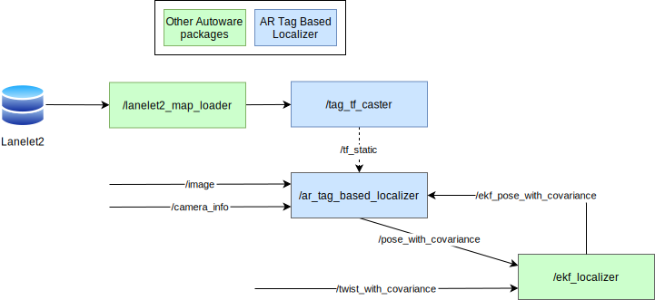

# AR Tag Based Localizer

**ArTagBasedLocalizer** is a vision-based localization package.


This package uses [the Aruco library](https://index.ros.org/p/aruco/) to detect AR-Tags from camera images and calculates and publishes the pose of the ego vehicle based on these detections.
The positions and orientations of the ArTags are assumed to be written in the LaneLet2 format.

This package includes two nodes.

- `ar_tag_based_localizer` : A node that detects AR-Tags from camera images and publishes the pose of the ego vehicle.
- `tag_tf_caster` : A node that publishes the pose of the AR-Tags applied in LaneLet2 as `tf_static`.

## Inputs / Outputs

### Input

| Name          | Type                           | Description  |
| :------------ | :----------------------------- | :----------- |
| `image`       | `sensor_msgs::msg::Image`      | Camera Image |
| `camera_info` | `sensor_msgs::msg::CameraInfo` | Camera Info  |

### Output

| Name                   | Type                                            | Description                                                                               |
| :--------------------- | :---------------------------------------------- | :---------------------------------------------------------------------------------------- |
| `pose_with_covariance` | `geometry_msgs::msg::PoseWithCovarianceStamped` | Estimated Pose                                                                            |
| `result`               | `sensor_msgs::msg::Image`                       | [debug topic] Image in which marker detection results are superimposed on the input image |
| `tf`                   | `geometry_msgs::msg::TransformStamped`          | [debug topic] TF from camera to detected tag                                              |

## How to launch

When launching Autoware, specify `ar_tag_based_localizer` for `pose_source`.

```bash
ros2 launch autoware_launch ... \
    pose_source:=ar_tag_based_localizer \
    ...
```

[Sample rosbag and map](https://drive.google.com/file/d/1wiCQjyjRnYbb0dg8G6mRecdSGh8tv3zR/view)

## Architecture



## Principle


## Map specifications

For this package to function correctly, the pose of the AR-Tags must be specified in the LaneLet2 map format that Autoware can interpret.

The four vertices of AR-Tag are defined counterclockwise.

The order of the four vertices is defined as follows. In the coordinate system of AR-Tag,

- the x-axis is parallel to the vector from the first vertex to the second vertex
- the y-axis is parallel to the vector from the second vertex to the third vertex



### example of `lanelet2_map.osm`

The values provided below are placeholders.
Ensure to input the correct coordinates corresponding to the actual location where the AR-Tag is placed, such as `lat`, `lon`, `mgrs_code`, `local_x`, `local_y`.

```xml
...

  <node id="1" lat="35.8xxxxx" lon="139.6xxxxx">
    <tag k="mgrs_code" v="99XXX000000"/>
    <tag k="local_x" v="22.2356"/>
    <tag k="local_y" v="87.4506"/>
    <tag k="ele" v="2.1725"/>
  </node>
  <node id="2" lat="35.8xxxxx" lon="139.6xxxxx">
    <tag k="mgrs_code" v="99XXX000000"/>
    <tag k="local_x" v="22.639"/>
    <tag k="local_y" v="87.5886"/>
    <tag k="ele" v="2.5947"/>
  </node>
  <node id="3" lat="35.8xxxxx" lon="139.6xxxxx">
    <tag k="mgrs_code" v="99XXX000000"/>
    <tag k="local_x" v="22.2331"/>
    <tag k="local_y" v="87.4713"/>
    <tag k="ele" v="3.0208"/>
  </node>
  <node id="4" lat="35.8xxxxx" lon="139.6xxxxx">
    <tag k="mgrs_code" v="99XXX000000"/>
    <tag k="local_x" v="21.8298"/>
    <tag k="local_y" v="87.3332"/>
    <tag k="ele" v="2.5985"/>
  </node>

...

  <way id="5">
    <nd ref="1"/>
    <nd ref="2"/>
    <nd ref="3"/>
    <nd ref="4"/>
    <tag k="type" v="pose_marker"/>
    <tag k="subtype" v="apriltag_16h5"/>
    <tag k="area" v="yes"/>
    <tag k="marker_id" v="0"/>
  </way>

...

```
