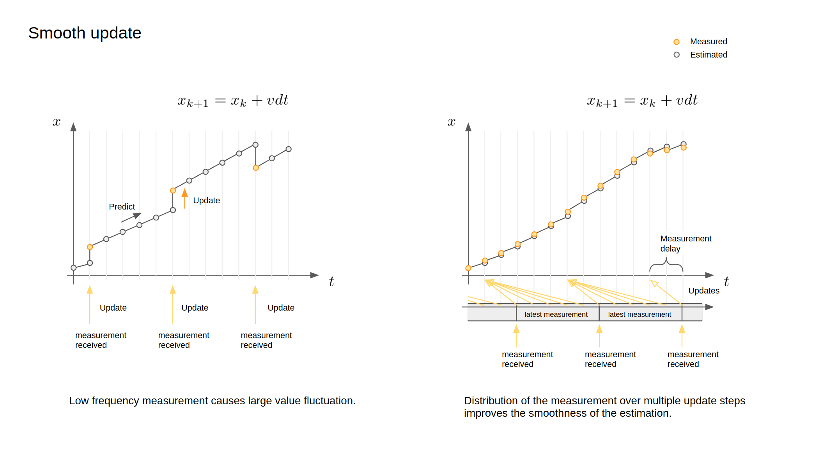
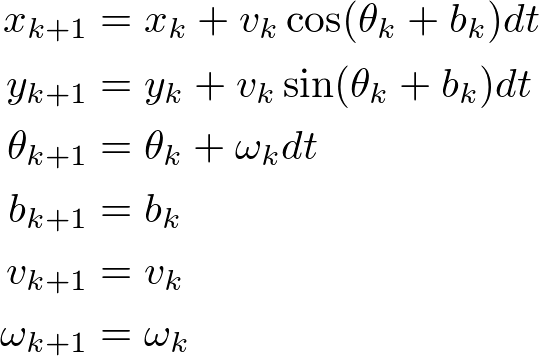
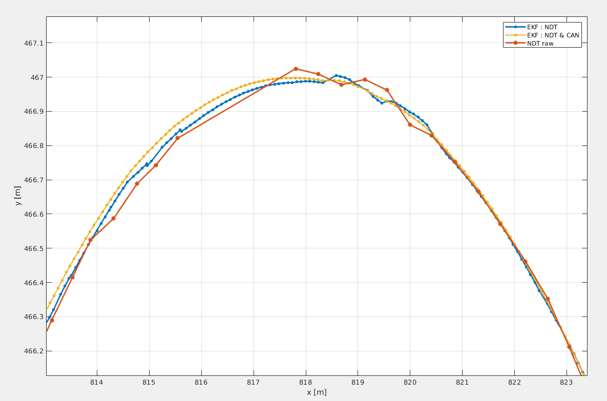
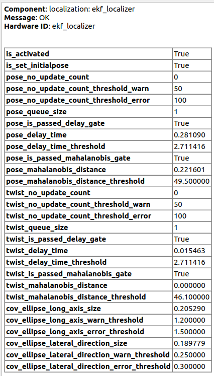
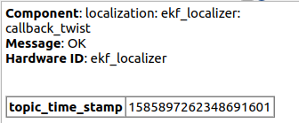

# 概要

**拡張カルマンフィルタローカライザー**は、2D車両力学モデルを入力エゴポーズとエゴツイストメッセージと統合して、堅牢でより少ないノイズを持つロボットのポーズと捻じれを推定します。このアルゴリズムは、自律走行システムなどの高速移動ロボットのために特別に設計されています。

## フローチャート

autoware_ekf_localizerの全体的なフローチャートを以下に示します。

  

## 機能

このパッケージには、次の機能があります。

- **タイム遅延補償**入力メッセージに対して、さまざまな遅延時間で入力情報を適切に統合できます。これは、自動運転車などの高速で移動するロボットでは特に重要です（次の図を参照）。
- **ヨーバイアスの自動推定**センサー取り付け角度の誤差によるモデリングエラーを防ぎ、推定精度を向上させることができます。
- **マハラノビス距離ゲート**確率的な外れ値検出を可能にし、使用する入力と無視する入力を判断できます。
- **スムーズな更新**カルマンフィルタの測定値更新は通常、測定値を取得したときに実行されますが、特に低周波測定値の場合、推定値に大きな変化をもたらす可能性があります。このアルゴリズムは測定時間を考慮できるため、測定データは複数の部分に分割し、一貫性を維持しながらスムーズに統合できます（次の図を参照）。
- **ピッチからの垂直訂正量の計算**勾配でのローカライゼーションの不安定性を軽減します。たとえば、上り坂では、EKFは3自由度（x、y、ヨー）のみを考慮するため、まるで地面に埋もれているかのように動作します（「ピッチからのデルタの計算」図の左側を参照）。したがって、EKFは公式に従ってz座標を修正します（「ピッチからのデルタの計算」図の右側を参照）。

  

  

## ノード

### サブスクライブするトピック

| 名前                                   | タイプ                                                             | 説明                                                                                                                                           |
| -------------------------------------- | ------------------------------------------------------------------ | --------------------------------------------------------------------------------------------------------------------------------------------------- |
| `measured_pose_with_covariance`          | `geometry_msgs::msg::PoseWithCovarianceStamped`                      | 測定共分散行列を持つ入力ポーズソース                                                                                                        |
| `measured_twist_with_covariance`     | `geometry_msgs::msg::TwistWithCovarianceStamped`                     | 測定共分散行列を持つ入力ツイストソース                                                                                                    |
| `initialpose`                            | `geometry_msgs::msg::PoseWithCovarianceStamped`                      | EKF の初期ポーズ。推定ポーズは開始時にゼロで初期化されます。公開されるたびにこのメッセージで初期化されます。                            |

### 公開トピック

| 名前                              | タイプ                                             | 説明                                          |
| --------------------------------- | ------------------------------------------------ | -------------------------------------------- |
| `ekf_odom`                        | `nav_msgs::msg::Odometry`                        | 推定オドメトリ。                               |
| `ekf_pose`                        | `geometry_msgs::msg::PoseStamped`                | 推定ポーズ。                                  |
| `ekf_pose_with_covariance`        | `geometry_msgs::msg::PoseWithCovarianceStamped`  | 共分散を含む推定ポーズ。                      |
| `ekf_biased_pose`                 | `geometry_msgs::msg::PoseStamped`                | Yawバイアスを含む推定ポーズ。                 |
| `ekf_biased_pose_with_covariance` | `geometry_msgs::msg::PoseWithCovarianceStamped`  | Yawバイアスを含む共分散付き推定ポーズ。      |
| `ekf_twist`                       | `geometry_msgs::msg::TwistStamped`               | 推定ツイスト。                                 |
| `ekf_twist_with_covariance`       | `geometry_msgs::msg::TwistWithCovarianceStamped` | 共分散を含む推定ツイスト。                   |
| `diagnostics`                     | `diagnostics_msgs::msg::DiagnosticArray`         | 診断情報。                                   |

### 公開 TF

- base_link
  `map` 座標から推定姿勢への TF。

## 関数

### 予測

現在のロボットの状態は、指定された予測モデルを使用して、これまで推定されたデータから予測されます。この計算は一定の間隔（`predict_frequency [Hz]`）で呼び出されます。予測式はこのページの最後に記載されています。

### 測定値更新

更新前に、測定された入力値と予測された状態との間でマハラノビス距離が計算されます。測定値更新は、マハラノビス距離が所定のしきい値を超える入力値に対しては実行されません。

予測された状態は、最新の測定入力、measured_pose、measured_twistを使用して更新されます。更新は、通常は高周波で予測と同じ周波数で行われ、スムーズな状態推定を実行できます。

## パラメータの説明

パラメータは `launch/ekf_localizer.launch` で設定されます。

### ノードの場合

{{ json_to_markdown("localization/autoware_ekf_localizer/schema/sub/node.sub_schema.json") }}

### ポーズの測定値の場合

{{ json_to_markdown("localization/autoware_ekf_localizer/schema/sub/pose_measurement.sub_schema.json") }}

### ツイストの測定値の場合

{{ json_to_markdown("localization/autoware_ekf_localizer/schema/sub/twist_measurement.sub_schema.json") }}

### プロセスノイズの場合

{{ json_to_markdown("localization/autoware_ekf_localizer/schema/sub/process_noise.sub_schema.json") }}

注: 位置 x と y のプロセスノイズは非線形動特性から自動的に計算されます。

### 1 次元単純フィルタのパラメータ

{{ json_to_markdown("localization/autoware_ekf_localizer/schema/sub/simple_1d_filter_parameters.sub_schema.json") }}

### 診断の場合

{{ json_to_markdown("localization/autoware_ekf_localizer/schema/sub/diagnostics.sub_schema.json") }}

### 諸々

{{ json_to_markdown("localization/autoware_ekf_localizer/schema/sub/misc.sub_schema.json") }}

## EKF パラメータの調整方法

### 0. 準備

- ポーズとツイストのメッセージヘッダーの時間が適切にセンサー時間に設定されていることを確認します。時間遅延はこの値から計算されるためです。タイマの同期に関する問題から適切な時間を設定するのが難しい場合は、`twist_additional_delay` と `pose_additional_delay` を使用して時間を修正してください。
- 測定ポーズとツイストの関係が適切であるかどうかを確認します（ポーズの微分がツイストと同様の値になるかどうか）。この差異は主に単位の誤り（ラジアンと度数の混同など）またはバイアスノイズが原因であり、大きな推定誤差につながります。

### 1. センサーパラメータの調整

各センサの標準偏差を設定します。ヘッダーのタイムスタンプデータの不確かさに対する`pose_measure_uncertainty_time`です。各観測センサデータの`*_smoothing_steps`を設定することで、スムージングのステップ数を調整できます。数を増やすと推定値のスムーズさが向上しますが、推定パフォーマンスに悪影響が出る可能性があります。

- `pose_measure_uncertainty_time`
- `pose_smoothing_steps`
- `twist_smoothing_steps`

### 2. プロセスモデルパラメータの調整

- `proc_stddev_vx_c` : 最大線形加速度に設定
- `proc_stddev_wz_c` : 最大角加速度に設定
- `proc_stddev_yaw_c` : このパラメータはヨーとヨーレート間の相関を表します。値が大きいほど、ヨーの変化が推定ヨーレートと相関しません。これを0に設定すると、推定ヨーの変化がヨーレートと等しくなります。通常は0に設定する必要があります。
- `proc_stddev_yaw_bias_c` : このパラメータはヨーバイアスの変化率の標準偏差です。ほとんどの場合、ヨーバイアスは一定であるため、非常に小さくなければなりませんが、ゼロではありません。

### 3. ゲートパラメータの調整

EKFは観測による更新前にマハラノビス距離を使用してゲーティングを実行します。ゲートサイズは`pose_gate_dist`パラメータと`twist_gate_dist`によって決定されます。マハラノビス距離がこの値よりも大きい場合、観測は無視されます。

このゲーティングプロセスは、カイ二乗分布を使用した統計的テストに基づいています。モデル化されたように、マハラノビス距離はヨーの自由度が3、ねじれの自由度が2のカイ二乗分布に従うものと仮定しています。

現在のところ、共分散推定の精度はあまり良くないため、偽陽性による拒否を減らすために、有意水準を非常に小さい値に設定することをお勧めします。

| 重要度レベル | 2 次元結果の閾値 | 3 次元結果の閾値 |
| ---------------- | -------------------- | -------------------- |
| $10 ^ {-2}$        | 9.21                | 11.3                |
| $10 ^ {-3}$        | 13.8                | 16.3                |
| $10 ^ {-4}$        | 18.4                | 21.1                |
| $10 ^ {-5}$        | 23.0                | 25.9                |
| $10 ^ {-6}$        | 27.6                | 30.7                |
| $10 ^ {-7}$        | 32.2                | 35.4                |
| $10 ^ {-8}$        | 36.8                | 40.1                |
| $10 ^ {-9}$        | 41.4                | 44.8                |
| $10 ^ {-10}$       | 46.1                | 49.5                |

## カルマンフィルタモデル

### 更新関数における運動モデル

ここで、$\theta_k$ は車体の進行方向の角度で、取り付け角度のバイアスを含みます。
$b_k$ はヨーバイアスの補正項であり、$(\theta_k+b_k)$が base_link の進行方向の角度になるようにモデル化されます。
pose_estimator は base_link を地図座標系で公開すると予想されています。ただし、ヨー角はキャリブレーションのエラーによりずれる場合があります。このモデルは、このエラーを補正し、推定精度を向上させます。

### タイム遅延モデル

測定タイム遅延は、拡張状態 [1] (セクション 7.3 固定遅延スムージングを参照) で処理されます。

拡張状態の特定の構造に基づいて解析的な展開を適用できるため、次元は大きくなりますが、計算の複雑さは大幅には変わりません。

## Autoware NDT によるテスト結果

## 診断

### WARN 状態になる条件

- ノードがアクティブ状態ではありません。
- Pose/Twist トピックによる連続的な測定更新の数が `pose_no_update_count_threshold_warn`/`twist_no_update_count_threshold_warn` を超えています。
- Pose/Twist トピックのタイムスタンプが遅延補正範囲を超えています。
- Pose/Twist トピックが共分散推定のためのマハラノビス距離の範囲を超えています。
- 共分散楕円が `warn_ellipse_size` (長軸) または `warn_ellipse_size_lateral_direction` (横方向) のしきい値を超えています。

### ERROR 状態になる条件

- Pose/Twist トピックによる連続的な測定更新の数が `pose_no_update_count_threshold_error`/`twist_no_update_count_threshold_error` を超えています。
- 共分散楕円が `error_ellipse_size` (長軸) または `error_ellipse_size_lateral_direction` (横方向) のしきい値を超えています。

## 既知の問題

- 複数の pose_estimators が使用されている場合、EKF への入力には各ソースに対応する複数のヨーバイアスが含まれます。ただし、現在の EKF はヨーバイアスが 1 つしか存在しないと想定しています。したがって、現在の EKF 状態のヨーバイアス `b_k` は意味がなく、これらの複数のヨーバイアスを正しく処理することはできません。そのため、今後の作業では、ヨー推定値を持つ各センサーのヨーバイアスを導入する予定です。

## 参考資料

[1] Anderson, B. D. O., & Moore, J. B. (1979). Optimal filtering. Englewood Cliffs, NJ: Prentice-Hall.

