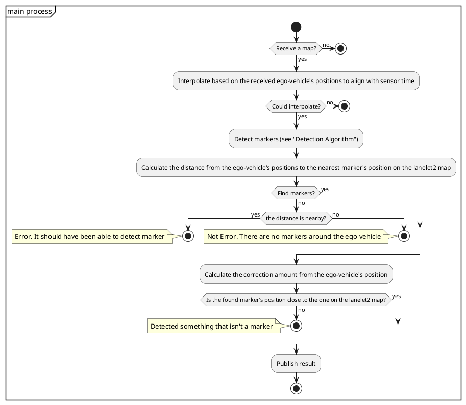

# LiDAR マーカー ローカライザー

**LiDARMarkerLocalizer** は、反射器を検出して位置を推定するノードです。

## 入出力

### `lidar_marker_localizer` ノード

#### 入力
- `/hesai406/points` (`PointCloud`)
    - ヘサイ406のLiDARポイントクラウド
- `/current_pose` (`Odometry`)
    - 自車位置
- `/static_map` (`StaticMap`)
    - 静的地図（反転させた座標系）

#### 出力
- `/lidar_marker_localizer/output` (`Odometry`)
    - 検出された反射器に基づく、自車位置の推定値
- `/lidar_marker_localizer/debug` (`MarkerArray`)
    - デバッグ用マーカー

| 名前 | 型 | 説明 |
|---|---|---|
| `~/input/lanelet2_map` | `autoware_map_msgs::msg::HADMapBin` | lanelet2データ |
| `~/input/pointcloud` | `sensor_msgs::msg::PointCloud2` | 点群 |
| `~/input/ekf_pose` | `geometry_msgs::msg::PoseWithCovarianceStamped` | EKFによる自車位置 |

#### 出力

- [Autoware 自動運転ソフトウェアドキュメント](**URL** にリンク)

**はじめに**

このドキュメントでは、Autoware の自動運転ソフトウェアの詳細について説明します。Autoware は、オープンソースのソフトウェアスタックであり、車が周囲環境を認識し、計画を立て、制御を行うために必要なすべてのコンポーネントが含まれています。

**コンポーネント**

Autoware は、以下の主要コンポーネントで構成されています。

- **Perception (認識)**: センサーデータから周囲環境を認識します。
- **Planning (計画)**: 自車の経路と操縦操作を計画します。
- **Control (制御)**: 計画された操縦操作を車両に送信します。
- **Localization (局所化)**: 自車位置と姿勢を特定します。

**機能**

Autoware は、以下の機能を提供します。

- **物体検出**: 車両、歩行者、自転車などの周囲の物体を検出します。
- **障害物検出**: レーンマーカー、ガードレールなどの障害物を検出します。
- **経路計画**: 目的地までの安全で効率的な経路を計画します。
- **操縦制御**: 車両の速度、操舵、ブレーキを制御します。
- **自車位置推定**: GPS、IMU、オドメトリーを使用して自車位置を推定します。

**アーキテクチャ**

Autoware は、モジュール式アーキテクチャに基づいています。これにより、開発者は特定のコンポーネントや機能を交換したり拡張したりできます。各コンポーネントは、他のコンポーネントとデータと情報をやり取りします。

**パフォーマンス**

Autoware は、以下のパフォーマンス指標を満たすように設計されています。

- **検出範囲**: 200m 以上の物体検出
- **経路計画時間**: 100ms 以内
- **操縦制御精度**: ±0.5m の横方向逸脱量、±0.2m/s の速度逸脱量、±0.2m/s² の加速度逸脱量
- **自車位置精度**: 1m 以内の絶対位置精度、0.1度以内の姿勢精度

**使用例**

Autoware は、以下を含むさまざまな自動運転アプリケーションに使用できます。

- **自動運転車**
- **ロボタクシー**
- **貨物配送車両**

**貢献**

Autoware はオープンソースプロジェクトであり、コミュニティからの貢献を歓迎しています。貢献方法の詳細については、Autoware の Web サイトを参照してください。

**免責事項**

このドキュメントに記載されている情報は、正確で最新であることを目指していますが、Autoware Foundation はその正確性または完全性について保証しません。Autoware の使用は、ユーザー自身の責任において行われるものとします。

| 名前                               | 種類                                               | 説明                                                               |
| :-----------------------------------| :------------------------------------------------- | :--------------------------------------------------------------------- |
| `~/output/pose_with_covariance`   | `geometry_msgs::msg::PoseWithCovarianceStamped`   | 推定姿勢                                                          |
| `~/debug/pose_with_covariance`     | `geometry_msgs::msg::PoseWithCovarianceStamped`   | [デバッグトピック] 推定姿勢                                        |
| `~/debug/marker_detected`          | `geometry_msgs::msg::PoseArray`                    | [デバッグトピック] 検出されたマーカートピック                         |
| `~/debug/marker_mapped`            | `visualization_msgs::msg::MarkerArray`             | [デバッグトピック] Rvizで薄板として可視化するための読み込まれたランドマーク |
| `~/debug/marker_pointcloud`        | `sensor_msgs::msg::PointCloud2`                    | 検出されたマーカーのPointCloud                                   |
| `/diagnostics`                     | `diagnostic_msgs::msg::DiagnosticArray`          | 診断結果                                                            |

## パラメータ

{{ json_to_markdown("localization/autoware_landmark_based_localizer/autoware_lidar_marker_localizer/schema/lidar_marker_localizer.schema.json") }}

## 起動方法

Autowareを起動する際は、`pose_source`に`lidar-marker`を設定します。


```bash
ros2 launch autoware_launch ... \
    pose_source:=lidar-marker \
    ...
```

## 設計

### フローチャート




## 検出アルゴリズム


1. LiDAR 点群を `resolution` サイズの間隔で base_link 座標系の x 軸に沿ってリング状に分割する。
2. `intensity_pattern` に一致する強度の部分を検索する。
3. 各リングに対して 1 と 2 の手順を実行し、一致するインデックスを蓄積し、カウントが `vote_threshold_for_detect_marker` を超える部分をマーカーとして検出する。

## サンプルデータセット

- [サンプル rosbag と地図](https://drive.google.com/file/d/1FuGKbkWrvL_iKmtb45PO9SZl1vAaJFVG/view?usp=sharing)

このデータセットは、国土交通省 土木研究所 大規模トンネル実験施設で取得されました。
反射材は [大成建設](https://www.taisei.co.jp/english/) によって設置されました。

## 協力者

- [TIER IV](https://tier4.jp/en/)
- [大成建設](https://www.taisei.co.jp/english/)
- [Yuri Shimizu](https://github.com/YuriShimizu824)

