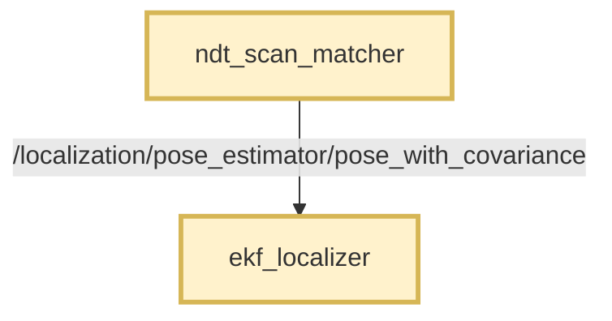
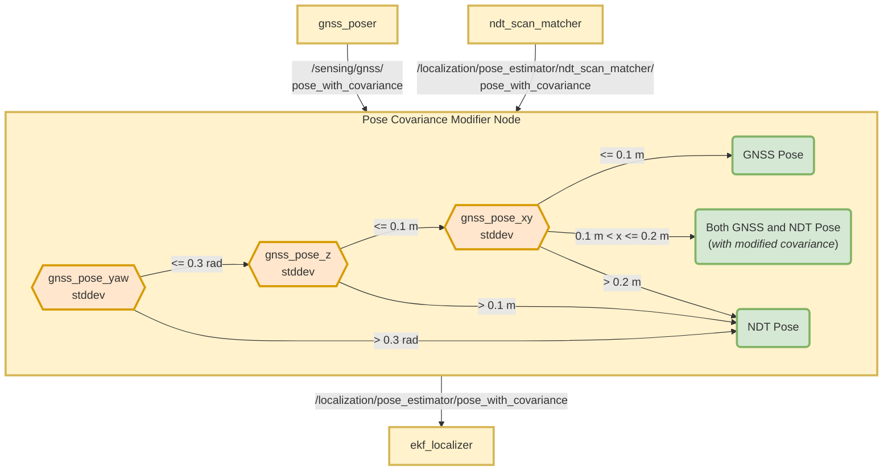

# Autoware Pose Covariance Modifier Node

## 目的

このパッケージは、リアルタイムの位置推定で GNSS と NDT ポーズを併用することを可能にします。

## 機能

このパッケージは、共分散を持つ GNSS（全地球測位システム）と NDT（正規分布変換）ポーズを受け取ります。

共分散を持つ単一のポーズを出力します。

- GNSS ポーズとその共分散を直接出力します。
- NDT ポーズとその共分散を直接出力します。
- 共分散が変更された GNSS ポーズと NDT ポーズの両方を出力します。

> - このパッケージは、受信するポーズ情報を変更しません。
> - 特定の条件下でのみ NDT 共分散値を変更します。

## 仮定

- NDT マッチャは、固定された共分散を持つポーズを提供します。
- NDT マッチャは、動的で信頼性の高い共分散値を提供できません。

## 要件

- GNSS/INS モジュールは、位置と姿勢の標準偏差値（その誤差/RMSE）を提供する必要があります。
- 正確な位置と姿勢情報を提供するには、RTK サポートが必要になると思われます。
- 地理参照されたマップが必要です。
- GNSS/INS モジュールと base_link フレームは、十分に較正されている必要があります。
- GNSS/INS と NDT システムがうまく機能する環境では、両方のシステムの `base_link` ポーズは互いに近くにある必要があります。

## 説明

GNSS と NDT ノードは、拡張カルマンフィルター（EKF）で使用される共分散データを持つポーズを提供します。

正確な共分散値は、EKF が状態を推定する有効性にとって非常に重要です。

GNSS システムは、共分散測定に変換できる信頼性の高い標準偏差値を生成します。

しかし、現在 NDT ポーズの共分散値を決定する信頼できる方法がありません。
そして、Autoware の NDT マッチングシステムは、事前設定された共分散値を持つポーズを出力します。

この理由から、このパッケージは、GNSS システムによって提供される標準偏差値に基づいて、ポーズソースの選択を管理するように設計されています。

また、GNSS 標準偏差値に基づいて NDT ポーズの共分散値も調整します。

## フローチャート

### このパッケージを使用しない場合

ローカリゼーションでは NDT ポーズのみが使用されます。GNSS ポーズは初期化にのみ使用されます。

### このパッケージの使用

ローカライゼーションでは、GNSSから得られる標準偏差値に応じて、NDTとGNSSの両方の姿勢が使用されます。

以下に、プロセスと定義済みの閾値を示すフローチャートを示します。

## 本パッケージの使用方法

> **本パッケージはAutowareでデフォルトでは無効になっています。手動で有効化を行う必要があります。**

本パッケージを有効化するために、[pose_twist_estimator.launch.xml](../../launch/tier4_localization_launch/launch/pose_twist_estimator/pose_twist_estimator.launch.xml#L3)内の`use_autoware_pose_covariance_modifier`パラメータを`true`に変更する必要があります。

### 条件を満たさない場合（デフォルト）

- [ndt_scan_matcher](../../localization/autoware_ndt_scan_matcher)の出力が、[ekf_localizer](../../localization/autoware_ekf_localizer)に直接送信されます。
  - 事前に設定された共分散値があります。
  - **トピック名:** `/localization/pose_estimator/pose_with_covariance`
- GNSSの姿勢がekf_localizerに入りません。
- このノードは起動しません。

### 条件を満たす場合

- [ndt_scan_matcher](../../localization/autoware_ndt_scan_matcher)の出力がリネームされます
  - **変更前:** `/localization/pose_estimator/pose_with_covariance`
  - **変更後:** `/localization/pose_estimator/ndt_scan_matcher/pose_with_covariance`
- `ndt_scan_matcher`の出力が`autoware_pose_covariance_modifier`に入ります。
- 本パッケージの出力が、以下とともに[ekf_localizer](../../localization/autoware_ekf_localizer)に出力されます。
  - **トピック名:** `/localization/pose_estimator/pose_with_covariance`

## ノード

### サブスクライブするトピック

| 名称                            | タイプ                                         | 説明                        |
| ------------------------------- | -------------------------------------------- | --------------------------- |
| `input_gnss_pose_with_cov_topic` | `geometry_msgs::msg::PoseWithCovarianceStamped` | GNSSポーズ入力トピック。       |
| `input_ndt_pose_with_cov_topic`  | `geometry_msgs::msg::PoseWithCovarianceStamped` | NDTポーズ入力トピック。       |

### 発行トピック

| 名称                                  | 型                                          | 説明                                                                                                                  |
| ------------------------------------- | ------------------------------------------- | ------------------------------------------------------------------------------------------------------------------- |
| `output_pose_with_covariance_topic` | `geometry_msgs::msg::PoseWithCovarianceStamped` | 出力姿勢トピック。このトピックはekf_localizerパッケージで使用されます。                                          |
| `selected_pose_type`                  | `std_msgs::msg::String`                     | このパッケージの出力でどの姿勢ソースが使用されるかを宣言します。                                                  |
| `output/ndt_position_stddev`          | `std_msgs::msg::Float64`                    | 出力姿勢のndt位置標準偏差の平均（x-y）。enable_debug_topicsがtrueの場合にのみ公開されます。                  |
| `output/gnss_position_stddev`         | `std_msgs::msg::Float64`                    | 出力姿勢のGNSS位置標準偏差の平均（x-y）。enable_debug_topicsがtrueの場合にのみ公開されます。                  |

### パラメーター

パラメーターは [config/pose_covariance_modifier.param.yaml](config/pose_covariance_modifier.param.yaml) に設定されています。

{{ json_to_markdown(
  "localization/autoware_pose_covariance_modifier/schema/pose_covariance_modifier.schema.json") }}

## FAQ

### さまざまな周波数レートはどのように処理されますか?

GNSSとNDTのポーズトピックは異なる周波数を持つ場合があります。
GNSSポーズトピックはNDTよりも高い周波数を持つ場合があります。

入力が次の周波数を持つと仮定します。

| 情報源 | 周波数 |
| ------ | --------- |
| GNSS   | 200 Hz    |
| NDT    | 10 Hz     |

このパッケージは、モードに応じて出力のポーズを発行します。

最終的な結果:

| モード | 出力周波数 |
|---|---|
| GNSSのみ | 200 Hz |
| GNSS + NDT | 210 Hz |
| NDTのみ | 10 Hz |

### NDT共分散値の上書き方法および時期

**概要**

NDT（正規分布変換）共分散値は、前方障害物の検出に使用されます。これらは、リレーショナルデータベース（レダンド）内でNDTで提供されます。

**詳細**

NDT共分散値は、以下の条件を満たした場合に上書きされます。

- `ndt`サブスクライバーが新しいNDTに変換された点群を受信したとき
- Planningモジュールが、`post resampling`結果をNDTに変換し、システムが低速モード（つまり速度が0 m/s以下）にいるとき

これらの共分散値は、常にサブスクライバーに提供されます。ただし、サブスクライバーは、Planningモジュールが低速モードで動作している場合にのみNDTに変換された点群の共分散値を考慮します。これにより、低速で走行中の微妙な物体との衝突を避けることができます。

**注意:**

オブジェクトの障害物逸脱量がvelocity逸脱量よりも著しく大きい場合、速度が0である場合でも、オブジェクトの障害物逸脱量はゼロにはなりません。

| モード       | 出力、共分散                         |
| ---------- | ------------------------------------------- |
| GNSS のみ  | GNSS、修正なし                            |
| GNSS + NDT | **GNSS:** 修正なし、**NDT:** 補間 |
| NDT のみ   | NDT、修正なし                             |

NDT 共分散値は `GNSS + NDT` モードでのみ上書きされます。

これにより、`GNSS のみ` モードと `NDT のみ` モードとの間のスムーズな遷移が可能になります。

このモードでは、NDT と GNSS の両方のポーズがこのノードから公開されます。

#### NDT 共分散計算

`gnss_std_dev` が境界値内で増加すると、`ndt_std_dev` は独自境界内で比例して減少する必要があります。

これを実現するには、まず線形補間を行います。

- 基準値: `gnss_std_dev`
- 基準範囲: [`threshold_gnss_stddev_xy_bound_lower`, `threshold_gnss_stddev_xy_bound_upper`]
- 目標範囲: [`ndt_std_dev_bound_lower`, `ndt_std_dev_bound_upper`]
- 目標値: `ndt_std_dev_target`

- 最終値 = `ndt_std_dev_bound_lower` + `ndt_std_dev_bound_upper` - `ndt_std_dev_target` (逆数を求める)

