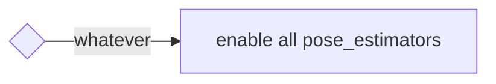

# autoware_pose_estimator_arbiter

目次:

- [概要](#概要)
- [インターフェース](#インターフェース)
- [アーキテクチャ](#アーキテクチャ)
- [起動方法](#起動方法)
- [切替ルール](#切替ルール)
- [姿勢初期化](#姿勢初期化)
- [今後の予定](#今後の予定)

## 概要

本パッケージは複数の姿勢推定器を起動し、状況に応じて特定の姿勢推定器を停止または再開する機能を提供します。
暫定的な切替ルールが用意されており、将来的にはさまざまなルールに対応できるようになります。

他の実装方法に関するアイデアについては、[このディスカッション](https://github.com/orgs/autowarefoundation/discussions/3878)を参照してください。

### 停止/再開メカニズムが必要な理由

起動ファイルを編集することで複数の`pose_estimators`を起動し、カルマンフィルタを使用してそれらを融合することは可能です。
ただし、このアプローチは計算コストがかかるため推奨されません。

特に、NDTとYabLocは計算集約的であり、同時に実行することは推奨されません。
また、両方を同時に有効にしても、どちらかが悪い出力を出すとカルマンフィルタに影響が出る可能性があります。

> [!NOTE]
> 現在のところ、**すべての`pose_estimators`を常に有効にするルールのみが実装されています。**
> ユーザーが独自のルールで`pose_estimator`を切り替える場合は、example_ruleを参照して新しいルールを追加する必要があります。
> [example_rule](example_rule/README.md)には、ルールを実装するためのリファレンスとして使用できるソースコードがあります。

### サポートされる`pose_estimators`

- [ndt_scan_matcher](https://github.com/autowarefoundation/autoware.universe/tree/main/localization/autoware_ndt_scan_matcher)
- [eagleye](https://autowarefoundation.github.io/autoware-documentation/main/how-to-guides/integrating-autoware/launch-autoware/localization/eagleye/)
- [yabloc](https://github.com/autowarefoundation/autoware.universe/tree/main/localization/yabloc)
- [landmark_based_localizer](https://github.com/autowarefoundation/autoware.universe/tree/main/localization/autoware_landmark_based_localizer)

### デモンストレーション

以下のビデオでは、4つの異なる姿勢推定器の切り替えの様子を説明しています。

<div><video controls src="https://github.com/autowarefoundation/autoware.universe/assets/24854875/d4d48be4-748e-4ffc-bde2-d498911ed3a1" muted="false" width="800"></video></div>

ユーザーは、以下のデータと起動コマンドを使用して、このデモンストレーションを再現できます。

[サンプルデータ(rosbagおよびマップ)](https://drive.google.com/file/d/1ZNlkyCtwe04iKFREdeZ5xuMU_jWpwM3W/view)
rosbagは[AWSIM](https://tier4.github.io/AWSIM/)によって作成されたシミュレーションデータです。
マップは、AWSIMのドキュメンテーションページで公開されている[オリジナルマップデータ](https://github.com/tier4/AWSIM/releases/download/v1.1.0/nishishinjuku_autoware_map.zip)を編集したもので、複数の`pose_estimators`に適したものになっています。


```bash
ros2 launch autoware_launch logging_simulator.launch.xml \
  map_path:=<your-map-path> \
  vehicle_model:=sample_vehicle \
  sensor_model:=awsim_sensor_kit \
  pose_source:=ndt_yabloc_artag_eagleye
```

## インターフェース

<details>
<summary>詳細を表示</summary>

### パラメーター

パラメーターはありません。

### サービス

| 名称              | 種類                            | 説明                           |
| ----------------- | ------------------------------- | ------------------------------- |
| `/config_logger` | logging_demo::srv::ConfigLogger | ログレベルを変更するサービス |

### クライアント

**Autoware の Perception Client**

- Perception Client は Perception モジュールの Pub/Sub クライアントです。[autoware.perception]からセンサーの topic にサブスクライブし、[autoware.perception.output]へメッセージをパブリッシュします。

**Autoware Local Map Client**

- Local Map Client は Local Map モジュールの Pub/Sub クライアントです。[autoware.localization.map]から現在の地図をサブスクライブし、[autoware.localization.current_map]へメッセージをパブリッシュします。

**Autoware Reference Path Client**

- Reference Path Client は Reference Path モジュールの Pub/Sub クライアントです。[autoware.planning.trajectory]からリファレンスパスをサブスクライブし、[autoware.control.path]へメッセージをパブリッシュします。

**Autoware Obstacle Avoidance Client**

- Obstacle Avoidance Client は Obstacle Avoidance モジュールの Pub/Sub クライアントです。[autoware.perception.object]から認識された障害物をサブスクライブし、[autoware.control.prediction]へメッセージをパブリッシュします。

**Autoware Planner Client**

- Planner Client は Planning モジュールの Pub/Sub クライアントです。[autoware.perception.object], [autoware.planning.trajectory], [autoware.localization.current_map], [autoware.control.prediction]からメッセージをサブスクライブし、[autoware.control.command]へメッセージをパブリッシュします。

**Autoware Controller Client**

- Controller Client は Controller モジュールの Pub/Sub クライアントです。[autoware.control.command]から制御コマンドをサブスクライブし、[autoware.control.act]へメッセージをパブリッシュします。

| 名称                  | タイプ                  | 説明                       |
| --------------------- | --------------------- | --------------------------------- |
| `/yabloc_suspend_srv` | std_srv::srv::SetBool | Yabloc を停止または再開するサービス |

### サブスクリプション

ポーズ推定アビトレーション用:

| 名称                                  | 型                                          | 説明    |
| ------------------------------------- | --------------------------------------------- | -------------- |
| `/input/artag/image`                  | sensor_msgs::msg::Image                       | ArTag入力    |
| `/input/yabloc/image`                 | sensor_msgs::msg::Image                       | YabLoc入力   |
| `/input/eagleye/pose_with_covariance` | geometry_msgs::msg::PoseWithCovarianceStamped | Eagleye出力 |
| `/input/ndt/pointcloud`               | sensor_msgs::msg::PointCloud2                 | NDT入力      |

## 切り替えルール：

- **Planningモジュールの障害物認識障害：**
  - 監視タスクが障害物を検出し、直前のPlanningのcycleから障害物認識障害が報告された場合
  - Planningのcycle自体が障害物認識障害を出力した場合
  - 障害物が自車位置から十分近い場合、または衝突する可能性がある場合

- **Planningのcycle障害：**
  - Planningが指定の期間内に完了しなかった場合
  - Planningが予測不可能または無効なプランを生成した場合

- **走行中のPlanningの速度逸脱量：**
  - 走行中に planificate の速度が要求済み速度を超過した場合
  - planificate が想定以上の加速を要求した場合

- **走行中のPlanningの加速度逸脱量：**
  - 走行中に planificate の加速度が要求済み加速度を超過した場合

- **動作中のPlanningの逸脱：**
  - Planningが走行中に停止など、不適切な動作を要求した場合

- **PlanningとConrolの異なる目標：**
  - PlanningがControlモジュールに、要求された目標と異なる目標を送信すると報告された場合

- **`post resampling`の障害：**
  - PlanningモジュールがPlanning target pathを再サンプリングした後に、障害物を認識した場合

## 自動運転ソフトウェア

| 名称                               | 型                                                            | 説明                                          |
| ----------------------------------- | ------------------------------------------------------------ | ------------------------------------------------ |
| `/input/vector_map`                  | `autoware_map_msgs::msg::LaneletMapBin`                       | ベクターマップ                                  |
| `/input/pose_with_covariance`         | `geometry_msgs::msg::PoseWithCovarianceStamped`              | ローカリゼーション最終出力                    |
| `/input/initialization_state`       | `autoware_adapi_v1_msgs::msg::LocalizationInitializationState` | ローカリゼーション初期化状態                  |

### 論文


| 名前                                  | タイプ                                        | 説明                                                  |
| --------------------------------------- | -------------------------------------------- | ------------------------------------------------------- |
| `/output/artag/image`                 | sensor_msgs::msg::Image                    | 中継されたArTag入力                                   |
| `/output/yabloc/image`                | sensor_msgs::msg::Image                    | 中継されたYabLoc入力                                  |
| `/output/eagleye/pose_with_covariance` | geometry_msgs::msg::PoseWithCovarianceStamped | 中継されたEagleye出力                                |
| `/output/ndt/pointcloud`              | sensor_msgs::msg::PointCloud2              | 中継されたNDT入力                                      |
| `/output/debug/marker_array`          | visualization_msgs::msg::MarkerArray       | [デバッグトピック] 視覚化のすべて                    |
| `/output/debug/string`                | visualization_msgs::msg::MarkerArray       | [デバッグトピック] 現在のステータスなどのデバッグ情報 |

</details>

## トラブルシューティング

うまくいかない場合は、以下の方法でさらに多くの詳細情報が取得できます。

> [!TIP]


> ```bash
> ros2 service call /localization/autoware_pose_estimator_arbiter/config_logger logging_demo/srv/ConfigLogger \
>   '{logger_name: localization.autoware_pose_estimator_arbiter, level: debug}'
> ```

## アーキテクチャ

<details>
<summary>詳細を表示するにはクリックしてください</summary>

### 単一のポーズ推定器を実行する場合

各 `pose_estimator` が単独で実行されているとき、このパッケージは何も行いません。
次の図は、NDT、YabLoc Eagleye、および AR-Tag が個別に実行されているときのノード構成を示しています。


### 複数のポーズ推定器を実行する場合

複数の `pose_estimators` を実行すると、`autoware_pose_estimator_arbiter` が実行されます。
これは各 `pose_estimator` に対応する **切り替えルール** と **ストッパー** で構成されています。

- ストッパーは、入出力の中継やサスペンドサービスのリクエストを行うことで、`pose_estimator` のアクティビティを制御します。
- 切り替えルールは、使用する `pose_estimator` を決定します。

インスタンス化されるストッパーと切り替えルールは、起動時のランタイム引数によって決まります。

次の図は、すべての `pose_estimators` が同時に実行されているときのノード構成を示しています。


- **NDT**

NDT ストッパーは、ポイントクラウドプリプロセッサの前方にトピックを中継します。

- **YabLoc**

YabLoc ストッパーは、イメージプリプロセッサのフロントエンドに入力イメージトピックを中継します。
YabLoc には、タイマーで動作するパーティクルフィルタプロセスが含まれており、イメージトピックがストリーミングされていない場合でも、パーティクル予測プロセスは引き続き動作します。
これを解決するために、YabLoc ストッパーには、YabLoc を明示的に停止および再開するためのサービスクライアントも含まれています。

- **Eagleye**

Eagleye ストッパーは、Eagleye 推定プロセスのバックエンドで Eagleye の出力ポーズトピックを中継します。
Eagleye は内部で時系列処理を実行し、入力ストリームの停止はできません。
さらに、Eagleye の推定プロセスは、大きな負荷なしに連続して実行できるほど軽量であるため、中継はバックエンドに挿入されます。

- **ArTag**

ArTag ストッパーは、ランドマークローカルライザの前にあるイメージトピックを中継します。

</details>

## 起動方法

<details>
<summary>詳細を表示するにはクリックしてください</summary>

ユーザーは、ランタイム引数 `pose_source` にアンダースコアの連結として `pose_estimator` 名を渡すことで、目的の `pose_estimators` を起動できます。


```bash
ros2 launch autoware_launch logging_simulator.launch.xml \
  map_path:=<your-map-path> \
  vehicle_model:=sample_vehicle \
  sensor_model:=awsim_sensor_kit \
  pose_source:=ndt_yabloc_artag_eagleye
```

予期しない文字列が `pose_source` に含まれていた場合でも、適切にフィルタされます。
詳細は下記の表を参照してください。

| 実行時引数 | autoware_pose_estimator_arbiterのパラメータ(pose_source) |
| ----------- | --------------------------------------------------------- |
| `pose_source:=ndt` | `["ndt"]` |
| `pose_source:=nan` | `[]` |
| `pose_source:=yabloc_ndt` | `["ndt","yabloc"]` |
| `pose_source:=yabloc_ndt_ndt_ndt` | `["ndt","yabloc"]` |
| `pose_source:=ndt_yabloc_eagleye` | `["ndt","yabloc","eagleye"]` |
| `pose_source:=ndt_yabloc_nan_eagleye_artag` | `["ndt","yabloc","eagleye","artag"]` |

## 切り替えルール

<details>
<summary>詳細を表示</summary>

現在は **ルールが 1 つのみ** (`enable_all_rule`) 実装されています。
将来は複数のルールが実装され、ユーザーがルールを選択できるようになります。

> [!ヒント]
> ルールを拡張するためのプリセットが用意されています。ルールを拡張したい場合は、[example_rule](./example_rule/README.md) を参照してください。

### 全てを有効にするルール

これは既定で最もシンプルなルールです。このルールは、現在の状態に関係なく、すべての pose_estimator を有効にします。




</details>

## 自車位置初期化

複数の pose_estimators を使用する場合、`pose_initializer` に渡すパラメータを適切に調整する必要があります。

<details>
<summary>クリックして詳細を表示</summary>

次の表は、初期の自車位置推定法を示すランタイム引数 "pose_source" および pose_initialization ノードに渡す必要があるパラメータに基づいています。
アプリケーションを複雑になりすぎないように、NDT が使用可能な場合は常に NDT が使用されるようにプライオリティが確立されます。
(`ndt_enabled` と `yabloc_enabled` の両方が `true` の場合にのみ、pose_initializer は NDT ベースの初期自車位置推定を実行します）。

この表の使い方は、3 つの観点から説明されています。

- **Autoware ユーザー:** Autoware ユーザーはこの表を参照する必要はありません。
  自車位置推定器の組み合わせを指定するだけで、pose_initializer に適切なパラメータが自動的に与えられます。
- **Autoware 開発者:** Autoware 開発者は、どのパラメータが割り当てられているかを知るためにこの表を参照できます。
- **新しい自車位置推定スイッチを実装する人:**
開発者は、この表を拡張し、pose_initializer に適切なパラメータを割り当てるように実装する必要があります。
</details>

|         pose_source         | invoked initialization method | `ndt_enabled` | `yabloc_enabled` | `gnss_enabled` | `sub_gnss_pose_cov`                          |
| :-------------------------: | ----------------------------- | ------------- | ---------------- | -------------- | -------------------------------------------- |
|             ndt             | ndt                           | true          | false            | true           | /sensing/gnss/pose_with_covariance           |
|           yabloc            | yabloc                        | false         | true             | true           | /sensing/gnss/pose_with_covariance           |
|           eagleye           | 車両はしばらく走行する必要があります | false         | false            | true           | /localization/pose_estimator/eagleye/...     |
|            artag            | 2D 姿勢推定（RViz）       | false         | false            | true           | /sensing/gnss/pose_with_covariance           |
|         ndt, yabloc         | ndt                           | true          | true             | true           | /sensing/gnss/pose_with_covariance           |
|        ndt, eagleye         | ndt                           | true          | false            | true           | /sensing/gnss/pose_with_covariance           |
|         ndt, artag          | ndt                           | true          | false            | true           | /sensing/gnss/pose_with_covariance           |
|       yabloc, eagleye       | yabloc                        | false         | true             | true           | /sensing/gnss/pose_with_covariance           |
|        yabloc, artag        | yabloc                        | false         | true             | true           | /sensing/gnss/pose_with_covariance           |
|       eagleye, artag        | 車両はしばらく走行する必要があります | false         | false            | true           | /localization/pose_estimator/eagleye/pose... |
|    ndt, yabloc, eagleye     | ndt                           | true          | true             | true           | /sensing/gnss/pose_with_covariance           |
|     ndt, eagleye, artag     | ndt                           | true          | false            | true           | /sensing/gnss/pose_with_covariance           |
|   yabloc, eagleye, artag    | yabloc                        | false         | true             | true           | /sensing/gnss/pose_with_covariance           |
| ndt, yabloc, eagleye, artag | ndt                           | true          | true             | true           | /sensing/gnss/pose_with_covariance           |

## 今後の計画

<details>
<summary>詳細を表示</summary>

### 段階的な切り替え

今後、このパッケージでは、オン/オフの切り替えだけでなく、50% NDT と 50% YabLoc などの低周波動作のためのメカニズムも提供します。

### 今後追加される pose_estimators 用の stopper

基本的な戦略は、その pose_estimator の入力または出力トピックをリレーすることでオン/オフの切り替えを実現することです。
pose_estimator に大量の計算を伴う時系列処理が含まれている場合、トピックリレーだけで一時停止して再開することはできません。

このような場合、一般的に適用可能なソリューションはないかもしれませんが、次の方法が役立つ場合があります。

1. YabLoc の場合に示されているように、時系列処理を完全に停止して**再初期化**する。
2. `localization/kinematic_state` を購読して**状態を更新し続け**、推定が中断しないようにする（アクティブな pose_estimator の出力を利用する）。
3. 複数の pose_estimator は、その特定の pose_estimator を**サポートしない**。

この問題は複数の pose_estimator を実現するための基本的な問題であり、この場合に提案されたアーキテクチャに関係なく発生することに注意してください。

</details>

