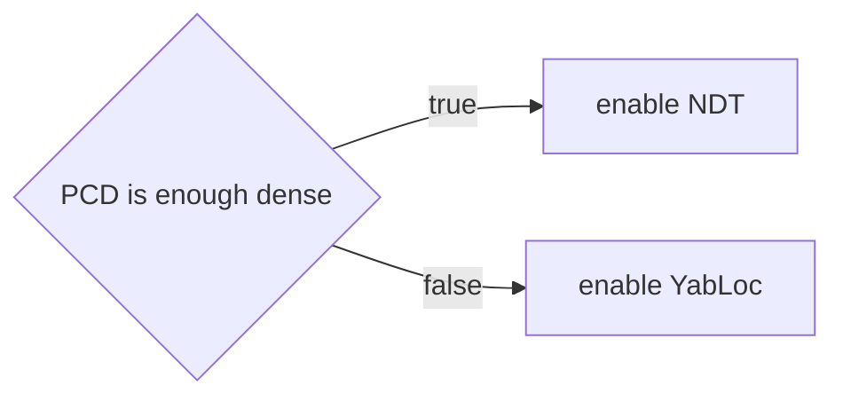
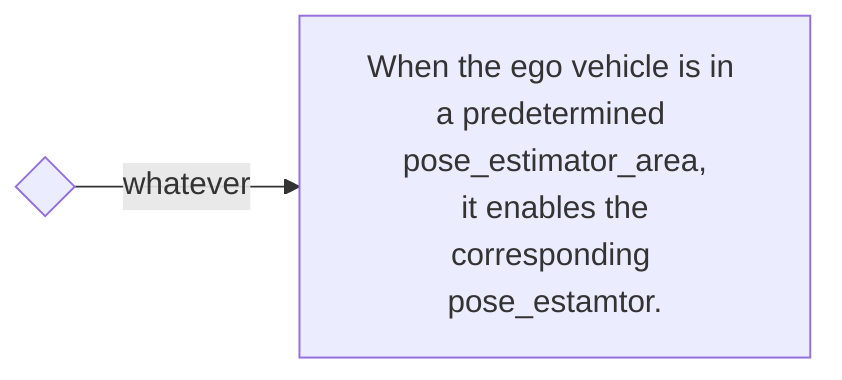

# 自動運転ソフトウェアに関するドキュメント

このドキュメントでは、自動運転ソフトウェアの基本ルールについて説明します。これらのルールを組み合わせることで、以下のような機能を実現できます。ユーザーは必要に応じてこれらのルールを拡張してこのコードを参照し、希望どおりにアービターを制御することができます。

## デモ

次のビデオは、4つの異なるポーズ推定値を切り替える様子を示しています。

<div><video controls src="https://github-production-user-asset-6210df.s3.amazonaws.com/24854875/295755577-62b26fdd-dcf0-4b1c-a1a0-ecd633413196.mp4" muted="false" width="600"></video></div>

### 切り替えルール

### Pcdマップを使用したルール




### ベクトルマップベースルール

**1. シスプレビュー**

**1.1. 概要**

本ドキュメントでは、Autoware.Autoのベクトルマップベースルール機能について説明します。この機能により、Planningコンポーネントは、ベクトルマップから得られた道路ネットワーク制約に基づいて、走行経路を生成できます。

**1.2. 利点**

* 道路ネットワーク上の走行経路生成を正確化します。
* 交通状況に適応して安全で効率的な走行を実現します。

**2. アーキテクチャ**

ベクトルマップベースルール機能は、以下のコンポーネントで構成されています。

* **ベクトルマップ解析器：** ベクトルマップから道路ネットワーク情報を抽出します。
* **ルール処理：** 道路ネットワーク制約に基づいて走行経路にルールを適用します。

**3. ルール**

ベクトルマップベースルール機能は、次のようなルールを走行経路に適用します。

* **車線逸脱量：** 車線境界からの逸脱量を制限します。
* **加速逸脱量：** 加速に関する制限を適用します。
* **速度逸脱量：** 速度に関する制限を適用します。
* **停止線遵守：** 停止線で車両を停止させます。
* **優先順位付き交差点：** 交差点における優先順位を遵守します。

**4. 使用方法**

ベクトルマップベースルール機能を使用するには、次の手順に従います。

* Autoware.Autoのルート設定ファイルでベクトルマップパスを指定します。
* ナビゲーションコンポーネントを有効にします。
* `post resampling`を使用している場合は、Planningパラメータを設定してベクトルマップベースのルールを有効にします。

**5. 制限事項**

* ベクトルの品質に依存します。
* すべての道路をカバーしていない場合があります。

**6. 関連ドキュメント**

* [Autoware.Autoドキュメント](https://autoware.github.io/autoware.auto/)




### ルールヘルパー

ルールヘルパーは、スイッチングルールを記述するための補助ツールです。

- [PCD占有率](#pcd-occupancy)
- [ポーズ推定エリア](#pose-estimator-area)

#### PCD占有率


#### ポーズ推定エリア

`pose_estimator_area` は、`lanelet2` のポリゴンで記述された平面の領域です。エリアの高さには意味はなく、自車の位置の投影がポリゴンの内側に含まれているかどうかを判断します。


以下のサンプルの `pose_estimator_area` が示されています。次に示す値はプレースホルダーです。

エリアが正しく読み取られていることを確認するには、エリアのタイプを「`pose_estimator_specify`」にして、サブタイプをndt、yabloc、eagleye、またはartagのいずれかにします。


```xml
  <node id="1" lat="35.8xxxxx" lon="139.6xxxxx">
    <tag k="mgrs_code" v="54SUE000000"/>
    <tag k="local_x" v="10.0"/>
    <tag k="local_y" v="10.0"/>
    <tag k="ele" v="1.0"/>
  </node>
  <node id="2" lat="35.8xxxxx" lon="139.6xxxxx">
    <tag k="mgrs_code" v="54SUE000000"/>
    <tag k="local_x" v="10.0"/>
    <tag k="local_y" v="20.0"/>
    <tag k="ele" v="1.0"/>
  </node>
  <node id="3" lat="35.8xxxxx" lon="139.6xxxxx">
    <tag k="mgrs_code" v="54SUE000000"/>
    <tag k="local_x" v="20.0"/>
    <tag k="local_y" v="20.0"/>
    <tag k="ele" v="1.0"/>
  </node>
  <node id="4" lat="35.8xxxxx" lon="139.6xxxxx">
    <tag k="mgrs_code" v="54SUE000000"/>
    <tag k="local_x" v="10.0"/>
    <tag k="local_y" v="20.0"/>
    <tag k="ele" v="1.0"/>
  </node>

...

  <way id="5">
    <nd ref="1"/>
    <nd ref="2"/>
    <nd ref="3"/>
    <nd ref="4"/>
    <tag k="type" v="pose_estimator_specify"/>
    <tag k="subtype" v="eagleye"/>
    <tag k="area" v="yes"/>
  </way>

  <way id="6">
    <nd ref="7"/>
    <nd ref="8"/>
    <nd ref="9"/>
    <nd ref="10"/>
    <tag k="type" v="pose_estimator_specify"/>
    <tag k="subtype" v="yabloc"/>
    <tag k="area" v="yes"/>
  </way>

```

