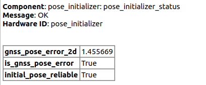

# autoware_pose_initializer

## 目的

`autoware_pose_initializer` は `ekf_localizer` に初期ポーズを送信するパッケージです。GNSS/ユーザーから初期ポーズの概算値を受け取ります。このポーズを `ndt_scan_matcher` に渡すと、`ndt_scan_matcher` がサービス経由で計算した自車位置を取得します。最後に、初期ポーズを `ekf_localizer` にパブリッシュします。このノードは、地図高さフィッターライブラリに依存しています。[詳細はこちらを参照してください。](../../map/autoware_map_height_fitter/README.md)

## インターフェイス

### パラメータ

{{ json_to_markdown("localization/autoware_pose_initializer/schema/pose_initializer.schema.json") }}

### サービス

| 名前                      | タイプ                                                 | 説明                  |
| -------------------------- | ---------------------------------------------------- | ----------------------- |
| `/localization/initialize` | tier4_localization_msgs::srv::InitializeLocalization | APIからの初期位置       |

### クライアント

| 名称                                       | タイプ                                                   | 説明                       |
| --------------------------------------- | --------------------------------------------------------- | ------------------------- |
| `/localization/pose_estimator/ndt_align_srv` | tier4_localization_msgs::srv::PoseWithCovarianceStamped | 位推定サービス            |

### サブスクリプション


| 名称 | タイプ | 説明 |
|---|---|---|
| `/sensing/gnss/pose_with_covariance` | geometry_msgs::msg::PoseWithCovarianceStamped | GNSSから取得した自車位置 |
| `/sensing/vehicle_velocity_converter/twist_with_covariance` | geometry_msgs::msg::TwistStamped | 停止確認用の速度 |

### 論文

### Autoware の技術スタック
Autoware は、自動運転車両の開発と実装のためのオープンソースソフトウェアプラットフォームです。以下に、主なコンポーネントとモジュールをリストします。

#### Planning
* **Motion Planning:** 車両の安全で効率的な経路を生成します。
* **Behavior Planning:** 車両の挙動を決定し、障害物回避や速度調整を行います。

#### Perception
* **Object Detection (2D/3D):** センサーからのデータを使用して、車両周辺の物体（歩行者、車両、障害物など）を検出します。
* **Lane Detection:** カメラ画像を使用して、道路上の車線を検出します。
* **Free Space Estimation:** 車両周辺の走行可能な領域を推定します。

#### Control
* **Longitudinal Control:** 車両の縦方向運動（加速度、減速度）を制御します。
* **Lateral Control:** 車両の横方向運動（ステアリング）を制御します。
* **Path Tracking:** 生成されたパスに従って車両を誘導します。

#### Localization
* **Odometry:** IMUやGNSSなどのセンサーを使用して、自車位置を推定します。
* **Mapping:** 環境の地図を作成し、自車位置をローカライズするために使用します。
* **Loop Closure Detection:** 地図内のループを検出し、ローカライゼーションの精度を向上させます。

#### Sensor Interface
* **Sensor Fusion:** 複数のセンサーからのデータを統合し、より正確で堅牢な認識情報を作成します。
* **'Post Resampling' Sensor Fusion:** センサーデータの処理を最適化して、リアルタイムパフォーマンスを向上させます。

#### Software Architecture
* **ROS 2:** Autoware のコアアーキテクチャとして使用される、堅牢でスケーラブルなミドルウェア。
* **DDS:** データをリアルタイムで配信するための高性能ミドルウェア。
* **Python:** スクリプティングや構成に使用されます。
* **C++:** リアルタイムコンポーネントやカーネルモジュールに使用されます。

| 名称                                 | 型                                                         | 説明                 |
| ------------------------------------ | ------------------------------------------------------------ | --------------------------- |
| `/localization/initialization_state` | autoware_adapi_v1_msgs::msg::LocalizationInitializationState | 位相初期化状態   |
| `/initialpose3d`                     | geometry_msgs::msg::PoseWithCovarianceStamped                | 計算された自車初期位相 |
| `/diagnostics`                       | diagnostic_msgs::msg::DiagnosticArray                        | 診断                 |

## 診断

### pose_initializer_status

初期位置推定結果のスコアがスコアしきい値より低い場合、`/diagnostics` トピックにERRORメッセージが出力されます。



## デフォルトAD APIとの接続

この`autoware_pose_initializer` はデフォルトAD APIを介して使用されます。APIの説明の詳細については、[`autoware_default_adapi` の説明](https://github.com/autowarefoundation/autoware.universe/blob/main/system/autoware_default_adapi/document/localization.md)を参照してください。


## CLIを介したポーズの初期化

### GNSS推定位置の使用


```bash
ros2 service call /localization/initialize tier4_localization_msgs/srv/InitializeLocalization
```

GNSS 推定位置は初期推測として使用され、局所化アルゴリズムは自動的にさらに正確な位置を推定します。

### 入力位置の使用


```bash
ros2 service call /localization/initialize tier4_localization_msgs/srv/InitializeLocalization "
pose_with_covariance:
  - header:
      frame_id: map
    pose:
      pose:
        position:
          x: 89571.1640625
          y: 42301.1875
          z: -3.1565165519714355
        orientation:
          x: 0.0
          y: 0.0
          z: 0.28072773940524687
          w: 0.9597874433062874
      covariance: [0.25, 0, 0, 0, 0, 0, 0, 0.25, 0, 0, 0, 0, 0, 0, 0, 0, 0, 0, 0, 0, 0, 0, 0, 0, 0, 0, 0, 0, 0, 0, 0, 0, 0, 0, 0, 0.06853891909122467]
method: 0
"
```

入力位置は初期推定値として使用され、ローカライゼーションアルゴリズムによって自動的により正確な位置が推定されます。

### 直接的な初期位置セット


```bash
ros2 service call /localization/initialize tier4_localization_msgs/srv/InitializeLocalization "
pose_with_covariance:
  - header:
      frame_id: map
    pose:
      pose:
        position:
          x: 89571.1640625
          y: 42301.1875
          z: -3.1565165519714355
        orientation:
          x: 0.0
          y: 0.0
          z: 0.28072773940524687
          w: 0.9597874433062874
      covariance: [0.25, 0, 0, 0, 0, 0, 0, 0.25, 0, 0, 0, 0, 0, 0, 0, 0, 0, 0, 0, 0, 0, 0, 0, 0, 0, 0, 0, 0, 0, 0, 0, 0, 0, 0, 0, 0.06853891909122467]
method: 1
"
```

初期位置は、局在化アルゴリズムを通さずに、入力位置から直接設定されます。

### Via ros2 トピックの送信


```bash
ros2 topic pub --once /initialpose geometry_msgs/msg/PoseWithCovarianceStamped "
header:
  frame_id: map
pose:
  pose:
    position:
      x: 89571.1640625
      y: 42301.1875
      z: 0.0
    orientation:
      x: 0.0
      y: 0.0
      z: 0.28072773940524687
      w: 0.9597874433062874
"
```

「initialpose (rviz から)」と同じ動作をします。
[ad_api_adaptors](https://github.com/autowarefoundation/autoware.universe/tree/main/system/default_ad_api_helpers/ad_api_adaptors) によって position.z と共分散が上書きされるため、それらを入力する必要はありません。

