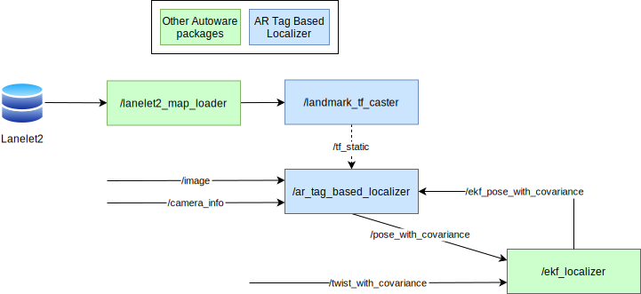

# Landmark Based Localizer

**LandmarkBasedLocalizer** is a package for landmark-based localization.

Landmarks are, for example

* AR tags detected by camera
* Boards characterized by intensity detected by LiDAR

etc.

Since these landmarks are easy to detect and estimate pose, self-pose can be back-calculated from the pose of the detected landmark if the pose of the landmark is written on the map in advance.

This back-calculated pose is passed to EKF, where it is fused with twist information and used to estimate a good self-pose.

## Nodes included in this package

### `tag_tf_caster` node

The definitions of the tags written to the map are introduced in the next section. See `Map Specifications`.

The `tag_tf_caster` node publishes the TF from the map to the tag.

* Translation : The center of the four vertices of the tag
* Rotation : Let the vertex numbers be 1, 2, 3, 4 counterclockwise as shown in the next section. Direction is defined as the cross product of the vector from 1 to 2 and the vector from 2 to 3.

Users can define tags as Lanelet2 4-vertex polygons.
In this case, it is possible to define an arrangement in which the four vertices cannot be considered to be on the same plane. The direction of the tag in that case is difficult to calculate.
So, if the 4 vertices are considered as forming a tetrahedron and its volume exceeds the `volume_threshold` parameter, the tag will not publish tf_static.

### `ar_tag_based_localizer`

[page](./doc/ar_tag_based_localizer.md)

## Inputs / Outputs

### `tag_tf_caster` node

#### Input

| Name                   | Type                                         | Description      |
| :--------------------- | :------------------------------------------- | :--------------- |
| `~/input/lanelet2_map` | `autoware_auto_mapping_msgs::msg::HADMapBin` | Data of lanelet2 |

#### Output

| Name        | Type                                   | Description        |
| :---------- | :------------------------------------- | :----------------- |
| `tf_static` | `geometry_msgs::msg::TransformStamped` | TF from map to tag |
