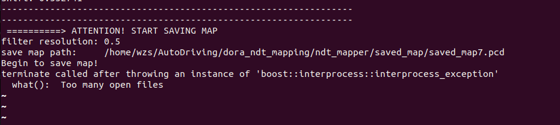
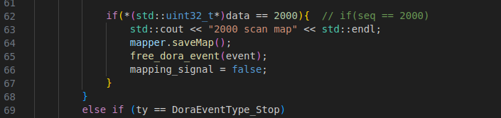

# Dora-rs NDT Mapping
source: https://github.com/Kin-Zhang/simple_ndt_slam
## 文件清单
**dora_node.cc**  ndt建图dora节点
**dora_ndt_mapper.cc**   ndt建图类
**ndt_cpu**   ndt算法实现
**ndt_mapping_config.yml**   ndt建图参数
**dataflow_pcap.yml**   Dora数据流文件

## 依赖
```bash
# pcl库
sudo apt-get installl libpcl-dev
# eigen库
sudo apt install libeigen3-dev
```
yaml-cpp: https://github.com/jbeder/yaml-cpp

## 编译
需要先编译ndt_cpu
```bash
cd ndt_cpu
mkdir build && cd build
cmake ..
cmake --build .
```
编译dora ndt建图节点
```bash
cd ../..
# 在编译之前需要先修改CMakeLists.txt，修改
# include_directories()
# target_link_libraries()
# 中的有关dora的路径
mkdir build && cd build
cmake ..
cmake --build .
```

## 建图
```bash
# 在ndt_mapping路径下
dora up
# 在启动前，需要把dataflow_pcap.yml中，节点的source
dora start dataflow_pcap.yml --name test
```
建好的地图会保存在 **ndt_mapping_config.yml** map_save_path这一路径下

# 保地图时报错： Too many open files

可能是因为地图中的点太多了，提前停止建图，保存地图就没事了

dora_node.cc中可以设置建图到第几个seq停止，然后把下面的mapper.saveMap()注释掉

# 观察建图结果
```bash
sudo apt install pcl-tools
pcl_viewer -multiview 1 path_to_pcd_files
```

# 编译节点报错：

```
/usr/bin/ld: /home/crp/dora_project/dora-rs/dora/target/release/libdora_node_api_c.a(shared_memory_extended-abb6f576d32f1117.shared_memory_extended.1275353eb15ed122-cgu.1.rcgu.o): undefined reference to symbol 'shm_open@@GLIBC_2.2.5'
/usr/bin/ld: /lib/x86_64-linux-gnu/librt.so.1: error adding symbols: DSO missing from command line
clang: error: linker command failed with exit code 1 (use -v to see invocation)
make[2]: *** [CMakeFiles/dora_ndt_mapper.dir/build.make:192：dora_ndt_mapper] 错误 1
make[1]: *** [CMakeFiles/Makefile2:76：CMakeFiles/dora_ndt_mapper.dir/all] 错误 2
make: *** [Makefile:84：all] 错误 2
```

这个错误通常是由于链接器找不到与`shm_open`符号相关联的共享对象（DSO）引起的。这通常是因为在链接时未正确指定所需的库。

您可以尝试在链接命令中添加`-lrt`选项来链接`librt`库。如果您使用的是CMake进行构建，可以在`CMakeLists.txt`文件中的目标链接属性中添加`rt`。

```cmake
target_link_libraries(your_target_name rt)
```